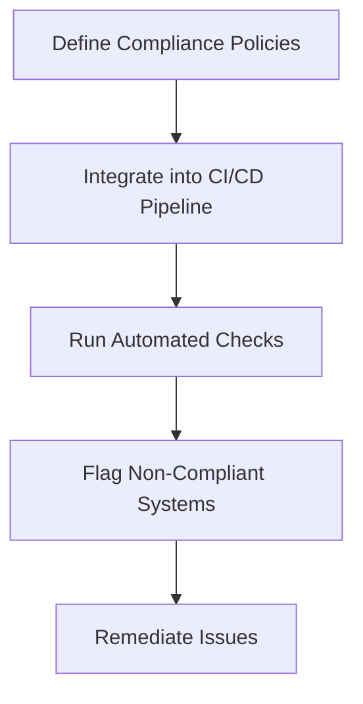

## Introduction to Compliance as Code

### What is Compliance as Code?

Compliance as Code (CaC) is an approach to automating the enforcement and verification of compliance requirements within an organization’s IT infrastructure. This method leverages code to define, implement, and enforce compliance policies, ensuring that systems and applications adhere to regulatory standards and internal governance rules. By treating compliance requirements as code, organizations can integrate them into their continuous integration/continuous deployment (CI/CD) pipelines, enabling automated checks and remediations.

### Why is Compliance as Code Important?

Compliance as Code is crucial because it addresses several key challenges faced by organizations:

1. **Scalability**: Manual compliance checks become increasingly difficult to manage as the number of systems and applications grows.
2. **Consistency**: Automated checks ensure that compliance requirements are applied consistently across all environments.
3. **Speed**: Automation reduces the time required to verify compliance, allowing for faster releases and deployments.
4. **Accuracy**: Automated tools reduce the likelihood of human error in compliance checks.

### How Does Compliance as Code Work?

The core idea behind Compliance as Code is to treat compliance requirements as code. This involves:

1. **Defining Policies**: Compliance policies are defined in code, often using domain-specific languages (DSLs) or standard programming languages.
2. **Automated Checks**: These policies are then integrated into CI/CD pipelines, where they automatically check whether systems and applications comply with the defined policies.
3. **Remediation**: Non-compliant systems can be flagged for remediation, either manually or through automated processes.

### Example: PCI DSS Compliance

Consider the Payment Card Industry Data Security Standard (PCI DSS), which mandates specific security controls for organizations handling credit card data. A Compliance as Code approach might involve defining policies for each requirement and integrating these policies into the CI/CD pipeline.



### Real-World Example: Recent Breaches

A notable example of the importance of Compliance as Code is the Capital One breach in 2019. The breach exposed sensitive customer data due to misconfigured cloud storage buckets. Had the organization implemented Compliance as Code practices, automated checks could have identified and remediated the misconfiguration before it led to a breach.

### Starting Small: Early Wins

When embarking on a Compliance as Code journey, it is essential to start small and focus on early wins. This approach helps build momentum and demonstrates the value of automation.

#### Identifying Early Wins

Early wins can be identified by focusing on compliance requirements that are:

1. **High Impact**: Requirements that, if not met, could result in significant penalties or reputational damage.
2. **Low Complexity**: Requirements that are straightforward to implement and verify.
3. **Repetitive**: Requirements that need to be checked frequently, making automation particularly beneficial.

### Leveraging Existing Templates and Code

To ease the initial burden, organizations should leverage existing templates and code. Many open-source projects and commercial tools provide pre-defined compliance policies that can be customized to meet specific organizational needs.

#### Open-Source Tools

Some popular open-source tools for Compliance as Code include:

1. **Open Policy Agent (OPA)**: A language and runtime for creating and enforcing policies.
2. **InSpec**: A testing framework for infrastructure.
3. **Ansible**: An automation tool that can be used to enforce compliance policies.

#### Commercial Tools

Commercial tools like:

1. **Tenable.io**: Provides automated compliance checks and reporting.
2. **Palo Alto Prisma Cloud**: Offers comprehensive compliance management capabilities.

### Sustainable Progress

Achieving sustainable progress in Compliance as Code requires a structured approach:

1. **Incremental Implementation**: Gradually expand the scope of compliance checks.
2. **Continuous Improvement**: Regularly review and update compliance policies to reflect changes in regulations and organizational needs.
3. **Collaboration**: Engage with various stakeholders, including engineering teams, legal departments, and compliance officers, to ensure alignment and buy-in.

### Collaboration and Feedback

Effective collaboration and feedback loops are crucial for the success of Compliance as Code initiatives. This involves:

1. **Cross-Functional Teams**: Involve representatives from different departments to ensure a holistic approach.
2. **Regular Reviews**: Conduct periodic reviews to assess the effectiveness of compliance policies and identify areas for improvement.
3. **Feedback Mechanisms**: Establish mechanisms for stakeholders to provide feedback on compliance policies and their implementation.

### Building Momentum

Building momentum in Compliance as Code involves:

1. **Demonstrating Value**: Highlight the benefits of automation, such as reduced compliance costs and improved security posture.
2. **Celebrating Successes**: Recognize and celebrate milestones achieved through Compliance as Code.
3. **Continuous Education**: Provide ongoing training and resources to ensure that all stakeholders understand the importance and benefits of Compliance as Code.

### Material Level of Compliance Code

Once a material level of compliance code is achieved, it becomes difficult to revert to manual compliance checks. This is similar to the transition from manual testing to automated testing in software development.

### Automated Testing Analogy

Just as automated testing provides significant benefits over manual testing, Compliance as Code offers substantial advantages over manual compliance checks. Once a critical mass of compliance code is established, the benefits become evident, and it becomes challenging to return to manual methods.

### Real-World Example: Automated Compliance Checks

Consider a scenario where an organization uses InSpec to enforce PCI DSS compliance. The following example shows how a compliance policy can be defined and integrated into a CI/CD pipeline.

#### Defining a Compliance Policy

```ruby
control 'pci-dss-1.1' do
  title 'PCI DSS Requirement 1.1'
  describe file('/etc/ssh/sshd_config') do
    it { should exist }
    its('content') { should match /^PasswordAuthentication no$/ }
  end
end
```

#### Integrating into CI/CD Pipeline

```yaml
stages:
  - build
  - test
  - deploy

build:
  script:
    - echo "Building application..."

test:
  script:
    - inspec exec compliance-tests/

deploy:
  script:
    - echo "Deploying application..."
```

### Vulnerable vs. Secure Code Example

Consider a scenario where an organization needs to ensure that SSH password authentication is disabled to comply with PCI DSS. The following example shows both the vulnerable and secure versions of the configuration.

#### Vulnerable Configuration

```bash
# /etc/ssh/sshd_config
PasswordAuthentication yes
```

#### Secure Configuration

```bash
# /etc/ssh/sshd_config
PasswordAuthentication no
```

### Detection and Prevention

To detect and prevent non-compliance issues, organizations can use tools like InSpec to run automated checks. The following example shows how to detect the presence of insecure SSH configurations.

#### Detection Script

```ruby
control 'ssh-password-authentication' do
  title 'Ensure SSH Password Authentication is Disabled'
  describe file('/etc/ssh/sshd_config') do
    it { should exist }
    its('content') { should match /^PasswordAuthentication no$/ }
  end
end
```

### Secure Coding Practices

Secure coding practices are essential to ensure that compliance policies are effectively enforced. This includes:

1. **Code Reviews**: Regularly reviewing compliance policies to ensure they are accurate and effective.
2. **Testing**: Thoroughly testing compliance policies to ensure they work as intended.
3. **Documentation**: Maintaining detailed documentation of compliance policies and their implementation.

### Hands-On Labs

To gain practical experience with Compliance as Code, consider the following hands-on labs:

1. **PortSwigger Web Security Academy**: Offers exercises on securing web applications.
2. **OWASP Juice Shop**: A deliberately insecure web application for learning about security vulnerabilities.
3. **CloudGoat**: A series of labs for learning about cloud security.

### Conclusion

Compliance as Code is a powerful approach to automating compliance checks and ensuring that systems and applications adhere to regulatory standards. By starting small, leveraging existing templates, and building momentum, organizations can achieve sustainable progress in their Compliance as Code initiatives. The benefits of automation, including reduced compliance costs and improved security posture, make Compliance as Code an essential practice for modern organizations.

---
<!-- nav -->
[[DevSecOps/DevSecOps Bootcamp/02-Security Governance & Compliance/05-Understanding Compliance as Code/01-Getting Started/00-Overview|Overview]] | [[DevSecOps/DevSecOps Bootcamp/02-Security Governance & Compliance/05-Understanding Compliance as Code/01-Getting Started/02-Practice Questions & Answers|Practice Questions & Answers]]
