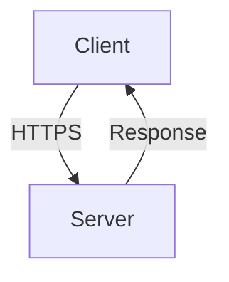
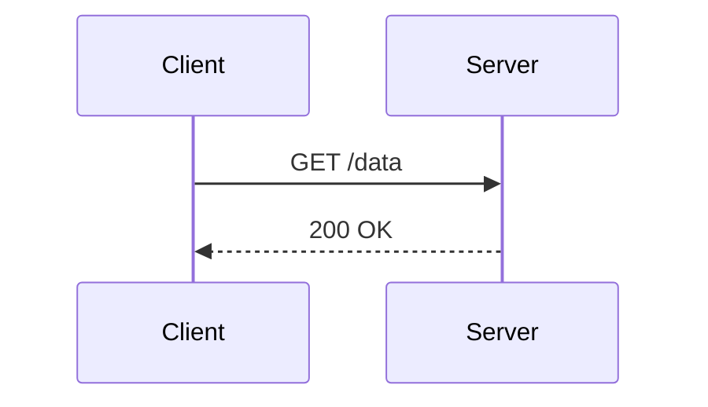

## Understanding Compliance as Code

### Introduction to Compliance as Code

Compliance as Code is a modern approach to ensuring that IT systems and infrastructure adhere to regulatory requirements and internal policies. This method leverages automation and code to enforce compliance rules, making it easier to maintain and audit compliance across complex environments. In this chapter, we will delve deep into the principles of Compliance as Code, focusing on the ISO 27001 security standard and specifically control A13.2.1, which deals with information transfer policies and procedures.

### Background Theory

#### What is Compliance as Code?

Compliance as Code is the practice of embedding compliance requirements directly into the codebase or infrastructure-as-code (IaC) configurations. This ensures that compliance checks are automated and integrated into the development lifecycle, reducing the likelihood of human error and improving consistency.

#### Why is Compliance as Code Important?

In today’s rapidly evolving technological landscape, traditional manual compliance processes are often insufficient. Compliance as Code helps organizations:

1. **Automate Compliance Checks**: By embedding compliance rules into code, organizations can automatically verify that their systems meet regulatory requirements.
2. **Ensure Consistency**: Automated compliance checks ensure that all systems are consistently evaluated against the same standards.
3. **Reduce Human Error**: Manual processes are prone to errors, whereas automated checks reduce the risk of oversight.
4. **Facilitate Continuous Auditing**: Compliance as Code allows for continuous monitoring and auditing, enabling organizations to quickly identify and address compliance issues.

### ISO 27001 Standard Overview

The ISO 27001 standard is an internationally recognized framework for establishing, implementing, maintaining, and continually improving an Information Security Management System (ISMS). It provides a structured approach to managing sensitive company information so that it remains secure.

#### Control A13.2.1: Information Transfer Policies and Procedures

Control A13.2.1 specifically addresses the need for procedures to protect the transfer of information. This includes ensuring that information is transferred securely and that appropriate measures are in place to prevent unauthorized access during transmission.

### Mapping Security Controls to Code

To implement Compliance as Code, we need to translate security controls into code-based policies. Let’s take the example of Microsoft Azure and control A13.2.1.

#### Policy Definition in Azure

In Azure, a policy definition is a set of rules that can be applied to resources to ensure they comply with organizational standards. We can create a policy definition to check how information is being transferred and ensure that it is encrypted using HTTPS.

### Example Code Snippet

Let’s look at a sample policy definition in Azure that checks for secure information transfer.

```json
{
  "mode": "All",
  "policyRule": {
    "if": {
      "allOf": [
        {
          "field": "type",
          "equals": "Microsoft.Network/networkInterfaces"
        },
        {
          "not": {
            "field": "Microsoft.Network/networkInterfaces/ipConfigurations[*].properties.privateIpAllocationMethod",
            "equals": "Dynamic"
          }
        }
      ]
    },
    "then": {
      "effect": "audit"
    }
  },
  "parameters": {}
}
```

This policy checks if network interfaces are configured with dynamic private IP allocation methods, which is a common requirement for secure information transfer.

### Detailed Explanation of the Code

#### Breaking Down the Policy Rule

1. **Mode**: `All` means the policy applies to all resources.
2. **Policy Rule**:
   - **If Clause**: 
     - **Field Check**: `type` is checked to ensure it matches `Microsoft.Network/networkInterfaces`.
     - **Not Clause**: Ensures that the `privateIpAllocationMethod` is not set to `Dynamic`.
3. **Then Clause**: 
   - **Effect**: `audit` means the policy will generate an audit log if the condition is met.

### Real-World Examples

#### Recent Breaches and CVEs

Recent breaches and vulnerabilities highlight the importance of secure information transfer. For example:

- **CVE-2021-3427**: A vulnerability in Microsoft Exchange Server allowed attackers to bypass authentication and gain unauthorized access to email servers. This underscores the need for robust encryption and secure transfer protocols.
- **SolarWinds Supply Chain Attack (2020)**: This attack involved the compromise of SolarWinds’ software update mechanism, leading to widespread breaches. Secure transfer protocols could have helped mitigate such attacks.

### How to Prevent / Defend

#### Detection

To detect insecure information transfer, organizations should implement continuous monitoring and logging. Tools like Azure Monitor can help track resource configurations and alert on deviations from compliance policies.

#### Prevention

1. **Secure Configuration**: Ensure that all network interfaces and endpoints are configured to use secure transfer protocols like HTTPS.
2. **Encryption**: Implement strong encryption mechanisms to protect data in transit.
3. **Regular Audits**: Conduct regular audits to ensure compliance with security policies.

#### Secure Coding Fixes

Here’s an example of how to correct insecure information transfer in code:

**Vulnerable Code:**
```python
import requests

response = requests.get('http://example.com/data')
print(response.text)
```

**Secure Code:**
```python
import requests

response = requests.get('https://example.com/data', verify=True)
print(response.text)
```

### Complete Example with HTTP Request and Response

#### HTTP Request

```http
GET /data HTTP/1.1
Host: example.com
Accept: */*
```

#### HTTP Response

```http
HTTP/1.1 200 OK
Date: Mon, 27 Jul 2021 12:00:00 GMT
Content-Type: application/json
Content-Length: 34

{"message": "Data successfully retrieved"}
```

### Mermaid Diagrams

#### Network Topology



#### Sequence Diagram



### Hands-On Labs

For practical experience with Compliance as Code, consider the following labs:

- **PortSwigger Web Security Academy**: Offers modules on secure coding practices and compliance.
- **OWASP Juice Shop**: Provides a vulnerable web application for practicing secure coding and compliance.
- **CloudGoat**: A series of labs designed to teach cloud security best practices, including Compliance as Code.

### Conclusion

Understanding and implementing Compliance as Code is crucial for maintaining secure and compliant IT systems. By leveraging tools like Azure Policy Definitions and following best practices, organizations can ensure that their systems adhere to regulatory requirements and internal policies. Continuous monitoring and regular audits are essential to maintaining compliance in a dynamic environment.

---
<!-- nav -->
[[DevSecOps/DevSecOps Bootcamp/02-Security Governance & Compliance/05-Understanding Compliance as Code/02-Compliance as Code policy definition/00-Overview|Overview]] | [[DevSecOps/DevSecOps Bootcamp/02-Security Governance & Compliance/05-Understanding Compliance as Code/02-Compliance as Code policy definition/02-Practice Questions & Answers|Practice Questions & Answers]]
