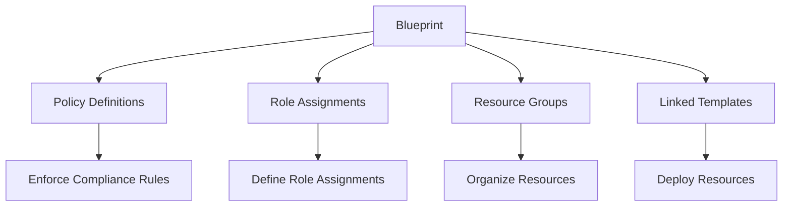
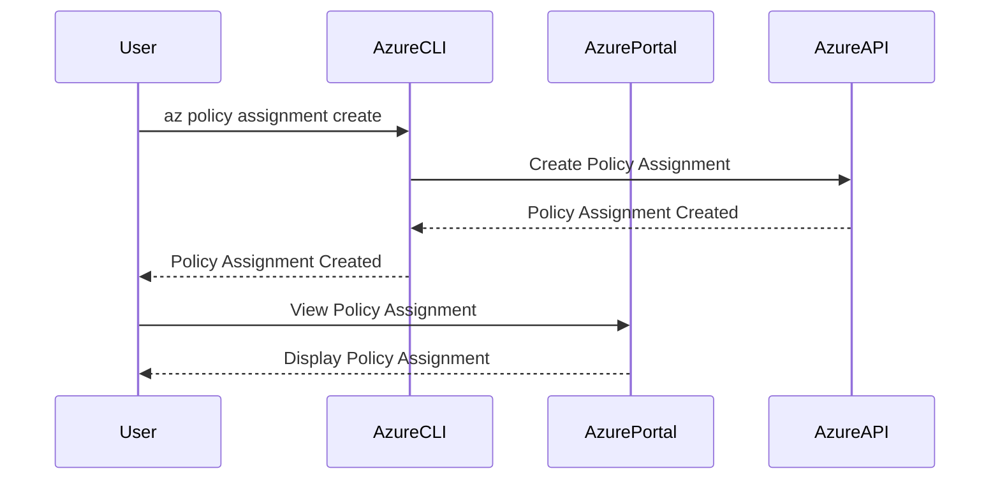

## Understanding Compliance as Code

### Introduction to Compliance as Code

Compliance as Code is a methodology that integrates compliance requirements into the development process through automated checks and configurations. This approach ensures that systems and applications adhere to regulatory standards and internal policies throughout their lifecycle. In the context of Azure, this methodology is implemented through tools like Policy Definitions and Blueprints.

### Policy Definitions in Azure

Policy Definitions in Azure are used to enforce organizational standards and regulatory requirements across resources. These policies can be applied at various scopes, including management groups, subscriptions, resource groups, and individual resources. Policy Definitions can be created using the Azure Portal, Azure CLI, Azure PowerShell, or REST API.

#### Creating a Policy Definition

To create a policy definition, you can use the Azure Portal:

1. Navigate to the **Policy** service.
2. Click on **Definitions**.
3. Click on **Create Policy Definition**.
4. Provide a name, description, and metadata.
5. Define the policy rule using the Policy Language.

Here’s an example of a simple policy definition that requires all storage accounts to have public access disabled:

```json
{
    "if": {
        "allOf": [
            {
                "field": "type",
                "equals": "Microsoft.Storage/storageAccounts"
            },
            {
                "field": "Microsoft.Storage/storageAccounts/publicAccess",
                "exists": "true"
            }
        ]
    },
    "then": {
        "effect": "deny"
    }
}
```

This policy will deny the creation or modification of any storage account that has public access enabled.

#### Applying Policy Definitions

Once a policy definition is created, it can be assigned to a scope. For example, to assign the above policy to a subscription using Azure CLI:

```bash
az policy assignment create --policy "<policy-definition-id>" --name "DenyPublicStorageAccess" --scope "/subscriptions/<subscription-id>"
```

### Azure Blueprints

Azure Blueprints take compliance as code to the next level by providing a template-based approach to deploying and managing resources. A blueprint is a collection of policy definitions, role assignments, and resource groups that define how resources should be deployed and managed.

#### Components of a Blueprint

A blueprint consists of several components:

- **Policy Definitions**: Enforce compliance rules.
- **Role Assignments**: Define who can perform actions on resources.
- **Resource Groups**: Organize resources logically.
- **Linked Templates**: ARM templates that define resource deployments.

#### Creating a Blueprint

To create a blueprint, follow these steps:

1. Navigate to the **Blueprints** service in the Azure Portal.
2. Click on **Create Blueprint**.
3. Provide a name and description.
4. Add policy definitions, role assignments, and linked templates.

For example, let’s create a blueprint that enforces PCI DSS compliance:

1. Add a policy definition that requires all virtual machines to have a specific tag.
2. Add a role assignment that grants read-only access to a specific user.
3. Add a linked template that deploys a virtual machine with specific configurations.

Here’s an example of a linked template that deploys a virtual machine:

```json
{
    "$schema": "https://schema.management.azure.com/schemas/2019-04-01/deploymentTemplate.json#",
    "contentVersion": "1.0.0.0",
    "parameters": {
        "vmName": {
            "type": "string",
            "metadata": {
                "description": "The name of the virtual machine."
            }
        }
    },
    "resources": [
        {
            "type": "Microsoft.Compute/virtualMachines",
            "apiVersion": "2021-07-01",
            "name": "[parameters('vmName')]",
            "location": "[resourceGroup().location]",
            "properties": {
                "osProfile": {
                    "computerName": "[parameters('vmName')]",
                    "adminUsername": "azureuser",
                    "adminPassword": "P@ssw0rd!"
                },
                "hardwareProfile": {
                    "vmSize": "Standard_DS1_v2"
                },
                "storageProfile": {
                    "imageReference": {
                        "publisher": "Canonical",
                        "offer": "UbuntuServer",
                        "sku": "18.04-LTS",
                        "version": "latest"
                    },
                    "osDisk": {
                        "createOption": "FromImage"
                    }
                },
                "networkProfile": {
                    "networkInterfaces": [
                        {
                            "id": "[resourceId('Microsoft.Network/networkInterfaces', concat(parameters('vmName'), '-nic'))]"
                        }
                    ]
                }
            }
        }
    ]
}
```

#### Applying a Blueprint

To apply a blueprint, you can use the Azure Portal or Azure CLI:

```bash
az blueprint assignment create --blueprint "<blueprint-name>" --name "MyAssignment" --scope "/subscriptions/<subscription-id>"
```

### Real-World Examples

#### Example 1: PCI DSS Compliance

PCI DSS (Payment Card Industry Data Security Standard) is a set of security standards designed to ensure that all companies that accept, process, store, or transmit credit card information maintain a secure environment. Azure provides pre-defined blueprints for PCI DSS compliance.

For example, the PCI DSS blueprint includes policies that require:

- All virtual machines to have a specific tag.
- All storage accounts to have public access disabled.
- All network security groups to have specific rules defined.

#### Example 2: NIST Compliance

NIST (National Institute of Standards and Technology) provides guidelines for securing federal information systems. Azure provides pre-defined blueprints for NIST compliance.

For example, the NIST blueprint includes policies that require:

- All virtual machines to have a specific tag.
- All storage accounts to have public access disabled.
- All network security groups to have specific rules defined.

### How to Prevent / Defend

#### Detection

To detect non-compliance issues, you can use Azure Policy to evaluate resources against policy definitions. For example, to evaluate a subscription against a policy definition:

```bash
az policy state list --filter "policyDefinitionId eq '<policy-definition-id>'" --subscription "<subscription-id>"
```

#### Prevention

To prevent non-compliance issues, you can use Azure Blueprints to enforce compliance rules across resources. For example, to assign a blueprint to a subscription:

```bash
az blueprint assignment create --blueprint "<blueprint-name>" --name "MyAssignment" --scope "/subscriptions/<subscription-id>"
```

#### Secure Coding Fixes

To fix non-compliance issues, you can modify resources to meet policy requirements. For example, to modify a storage account to disable public access:

```bash
az storage account update --name "<storage-account-name>" --public-access "false"
```

### Conclusion

Compliance as Code is a powerful methodology that integrates compliance requirements into the development process through automated checks and configurations. By using tools like Azure Policy Definitions and Blueprints, organizations can ensure that systems and applications adhere to regulatory standards and internal policies throughout their lifecycle.

### Practice Labs

For hands-on practice with Compliance as Code, consider the following labs:

- **PortSwigger Web Security Academy**: Focuses on web application security but can provide insights into compliance requirements.
- **OWASP Juice Shop**: Provides a vulnerable web application for practicing security testing and compliance.
- **CloudGoat**: Offers a series of labs for practicing cloud security and compliance in AWS.
- **flaws.cloud**: Provides a series of labs for practicing cloud security and compliance in Azure.

These labs will help you gain practical experience with Compliance as Code and prepare you for real-world scenarios.

### Mermaid Diagrams

#### Blueprint Architecture



#### Request/Response Flow



### Summary

In summary, Compliance as Code is a critical component of DevSecOps that ensures systems and applications adhere to regulatory standards and internal policies throughout their lifecycle. By using tools like Azure Policy Definitions and Blueprints, organizations can automate compliance checks and enforce compliance rules across resources. This approach helps organizations stay compliant and secure in today's complex and dynamic environments.

---
<!-- nav -->
[[DevSecOps/DevSecOps Bootcamp/02-Security Governance & Compliance/05-Understanding Compliance as Code/03-Compliance as Code templates/00-Overview|Overview]] | [[DevSecOps/DevSecOps Bootcamp/02-Security Governance & Compliance/05-Understanding Compliance as Code/03-Compliance as Code templates/02-Practice Questions & Answers|Practice Questions & Answers]]
