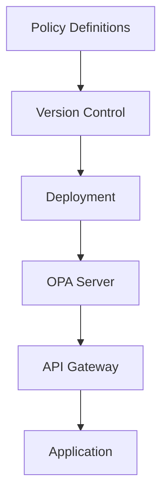
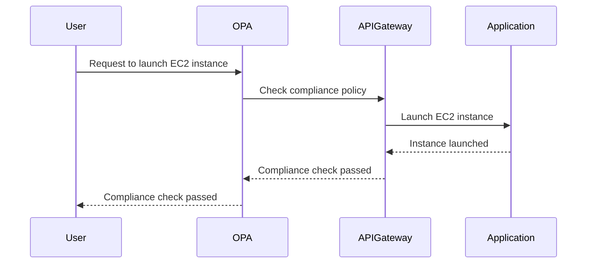

## Understanding Compliance as Code

### Background Theory

Compliance as Code is an extension of the broader concept of Infrastructure as Code (IaC). To understand Compliance as Code, we first need to delve into the principles and practices of IaC.

#### Infrastructure as Code (IaC)

Infrastructure as Code (IaC) is the practice of managing and provisioning computer data centers through machine-readable definition files, rather than physical hardware configuration or interactive configuration tools. Essentially, IaC treats infrastructure like software, allowing for version control, testing, and deployment automation.

**What is IaC?**

IaC involves treating your infrastructure (servers, networks, storage, etc.) as a codebase. Instead of manually configuring servers or using graphical user interfaces (GUIs), you define your infrastructure using code. This code can then be checked into a version control system, tested, and deployed automatically.

**Why is IaC Important?**

1. **Consistency**: Manual configurations can lead to inconsistencies across environments. With IaC, you ensure that all environments are configured identically.
2. **Reproducibility**: You can easily reproduce your entire infrastructure from scratch using the same code.
3. **Version Control**: By storing your infrastructure definitions in a version control system, you can track changes, revert to previous states, and collaborate with others.
4. **Automation**: IaC allows for automated deployment and scaling, reducing the risk of human error.

**How Does IaC Work?**

IaC typically involves the following steps:

1. **Define Your Infrastructure**: Write code that defines your infrastructure. This can be done using various tools and languages, such as Terraform, Ansible, Chef, Puppet, or simple shell scripts.
2. **Check-in the Code**: Store the code in a version control system like Git.
3. **Test the Code**: Test the code to ensure it behaves as expected.
4. **Deploy the Code**: Use the code to deploy and manage your infrastructure.

**Example of IaC Using Terraform**

```hcl
provider "aws" {
  region = "us-west-2"
}

resource "aws_instance" "example" {
  ami           = "ami-0c94855ba95b798c7"
  instance_type = "t2.micro"

  tags = {
    Name = "example-instance"
  }
}
```

This Terraform configuration defines an AWS EC2 instance. The `provider` block specifies the AWS provider and region, while the `resource` block defines the EC2 instance.

### Compliance as Code

Compliance as Code extends the principles of IaC to compliance requirements. Just as IaC treats infrastructure as code, Compliance as Code treats compliance policies and regulations as code.

**What is Compliance as Code?**

Compliance as Code involves automating the enforcement of compliance policies and regulations using code. This includes defining compliance rules, testing them, and enforcing them across your infrastructure.

**Why is Compliance as Code Important?**

1. **Automation**: Automate the enforcement of compliance policies, reducing the risk of human error.
2. **Consistency**: Ensure consistent enforcement of compliance policies across all environments.
3. **Auditability**: Track changes to compliance policies and audit their enforcement.
4. **Scalability**: Easily scale compliance enforcement as your infrastructure grows.

**How Does Compliance as Code Work?**

Compliance as Code typically involves the following steps:

1. **Define Compliance Policies**: Write code that defines your compliance policies.
2. **Check-in the Code**: Store the code in a version control system.
3. **Test the Code**: Test the code to ensure it enforces compliance correctly.
4. **Enforce the Code**: Use the code to enforce compliance policies across your infrastructure.

**Example of Compliance as Code Using Open Policy Agent (OPA)**

Open Policy Agent (OPA) is a powerful tool for implementing Compliance as Code. OPA allows you to define policies in a declarative language called Rego.

```rego
package security

default allow = false

allow {
  input.resource.type == "EC2Instance"
  input.action == "launch"
  input.resource.properties.imageId == "ami-0c94855ba95b798c7"
}
```

This Rego policy defines a rule that allows launching an EC2 instance only if the specified AMI is used.

### Recent Real-World Examples

#### Example: GDPR Compliance

The General Data Protection Regulation (GDPR) is a regulation in EU law on data protection and privacy for all individuals within the European Union. Compliance as Code can help organizations automate the enforcement of GDPR requirements.

**GDPR Requirement**: Organizations must ensure that personal data is processed securely and that appropriate technical and organizational measures are implemented.

**Compliance as Code Implementation**: Use OPA to define policies that enforce GDPR requirements, such as ensuring that sensitive data is encrypted and access controls are properly configured.

```rego
package gdpr

default allow = false

allow {
  input.resource.type == "SensitiveData"
  input.action == "access"
  input.principal.role == "Admin"
}
```

This policy ensures that only administrators can access sensitive data.

### Common Pitfalls and How to Avoid Them

#### Pitfall: Inconsistent Enforcement

One common pitfall is inconsistent enforcement of compliance policies. This can occur if policies are not properly defined, tested, or enforced.

**How to Avoid**: Ensure that compliance policies are well-defined, tested, and enforced consistently across all environments. Use version control to track changes and collaborate with others.

#### Pitfall: Lack of Auditability

Another pitfall is a lack of auditability. Without proper tracking and logging, it can be difficult to determine whether compliance policies are being enforced correctly.

**How to Avoid**: Implement logging and monitoring to track compliance policy enforcement. Use tools like OPA to generate audit logs that can be reviewed and analyzed.

### How to Prevent / Defend

#### Detection

To detect compliance violations, implement monitoring and logging. Use tools like OPA to generate audit logs that can be reviewed and analyzed.

#### Prevention

To prevent compliance violations, ensure that compliance policies are well-defined, tested, and enforced consistently. Use version control to track changes and collaborate with others.

#### Secure Coding Fixes

Show the vulnerable pattern and the corrected secure version side by side.

**Vulnerable Pattern**

```rego
package security

default allow = true

allow {
  input.resource.type == "EC2Instance"
  input.action == "launch"
}
```

This policy allows launching any EC2 instance without any restrictions.

**Secure Version**

```rego
package security

default allow = false

allow {
  input.resource.type == "EC2Instance"
  input.action == "launch"
  input.resource.properties.imageId == "ami-0c94855ba95b798c7"
}
```

This policy restricts launching EC2 instances to only those using the specified AMI.

### Complete Example

#### Full HTTP Request and Response

When working with compliance policies, you may need to interact with APIs to enforce policies. Here is an example of a full HTTP request and response for enforcing a compliance policy using OPA.

**HTTP Request**

```http
POST /v1/data/security/allow HTTP/1.1
Host: localhost:8181
Content-Type: application/json

{
  "input": {
    "resource": {
      "type": "EC2Instance",
      "properties": {
        "imageId": "ami-0c94855ba95b798c7"
      }
    },
    "action": "launch",
    "principal": {
      "role": "Admin"
    }
  }
}
```

**HTTP Response**

```http
HTTP/1.1 200 OK
Content-Type: application/json

{
  "result": true
}
```

### Mermaid Diagrams

#### Architecture Diagram

Here is a mermaid diagram showing the architecture of a Compliance as Code implementation using OPA.



#### Sequence Diagram

Here is a mermaid sequence diagram showing the interaction between components in a Compliance as Code implementation.



### Hands-On Labs

For hands-on practice with Compliance as Code, consider the following labs:

- **PortSwigger Web Security Academy**: Offers labs on securing web applications, including compliance-related topics.
- **OWASP Juice Shop**: A deliberately insecure web application for security training.
- **CloudGoat**: A set of labs for learning about cloud security, including compliance as code.
- **Pacu**: A framework for automating cloud security assessments, including compliance checks.

These labs provide practical experience in implementing and enforcing compliance policies using code.

### Conclusion

Compliance as Code is a powerful approach to automating the enforcement of compliance policies and regulations. By treating compliance policies as code, you can ensure consistency, reproducibility, and scalability. Use tools like OPA to define, test, and enforce compliance policies, and implement monitoring and logging to track compliance policy enforcement. With Compliance as Code, you can ensure that your organization remains compliant with regulatory requirements while maintaining the benefits of automation and consistency.

---
<!-- nav -->
[[DevSecOps/DevSecOps Bootcamp/02-Security Governance & Compliance/05-Understanding Compliance as Code/04-Compliance as Code/00-Overview|Overview]] | [[DevSecOps/DevSecOps Bootcamp/02-Security Governance & Compliance/05-Understanding Compliance as Code/04-Compliance as Code/02-Practice Questions & Answers|Practice Questions & Answers]]
