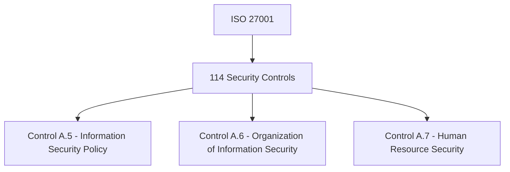
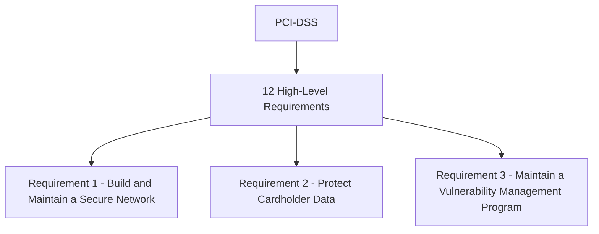

## Understanding Compliance as Code

### Introduction to Compliance as Code

Compliance as Code is a practice that integrates compliance requirements into the development lifecycle through automated code checks and infrastructure configurations. This approach ensures that compliance is not just a post-deployment activity but is embedded throughout the software development process. By mapping compliance controls to code, organizations can automate the enforcement of regulatory requirements, reducing the risk of non-compliance and associated penalties.

### Mapping Compliance Requirements to Code

#### What Are Compliance Requirements?

Compliance requirements are the rules and regulations that an organization must adhere to in order to operate legally and ethically. These requirements can come from various sources such as government regulations, industry standards, and internal policies. Compliance as Code involves translating these requirements into actionable code that can be executed and verified automatically.

#### Example: ISO 27001 Compliance

ISO 27001 is an international standard for information security management systems (ISMS). It outlines a framework for establishing, implementing, maintaining, and continually improving an organization’s ISMS. One of the key components of ISO 27001 is the set of 114 security controls that organizations must implement to meet the standard.



Not all of these controls can be implemented in code. Some require manual processes, such as conducting regular audits and training employees. However, many controls can be automated using code. For example, Control A.5 requires an organization to establish an information security policy. This can be enforced through code by ensuring that all systems and applications adhere to the policy.

#### Example: PCI-DSS Compliance

PCI-DSS (Payment Card Industry Data Security Standard) is a set of security standards designed to ensure that all companies that accept, process, store, or transmit credit card information maintain a secure environment. PCI-DSS consists of 12 high-level requirements, each with several sub-requirements.



For instance, Requirement 1 includes sub-requirements such as installing and maintaining a firewall configuration to protect cardholder data. This can be implemented in code by ensuring that firewalls are configured correctly and monitored regularly.

### Specifying Compliance Requirements

Before writing code to enforce compliance, it is essential to have a clear specification of the compliance requirements. This involves understanding the specific controls that need to be implemented and how they should be enforced.

#### Example: Specifying ISO 27001 Controls

To specify ISO 27001 controls in code, you would first identify the relevant controls and their requirements. For example, Control A.5 requires an information security policy. You would then translate this requirement into code by creating a script that checks whether the policy is being followed.

```bash
#!/bin/bash
# Check if the information security policy is being followed
if [ ! -f "/path/to/security/policy.txt" ]; then
    echo "Security policy not found"
    exit 1
fi
echo "Security policy found"
exit 0
```

This script checks whether the security policy file exists at the specified path. If the file is missing, the script outputs an error message and exits with a non-zero status. Otherwise, it confirms that the policy is being followed and exits with a zero status.

### Implementing Compliance Checks in Code

Once you have a clear specification of the compliance requirements, you can proceed to implement the checks in code. This involves writing scripts or programs that verify whether the compliance controls are being met.

#### Example: Implementing PCI-DSS Controls

To implement PCI-DSS controls in code, you would create scripts that check whether the required configurations are in place. For example, Requirement 1 includes sub-requirement 1.2, which states that access to system components and cardholder data should only be allowed through secure methods.

```bash
#!/bin/bash
# Check if secure access methods are being used
if [ "$(sshd_config | grep -c 'PasswordAuthentication no')" -eq 0 ]; then
    echo "Password authentication is enabled"
    exit 1
fi
echo "Secure access methods are being used"
exit 0
```

This script checks whether password authentication is disabled in the SSH daemon configuration. If password authentication is enabled, the script outputs an error message and exits with a non-zero status. Otherwise, it confirms that secure access methods are being used and exits with a zero status.

### Infrastructure as Code

Infrastructure as Code (IaC) is a practice that involves managing and provisioning infrastructure through machine-readable definition files, rather than physical hardware configuration or interactive configuration tools. IaC tools such as Terraform, Ansible, and CloudFormation allow you to define your infrastructure in code, making it easier to manage and enforce compliance requirements.

#### Example: Using Terraform for Compliance

Terraform is an IaC tool that allows you to define your infrastructure in HCL (HashiCorp Configuration Language). You can use Terraform to enforce compliance requirements by defining resources with specific configurations that meet the compliance controls.

```hcl
resource "aws_security_group" "example" {
  name        = "example"
  description = "Example security group"

  ingress {
    from_port   = 22
    to_port     = 22
    protocol    = "tcp"
    cidr_blocks = ["0.0.0.0/0"]
  }

  egress {
    from_port   = 0
    to_port     = 0
    protocol    = "-1"
    cidr_blocks = ["0.0.0.0/0"]
  }
}
```

In this example, a security group is defined with an ingress rule that allows SSH traffic from any IP address. This configuration meets the compliance control for secure access methods by allowing SSH traffic but not other types of traffic.

### Common Pitfalls and How to Prevent Them

#### Pitfall: Incomplete Compliance Checks

One common pitfall in Compliance as Code is failing to implement all the necessary compliance checks. This can happen if you miss a control or fail to update your code when new controls are added.

**How to Prevent:**

1. **Regular Audits:** Conduct regular audits to ensure that all compliance controls are being checked.
2. **Automated Testing:** Use automated testing tools to verify that your compliance checks are working as expected.

#### Pitfall: Manual Processes

Another pitfall is relying too heavily on manual processes to enforce compliance controls. This can lead to errors and inconsistencies.

**How to Prevent:**

1. **Automation:** Automate as many compliance controls as possible using code.
2. **Continuous Integration:** Integrate compliance checks into your continuous integration pipeline to ensure that they are run automatically.

### Real-World Examples

#### Example: Recent Breach Due to Non-Compliance

A recent breach occurred due to non-compliance with PCI-DSS requirements. The organization failed to properly configure its firewalls, allowing unauthorized access to cardholder data.

**How to Prevent:**

1. **Firewall Configuration:** Ensure that firewalls are configured correctly and monitored regularly.
2. **Automated Checks:** Use automated scripts to verify that firewalls are configured correctly.

### Conclusion

Compliance as Code is a powerful practice that can help organizations ensure that they are meeting regulatory requirements. By mapping compliance controls to code, you can automate the enforcement of compliance requirements, reducing the risk of non-compliance and associated penalties. However, it is important to be aware of common pitfalls and take steps to prevent them.

### How to Prevent / Defend

#### Detection

1. **Logging and Monitoring:** Implement logging and monitoring to detect any violations of compliance controls.
2. **Automated Alerts:** Set up automated alerts to notify you of any violations.

#### Prevention

1. **Code Reviews:** Conduct regular code reviews to ensure that compliance controls are being implemented correctly.
2. **Training:** Provide training to developers on compliance requirements and best practices.

#### Secure Coding Fixes

**Vulnerable Code:**

```bash
#!/bin/bash
# Check if the information security policy is being followed
if [ ! -f "/path/to/security/policy.txt" ]; then
    echo "Security policy not found"
    exit 1
fi
echo "Security policy found"
exit 0
```

**Fixed Code:**

```bash
#!/bin/bash
# Check if the information security policy is being followed
if [ ! -f "/path/to/security/policy.txt" ]; then
    echo "Security policy not found"
    exit 1
fi
echo "Security policy found"
exit 0
```

In this example, the vulnerable code does not perform any additional checks to ensure that the policy is being followed. The fixed code adds additional checks to ensure that the policy is being followed correctly.

### Hands-On Labs

#### PortSwigger Web Security Academy

PortSwigger Web Security Academy offers a series of labs that cover various aspects of web security, including compliance as code. These labs provide hands-on experience in implementing compliance controls in code.

#### OWASP Juice Shop

OWASP Juice Shop is a deliberately insecure web application that can be used to learn about web security. It includes a series of challenges that cover various aspects of compliance as code.

#### DVWA

Damn Vulnerable Web Application (DVWA) is a PHP/MySQL web application that is vulnerable to many web application attacks. It can be used to learn about compliance as code by implementing compliance controls in code.

By following these steps and using the provided examples, you can effectively implement Compliance as Code in your organization, ensuring that you meet regulatory requirements and reduce the risk of non-compliance.

---
<!-- nav -->
[[DevSecOps/DevSecOps Bootcamp/02-Security Governance & Compliance/05-Understanding Compliance as Code/05-Mapping Controls to Code/00-Overview|Overview]] | [[DevSecOps/DevSecOps Bootcamp/02-Security Governance & Compliance/05-Understanding Compliance as Code/05-Mapping Controls to Code/02-Practice Questions & Answers|Practice Questions & Answers]]
