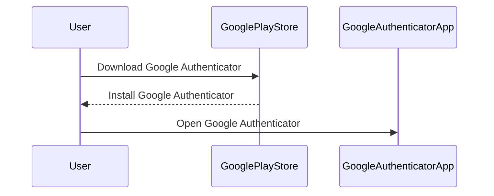
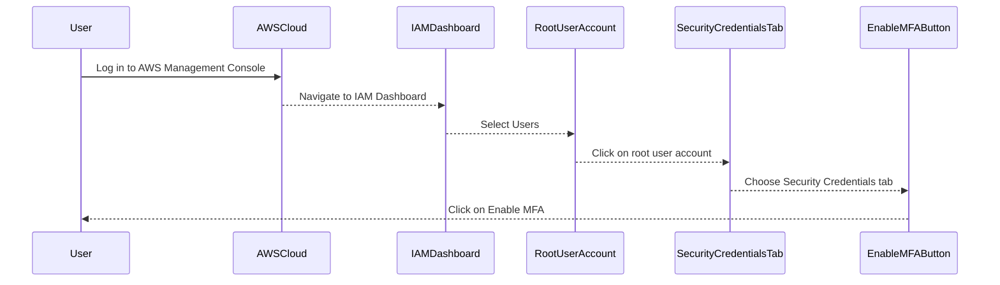
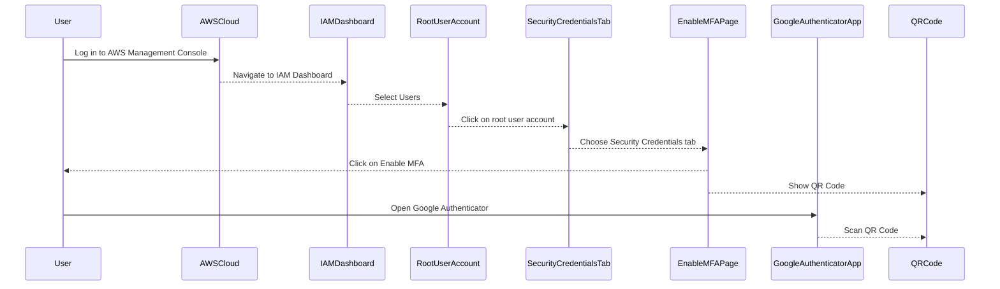
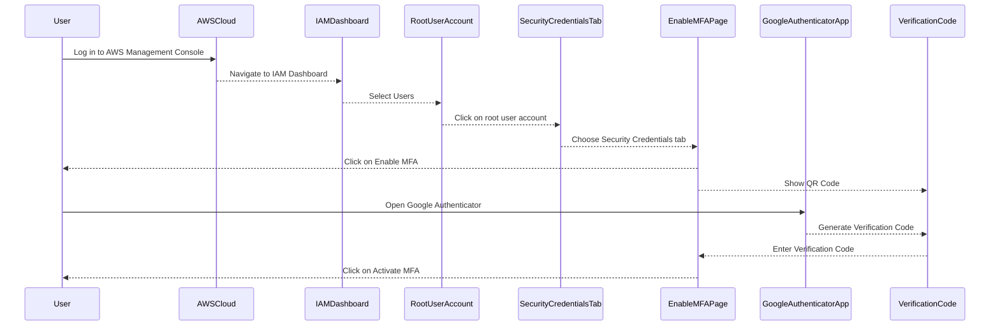

## Securing the AWS Root User Account

### Introduction to AWS Root User Account

The AWS root user account is the most powerful account within an AWS environment. This account has full administrative privileges across all services and resources within the AWS account. Because of its extensive permissions, securing the root user account is critical to maintaining the overall security posture of your AWS environment.

### Importance of Multi-Factor Authentication (MFA)

Multi-Factor Authentication (MFA) is a security measure that requires users to provide two or more verification factors to gain access to a resource. In the context of AWS, enabling MFA for the root user account significantly enhances security by adding an additional layer of authentication beyond just a username and password.

#### What is MFA?

MFA combines something you know (password), something you have (token), and something you are (biometric data). By requiring multiple forms of identification, MFA makes it much harder for unauthorized individuals to gain access to your account.

#### Why Use MFA?

- **Enhanced Security**: MFA reduces the risk of unauthorized access even if a password is compromised.
- **Compliance Requirements**: Many regulatory frameworks require the use of MFA for privileged accounts.
- **Best Practices**: Enabling MFA aligns with industry best practices for securing sensitive accounts.

### Types of MFA Devices

AWS supports several types of MFA devices:

1. **Authenticator App**: A mobile application that generates time-based one-time passwords (TOTP).
2. **Hardware Token**: A physical device that generates one-time passwords.
3. **Security Key**: A USB device that uses public-key cryptography for authentication.

#### Authenticator App

An authenticator app is a software-based solution that generates TOTP codes. These apps are widely used due to their convenience and ease of setup. Popular examples include Google Authenticator, Microsoft Authenticator, and Authy.

#### Hardware Token

A hardware token is a physical device that generates one-time passwords. These tokens are often used in environments where a high level of security is required. Examples include RSA SecurID and YubiKey.

#### Security Key

A security key is a USB device that uses public-key cryptography to authenticate users. These keys are designed to be resistant to phishing attacks and are often used in conjunction with passwordless authentication methods.

### Setting Up MFA for the AWS Root User Account

To set up MFA for the AWS root user account, follow these steps:

1. **Log in to the AWS Management Console**.
2. **Navigate to the IAM Dashboard**.
3. **Select Users**.
4. **Click on the root user account**.
5. **Choose the Security Credentials tab**.
6. **Click on Enable MFA**.

#### Step-by-Step Example Using Google Authenticator

1. **Install Google Authenticator**:
   - Download and install the Google Authenticator app from the Google Play Store or Apple App Store.



2. **Enable MFA in AWS**:
   - Log in to the AWS Management Console.
   - Navigate to the IAM Dashboard.
   - Select Users.
   - Click on the root user account.
   - Choose the Security Credentials tab.
   - Click on Enable MFA.



3. **Scan the QR Code**:
   - On the Enable MFA page, click on Show QR Code.
   - Open the Google Authenticator app and click on the plus sign.
   - Select Scan a barcode.
   - Scan the QR code displayed in the AWS console.



4. **Enter the Verification Code**:
   - After scanning the QR code, the Google Authenticator app will generate a six-digit code.
   - Enter this code in the AWS console and click on Activate MFA.



### Common Pitfalls and Best Practices

#### Common Pitfalls

1. **Not Enabling MFA**: Failing to enable MFA leaves the root user account vulnerable to unauthorized access.
2. **Using Weak Passwords**: Weak passwords can be easily guessed or cracked, compromising the security of the root user account.
3. **Not Regularly Reviewing Access Logs**: Not reviewing access logs can make it difficult to detect unauthorized access attempts.

#### Best Practices

1. **Enable MFA**: Always enable MFA for the root user account to add an extra layer of security.
2. **Use Strong Passwords**: Use strong, unique passwords for the root user account.
3. **Regularly Review Access Logs**: Regularly review access logs to detect and respond to unauthorized access attempts.

### Real-World Examples and Breaches

#### Recent Breaches

1. **Capital One Data Breach (2019)**: In this breach, an attacker gained unauthorized access to Capital One’s AWS environment by exploiting a misconfigured web application firewall. The attacker was able to access sensitive customer data, including Social Security numbers and bank account information.

2. **Twitter Hack (2020)**: In this incident, attackers gained access to Twitter’s internal systems by compromising the credentials of multiple employees. The attackers were able to post fraudulent tweets from high-profile accounts, including those of Barack Obama and Elon Musk.

#### Security Impact

These breaches highlight the importance of securing the root user account and implementing robust security measures, such as MFA, to prevent unauthorized access.

### How to Prevent / Defend

#### Detection

1. **Monitor Access Logs**: Regularly monitor access logs to detect any unauthorized access attempts.
2. **Use AWS CloudTrail**: AWS CloudTrail provides a record of API calls made to your AWS account, including those made by the root user. This can help you detect and investigate unauthorized access.

#### Prevention

1. **Enable MFA**: Always enable MFA for the root user account to add an extra layer of security.
2. **Use Strong Passwords**: Use strong, unique passwords for the root user account.
3. **Limit Root User Usage**: Limit the usage of the root user account and instead use IAM users with least privilege access.

#### Secure Coding Fixes

##### Vulnerable Pattern

```json
{
  "Statement": [
    {
      "Effect": "Allow",
      "Action": "*",
      "Resource": "*"
    }
  ]
}
```

##### Secure Pattern

```json
{
  "Statement": [
    {
      "Effect": "Allow",
      "Action": "ec2:*",
      "Resource": "*"
    },
    {
      "Effect": "Allow",
      "Action": "s3:*",
      "Resource": "arn:aws:s3:::my-bucket/*"
    }
  ]
}
```

### Hands-On Labs

For practical experience in securing AWS root user accounts, consider the following labs:

- **CloudGoat**: A cloud security training platform that includes exercises on securing AWS root user accounts.
- **flaws.cloud**: A cloud security training platform that includes exercises on securing AWS root user accounts.
- **AWS Well-Architected Labs**: Official AWS labs that cover various aspects of securing AWS environments, including securing root user accounts.

By following these best practices and utilizing hands-on labs, you can ensure that your AWS root user account remains secure and protected against unauthorized access.

---
<!-- nav -->
[[DevSecOps/DevSecOps Bootcamp/03-Identity & Access Management/01-AWS Cloud Security & Access Management/05-Securing AWS Root User Account/00-Overview|Overview]] | [[02-Understanding AWS Root User and Its Importance|Understanding AWS Root User and Its Importance]]
