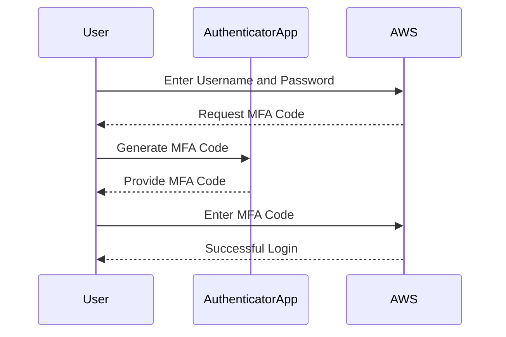
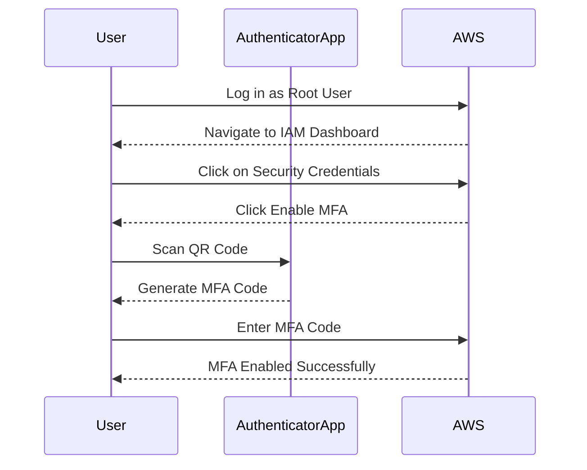
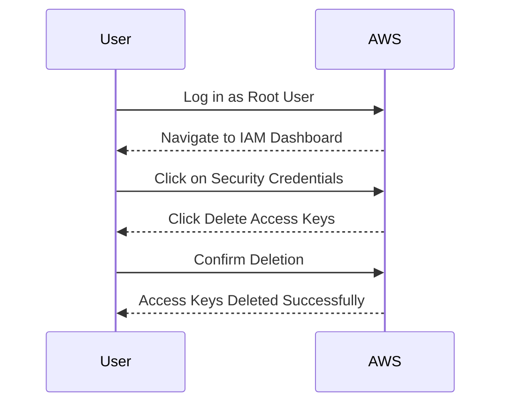

## Understanding AWS Root User and Its Importance

In the context of AWS (Amazon Web Services), the root user is the initial administrative account created when an AWS account is set up. This user has full access to all AWS services and resources within the account. The root user can perform any action, including creating and managing IAM (Identity and Access Management) users, roles, and policies, as well as making changes to billing and support information.

### Why Is the Root User Important?

The root user holds supreme power within an AWS account. Here are some key reasons why securing the root user is crucial:

1. **Full Control**: The root user can perform any action within the AWS account, including deleting the entire account, changing payment methods, and modifying critical resources.
2. **Resource Management**: The root user can create, modify, and delete any resource within the AWS environment.
3. **Access Management**: The root user can grant permissions to other users and roles, effectively controlling who has access to what within the account.
4. **Security Risks**: Because of its extensive privileges, the root user is a prime target for attackers. Compromising the root user can lead to significant damage, including data loss, financial theft, and reputational harm.

### Real-World Examples of Root User Compromise

Several high-profile breaches have involved compromised root user accounts:

- **Equifax Data Breach (CVE-2017-5638)**: Although not directly related to AWS, the breach highlighted the importance of securing administrative accounts. In this case, an attacker exploited a vulnerability in Apache Struts, leading to the exposure of sensitive personal data.
- **Capital One Data Breach (CVE-2019-11510)**: An attacker gained unauthorized access to a Capital One server by exploiting a misconfigured web application firewall. While this breach did not involve AWS root user compromise, it underscores the broader importance of securing administrative access.

### How to Secure the Root User

Given the critical nature of the root user, it is essential to implement robust security measures to protect it. The following sections will cover the steps to secure the root user, focusing on Multi-Factor Authentication (MFA) and the removal of root user access keys.

### Multi-Factor Authentication (MFA)

Multi-Factor Authentication (MFA) adds an additional layer of security to the login process. Instead of relying solely on a username and password, MFA requires a second form of verification, such as a code sent to a mobile device or generated by an authenticator app.

#### What Is MFA?

MFA combines something the user knows (password), something the user has (mobile device), and something the user is (biometric data). This combination significantly reduces the risk of unauthorized access, even if the password is compromised.

#### Why Is MFA Important?

MFA provides an extra layer of security that makes it much harder for attackers to gain access to an account. Without MFA, an attacker who gains access to a user’s password can log in and potentially cause significant damage. With MMFA, even if the password is compromised, the attacker would still need the second factor to gain access.

#### How Does MFA Work?

When enabled, MFA prompts the user to provide a second form of verification after entering their username and password. This second factor is typically a time-based one-time password (TOTP) generated by an authenticator app or sent via SMS.



### Enabling MFA for the Root User

To enable MFA for the root user, follow these steps:

1. **Log in to the AWS Management Console** as the root user.
2. Navigate to the IAM (Identity and Access Management) dashboard.
3. Click on the **Security Credentials** tab.
4. Under **Multi-Factor Authentication**, click **Enable MFA**.
5. Follow the on-screen instructions to configure MFA using an authenticator app or SMS.

Here is an example of enabling MFA using an authenticator app:



### Removing Root User Access Keys

Access keys are used for programmatic access to AWS services. They consist of an access key ID and a secret access key. While useful for automation, access keys for the root user pose a significant security risk.

#### Why Are Root User Access Keys Dangerous?

Root user access keys provide full administrative access to the AWS account. If these keys are compromised, an attacker can perform any action within the account, including deleting resources and modifying billing information. Therefore, it is recommended to remove root user access keys and use them only for initial setup or emergency situations.

#### How to Remove Root User Access Keys

To remove root user access keys, follow these steps:

1. **Log in to the AWS Management Console** as the root user.
2. Navigate to the IAM (Identity and Access Management) dashboard.
3. Click on the **Security Credentials** tab.
4. Under **Access Keys**, click **Delete**.
5. Confirm the deletion to remove the access keys.

Here is an example of removing root user access keys:



### How to Prevent / Defend Against Root User Compromise

#### Detection

Regularly monitor AWS CloudTrail logs to detect any suspicious activity associated with the root user. CloudTrail logs provide detailed records of API calls made to AWS services, which can help identify unauthorized access attempts.

#### Prevention

1. **Enable MFA**: Ensure that MFA is enabled for the root user and all IAM users with elevated privileges.
2. **Remove Root User Access Keys**: Avoid using root user access keys for regular operations. Instead, create IAM users with limited permissions for day-to-day tasks.
3. **Use IAM Policies**: Implement least privilege principles by granting IAM users only the permissions necessary to perform their job functions.
4. **Monitor and Audit**: Regularly review CloudTrail logs and IAM activity to detect and respond to potential security incidents.

#### Secure Coding Fixes

Here is an example of a vulnerable IAM policy that grants excessive permissions to an IAM user:

```json
{
    "Version": "2012-10-17",
    "Statement": [
        {
            "Effect": "Allow",
            "Action": "*",
            "Resource": "*"
        }
    ]
}
```

This policy allows the IAM user to perform any action on any resource, which is highly insecure. A secure version of this policy should limit the actions and resources to only what is necessary:

```json
{
    "Version": "2012-10-17",
    "Statement": [
        {
            "Effect": "Allow",
            "Action": [
                "s3:GetObject",
                "s3:PutObject"
            ],
            "Resource": "arn:aws:s3:::my-bucket/*"
        }
    ]
}
```

### Configuration Hardening

To further harden the AWS environment, consider implementing the following configurations:

1. **IAM Roles for EC2 Instances**: Use IAM roles to grant permissions to EC2 instances instead of using access keys.
2. **Resource Tags**: Tag resources with metadata to facilitate better management and auditing.
3. **VPC Flow Logs**: Enable VPC flow logs to monitor network traffic and detect unusual patterns.

### Complete Example: Full HTTP Request and Response

Here is an example of a full HTTP request and response for enabling MFA using an authenticator app:

#### HTTP Request

```http
POST /mfa/enroll HTTP/1.1
Host: iam.amazonaws.com
Content-Type: application/json
Authorization: Bearer <access_token>

{
    "method": "authenticator",
    "qr_code": "<base64_encoded_qr_code>"
}
```

#### HTTP Response

```http
HTTP/1.1 200 OK
Content-Type: application/json

{
    "status": "success",
    "message": "MFA enrollment successful",
    "mfa_code": "<generated_mfa_code>"
}
```

### Hands-On Labs

For hands-on practice in securing AWS root user accounts, consider the following labs:

- **CloudGoat**: A cloud security training platform that includes exercises for securing AWS root user accounts.
- **flaws.cloud**: A cloud security training platform that offers scenarios for practicing IAM and MFA configurations.
- **AWS Official Workshops**: AWS provides various workshops and labs that cover IAM and MFA setup.

By following these steps and best practices, you can significantly enhance the security of your AWS root user account and reduce the risk of unauthorized access and potential damage.

---
<!-- nav -->
[[01-Securing the AWS Root User Account|Securing the AWS Root User Account]] | [[DevSecOps/DevSecOps Bootcamp/03-Identity & Access Management/01-AWS Cloud Security & Access Management/05-Securing AWS Root User Account/00-Overview|Overview]] | [[DevSecOps/DevSecOps Bootcamp/03-Identity & Access Management/01-AWS Cloud Security & Access Management/05-Securing AWS Root User Account/03-Practice Questions & Answers|Practice Questions & Answers]]
