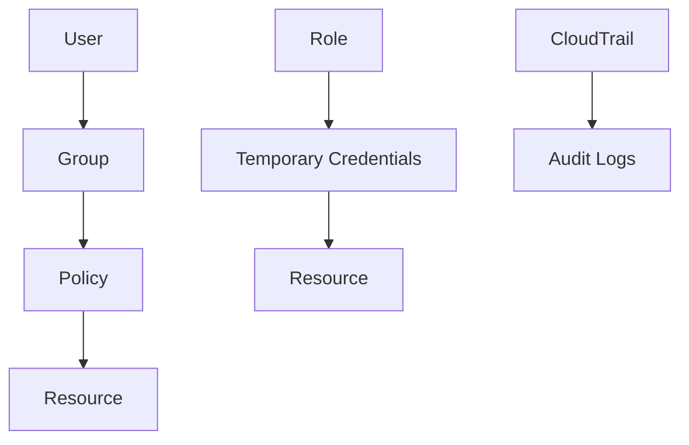

## Introduction to AWS Identity and Access Management (IAM)

AWS Identity and Access Management (IAM) is a crucial service that enables organizations to securely control access to AWS resources. IAM allows you to create and manage AWS users, groups, and permissions, ensuring that only authorized individuals can access specific resources. This is particularly important in both fully managed and self-managed AWS environments. In larger companies, it is common to have a dedicated team responsible solely for managing access to AWS resources, adhering to strict best practices such as least privilege access.

### Importance of Access Management

Access management is essential for several reasons:

1. **Security**: Ensures that only authorized personnel can access sensitive data and resources.
2. **Compliance**: Helps organizations meet regulatory requirements by controlling access based on roles and responsibilities.
3. **Efficiency**: Streamlines access management processes, reducing administrative overhead and improving productivity.

In large enterprises, a dedicated team manages IAM to ensure that all access requests are handled securely and efficiently. This team is responsible for creating and managing users, groups, roles, and permissions, and monitoring access activities to detect any suspicious behavior.

### Least Privilege Access Principle

The principle of least privilege (PoLP) is a fundamental security concept that states that users should have the minimum level of access necessary to perform their job functions. This means that users are granted access only to the resources they need, and only for the duration required. Implementing PoLP helps minimize the risk of unauthorized access and potential security breaches.

#### Example: Least Privilege in Practice

Consider an organization with multiple teams, each requiring different levels of access to AWS resources. For instance, a development team might need access to EC2 instances and S3 buckets, while a finance team might only require access to billing information.

```json
{
  "Version": "2012-10-17",
  "Statement": [
    {
      "Effect": "Allow",
      "Action": [
        "ec2:*",
        "s3:*"
      ],
      "Resource": "*"
    }
  ]
}
```

This policy grants full access to EC2 and S3 resources, which is overly permissive. Instead, a more secure approach would be to limit access to specific actions and resources:

```json
{
  "Version": "2012-10-17",
  "Statement": [
    {
      "Effect": "Allow",
      "Action": [
        "ec2:DescribeInstances",
        "s3:GetObject"
      ],
      "Resource": [
        "arn:aws:ec2:region:account-id:instance/*",
        "arn:aws:s3:::bucket-name/*"
      ]
    }
  ]
}
```

This policy restricts access to only the necessary actions and resources, adhering to the least privilege principle.

### Revoking Access

Access should be revoked as soon as it is no longer needed. This includes scenarios such as:

- A project being completed
- An employee changing roles or leaving the company
- Detecting suspicious activity

For example, if an employee leaves the company, their access should be immediately revoked to prevent unauthorized access to sensitive resources.

```json
{
  "Version": "2012-10-17",
  "Statement": [
    {
      "Effect": "Deny",
      "Action": "*",
      "Resource": "*"
    }
  ]
}
```

This policy revokes all access for a user, ensuring that they cannot access any AWS resources.

### Monitoring and Auditing

Monitoring and auditing access activities are critical for detecting and responding to suspicious behavior. IAM provides tools for logging and auditing access activities, allowing organizations to track who accessed what and when.

#### Example: CloudTrail Integration

CloudTrail is an AWS service that logs API calls made to your AWS account. By integrating CloudTrail with IAM, you can monitor and audit access activities.

```json
{
  "Version": "2012-10-17",
  "Statement": [
    {
      "Sid": "EnableCloudTrailLogging",
      "Effect": "Allow",
      "Action": [
        "cloudtrail:CreateTrail",
        "cloudtrail:UpdateTrail",
        "cloudtrail:StartLogging",
        "cloudtrail:StopLogging"
      ],
      "Resource": "*"
    }
  ]
}
```

This policy allows users to create and manage CloudTrail trails, enabling logging and auditing of access activities.

### IAM Concepts

IAM consists of several key components:

- **Users**: Individual accounts that can sign in to AWS.
- **Groups**: Collections of users that share similar access requirements.
- **Roles**: Temporary credentials that allow entities to assume specific permissions.
- **Policies**: Documents that define permissions for users, groups, and roles.

#### Users

Users are individual accounts that can sign in to AWS. Each user has a unique set of permissions defined by policies.

```json
{
  "Version": "2012-10-17",
  "Statement": [
    {
      "Effect": "Allow",
      "Action": [
        "s3:ListBucket"
      ],
      "Resource": [
        "arn:aws:s3:::my-bucket"
      ]
    }
  ]
}
```

This policy grants a user permission to list objects in a specific S3 bucket.

#### Groups

Groups are collections of users that share similar access requirements. Policies can be attached to groups, simplifying access management.

```json
{
  "Version": "2012-10-17",
  "Statement": [
    {
      "Effect": "Allow",
      "Action": [
        "ec2:DescribeInstances"
      ],
      "Resource": "*"
    }
  ]
}
```

This policy grants all members of a group permission to describe EC2 instances.

#### Roles

Roles are temporary credentials that allow entities to assume specific permissions. Roles are commonly used for cross-account access and service-to-service communication.

```json
{
  "Version": "2012-10-17",
  "Statement": [
    {
      "Effect": "Allow",
      "Action": [
        "sts:AssumeRole"
      ],
      "Principal": {
        "Service": "ec2.amazonaws.com"
      }
    }
  ]
}
```

This policy allows an EC2 instance to assume a role, granting it specific permissions.

#### Policies

Policies are documents that define permissions for users, groups, and roles. Policies can be managed centrally, making it easier to enforce consistent access controls.

```json
{
  "Version": "2012-10-17",
  "Statement": [
    {
      "Effect": "Allow",
      "Action": [
        "s3:GetObject"
      ],
      "Resource": [
        "arn:aws:s3:::my-bucket/*"
      ]
    }
  ]
}
```

This policy grants a user permission to retrieve objects from a specific S3 bucket.

### Real-World Examples

Several high-profile breaches have highlighted the importance of proper access management. For example, the Capital One breach in 2019 was caused by a misconfigured web application firewall, which allowed an attacker to access sensitive customer data. Proper access management could have prevented this breach by ensuring that only authorized personnel had access to sensitive resources.

#### Example: CVE-2020-9488

CVE-2020-9488 is a vulnerability in AWS Lambda that allowed attackers to execute arbitrary code with elevated privileges. This vulnerability was exploited due to improper access management, highlighting the importance of implementing least privilege access principles.

### How to Prevent / Defend

To prevent and defend against access management vulnerabilities, organizations should implement the following measures:

1. **Least Privilege Access**: Ensure that users have only the minimum level of access necessary to perform their job functions.
2. **Regular Audits**: Conduct regular audits to detect and respond to suspicious access activities.
3. **Monitoring Tools**: Use tools like CloudTrail to log and audit access activities.
4. **Secure Policies**: Implement secure policies that define permissions for users, groups, and roles.
5. **Revocation Mechanisms**: Ensure that access is revoked as soon as it is no longer needed.

#### Example: Secure Policy Implementation

Consider a scenario where a developer needs access to an S3 bucket to upload and download files. A secure policy would grant only the necessary permissions:

```json
{
  "Version": "2012-10-17",
  "Statement": [
    {
      "Effect": "Allow",
      "Action": [
        "s3:PutObject",
        "s3:GetObject"
      ],
      "Resource": [
        "arn:aws:s3:::my-bucket/*"
      ]
    }
  ]
}
```

This policy grants the developer permission to upload and download files from a specific S3 bucket, adhering to the least privilege principle.

### Conclusion

AWS Identity and Access Management (IAM) is a critical service for securing access to AWS resources. By implementing least privilege access principles, conducting regular audits, and using monitoring tools, organizations can effectively manage access and prevent security breaches. Proper access management is essential for maintaining the security and integrity of AWS resources.

### Practice Labs

To gain hands-on experience with AWS IAM, consider the following practice labs:

- **CloudGoat**: A cloud security training platform that includes exercises on IAM and access management.
- **flaws.cloud**: A cloud security training platform that includes exercises on IAM and access management.
- **AWS Official Workshops**: AWS provides official workshops and labs that cover IAM and access management in depth.

By completing these labs, you can gain practical experience with IAM and improve your skills in managing access to AWS resources.



This diagram illustrates the relationships between users, groups, policies, roles, and resources in AWS IAM. Understanding these relationships is crucial for effective access management.

### Additional Resources

- **AWS IAM Documentation**: Comprehensive documentation on AWS IAM, including detailed guides and best practices.
- **OWASP Cheat Sheet Series**: Security cheat sheets that provide guidance on implementing secure access management practices.
- **NIST Special Publication 800-53**: Guidelines for implementing secure access management in federal systems.

By leveraging these resources, you can deepen your understanding of AWS IAM and improve your skills in managing access to AWS resources.

### Summary

AWS Identity and Access Management (IAM) is a critical service for securing access to AWS resources. By implementing least privilege access principles, conducting regular audits, and using monitoring tools, organizations can effectively manage access and prevent security breaches. Proper access management is essential for maintaining the security and integrity of AWS resources.

---
<!-- nav -->
[[DevSecOps/DevSecOps Bootcamp/03-Identity & Access Management/01-AWS Cloud Security & Access Management/06-Understand AWS Access Management using IAM Service/00-Overview|Overview]] | [[02-Understanding AWS Access Management Using IAM Service|Understanding AWS Access Management Using IAM Service]]
