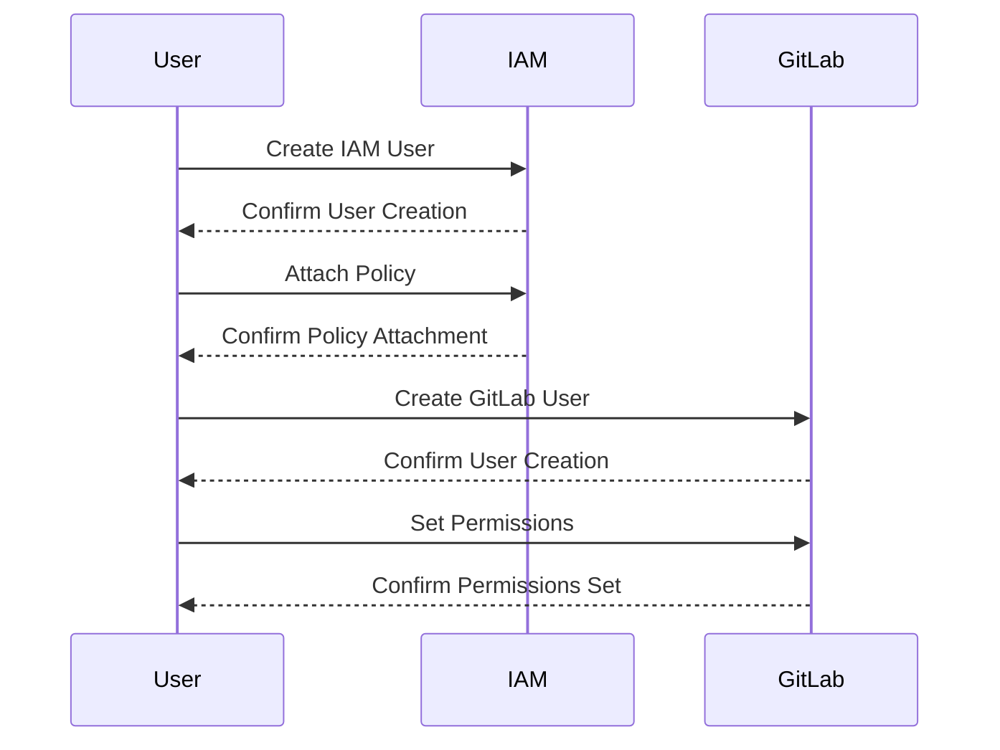

## Introduction to AWS Cloud Security & Access Management

AWS Cloud Security and Access Management is a critical aspect of DevSecOps, ensuring that your cloud resources are protected against unauthorized access and malicious activities. This chapter delves into the essential concepts, configurations, and best practices for securing your AWS environment. We'll cover topics such as user management, permission policies, and administrative tasks, providing a comprehensive guide to setting up and maintaining a secure AWS infrastructure.

### User Management in AWS

User management is fundamental to securing your AWS environment. It involves creating and managing IAM (Identity and Access Management) users, groups, and roles. Each user or role should have the minimum necessary permissions to perform their job functions, adhering to the principle of least privilege (PoLP).

#### Creating IAM Users

To create an IAM user, follow these steps:

1. **Sign in to the AWS Management Console**.
2. **Navigate to the IAM dashboard**.
3. **Click on "Users" in the left-hand menu**.
4. **Click on "Add user"**.
5. **Enter the user name and select the type of access (programmatic access, AWS Management Console access, or both)**.
6. **Set permissions for the user**. You can either attach existing policies or create a new policy.
7. **Review and create the user**.

Here is an example of creating an IAM user via the AWS CLI:

```bash
aws iam create-user --user-name my-new-user
```

#### IAM Groups

IAM groups allow you to manage permissions for multiple users at once. Instead of assigning permissions directly to individual users, you can assign them to a group, and then add users to that group.

To create an IAM group:

1. **Sign in to the AWS Management Console**.
2. **Navigate to the IAM dashboard**.
3. **Click on "Groups" in the left-hand menu**.
4. **Click on "Create group"**.
5. **Enter the group name and attach policies**.
6. **Review and create the group**.

Adding a user to a group:

```bash
aws iam add-user-to-group --group-name my-group --user-name my-user
```

#### IAM Roles

IAM roles are similar to users but are intended for services and applications rather than people. They allow services to assume temporary credentials to perform actions within your AWS account.

To create an IAM role:

1. **Sign in to the AWS Management Console**.
2. **Navigate to the IAM dashboard**.
3. **Click on "Roles" in the left-hand menu**.
4. **Click on "Create role"**.
5. **Select the type of trusted entity (service, AWS account, or organization)**.
6. **Attach policies to the role**.
7. **Review and create the role**.

Example of creating an IAM role via the AWS CLI:

```bash
aws iam create-role --role-name my-new-role --assume-role-policy-document file://trust-policy.json
```

Where `trust-policy.json` might look like this:

```json
{
    "Version": "2012-10-17",
    "Statement": [
        {
            "Effect": "Allow",
            "Principal": {
                "Service": "ec2.amazonaws.com"
            },
            "Action": "sts:AssumeRole"
        }
    ]
}
```

### Permission Policies

Permission policies define what actions a user, group, or role can perform on specific resources. Policies can be attached directly to users, groups, or roles, or they can be managed centrally through IAM policies.

#### Policy Structure

A policy is a JSON document that specifies the permissions granted to an entity. Here is an example of a simple policy:

```json
{
    "Version": "2012-10-17",
    "Statement": [
        {
            "Effect": "Allow",
            "Action": "s3:*",
            "Resource": "*"
        }
    ]
}
```

This policy allows all S3 actions on all resources.

#### Managed Policies vs Inline Policies

Managed policies are reusable and can be attached to multiple entities. Inline policies are specific to a single entity (user, group, or role).

#### Least Privilege Principle

The principle of least privilege (PoLP) states that a user, process, or system should have the minimum level of access necessary to perform its function. This reduces the risk of unauthorized access and potential damage.

Example of a least privilege policy:

```json
{
    "Version": "2012-10-17",
    "Statement": [
        {
            "Effect": "Allow",
            "Action": [
                "s3:GetObject",
                "s3:PutObject"
            ],
            "Resource": "arn:aws:s3:::my-bucket/*"
        }
    ]
}
```

This policy allows only `GetObject` and `PutObject` actions on objects in `my-bucket`.

### Administrative Tasks

Administrative tasks include configuring users and permissions, setting up billing, and managing resources. These tasks ensure that your AWS environment is properly configured and secure.

#### Configuring Users and Permissions

As discussed earlier, configuring users and permissions involves creating IAM users, groups, and roles, and attaching appropriate policies.

#### Setting Up Billing

Properly setting up billing ensures that you are aware of your AWS costs and can manage them effectively.

To set up billing:

1. **Sign in to the AWS Management Console**.
2. **Navigate to the "Billing & Cost Management" dashboard**.
3. **Configure budget alerts** to notify you when your spending exceeds certain thresholds.
4. **Enable cost allocation tags** to categorize your costs by project, department, or other criteria.

Example of enabling cost allocation tags via the AWS CLI:

```bash
aws ce create-cost-category-definition --name MyCostCategory --rule-version "CostCategoryExpression.v1" --rules file://cost-category-rules.json
```

Where `cost-category-rules.json` might look like this:

```json
[
    {
        "Value": "Development",
        "Rule": {
            "CostCategories": {
                "Key": "Project",
                "Values": ["Dev"]
            }
        }
    },
    {
        "Value": "Production",
        "Rule": {
            1: {
                "CostCategories": {
                    "Key": "Project",
                    "Values": ["Prod"]
                }
            }
        }
    }
]
```

### Administration Side of Hosted Solutions

Even with hosted solutions like GitLab, you still have administrative tasks such as configuring users and permissions, setting up billing, and managing resources.

#### GitLab Administration

GitLab is a popular platform for continuous integration and delivery (CI/CD). It can be used as a Software as a Service (SaaS) or self-hosted.

##### Using GitLab as SaaS

When using GitLab as SaaS, GitLab hosts the service for you, and you don't need to worry about configuring runners and other infrastructure components. However, you still need to manage users, permissions, and other administrative tasks.

To create a user in GitLab:

1. **Sign in to GitLab**.
2. **Navigate to "Admin Area"**.
3. **Click on "Users"**.
4. **Click on "New User"**.
5. **Fill in the user details and set permissions**.
6. **Save the user**.

Example of creating a user via the GitLab API:

```bash
curl --request POST --header "PRIVATE-TOKEN: <your_access_token>" "https://gitlab.example.com/api/v4/users" --data "email=user@example.com&password=secure_password&username=my_user&name=User Name"
```

##### Self-Hosting GitLab

Many companies prefer to self-host GitLab for tighter security and control. This involves setting up the server, installing GitLab, and configuring it from scratch.

To set up a self-hosted GitLab instance:

1. **Install the necessary dependencies**.
2. **Download and install GitLab**.
3. **Configure the installation**.
4. **Start the GitLab service**.

Example of installing GitLab on Ubuntu:

```bash
# Add the GitLab package repository
curl https://packages.gitlab.com/install/repositories/gitlab/gitlab-ce/script.deb.sh | sudo bash

# Install GitLab
sudo apt-get install gitlab-ce

# Reconfigure GitLab
sudo gitlab-ctl reconfigure
```

### Project-Level Administration in GitLab

In GitLab, you can have separate administrator views per project or repository. This allows you to manage permissions and settings specific to each project.

To manage a project:

1. **Sign in to GitLab**.
2. **Navigate to the project**.
3. **Click on "Settings"**.
4. **Manage project members, settings, and CI/CD configurations**.

Example of managing project members via the GitLab API:

```bash
curl --request POST --header "PRIVATE-TOKEN: <your_access_token>" "https://gitlab.example.com/api/v4/projects/<project_id>/members" --data "user_id=<user_id>&access_level=30"
```

### Real-World Examples and CVEs

Real-world examples and CVEs highlight the importance of proper security and access management in AWS and GitLab.

#### CVE-2021-20225: AWS IAM Policy Injection Vulnerability

CVE-2021-20225 was a critical vulnerability in AWS IAM that allowed attackers to inject arbitrary policies into IAM roles. This could lead to unauthorized access to sensitive resources.

**How to Prevent / Defend:**

1. **Update to the latest version of AWS SDKs and tools**.
2. **Regularly audit IAM policies and roles**.
3. **Use AWS Config to monitor changes to IAM resources**.

Example of auditing IAM policies:

```bash
aws iam list-policies --output json > policies.json
```

#### CVE-2020-10929: GitLab Container Registry Unauthorized Access

CVE-2020-10929 was a vulnerability in GitLab's container registry that allowed unauthorized access to images. This could lead to exposure of sensitive data.

**How to Prevent / Defend:**

1. **Ensure all container images are scanned for vulnerabilities**.
2. **Use GitLab's built-in security features to enforce access controls**.
3. **Regularly review and update access policies**.

Example of scanning container images:

```bash
docker run --rm -v $(pwd):/reports -v /var/run/docker.sock:/var/run/docker.sock aquasec/trivy image:latest
```

### Conclusion

Securing your AWS environment and managing access is crucial for maintaining the integrity and confidentiality of your resources. By following best practices for user management, permission policies, and administrative tasks, you can ensure that your AWS and GitLab environments are secure and compliant.

### Practice Labs

For hands-on practice, consider the following labs:

- **PortSwigger Web Security Academy**: Focuses on web application security.
- **OWASP Juice Shop**: A deliberately insecure web application for security training.
- **DVWA (Damn Vulnerable Web Application)**: Another intentionally vulnerable web app for security training.
- **WebGoat**: An interactive web security training application.

These labs provide practical experience in securing and managing cloud environments, helping you apply the concepts learned in this chapter.



This sequence diagram illustrates the process of creating and managing users in both IAM and GitLab, highlighting the steps involved in setting up and securing your cloud environment.

---
<!-- nav -->
[[DevSecOps/DevSecOps Bootcamp/03-Identity & Access Management/01-AWS Cloud Security & Access Management/AWS Security Essentials/00-Overview|Overview]] | [[02-Introduction to AWS Cloud Security & Access Management|Introduction to AWS Cloud Security & Access Management]]
