## Introduction to AWS Cloud Security & Access Management

In the realm of DevSecOps, ensuring the security of your cloud infrastructure is paramount. This chapter delves into the essential aspects of securing your AWS environment, focusing on both the infrastructure and access management layers. We will cover how to secure your virtual machines, network configurations, and AWS account access, providing a comprehensive guide to maintaining robust security in your cloud deployments.

### Securing Application Containers and Infrastructure

When deploying applications in a cloud environment, such as AWS, it is crucial to ensure that the underlying infrastructure is secure. This includes securing the application code, third-party libraries, container images, and the runtime environment. Additionally, the infrastructure itself, including the servers and network configurations, must be protected.

#### Securing Application Code and Third-Party Libraries

Before deploying an application, it is essential to scan the code for vulnerabilities. This includes both the application code and any third-party libraries used. Tools like SonarQube, OWASP Dependency-Check, and Snyk can be used to perform these scans.

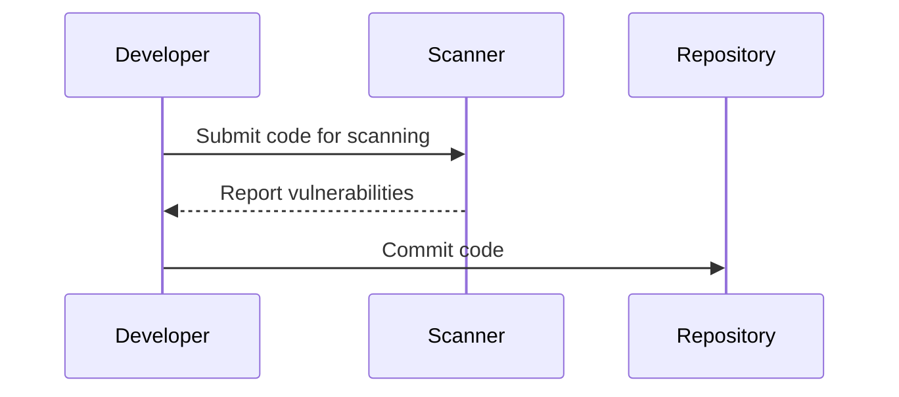

#### Securing Container Images

Container images should also be scanned for vulnerabilities before deployment. Tools like Clair, Trivy, and Anchore can be used to scan Docker images for known vulnerabilities.

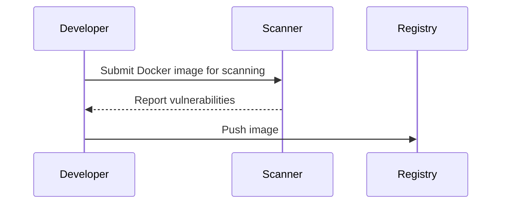

### Securing Virtual Machines and Network Configurations

Once the application and container images are secure, the next step is to secure the virtual machines and network configurations.

#### Securing EC2 Instances

Amazon EC2 instances are the virtual machines used to run your applications. To secure these instances, you should:

1. **Use Security Groups**: Security groups act as virtual firewalls that control inbound and outbound traffic to your instances. They allow you to specify rules for allowing traffic based on IP addresses, protocols, and ports.

2. **Enable SSH Key Authentication**: Instead of using passwords, enable SSH key authentication for accessing your EC2 instances. This provides a more secure method of authentication.

3. **Patch and Update Regularly**: Ensure that your EC2 instances are regularly patched and updated to protect against known vulnerabilities.

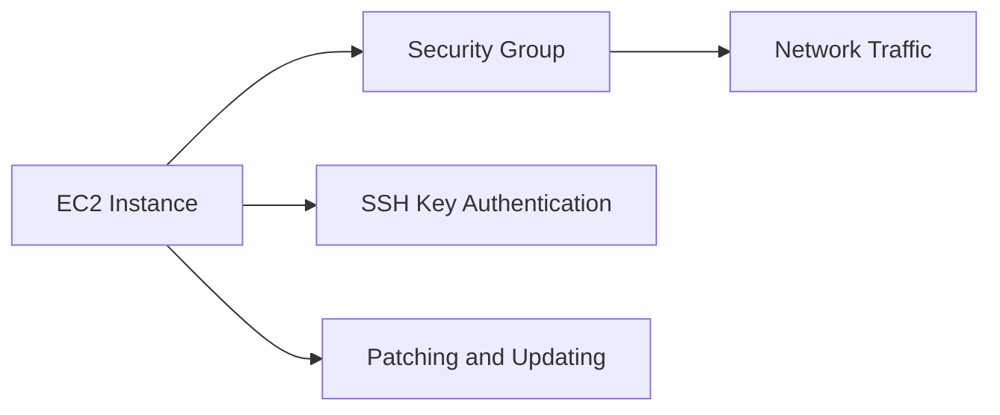

#### Real-World Example: CVE-2021-20225

CVE-2021-20225 is a critical vulnerability in the Amazon EC2 Nitro Hypervisor. This vulnerability could allow an attacker to execute arbitrary code on the host system. To mitigate this vulnerability, AWS released updates to the Nitro Hypervisor. Users were advised to update their instances to the latest version.

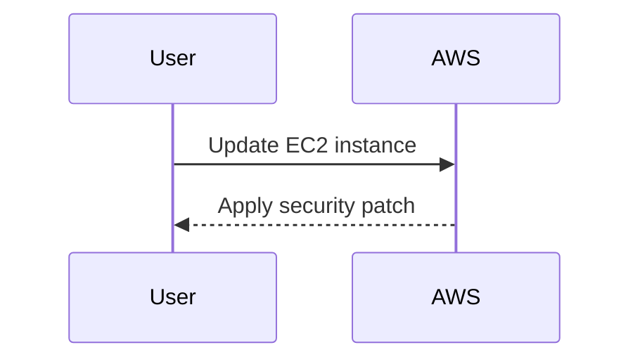

### Securing Network Configurations

Network configurations play a crucial role in securing your AWS environment. This includes configuring VPCs, subnets, and route tables.

#### Configuring VPCs and Subnets

A Virtual Private Cloud (VPC) is a logically isolated section of the AWS Cloud where you can launch resources in a virtual network that you define. To secure your VPC, you should:

1. **Use Private Subnets**: Place your instances in private subnets that are not directly accessible from the internet. Use public subnets for load balancers and NAT gateways.

2. **Enable Network ACLs**: Network Access Control Lists (ACLs) provide an additional layer of security by filtering traffic at the subnet level.

3. **Use Route Tables**: Configure route tables to control the routing of traffic within your VPC.

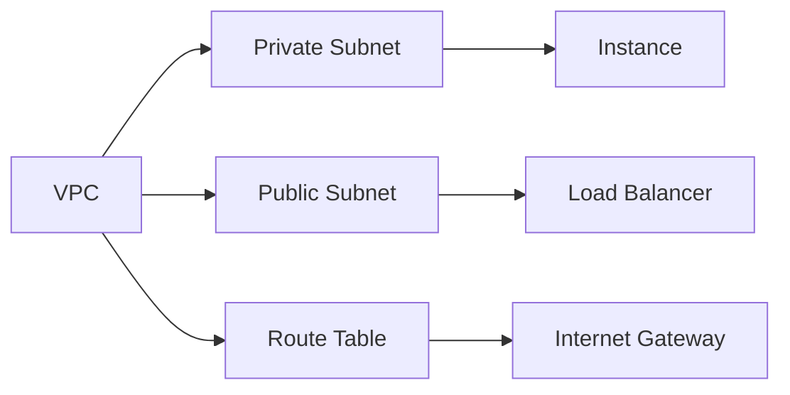

#### Real-World Example: AWS Outage in 2021

In February 2021, AWS experienced an outage due to a misconfiguration in the network infrastructure. This incident highlighted the importance of proper network configuration and regular audits to ensure the stability and security of your AWS environment.

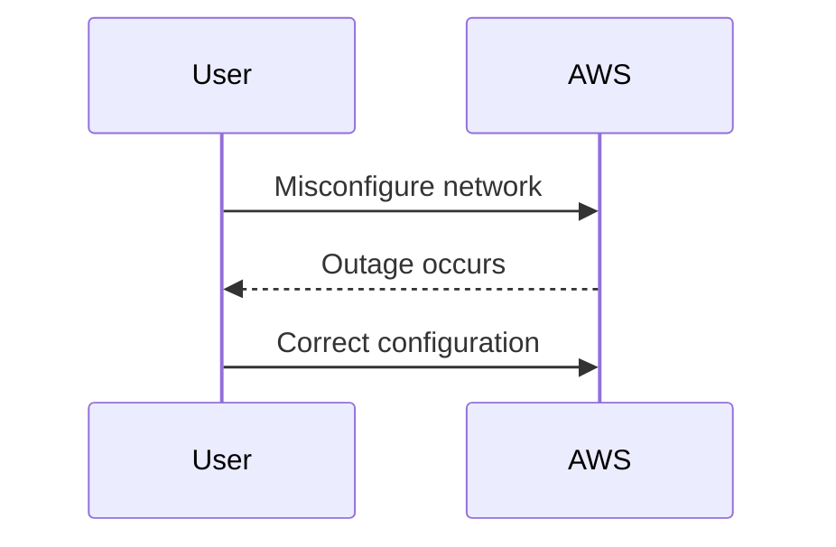

### Securing AWS Account Access

Access management is another critical aspect of securing your AWS environment. This includes managing user permissions, multi-factor authentication (MFA), and least privilege principles.

#### Managing User Permissions

To manage user permissions effectively, you should:

1. **Use IAM Roles**: Instead of assigning permissions directly to users, use IAM roles to grant permissions to specific actions and resources.

2. **Least Privilege Principle**: Assign the minimum set of permissions required for a user to perform their job functions. Avoid granting full administrative access unless absolutely necessary.

3. **Regular Audits**: Perform regular audits of IAM policies to ensure that permissions are up-to-date and aligned with current business needs.

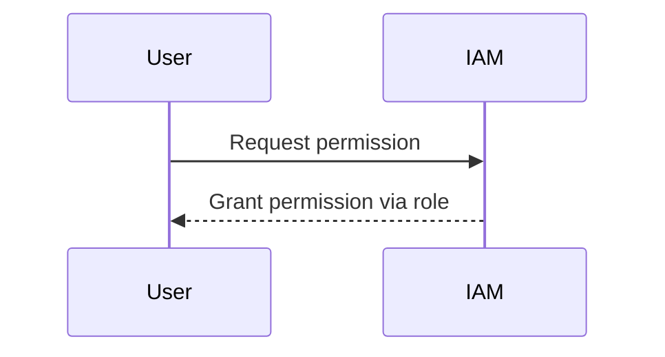

#### Enabling Multi-Factor Authentication (MFA)

Multi-Factor Authentication (MFA) adds an extra layer of security by requiring users to provide two forms of identification: something they know (password) and something they have (token).

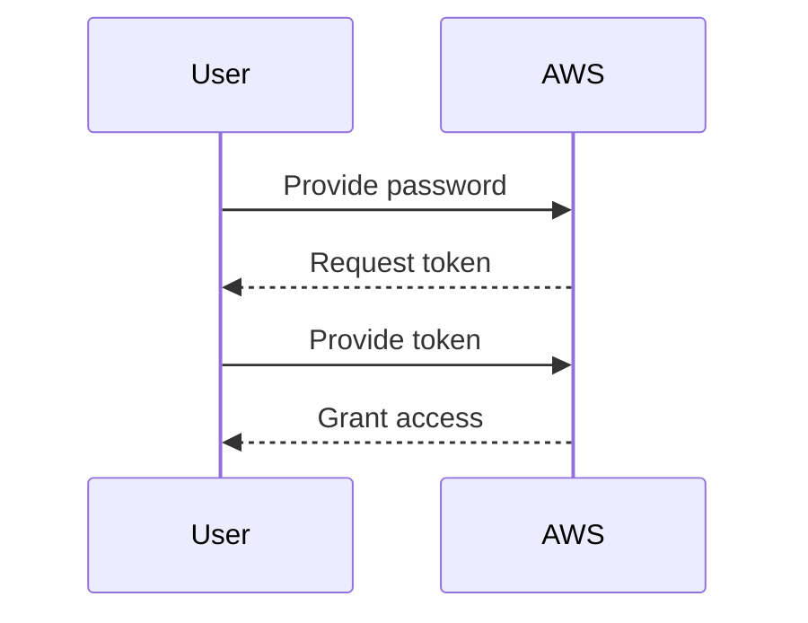

#### Real-World Example: AWS Account Compromise in 2020

In 2020, a major cryptocurrency exchange suffered a significant breach due to compromised AWS credentials. The attackers gained access to the AWS account and stole millions of dollars worth of cryptocurrency. This incident underscores the importance of securing AWS account access through strong authentication mechanisms and regular audits.

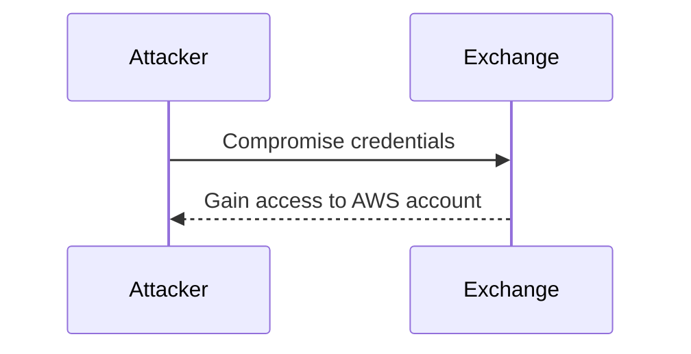

### How to Prevent / Defend

#### Detecting Vulnerabilities

To detect vulnerabilities in your AWS environment, you should:

1. **Use AWS Trusted Advisor**: Trusted Advisor provides recommendations to help you optimize your AWS environment for cost, performance, and security.

2. **Enable AWS CloudTrail**: CloudTrail logs API calls made to your AWS account, allowing you to monitor and audit activity.

3. **Use AWS Inspector**: Inspector automatically assesses your AWS resources for security vulnerabilities and compliance requirements.

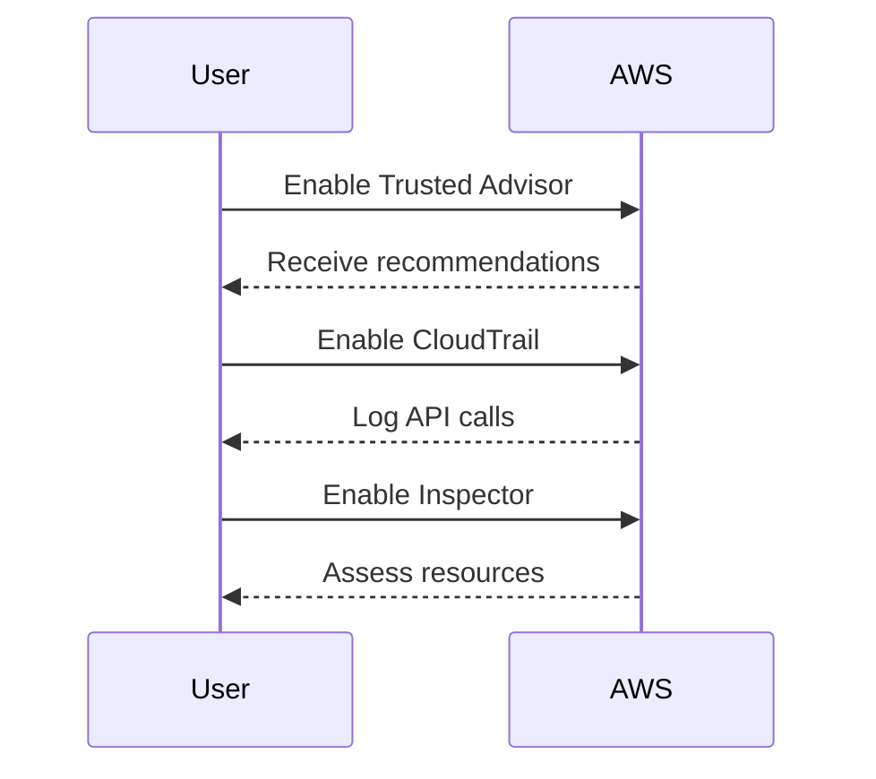

#### Preventing Attacks

To prevent attacks on your AWS environment, you should:

1. **Implement Security Best Practices**: Follow AWS security best practices, such as using security groups, enabling MFA, and applying least privilege principles.

2. **Regularly Patch and Update**: Keep your instances and dependencies up-to-date with the latest security patches.

3. **Perform Regular Audits**: Conduct regular audits of your IAM policies and network configurations to ensure they remain secure.

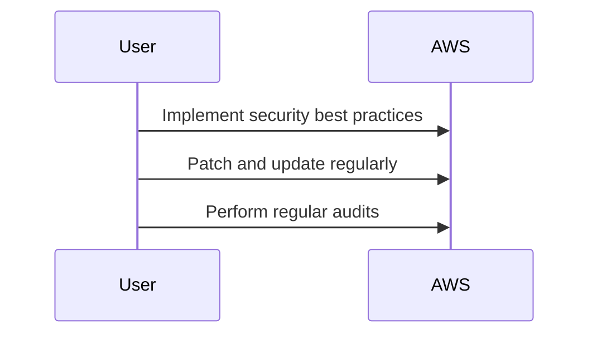

#### Secure Coding Fixes

Here is an example of a vulnerable IAM policy and its secure counterpart:

**Vulnerable Policy:**

```json
{
    "Version": "2012-10-17",
    "Statement": [
        {
            "Effect": "Allow",
            "Action": "*",
            "Resource": "*"
        }
    ]
}
```

**Secure Policy:**

```json
{
    "Version": "2012-10-17",
    "Statement": [
        {
            "Effect": "Allow",
            "Action": [
                "ec2:DescribeInstances",
                "s3:GetObject"
            ],
            "Resource": "*"
        }
    ]
}
```

#### Configuration Hardening

To harden your AWS configurations, you should:

1. **Enable Encryption**: Enable encryption for sensitive data stored in S3 buckets and RDS databases.

2. **Use IAM Policies**: Use IAM policies to restrict access to specific resources and actions.

3. **Enable CloudWatch Alarms**: Set up CloudWatch alarms to monitor and alert on suspicious activity.

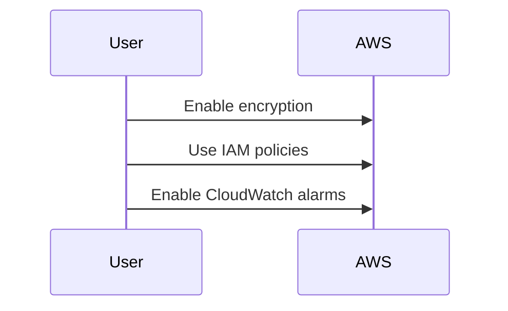

### Hands-On Labs

To practice securing your AWS environment, consider the following labs:

- **CloudGoat**: A cloud security training platform that simulates real-world scenarios and teaches you how to secure your AWS environment.
- **flaws.cloud**: A cloud security training platform that provides hands-on experience with securing AWS environments.
- **AWS Well-Architected Labs**: Official AWS labs that provide guidance on securing your AWS environment according to best practices.

By following these guidelines and practicing with hands-on labs, you can ensure that your AWS environment remains secure and resilient against potential threats.

### Conclusion

Securing your AWS environment is a multifaceted process that involves securing your application code, container images, virtual machines, network configurations, and account access. By implementing best practices, performing regular audits, and using tools like IAM roles, MFA, and CloudTrail, you can significantly enhance the security of your AWS environment. Remember to stay vigilant and proactive in your approach to security to protect your valuable assets in the cloud.

---
<!-- nav -->
[[01-Introduction to AWS Cloud Security & Access Management Part 1|Introduction to AWS Cloud Security & Access Management Part 1]] | [[DevSecOps/DevSecOps Bootcamp/03-Identity & Access Management/01-AWS Cloud Security & Access Management/AWS Security Essentials/00-Overview|Overview]] | [[03-Introduction to AWS Security Essentials|Introduction to AWS Security Essentials]]
