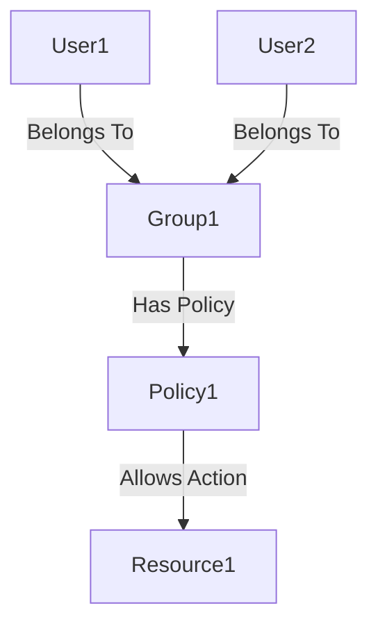

## Introduction to AWS IAM Users, Groups, and Policies

In the realm of cloud security, managing access control is paramount. Amazon Web Services (AWS) provides Identity and Access Management (IAM) to manage access to AWS services and resources securely. IAM allows you to create and configure users, groups, roles, and policies to control who can access your AWS resources and what actions they can perform.

### Why Use IAM?

IAM is essential for several reasons:

1. **Fine-grained Access Control**: IAM enables you to specify exactly which actions a user or role can perform on specific resources.
2. **Compliance**: IAM helps organizations comply with regulatory requirements by ensuring that only authorized personnel have access to sensitive data and systems.
3. **Cost Efficiency**: By limiting access to only necessary resources, you can avoid unnecessary costs associated with unauthorized usage.
4. **Scalability**: As your organization grows, IAM makes it easier to manage access for a large number of users and resources.

### IAM Users, Groups, and Policies

IAM consists of three primary components: users, groups, and policies.

#### IAM Users

An IAM user represents an individual person or application that requires access to AWS resources. Each user has a unique name and can be assigned permissions through policies.

**Example of Creating an IAM User**

```bash
aws iam create-user --user-name JohnDoe
```

This command creates a new IAM user named `JohnDoe`.

#### IAM Groups

Groups are collections of IAM users. You can assign policies to groups rather than individual users, making it easier to manage permissions for multiple users at once.

**Example of Creating an IAM Group**

```bash
aws iam create-group --group-name Developers
```

This command creates a new IAM group named `Developers`.

#### IAM Policies

Policies define the permissions that are granted to users, groups, or roles. Policies are written in JSON format and specify which actions are allowed or denied on specific resources.

**Example of a Policy**

```json
{
    "Version": "2012-10-17",
    "Statement": [
        {
            "Effect": "Allow",
            "Action": [
                "s3:ListBucket"
            ],
            "Resource": [
                "arn:aws:s3:::example-bucket"
            ]
        },
        {
            "Effect": "Allow",
            "Action": [
                "s3:GetObject"
            ],
            "Resource": [
                "arn:aws:s3:::example-bucket/*"
            ]
        }
    ]
}
```

This policy allows the user to list objects in the `example-bucket` and retrieve objects from it.

### Assigning Policies to Groups

Assigning policies to groups is more efficient than assigning them to individual users. This approach simplifies management and ensures consistency across users within the same group.

**Example of Attaching a Policy to a Group**

```bash
aws iam attach-group-policy --group-name Developers --policy-arn arn:aws:iam::aws:policy/AmazonS3FullAccess
```

This command attaches the `AmazonS3FullAccess` policy to the `Developers` group.

### Managing Users and Groups

When managing users and groups, consider the following best practices:

1. **Least Privilege Principle**: Grant users only the permissions they need to perform their job functions.
2. **Regular Audits**: Periodically review and update IAM configurations to ensure compliance and security.
3. **Use Roles for Temporary Access**: Instead of granting long-term permissions to users, use roles for temporary access to resources.

### Real-World Examples

#### Recent Breaches and CVEs

One notable breach involving IAM misconfigurations is the Capital One breach in 2019 (CVE-2019-11013). An attacker exploited a misconfigured web application firewall (WAF) rule to gain unauthorized access to sensitive customer data. This breach highlighted the importance of proper IAM configuration and regular audits.

#### Secure Configuration Example

To prevent such breaches, ensure that IAM policies are correctly configured and regularly audited. Here’s an example of a secure IAM policy configuration:

**Secure IAM Policy**

```json
{
    "Version": "2012-10-17",
    "Statement": [
        {
            "Effect": "Deny",
            "Action": "*",
            "Resource": "*",
            "Condition": {
                "StringNotEquals": {
                    "aws:PrincipalArn": "arn:aws:iam::123456789012:user/JohnDoe"
                }
            }
        },
        {
            "Effect": "Allow",
            "Action": [
                "s3:ListBucket",
                "s3:GetObject"
            ],
            "Resource": [
                "arn:aws:s3:::example-bucket",
                "arn:aws:s3:::example-bucket/*"
            ]
        }
    ]
}
```

This policy denies all actions unless the principal is `JohnDoe`, and then allows specific actions on the `example-bucket`.

### How to Prevent / Defend

#### Detection

Regularly audit IAM configurations using tools like AWS Trusted Advisor or third-party security scanners like AWS Security Hub.

**Example of Using AWS Security Hub**

```bash
aws securityhub describe-findings --finding-statuses ACTIVE
```

This command retrieves active findings from AWS Security Hub, which can help identify misconfigurations.

#### Prevention

1. **Use Managed Policies**: Leverage AWS-managed policies to simplify permission management.
2. **Enable MFA**: Require multi-factor authentication (MFA) for all IAM users.
3. **Regular Audits**: Conduct periodic reviews of IAM configurations to ensure compliance and security.

**Example of Enabling MFA**

```bash
aws iam enable-mfa-device --user-name JohnDoe --serial-number arn:aws:iam::123456789012:mfa/JohnDoe --authentication-code1 123456 --authentication-code2 654321
```

This command enables MFA for the user `JohnDoe`.

### Complete Example

Let’s walk through a complete example of creating an IAM user, group, and attaching a policy.

#### Step 1: Create an IAM User

```bash
aws iam create-user --user-name JohnDoe
```

#### Step 2: Create an IAM Group

```bash
aws iam create-group --group-name Developers
```

#### Step 3: Add User to Group

```bash
aws iam add-user-to-group --user-name JohnDoe --group-name Developers
```

#### Step 4: Attach Policy to Group

```bash
aws iam attach-group-policy --group-name Developers --policy-arn arn:aws:iam::aws:policy/AmazonS3FullAccess
```

#### Step 5: Verify Configuration

```bash
aws iam get-group --group-name Developers
```

This command retrieves details about the `Developers` group, including attached policies.

### Mermaid Diagrams

#### IAM Architecture Diagram



This diagram illustrates how users belong to groups, which have policies attached to them, allowing specific actions on resources.

### Common Pitfalls

1. **Overly Permissive Policies**: Avoid granting more permissions than necessary.
2. **Forgotten Users**: Regularly review and remove inactive users.
3. **Misconfigured MFA**: Ensure MFA is properly configured for all users.

### Conclusion

Proper management of IAM users, groups, and policies is crucial for maintaining security in AWS environments. By following best practices and regularly auditing configurations, you can significantly reduce the risk of unauthorized access and potential breaches.

### Practice Labs

For hands-on practice, consider the following labs:

- **CloudGoat**: A cloud security training platform that includes scenarios for IAM misconfigurations.
- **flaws.cloud**: A cloud security lab that covers various aspects of IAM management.
- **AWS Official Workshops**: AWS provides official workshops that cover IAM and other security topics in depth.

By engaging with these labs, you can gain practical experience in managing IAM configurations effectively.

---
<!-- nav -->
[[01-Introduction to AWS IAM Users, Groups, and Policies Part 1|Introduction to AWS IAM Users, Groups, and Policies Part 1]] | [[DevSecOps/DevSecOps Bootcamp/03-Identity & Access Management/01-AWS Cloud Security & Access Management/IAM Users Groups Policies/00-Overview|Overview]] | [[03-Introduction to AWS IAM Users, Groups, and Policies|Introduction to AWS IAM Users, Groups, and Policies]]
