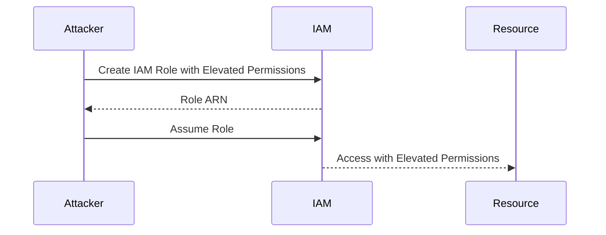
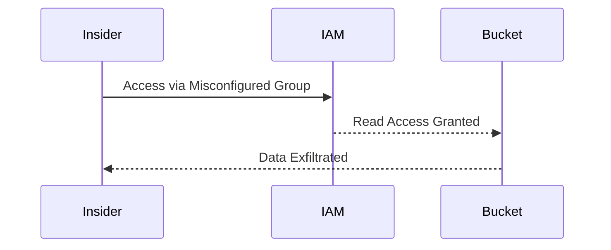
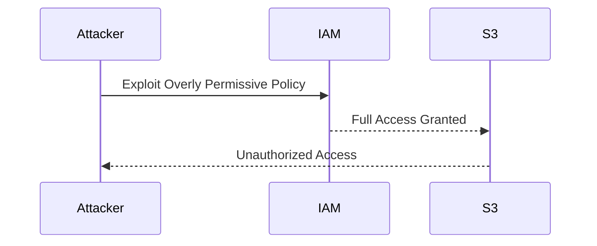
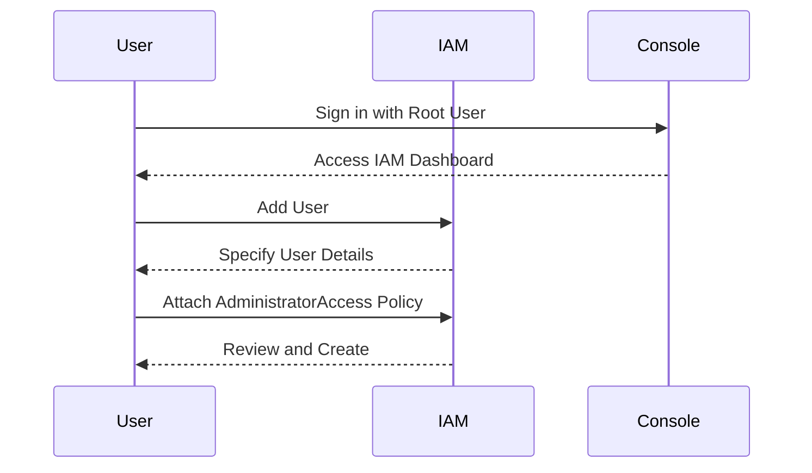

## Introduction to AWS IAM Users, Groups, and Policies

In the realm of DevSecOps, managing access to cloud resources securely is paramount. This chapter delves into the core concepts of AWS Identity and Access Management (IAM), focusing on users, groups, and policies. These components form the backbone of access control within AWS, ensuring that only authorized entities can interact with your resources.

### Understanding IAM Users

An IAM user is an entity that you create in AWS to represent a person or service that needs to interact with AWS resources. Each user has a unique name and can be assigned permissions to perform specific actions within your AWS environment.

#### Why IAM Users Matter

Using IAM users instead of the root user for day-to-day operations is a fundamental security best practice. The root user has unrestricted access to all resources within an AWS account, making it a high-value target for attackers. By contrast, IAM users can be granted limited permissions, reducing the risk of unauthorized access and accidental misconfiguration.

#### How IAM Users Work

When you create an IAM user, you can assign them permissions through policies. These policies define what actions the user can perform and on which resources. IAM users can also be associated with groups, which simplifies the management of permissions across multiple users.

#### Real-World Example: CVE-2021-20225

In 2021, a critical vulnerability was discovered in AWS IAM, designated as CVE-2021-20225. This vulnerability allowed an attacker to escalate their privileges by manipulating IAM roles and policies. The attack vector involved creating a role with elevated permissions and then assuming that role, effectively bypassing the intended access controls.

**Detection and Prevention**

To detect and prevent such vulnerabilities:

1. **Regular Audits**: Conduct regular audits of IAM roles and policies to ensure they align with least privilege principles.
2. **Monitoring**: Enable CloudTrail logging to monitor API calls and detect unauthorized activities.
3. **Secure Coding Practices**: Ensure that IAM roles and policies are defined securely, with minimal permissions necessary.

### IAM Groups

An IAM group is a collection of IAM users. Groups simplify the management of permissions by allowing you to apply policies to a group rather than individual users. This approach reduces administrative overhead and ensures consistent access control.

#### Why IAM Groups Matter

Using groups allows you to manage permissions at a higher level, making it easier to maintain and enforce security policies. For example, you might create a group for developers, another for administrators, and yet another for auditors, each with different sets of permissions.

#### How IAM Groups Work

When you create an IAM group, you can attach policies to it. Any user added to the group inherits the permissions defined by those policies. This inheritance model streamlines the process of assigning and revoking permissions.

#### Real-World Example: Misconfigured IAM Group Leads to Data Exfiltration

In a real-world scenario, a company had a misconfigured IAM group that inadvertently granted read access to sensitive data buckets. An insider exploited this misconfiguration to exfiltrate data, leading to a significant breach.

**Detection and Prevention**

To detect and prevent such incidents:

1. **Least Privilege Principle**: Ensure that IAM groups are configured with the minimum permissions necessary.
2. **Regular Audits**: Perform regular audits to identify and correct misconfigurations.
3. **Monitoring**: Implement monitoring solutions like AWS CloudTrail to track access patterns and detect anomalies.

### IAM Policies

An IAM policy is a document that specifies permissions. Policies are attached to IAM users, groups, or roles, defining what actions they can perform and on which resources.

#### Why IAM Policies Matter

Policies are the cornerstone of AWS access control. They enable fine-grained control over who can access what resources and under what conditions. Properly configured policies help prevent unauthorized access and ensure compliance with security policies.

#### How IAM Policies Work

IAM policies are written in JSON format and consist of statements. Each statement defines a set of actions that can be performed on specific resources. Policies can be attached directly to users, groups, or roles, providing a flexible and scalable way to manage permissions.

#### Real-World Example: Overly Permissive Policy Leads to Unauthorized Access

A company had an overly permissive IAM policy attached to a developer group, granting full access to all S3 buckets. An attacker exploited this misconfiguration to gain unauthorized access to sensitive data.

**Detection and Prevention**

To detect and prevent such incidents:

1. **Least Privilege Principle**: Ensure that IAM policies are configured with the minimum permissions necessary.
2. **Regular Audits**: Perform regular audits to identify and correct overly permissive policies.
3. **Monitoring**: Implement monitoring solutions like AWS CloudTrail to track access patterns and detect anomalies.

### Creating an Admin User

Given the importance of separating administrative tasks from regular operations, it is crucial to create an admin user for performing administrative tasks that require elevated permissions.

#### Steps to Create an Admin User

1. **Sign in to the AWS Management Console**: Use the root user credentials to sign in.
2. **Navigate to IAM**: Go to the IAM dashboard.
3. **Create a New User**: Click on "Users" and then "Add user".
4. **Specify User Details**: Provide a username and select programmatic access.
5. **Attach Policies**: Attach the `AdministratorAccess` policy to grant full administrative rights.
6. **Review and Create**: Review the details and create the user.

#### Secure Coding Practices

When creating an admin user, ensure that the following secure coding practices are followed:

1. **Use Strong Passwords**: Enforce strong password policies for the admin user.
2. **Enable Multi-Factor Authentication (MFA)**: Require MFA for the admin user to add an extra layer of security.
3. **Limit Usage**: Limit the usage of the admin user to only those tasks that require elevated permissions.

### Conclusion

Managing access to AWS resources securely is a critical aspect of DevSecOps. By leveraging IAM users, groups, and policies, you can ensure that only authorized entities can interact with your resources. Regular audits, monitoring, and adherence to least privilege principles are essential to maintaining a secure environment.

### Practice Labs

For hands-on experience with AWS IAM, consider the following labs:

- **CloudGoat**: A series of labs designed to teach cloud security concepts, including IAM management.
- **AWS Official Workshops**: AWS provides several workshops that cover IAM and other security topics in depth.
- **Pacu**: A penetration testing framework that includes modules for testing IAM configurations.

These labs provide practical experience in configuring and securing IAM users, groups, and policies, helping you master the skills needed to manage AWS resources securely.

---
<!-- nav -->
[[02-Introduction to AWS IAM Users, Groups, and Policies Part 2|Introduction to AWS IAM Users, Groups, and Policies Part 2]] | [[DevSecOps/DevSecOps Bootcamp/03-Identity & Access Management/01-AWS Cloud Security & Access Management/IAM Users Groups Policies/00-Overview|Overview]] | [[04-Introduction to AWS Identity and Access Management (IAM)|Introduction to AWS Identity and Access Management (IAM)]]
