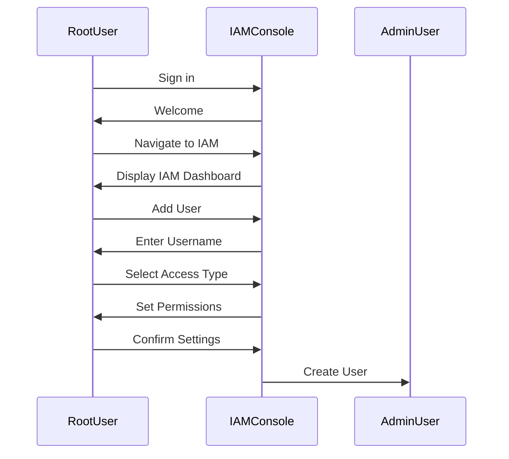
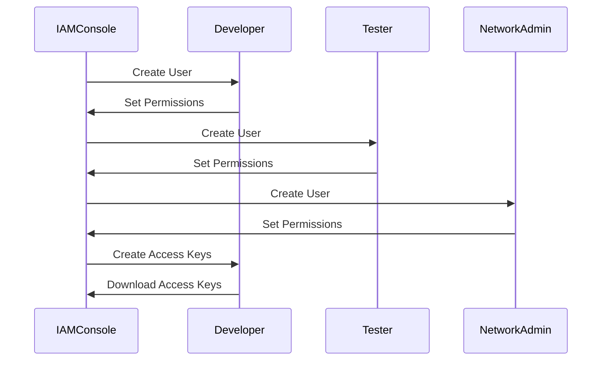
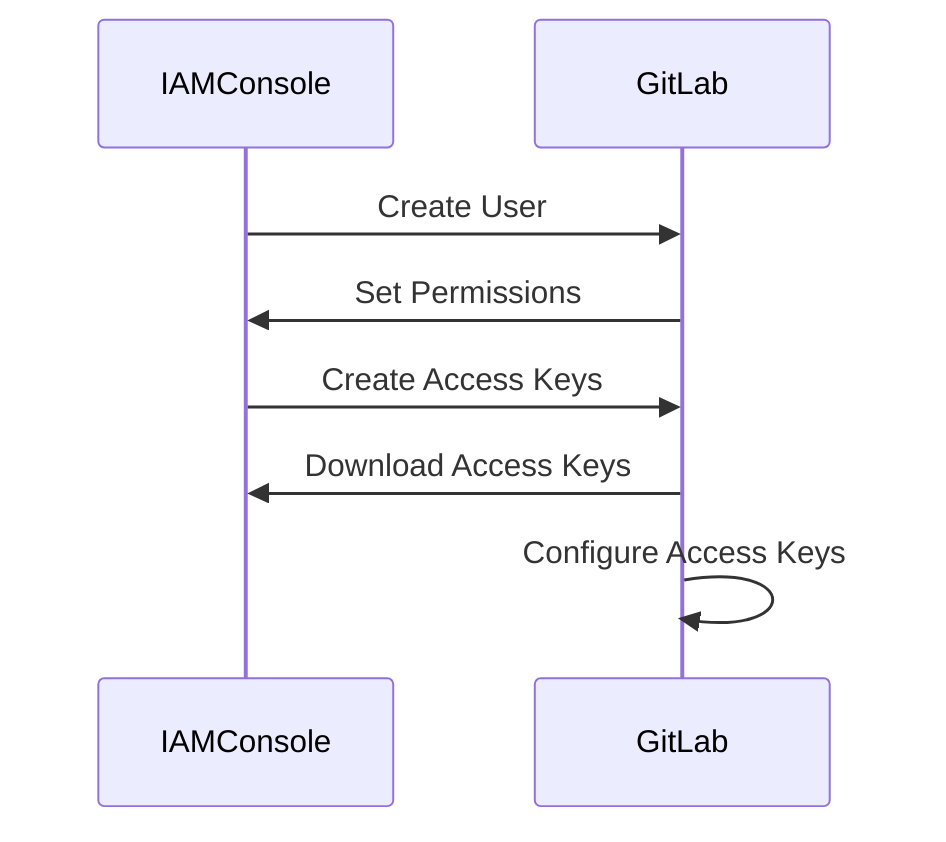

## AWS Cloud Security & Access Management: IAM Users, Groups, and Policies

### Introduction to AWS IAM

AWS Identity and Access Management (IAM) is a service that helps you securely control access to your AWS resources. IAM enables you to manage users, groups, roles, and permissions. This chapter focuses on IAM users, groups, and policies, providing a comprehensive understanding of how to set up and manage secure access to your AWS resources.

### Root User and Admin User

When you first create an AWS account, you are provided with a root user. The root user has full administrative access to all AWS services and resources within the account. However, it is highly recommended to avoid using the root user for day-to-day operations due to the high level of access it provides. Instead, you should create an admin user and use that user for most administrative tasks.

#### Creating an Admin User

To create an admin user, follow these steps:

1. **Sign in to the AWS Management Console** using your root user credentials.
2. Navigate to the **IAM dashboard**.
3. Click on **Users** in the left-hand menu.
4. Click on **Add user**.
5. Enter a username for the admin user.
6. Select **Programmatic access** and/or **AWS Management Console access** depending on your needs.
7. Set up the **permissions** for the user. You can either attach existing policies or create a new policy.
8. Review and confirm the settings.



### Human Users and Programmatic Access

In addition to the admin user, you may have various human users in your organization, such as developers, testers, and network administrators. Each of these users may require different levels of access to AWS resources.

#### Creating Human Users

To create human users, follow similar steps as creating the admin user but tailor the permissions according to their roles.

1. **Developer (N)**: May need access to specific services like EC2, S3, and RDS.
2. **Tester (Tom)**: May need access to services like S3 and CloudWatch for monitoring.
3. **Network Administrator (Alice)**: May need access to VPC, Route53, and CloudFormation.

#### Programmatic Access

Programmatic access allows applications and scripts to interact with AWS services programmatically. This is typically done using access keys (Access Key ID and Secret Access Key).

To create access keys for a user:

1. Navigate to the **IAM dashboard**.
2. Click on **Users**.
3. Select the user for whom you want to create access keys.
4. Click on **Security credentials**.
5. Click on **Create access key**.
6. Download the access key file containing the Access Key ID and Secret Access Key.



### Login Access Types

There are two primary ways to log into an AWS account:

1. **Management Console**: This is the web-based interface where users can manage their AWS resources using a graphical user interface.
2. **Programmatic Access**: This involves using access keys to interact with AWS services programmatically.

#### Management Console Login

The management console login requires a username and password. For the root user, this is typically an email address and a password. For other users, you can set up a password during the user creation process.

#### Programmatic Access Login

Programmatic access uses access keys (Access Key ID and Secret Access Key) to authenticate API calls. These keys are used in SDKs, CLI tools, and other applications to interact with AWS services.

### Example: Setting Up Programmatic Access for GitLab

Suppose you want to set up programmatic access for GitLab to interact with your AWS resources. Here’s how you can do it:

1. **Create an IAM User for GitLab**:
    - Navigate to the IAM dashboard.
    - Click on **Users**.
    - Click on **Add user**.
    - Enter a username for the GitLab user.
    - Select **Programmatic access**.
    - Attach the necessary policies (e.g., `AmazonEC2FullAccess`).

2. **Generate Access Keys**:
    - After creating the user, go to the **Security credentials** section.
    - Click on **Create access key**.
    - Download the access key file.

3. **Configure GitLab**:
    - In GitLab, navigate to the project settings.
    - Add the Access Key ID and Secret Access Key to the environment variables or configuration files.



### How to Prevent / Defend

#### Detection

- **Audit Logs**: Enable AWS CloudTrail to monitor API calls made to your AWS account.
- **IAM Access Advisor**: Use IAM Access Advisor to see which services a user has accessed and when.

#### Prevention

- **Least Privilege Principle**: Ensure that users have only the permissions necessary to perform their job functions.
- **MFA (Multi-Factor Authentication)**: Enable MFA for all IAM users to add an extra layer of security.
- **Periodic Reviews**: Regularly review and audit IAM policies and permissions to ensure they remain appropriate.

#### Secure Coding Fixes

- **Vulnerable Code**:
    ```json
    {
        "Version": "2012-10-17",
        "Statement": [
            {
                "Effect": "Allow",
                "Action": "*",
                "Resource": "*"
            }
        ]
    }
    ```
- **Secure Code**:
    ```json
    {
        "Version": "2012-10-17",
        "Statement": [
            {
                "Effect": "Allow",
                "Action": [
                    "ec2:*",
                    "s3:*"
                ],
                "Resource": "*"
            }
        ]
    }
    ```

### Real-World Examples

#### Recent Breaches

- **CVE-2021-20225**: A misconfigured IAM policy allowed unauthorized access to sensitive data. Ensuring least privilege and regular audits can prevent such issues.
- **AWS S3 Bucket Exposure**: Improper IAM policies led to public exposure of S3 buckets. Using bucket policies and IAM roles can mitigate this risk.

### Practice Labs

For hands-on experience with AWS IAM, consider the following labs:

- **CloudGoat**: A series of labs designed to help you understand and practice securing AWS environments.
- **flaws.cloud**: A platform for learning and practicing cloud security, including IAM configurations.
- **AWS Well-Architected Labs**: Official AWS labs that cover various aspects of cloud architecture and security, including IAM.

By following these detailed steps and best practices, you can effectively manage IAM users, groups, and policies in your AWS environment, ensuring robust security and compliance.

---
<!-- nav -->
[[04-Introduction to AWS Identity and Access Management (IAM)|Introduction to AWS Identity and Access Management (IAM)]] | [[DevSecOps/DevSecOps Bootcamp/03-Identity & Access Management/01-AWS Cloud Security & Access Management/IAM Users Groups Policies/00-Overview|Overview]] | [[DevSecOps/DevSecOps Bootcamp/03-Identity & Access Management/01-AWS Cloud Security & Access Management/IAM Users Groups Policies/06-Practice Questions & Answers|Practice Questions & Answers]]
