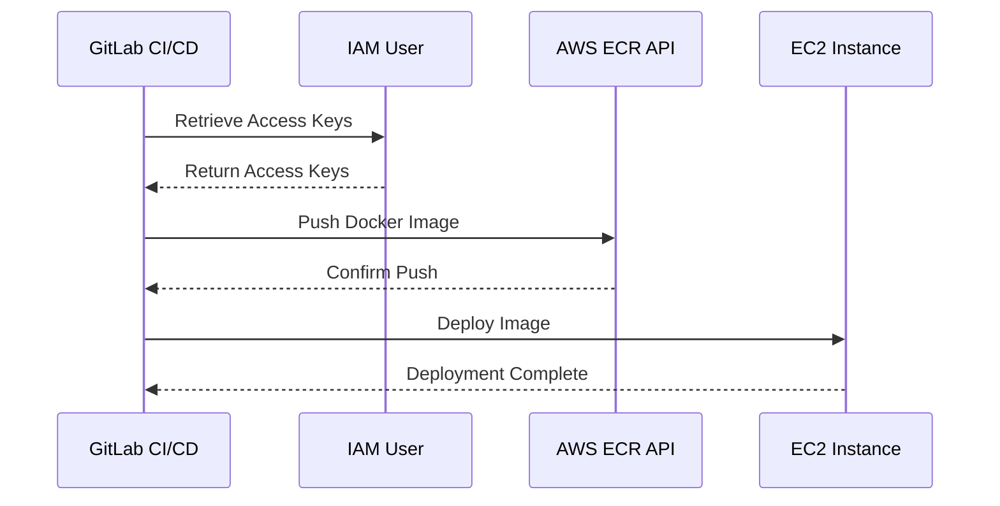

## Introduction to AWS Cloud Security and Access Management

In the realm of DevSecOps, ensuring secure access from Continuous Integration and Continuous Deployment (CI/CD) pipelines to AWS resources is paramount. This chapter delves into the intricacies of securing access, starting from the initial steps and progressing to advanced best practices. We'll explore the concepts, tools, and techniques necessary to maintain robust security within your CI/CD pipeline.

### Background Theory

AWS provides a comprehensive set of services and tools to manage access control and security. One of the fundamental principles in AWS security is the principle of least privilege (PoLP), which dictates that users and systems should have only the permissions necessary to perform their tasks. This principle is crucial in preventing unauthorized access and minimizing the potential damage from security breaches.

#### Root Access vs. IAM Users

Initially, many organizations might use root access credentials for their CI/CD pipelines. However, this approach poses significant risks:

- **High Privilege**: Root access grants full administrative privileges across all AWS services, making it a prime target for attackers.
- **Audit Challenges**: Tracking and auditing actions performed with root credentials is difficult, leading to potential compliance issues.

To mitigate these risks, AWS recommends using IAM (Identity and Access Management) users with limited permissions. IAM allows you to create and manage AWS users and groups, and assign specific permissions to these entities.

### Step-by-Step Approach to Securing Access

The process of securing access from a CI/CD pipeline to AWS involves several steps. We'll start by addressing the initial warning about root access and then move towards implementing more secure practices.

#### Initial Warning and Root Access

When setting up a CI/CD pipeline, AWS often warns about using root access credentials. This warning is based on the high-risk nature of root access. Here’s an example of such a warning:

```plaintext
Warning: Using root access credentials in your CI/CD pipeline is highly discouraged due to the elevated privileges associated with root access.
```

Despite this warning, you might choose to proceed initially, understanding that you will improve security later. This decision is often made to get the pipeline operational quickly, with the intention of enhancing security in subsequent steps.

#### Creating IAM User with Limited Permissions

The first step towards improving security is to create an IAM user with limited permissions. This user will be used exclusively by the CI/CD pipeline to interact with AWS services.

##### Creating an IAM User

1. **Navigate to IAM Console**: Log in to the AWS Management Console and navigate to the IAM service.
2. **Create User**: Click on "Users" in the left-hand menu, then click "Add user."
3. **Set User Details**: Provide a username and select "Programmatic access" since the user will be accessed programmatically by the CI/CD pipeline.
4. **Attach Policies**: Attach policies that grant the necessary permissions. For example, if the pipeline needs to interact with Amazon Elastic Container Registry (ECR), attach the `AmazonEC2ContainerRegistryPowerUser` policy.

Here’s an example of creating an IAM user via the AWS CLI:

```bash
aws iam create-user --user-name gitlab-ci-user
aws iam attach-user-policy --user-name gitlab-ci-user --policy-arn arn:aws:iam::aws:policy/AmazonEC2ContainerRegistryPowerUser
```

#### Replacing Root Access Keys with IAM User Access Keys

Once the IAM user is created, the next step is to replace the root access keys with the IAM user access keys in the CI/CD pipeline settings.

##### Access Key Replacement

1. **Retrieve Access Keys**: Navigate to the IAM user and retrieve the access key ID and secret access key.
2. **Update CI/CD Settings**: Replace the root access keys with the IAM user access keys in the CI/CD pipeline configuration.

For example, in a GitLab CI/CD pipeline, you would update the `.gitlab-ci.yml` file to use the IAM user access keys:

```yaml
stages:
  - build
  - test
  - deploy

variables:
  AWS_ACCESS_KEY_ID: $IAM_USER_ACCESS_KEY_ID
  AWS_SECRET_ACCESS_KEY: $IAM_USER_SECRET_ACCESS_KEY

build_image:
  stage: build
  script:
    - aws ecr get-login-password --region us-east-1 | docker login --username AWS --password-stdin $AWS_ACCOUNT_ID.dkr.ecr.us-east-1.amazonaws.com
    - docker build -t my-image .
    - docker tag my-image:latest $AWS_ACCOUNT_ID.dkr.ecr.us-east-1.amazonaws.com/my-image:latest
    - docker push $AWS_ACCOUNT_ID.dkr.ecr.us-east-1.amazonaws.com/my-image:latest

trivy_scan:
  stage: test
  script:
    - trivy image $AWS_ACCOUNT_ID.dkr.ecr.us-east-1.amazonaws.com/my-image:latest

deploy_image:
  stage: deploy
  script:
    - aws ecs update-service --cluster my-cluster --service my-service --force-new-deployment
```

### Testing the Pipeline

After updating the CI/CD pipeline settings, it’s essential to test the pipeline to ensure that the new IAM user access keys work correctly.

#### Testing Steps

1. **Remove Unnecessary Jobs**: To speed up the testing process, remove unnecessary jobs from the pipeline. For example, remove all test jobs and focus on the critical jobs that require AWS access.
2. **Commit Changes**: Commit the changes to the repository and trigger the pipeline.
3. **Verify Success**: Ensure that the pipeline runs successfully using the new IAM user access keys.

### Real-World Examples and Recent Breaches

Recent breaches highlight the importance of securing access in CI/CD pipelines. For instance, the Capital One breach in 2019 involved unauthorized access to sensitive data through misconfigured AWS S3 buckets. This breach underscores the need for strict access controls and regular audits.

Another notable example is the SolarWinds supply chain attack in 2020, where attackers compromised the build server and inserted malicious code into software updates. This incident emphasizes the importance of securing the entire CI/CD pipeline, including the build and deployment processes.

### How to Prevent / Defend

#### Detection

Regularly monitor and audit access logs to detect any unauthorized access attempts. AWS CloudTrail can be used to log API calls and management events, providing a detailed record of activity.

#### Prevention

1. **Use IAM Roles**: Instead of using access keys, consider using IAM roles for EC2 instances and other AWS services. IAM roles provide temporary credentials that are automatically rotated.
2. **Enable MFA**: Enable Multi-Factor Authentication (MFA) for IAM users to add an extra layer of security.
3. **Least Privilege Principle**: Ensure that IAM users and roles have only the minimum permissions required to perform their tasks.

#### Secure Coding Fixes

Compare the insecure and secure versions of the CI/CD pipeline configuration:

**Insecure Version:**

```yaml
variables:
  AWS_ACCESS_KEY_ID: $ROOT_ACCESS_KEY_ID
  AWS_SECRET_ACCESS_KEY: $ROOT_SECRET_ACCESS_KEY
```

**Secure Version:**

```yaml
variables:
  AWS_ACCESS_KEY_ID: $IAM_USER_ACCESS_KEY_ID
  AWS_SECRET_ACCESS_KEY: $IAM_USER_SECRET_ACCESS_KEY
```

### Complete Example with Raw HTTP Messages

Consider a scenario where the CI/CD pipeline interacts with AWS ECR to push a Docker image. The following example shows the full HTTP request and response:

**HTTP Request:**

```http
POST /v2/<account-id>.dkr.ecr.<region>.amazonaws.com/<repository>/manifests/sha256:<digest> HTTP/1.1
Host: <account-id>.dkr.ecr.<region>.amazonaws.com
Authorization: Bearer <token>
Content-Type: application/vnd.docker.distribution.manifest.v2+json
Content-Length: <length>

<manifest-json>
```

**HTTP Response:**

```http
HTTP/1.1 201 Created
Date: Mon, 01 Jan 2024 00:00:00 GMT
Content-Length: 0
```

### Mermaid Diagrams

#### Sequence Diagram for CI/CD Pipeline Interaction



### Hands-On Labs

To practice and reinforce the concepts covered in this chapter, consider the following hands-on labs:

- **PortSwigger Web Security Academy**: Offers modules on AWS security and IAM management.
- **CloudGoat**: Provides a series of challenges to learn and practice AWS security best practices.
- **AWS Official Workshops**: Includes workshops on IAM and security best practices.

By following these steps and best practices, you can significantly enhance the security of your CI/CD pipeline when interacting with AWS resources.

---
<!-- nav -->
[[DevSecOps/DevSecOps Bootcamp/03-Identity & Access Management/01-AWS Cloud Security & Access Management/Secure Access from CICD Pipeline to AWS/01-Introduction to AWS Cloud Security & Access Management|Introduction to AWS Cloud Security & Access Management]] | [[DevSecOps/DevSecOps Bootcamp/03-Identity & Access Management/01-AWS Cloud Security & Access Management/Secure Access from CICD Pipeline to AWS/00-Overview|Overview]] | [[DevSecOps/DevSecOps Bootcamp/03-Identity & Access Management/01-AWS Cloud Security & Access Management/Secure Access from CICD Pipeline to AWS/03-AWS Cloud Security & Access Management|AWS Cloud Security & Access Management]]
