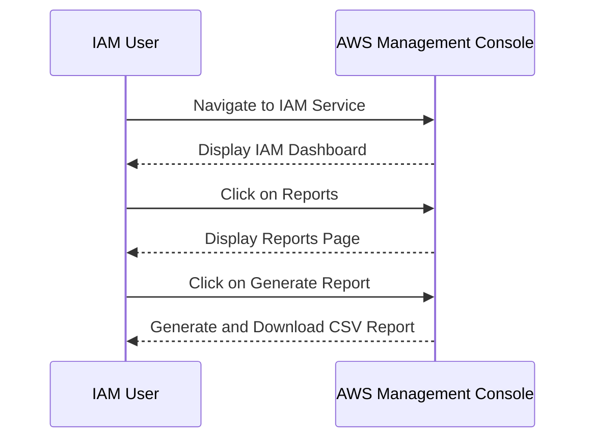

## AWS Cloud Security & Access Management

### Credential Reports in AWS

In AWS, one of the key tools for managing and securing access to resources is the **Credential Report**. This report provides a comprehensive overview of the credentials used within your AWS account. Credentials include various types of access mechanisms such as passwords, access keys, and multi-factor authentication (MFA).

#### What is a Credential Report?

A **Credential Report** is a CSV file that contains detailed information about the credentials associated with IAM users, roles, and groups in your AWS account. This report includes metadata about the credentials, such as:

- User IDs
- Password usage details (last used date)
- MFA status (enabled/disabled)
- Access key details (creation date, last used date)

#### Why Use a Credential Report?

The primary reason to use a Credential Report is to ensure that your AWS environment adheres to best security practices. By reviewing this report, you can identify potential security risks, such as:

- Users without MFA enabled
- Unused or expired access keys
- Users with multiple access keys

This helps in maintaining a secure environment by ensuring that all users comply with security policies.

#### How to Generate a Credential Report

To generate a Credential Report, follow these steps:

1. Log in to the AWS Management Console.
2. Navigate to the **IAM** service.
3. In the left-hand menu, click on **Reports**.
4. Click on **Generate report**.

After generating the report, it will be available for download as a CSV file.



### Analyzing the Credential Report

Once you have downloaded the Credential Report, you can analyze it to identify potential security issues. Let’s break down the key columns and their significance:

- **user**: The IAM user name.
- **arn**: The Amazon Resource Name (ARN) of the user.
- **user_creation_time**: The date and time when the user was created.
- **password_enabled**: Indicates whether the user has a password enabled (`true` or `false`).
- **password_last_used**: The date and time when the password was last used.
- **password_last_changed**: The date and time when the password was last changed.
- **mfa_active**: Indicates whether MFA is active for the user (`true` or `false`).
- **access_key_1_active**: Indicates whether the first access key is active (`true` or `false`).
- **access_key_1_last_rotated**: The date and time when the first access key was last rotated.
- **access_key_1_last_used_date**: The date when the first access key was last used.
- **access_key_1_last_used_service**: The AWS service that last used the first access key.
- **access_key_2_active**: Indicates whether the second access key is active (`true` or `false`).
- **access_key_2_last_rotated**: The date and time when the second access key was last rotated.
- **access_key_ 2_last_used_date**: The date when the second access key was last used.
- **access_key_2_last_used_service**: The AWS service that last used the second access key.

#### Example of a Credential Report

Here is an example of a portion of a Credential Report:

```csv
,user,arn,user_creation_time,password_enabled,password_last_used,password_last_changed,mfa_active,access_key_1_active,access_key_1_last_rotated,access_key_1_last_used_date,access_key_1_last_used_service,access_key_2_active,access_key_2_last_rotated,access_key_2_last_used_date,access_key_2_last_used_service
,user1,arn:aws:iam::123456789012:user/user1,2023-01-01T00:00:00Z,true,2023-01-15T00:00:00Z,2023-01-01T00:00:00Z,false,true,2023-01-01T00:00:00Z,2023-01-10T00:00:00Z,s3,false,2023-01-01T00:00:00Z,2023-01-10T00:00:00Z,s3
,user2,arn:aws:iam::123456789012:user/user2,2023-01-01T00:00:00Z,true,2023-01-15T00:00:00Z,2023-01-01T00:00:00Z,true,true,2023-01-01T00:00:00Z,2023-01-10T00:00:00Z,s3,false,2023-01-01T00:00:00Z,2023-01-10T00:00:00Z,s3
```

### Identifying Security Risks

By analyzing the Credential Report, you can identify several security risks:

1. **Users Without MFA Enabled**: Identify users with `mfa_active` set to `false`.
2. **Unused Access Keys**: Identify access keys that have not been used recently.
3. **Multiple Active Access Keys**: Identify users with both `access_key_1_active` and `access_key_2_active` set to `true`.

#### Example Analysis

Consider the following excerpt from a Credential Report:

```csv
,user,arn,user_creation_time,password_enabled,password_last_used,password_last_changed,mfa_active,access_key_1_active,access_key_1_last_rotated,access_key_1_last_used_date,access_key_1_last_used_service,access_key_2_active,access_key_2_last_rotated,access_key_2_last_used_date,access_key_2_last_used_service
,user3,arn:aws:iam::123456789012:user/user3,2023-01-01T00:00:00Z,true,2023-01-15T00:00:00Z,2023-01-01T00:00:00Z,false,true,2023-01-01T00:00:00Z,2023-01-10T00:00:00Z,s3,false,2023-01-01T00:00:00Z,2023-01-10T00:00:00Z,s3
,user4,arn:aws:iam::123456789012:user/user4,2023-01-01T00:00:00Z,true,2023-01-15T00:00:00Z,2023-01-01T00:00:00Z,true,true,2023-01-01T00:00:00Z,2023-01-10T00:00:00Z,s3,false,2023-01-01T00:00:00Z,2023-01-10T00:00:00Z,s3
```

- **User3** does not have MFA enabled (`mfa_active` is `false`).
- **User4** has MFA enabled (`mfa_active` is `true`).

### System Users (CI/CD Pipelines)

While the Credential Report primarily focuses on human users, it is equally important to manage access for system users, such as those used by CI/CD pipelines (e.g., Jenkins, GitLab CI).

#### Access Management for CI/CD Pipelines

For CI/CD pipelines, you typically use **IAM Roles** or **IAM Users** with **Access Keys**. These access keys are used to authenticate API calls made by the pipeline to AWS services.

##### IAM Roles vs. IAM Users

- **IAM Roles**: Typically used for temporary access and are assumed by entities like EC2 instances or Lambda functions.
- **IAM Users**: Used for permanent access and are often associated with human users or system users.

#### Best Practices for CI/CD Access

1. **Least Privilege Principle**: Ensure that the IAM role or user has only the minimum permissions required to perform its tasks.
2. **Rotation of Access Keys**: Regularly rotate access keys to minimize the risk of exposure.
3. **Monitoring and Logging**: Enable CloudTrail logging to monitor API calls made by the CI/CD pipeline.

#### Example IAM Policy for CI/CD Pipeline

Here is an example IAM policy for a CI/CD pipeline:

```json
{
    "Version": "2012-10-17",
    "Statement": [
        {
            "Effect": "Allow",
            "Action": [
                "s3:GetObject",
                "s3:PutObject"
            ],
            "Resource": "arn:aws:s3:::my-bucket/*"
        },
        {
            "Effect": "Allow",
            "Action": [
                "ecr:GetAuthorizationToken",
                "ecr:BatchCheckLayerAvailability",
                "ecr:GetDownloadUrlForLayer",
                "ecr:BatchGetImage",
                "ecr:InitiateLayerUpload",
                "ecr:UploadLayerPart",
                "ecr:CompleteLayerUpload",
                "ecr:PutImage"
            ],
            "Resource": "*"
        }
    ]
}
```

### Real-World Examples and Breaches

Several high-profile breaches have occurred due to misconfigured IAM roles and access keys. For instance:

- **Capital One Data Breach (CVE-2019-11510)**: A misconfigured S3 bucket and IAM role allowed unauthorized access to sensitive data.
- **Twitter Data Breach (CVE-2020-14720)**: An attacker gained access to internal systems through compromised AWS credentials.

These breaches highlight the importance of proper access management and regular audits.

### How to Prevent / Defend

#### Detection

1. **Regular Audits**: Schedule regular audits of IAM roles and users.
2. **CloudTrail**: Enable CloudTrail to log all API calls made by IAM users and roles.
3. **Credential Reports**: Regularly generate and review Credential Reports.

#### Prevention

1. **IAM Policies**: Ensure that IAM policies adhere to the least privilege principle.
2. **Access Key Rotation**: Implement a policy to rotate access keys regularly.
3. **MFA Enforcement**: Enforce MFA for all IAM users.

#### Secure Coding Fixes

Compare the insecure and secure versions of IAM policies:

**Insecure IAM Policy**:

```json
{
    "Version": "2012-10-17",
    "Statement": [
        {
            "Effect": "Allow",
            "Action": "*",
            "Resource": "*"
        }
    ]
}
```

**Secure IAM Policy**:

```json
{
    "Version": "2012-10-17",
    "Statement": [
        {
            "Effect": "Allow",
            "Action": [
                "s3:GetObject",
                "s3:PutObject"
            ],
            "Resource": "arn:aws:s3:::my-bucket/*"
        },
        {
            "Effect": "Allow",
            "Action": [
                "ecr:GetAuthorizationToken",
                "ecr:BatchCheckLayerAvailability",
                "ecr:GetDownloadUrlForLayer",
                "ecr:BatchGetImage",
                "ecr:InitiateLayerUpload",
                "ecr:UploadLayerPart",
                "ecr:CompleteLayerUpload",
                "ecr:PutImage"
            ],
            "Resource": "*"
        }
    ]
}
```

### Configuration Hardening

1. **IAM Role Usage**: Use IAM roles instead of IAM users for temporary access.
2. **Access Key Management**: Disable unused access keys and enforce rotation policies.
3. **MFA Configuration**: Configure MFA for all IAM users.

### Practice Labs

To gain hands-on experience with AWS Cloud Security and Access Management, consider the following labs:

- **CloudGoat**: A series of labs designed to help you understand and mitigate common cloud security issues.
- **flaws.cloud**: A platform that simulates real-world cloud environments with intentional vulnerabilities for educational purposes.
- **PortSwigger Web Security Academy**: While primarily focused on web application security, it also covers aspects of cloud security and IAM management.

By thoroughly understanding and implementing these best practices, you can significantly enhance the security of your AWS environment.

---
<!-- nav -->
[[DevSecOps/DevSecOps Bootcamp/03-Identity & Access Management/01-AWS Cloud Security & Access Management/Secure Access from CICD Pipeline to AWS/02-Introduction to AWS Cloud Security and Access Management|Introduction to AWS Cloud Security and Access Management]] | [[DevSecOps/DevSecOps Bootcamp/03-Identity & Access Management/01-AWS Cloud Security & Access Management/Secure Access from CICD Pipeline to AWS/00-Overview|Overview]] | [[DevSecOps/DevSecOps Bootcamp/03-Identity & Access Management/01-AWS Cloud Security & Access Management/Secure Access from CICD Pipeline to AWS/04-Creating Users in AWS IAM|Creating Users in AWS IAM]]
