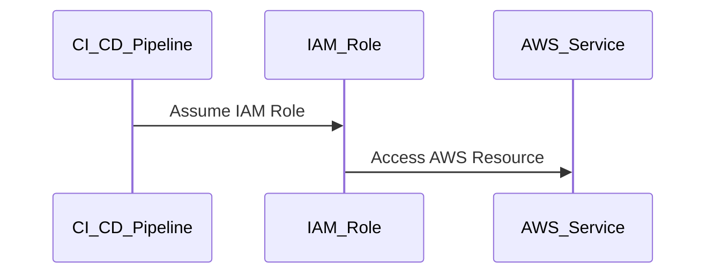
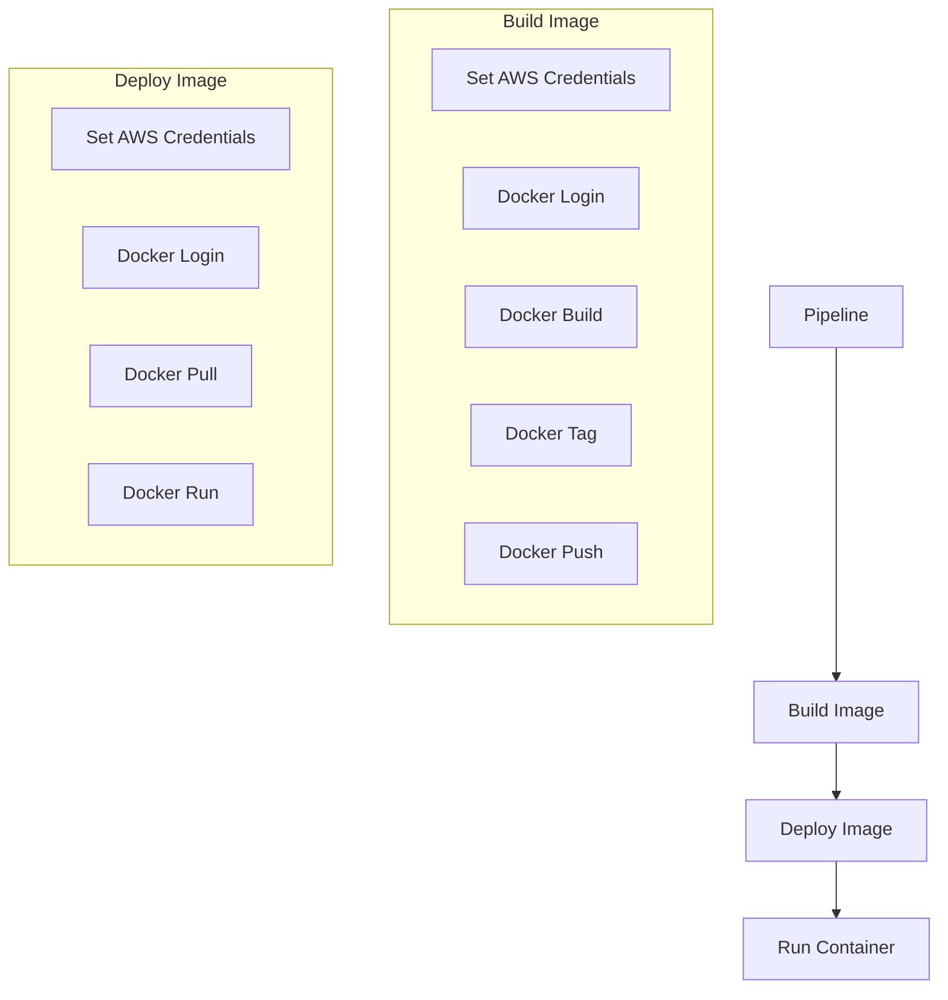

## Secure Access from CI/CD Pipeline to AWS

### Background Theory

In the context of DevSecOps, ensuring secure access from a CI/CD pipeline to AWS is crucial. This involves managing credentials securely, using appropriate roles and permissions, and automating the process to minimize human intervention. The goal is to ensure that the pipeline can interact with AWS services without compromising security.

### AWS ECR and Docker Credentials

AWS Elastic Container Registry (ECR) is a managed Docker container registry that makes it easy to store, manage, and deploy Docker container images. To pull images from ECR, you need to authenticate using Docker credentials. These credentials are typically associated with an AWS Identity and Access Management (IAM) user or role.

#### IAM Users and Roles

IAM users and roles are fundamental to AWS security. An IAM user is an entity that you create in AWS to represent a person or service that uses your AWS account resources. An IAM role is similar to an IAM user, but it is intended to be assumed by an AWS service or another trusted entity.

**Why IAM Users and Roles Matter:**
- **Access Control:** IAM users and roles allow you to control access to AWS resources.
- **Least Privilege Principle:** By assigning specific permissions to roles, you adhere to the principle of least privilege, reducing the risk of unauthorized access.

#### Root User Access Keys

Using root user access keys is highly discouraged due to the elevated privileges associated with the root user. Root users have full access to all AWS resources, making them a prime target for attackers. Instead, it is recommended to use IAM users or roles with limited permissions.

**Example of Root User Access Key Usage:**
```plaintext
aws ecr get-login-password --region us-east-1 | docker login --username AWS --password-stdin <account-id>.dkr.ecr.us-east-1.amazonaws.com
```

**Pitfall:**
Using root user access keys can lead to significant security risks. If these keys are compromised, an attacker could gain full access to your AWS account.

### Updating Credentials in CI/CD Pipeline

In the given scenario, the pipeline encountered an error during the `deploy image` step because the Docker credentials were outdated. Specifically, the credentials used were from a root user, which were subsequently deleted. To resolve this issue, new credentials from a GitLab user were needed.

#### Steps to Update Credentials

1. **Generate New Access Key Pair:**
   - Navigate to the IAM console in the AWS Management Console.
   - Select the IAM user or role that will be used for the pipeline.
   - Generate a new access key pair.

2. **Update Pipeline Configuration:**
   - Replace the old access key pair with the new one in the pipeline configuration.
   - Ensure that the new credentials are stored securely, such as in a secret management tool like HashiCorp Vault or AWS Secrets Manager.

**Example of Updating Pipeline Configuration:**

```yaml
stages:
  - build
  - deploy

build_image:
  stage: build
  script:
    - aws configure set aws_access_key_id $NEW_ACCESS_KEY_ID
    - aws configure set aws_secret_access_key $NEW_SECRET_ACCESS_KEY
    - aws ecr get-login-password --region us-east-1 | docker login --username AWS --password-stdin <account-id>.dkr.ecr.us-east-1.amazonaws.com
    - docker build -t my-image .
    - docker tag my-image:latest <account-id>.dkr.ecr.us-east-1.amazonaws.com/my-image:latest
    - docker push <account-id>.dkr.ecr.us-east-1.amazonaws.com/my-image:latest

deploy_image:
  stage: deploy
  script:
    - aws configure set aws_access_key_id $NEW_ACCESS_KEY_ID
    - aws configure set aws_secret_access_key $NEW_SECRET_ACCESS_KEY
    - aws ecr get-login-password --region us-east-1 | docker login --username AWS --password-stdin <account-id>.dkr.ecr.us-east-1.amazonaws.com
    - docker pull <account-id>.dkr.ecr.us-east-1.amazonaws.com/my-image:latest
    - docker run -d --name my-container <account-id>.dkr.ecr.us-east-1.amazonaws.com/my-image:latest
```

### Automating Credential Management

To further enhance security, consider automating the management of credentials within the CI/CD pipeline. This can be achieved using tools like AWS IAM Roles for Service Accounts (IRSA) or AWS Secrets Manager.

#### AWS IAM Roles for Service Accounts (IRSA)

IRSA allows you to grant IAM roles to Kubernetes service accounts, enabling pods to assume IAM roles and access AWS resources securely. This approach eliminates the need to manage and distribute access keys manually.

**Example of IRSA Setup:**

1. **Create an IAM Role:**
   - Navigate to the IAM console.
   - Create a new IAM role with the necessary permissions.
   - Attach the role to a Kubernetes service account.

2. **Configure Kubernetes Service Account:**
   - Use an annotation to associate the IAM role with the service account.
   - Example annotation:
     ```yaml
     annotations:
       eks.amazonaws.com/role-arn: arn:aws:iam::123456789012:role/my-role
     ```

#### AWS Secrets Manager

AWS Secrets Manager is a service that helps you protect access to your applications, services, and IT resources without complex cryptography. You can store, retrieve, and rotate secrets throughout their lifecycle.

**Example of Using AWS Secrets Manager:**

1. **Store Credentials in Secrets Manager:**
   - Navigate to the Secrets Manager console.
   - Create a new secret and store the access key ID and secret access key.

2. **Retrieve Credentials in Pipeline:**
   - Use the AWS SDK to retrieve the secret in the pipeline.
   - Example code:
     ```python
     import boto3

     client = boto3.client('secretsmanager')
     response = client.get_secret_value(SecretId='my-secret')
     secret = response['SecretString']
     ```

### Secure Coding Practices

To ensure that the pipeline is secure, follow these secure coding practices:

1. **Use Environment Variables:**
   - Store sensitive information like access keys in environment variables rather than hardcoding them in scripts.

2. **Limit Permissions:**
   - Assign the minimum necessary permissions to IAM roles and users used in the pipeline.

3. **Audit and Monitor:**
   - Regularly audit IAM roles and permissions.
   - Enable CloudTrail to monitor API calls made by IAM users and roles.

### Real-World Examples

#### Recent Breaches

One notable breach involving AWS credentials occurred in 2021, where an attacker gained access to an AWS account due to misconfigured IAM roles. The attacker used the compromised credentials to launch cryptocurrency mining operations.

**Example of Misconfigured IAM Role:**

```json
{
  "Version": "2012-10-17",
  "Statement": [
    {
      "Effect": "Allow",
      "Action": "*",
      "Resource": "*"
    }
  ]
}
```

**Detection and Prevention:**
- **Detection:** Use AWS Config to monitor changes to IAM roles and policies.
- **Prevention:** Implement least privilege principles and regularly review IAM roles and policies.

### How to Prevent / Defend

#### Detection

1. **CloudTrail:**
   - Enable CloudTrail to log all API calls made by IAM users and roles.
   - Set up alerts for suspicious activity, such as unauthorized access attempts.

2. **AWS Config:**
   - Use AWS Config to monitor changes to IAM roles and policies.
   - Set up rules to detect and alert on misconfigured IAM roles.

#### Prevention

1. **Least Privilege Principle:**
   - Assign the minimum necessary permissions to IAM roles and users used in the pipeline.
   - Regularly review and update IAM roles and policies.

2. **Automate Credential Management:**
   - Use tools like IRSA or AWS Secrets Manager to automate credential management.
   - Avoid hardcoding access keys in scripts or configuration files.

3. **Secure Environment Variables:**
   - Store sensitive information like access keys in environment variables rather than hardcoding them in scripts.
   - Use secret management tools like HashiCorp Vault or AWS Secrets Manager to securely store and retrieve credentials.

### Complete Example

#### Vulnerable Code

```yaml
stages:
  - build
  - deploy

build_image:
  stage: build
  script:
    - aws configure set aws_access_key_id $ROOT_ACCESS_KEY_ID
    - aws configure set aws_secret_access_key $ROOT_SECRET_ACCESS_KEY
    - aws ecr get-login-password --region us-east-1 | docker login --username AWS --password-stdin <account-id>.dkr.ecr.us-east-1.amazonaws.com
    - docker build -t my-image .
    - docker tag my-image:latest <account-id>.dkr.ecr.us-east-1.amazonaws.com/my-image:latest
    - docker push <account-id>.dkr.ecr.us-east-1.amazonaws.com/my-image:latest

deploy_image:
  stage: deploy
  script:
    - aws configure set aws_access_key_id $ROOT_ACCESS_KEY_ID
    - aws configure set aws_secret_access_key $ROOT_SECRET_ACCESS_KEY
    - aws ecr get-login-password --region us-east-1 | docker login --username AWS --password-stdin <account-id>.dkr.ecr.us-east-1.amazonaws.com
    - docker pull <account-id>.dkr.ecr.us-east-1.amazonaws.com/my-image:latest
    - docker run -d --name my-container <account-id>.dkr.ecr.us-east-1.amazonaws.com/my-image:latest
```

#### Secure Code

```yaml
stages:
  - build
  - deploy

build_image:
  stage: build
  script:
    - aws configure set aws_access_key_id $NEW_ACCESS_KEY_ID
    - aws configure set aws_secret_access_key $NEW_SECRET_ACCESS_KEY
    - aws ecr get-login-password --region us-east-1 | docker login --username AWS --password-stdin <account-id>.dkr.ecr.us-east-1.amazonaws.com
    - docker build -t my-image .
    - docker tag my-image:latest <account-id>.dkr.ecr.us-east-1.amazonaws.com/my-image:latest
    - docker push <account-id>.dkr.ecr.us-east-1.amazonaws.com/my-image:latest

deploy_image:
  stage: deploy
  script:
    - aws configure set aws_access_key_id $NEW_ACCESS_KEY_ID
    - aws configure set aws_secret_access_key $NEW_SECRET_ACCESS_KEY
    - aws ecr get-login-password --region us-east-1 | docker login --username AWS --password-stdin <account-id>.dkr.ecr.us-east-1.amazonaws.com
    - docker pull <account-id>.dkr.ecr.us-east-1.amazonaws.com/my-image:latest
    - docker run -d --name my-container <account-id>.dkr.ecr.us-east-1.amazonaws.com/my-image:latest
```

### Mermaid Diagrams

#### IAM Role Assignment



#### Pipeline Flow



### Practice Labs

For hands-on practice with securing access from a CI/CD pipeline to AWS, consider the following labs:

- **PortSwigger Web Security Academy:** Focuses on web application security but includes modules on secure coding practices and IAM roles.
- **OWASP Juice Shop:** While primarily focused on web application security, it includes challenges related to secure coding and IAM roles.
- **CloudGoat:** Provides a series of labs specifically designed to teach cloud security concepts, including IAM roles and secure access management.

By following these guidelines and practicing with real-world examples, you can ensure that your CI/CD pipeline interacts securely with AWS services.

---
<!-- nav -->
[[DevSecOps/DevSecOps Bootcamp/03-Identity & Access Management/01-AWS Cloud Security & Access Management/Secure Access from CICD Pipeline to AWS/05-Multi-Factor Authentication (MFA) in AWS|Multi-Factor Authentication (MFA) in AWS]] | [[DevSecOps/DevSecOps Bootcamp/03-Identity & Access Management/01-AWS Cloud Security & Access Management/Secure Access from CICD Pipeline to AWS/00-Overview|Overview]] | [[07-Secure Access from CICD Pipeline to AWS|Secure Access from CICD Pipeline to AWS]]
