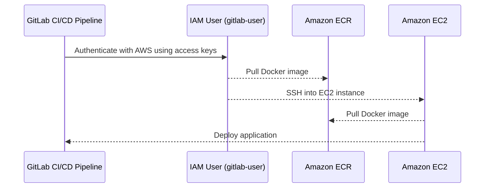

## Secure Access from CI/CD Pipeline to AWS

In the context of DevSecOps, ensuring secure access from a CI/CD pipeline to AWS is crucial for maintaining the integrity and confidentiality of your infrastructure. This section will delve into the process of setting up a secure access mechanism for a CI/CD pipeline, specifically focusing on GitLab pipelines accessing AWS services such as Amazon Elastic Container Registry (ECR) and Amazon EC2.

### Background Theory

Before diving into the specifics, it's important to understand the underlying concepts:

- **CI/CD Pipeline**: Continuous Integration and Continuous Deployment (CI/CD) is a practice where developers frequently merge their code changes into a central repository, after which automated builds and tests are run. If successful, the code is automatically deployed to production.
  
- **AWS Services**:
  - **Amazon EC2**: A web service that provides resizable compute capacity in the cloud.
  - **Amazon ECR**: A fully-managed Docker container registry that makes it easy to store, manage, and deploy Docker container images.

- **IAM Users and Policies**: Identity and Access Management (IAM) is a web service that helps you securely control access to AWS resources. IAM users are entities that represent people or applications that use your AWS account. IAM policies define permissions that allow or deny actions on AWS resources.

### Creating an IAM User for the CI/CD Pipeline

To ensure that the CI/CD pipeline can securely access AWS services, you need to create an IAM user with specific permissions. This user will be used by the pipeline to interact with AWS services like ECR and EC2.

#### Steps to Create an IAM User

1. **Log in to the AWS Management Console**:
   - Navigate to the IAM dashboard.
   - Click on "Users" in the left-hand menu.
   - Click on "Add user".

2. **Specify User Details**:
   - Enter a username, e.g., `gitlab-user`.
   - Ensure "Programmatic access" is selected, as the pipeline will use access keys to authenticate.
   - Leave "AWS Management Console access" unchecked, as the pipeline does not require console access.

3. **Attach Permissions**:
   - Click on "Next: Permissions".
   - Choose "Attach existing policies directly".
   - Search for and attach the `AmazonEC2ContainerRegistryFullAccess` policy to grant full access to ECR.
   - Optionally, you can also attach the `AmazonEC2ReadOnlyAccess` policy if the pipeline needs read-only access to EC2 instances.

4. **Review and Create User**:
   - Review the user details and permissions.
   - Click on "Create user".

5. **Retrieve Access Keys**:
   - After creating the user, download the access key ID and secret access key.
   - Store these credentials securely, as they will be used by the pipeline to authenticate with AWS.

### Configuring the CI/CD Pipeline

Once the IAM user is created, you need to configure the CI/CD pipeline to use these credentials. This typically involves setting environment variables in the CI/CD tool (e.g., GitLab CI/CD).

#### Example Configuration in GitLab CI/CD

```yaml
stages:
  - build
  - deploy

variables:
  AWS_ACCESS_KEY_ID: $AWS_ACCESS_KEY_ID
  AWS_SECRET_ACCESS_KEY: $AWS_SECRET_ACCESS_KEY

build_image:
  stage: build
  script:
    - aws ecr get-login-password --region us-west-2 | docker login --username AWS --password-stdin <aws_account_id>.dkr.ecr.us-west-2.amazonaws.com
    - docker build -t my-image .
    - docker tag my-image:latest <aws_account_id>.dkr.ecr.us-west-2.amazonaws.com/my-image:latest
    - docker push <aws_account_id>.dkr.ecr.us-west-2.amazonaws.com/my-image:latest

deploy_to_ec2:
  stage: deploy
  script:
    - ssh -i ~/.ssh/id_rsa ec2-user@<ec2_instance_ip> "docker pull <aws_account_id>.dkr.ecr.us-west-2.amazonaws.com/my-image:latest"
    - ssh -i ~/.ssh/id_rsa ec2-user@<ec2_instance_ip> "docker run -d --name my-container <aws_account_id>.dkr.ecr.us-west-2.amazonaws.com/my-image:latest"
```

### Diagramming the Access Flow

A mermaid diagram can help visualize the interaction between the CI/CD pipeline and AWS services.



### Common Pitfalls and How to Avoid Them

#### Pitfall 1: Storing Credentials Insecurely

**Problem**: Storing AWS access keys in plain text within the CI/CD pipeline configuration files can lead to unauthorized access if the files are exposed.

**Solution**: Use environment variables to store sensitive information. Ensure that these variables are encrypted and stored securely.

#### Pitfall 2: Over-permissive IAM Policies

**Problem**: Attaching overly permissive IAM policies to the pipeline user can expose your AWS resources to potential attacks.

**Solution**: Follow the principle of least privilege. Attach only the necessary permissions required for the pipeline to function correctly.

### Real-World Examples and Breaches

#### Example: CVE-2021-20225

**Description**: In 2021, a vulnerability was discovered in the AWS SDK for Java, which allowed attackers to bypass authentication mechanisms and gain unauthorized access to AWS resources.

**Impact**: This vulnerability could have been exploited to gain access to sensitive data stored in AWS services.

**Mitigation**: Ensure that all AWS SDKs and libraries are kept up-to-date with the latest security patches. Regularly review and audit IAM policies and access keys.

### How to Prevent / Defend

#### Detection

- **Monitor IAM Activity**: Use AWS CloudTrail to monitor and log IAM activity. Set up alerts for suspicious activities.
- **Audit IAM Policies**: Regularly review IAM policies to ensure they follow the principle of least privilege.

#### Prevention

- **Use IAM Roles Instead of Users**: Whenever possible, use IAM roles instead of users. IAM roles can be assumed by trusted entities and provide temporary credentials.
- **Enable Multi-Factor Authentication (MFA)**: Enable MFA for IAM users to add an additional layer of security.

#### Secure Coding Fixes

**Vulnerable Code**:
```yaml
variables:
  AWS_ACCESS_KEY_ID: <plain_text_access_key>
  AWS_SECRET_ACCESS_KEY: <plain_text_secret_key>
```

**Secure Code**:
```yaml
variables:
  AWS_ACCESS_KEY_ID: $AWS_ACCESS_KEY_ID
  AWS_SECRET_ACCESS_KEY: $AWS_SECRET_ACCESS_KEY
```

### Complete Example with Raw HTTP Messages

#### Full HTTP Request and Response

**HTTP Request**:
```http
POST /sts/assumeRole HTTP/1.1
Host: sts.amazonaws.com
Content-Type: application/x-www-form-urlencoded
X-Amz-Date: 20231010T123456Z
Authorization: AWS4-HMAC-SHA256 Credential=<access_key>/20231010/us-west-2/sts/aws4_request, SignedHeaders=content-type;host;x-amz-date, Signature=<signature>

Action=AssumeRole&RoleArn=arn:aws:iam::<account_id>:role/<role_name>&RoleSessionName=MySession
```

**HTTP Response**:
```http
HTTP/1.1 200 OK
Content-Type: application/xml
x-amzn-RequestId: <request_id>
Date: Tue, 10 Oct 2023 12:34:56 GMT
Content-Length: <content_length>

<?xml version="1.0"?>
<AssumeRoleResponse xmlns="https://sts.amazonaws.com/doc/2011-06-15/">
  <AssumeRoleResult>
    <SourceIdentity/>
    <SubjectFromSource/>
    <Audience/>
    <Credentials>
      <AccessKeyId><access_key_id></AccessKeyId>
      <SecretAccessKey><secret_access_key></SecretAccessKey>
      <SessionToken><session_token></SessionToken>
      <Expiration>2023-10-10T13:34:56Z</Expiration>
    </Credentials>
  </AssumeRoleResult>
  <ResponseMetadata>
    <RequestId><request_id></RequestId>
  </ResponseMetadata>
</AssumeRoleResponse>
```

### Hands-On Labs

For practical experience, consider the following labs:

- **PortSwigger Web Security Academy**: Offers modules on securing AWS services and IAM policies.
- **CloudGoat**: Provides a set of vulnerable AWS environments to practice securing IAM roles and policies.
- **flaws.cloud**: Contains real-world scenarios for practicing secure access management in AWS.

By following these detailed steps and best practices, you can ensure that your CI/CD pipeline has secure access to AWS services, thereby enhancing the overall security posture of your DevSecOps environment.

---
<!-- nav -->
[[06-Secure Access from CICD Pipeline to AWS Part 1|Secure Access from CICD Pipeline to AWS Part 1]] | [[DevSecOps/DevSecOps Bootcamp/03-Identity & Access Management/01-AWS Cloud Security & Access Management/Secure Access from CICD Pipeline to AWS/00-Overview|Overview]] | [[08-User Creation and Password Policies in AWS|User Creation and Password Policies in AWS]]
