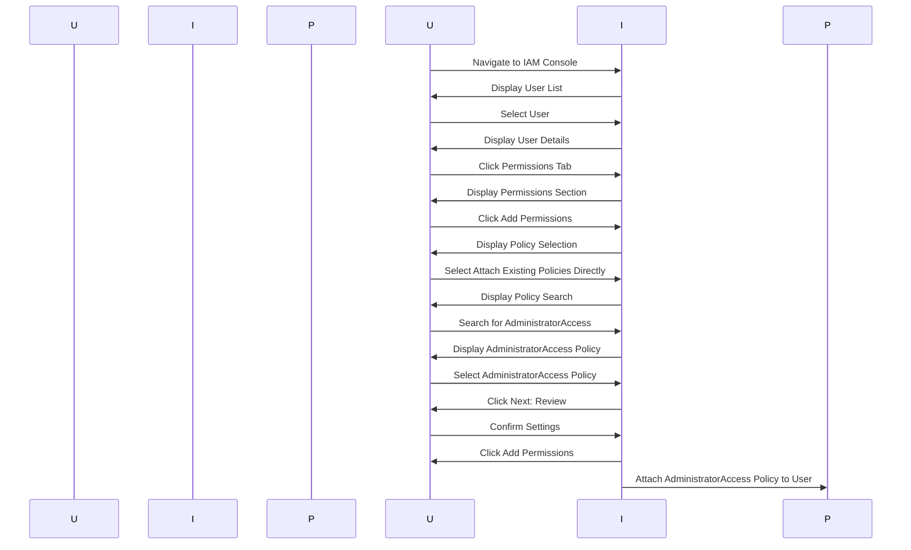

## User Creation and Password Policies in AWS

### Creating a User in AWS

When creating a user in AWS, it is crucial to ensure that the user is properly configured with strong security practices. One of the first steps is setting up a password for the user. This can be done either by allowing the user to set their own password upon first login or by setting a password for them directly. In this scenario, we are creating an admin user and will set the password ourselves.

#### Setting a Strong Password

To ensure the password meets AWS's requirements, it is recommended to use a password manager to generate a strong password. AWS has specific criteria for passwords, including:

- Minimum length of 8 characters
- At least one uppercase letter
- At least one lowercase letter
- At least one number
- At least one special character

Here is an example of a strong password generated by a password manager:

```plaintext
P@ssw0rd!123
```

This password meets all the AWS requirements and is sufficiently complex to resist brute-force attacks.

#### Disabling New Password on Login

By default, AWS may require users to set a new password upon their first login. However, if you want to avoid this step and allow the user to continue using the same password, you can uncheck the "New password on login" option. This ensures that the user does not have to change the password immediately upon logging in.

### Attaching Policies to Users

Once the user is created, the next step is to define what actions the user is allowed to perform within the AWS environment. This is achieved by attaching policies to the user. Policies in AWS are essentially sets of rules that define what actions a user or role can perform on AWS resources.

#### Using Predefined Policies

AWS provides a wide range of predefined policies that cover various use cases. These policies are designed to simplify the process of granting permissions without having to create custom policies from scratch. For an administrative user, the `AdministratorAccess` policy is typically used. This policy grants full access to all AWS services and resources.

#### Attaching the AdministratorAccess Policy

To attach the `AdministratorAccess` policy to the user, follow these steps:

1. Navigate to the IAM console in the AWS Management Console.
2. Select the user you created.
3. Click on the "Permissions" tab.
4. Click on "Add permissions".
5. Select "Attach existing policies directly".
6. Search for and select the `AdministratorAccess` policy.
7. Click "Next: Review".
8. Confirm the settings and click "Add permissions".

Here is a visual representation of the process using a Mermaid diagram:



### Understanding the AdministratorAccess Policy

The `AdministratorAccess` policy is a powerful policy that grants full access to all AWS services and resources. Here is the JSON representation of the `AdministratorAccess` policy:

```json
{
    "Version": "2012-10-17",
    "Statement": [
        {
            "Effect": "Allow",
            "Action": "*",
            "Resource": "*"
        }
    ]
}
```

This policy allows the user to perform any action (`*`) on any resource (`*`). While this level of access is necessary for administrative tasks, it also poses significant risks if misused.

### Pitfalls and Best Practices

#### Overusing AdministratorAccess

One of the main pitfalls of using the `AdministratorAccess` policy is the potential for over-permissioning. Granting full access to all AWS services and resources increases the risk of accidental or malicious misuse. It is generally recommended to use more granular policies that grant only the necessary permissions required for a user's role.

#### Least Privilege Principle

The principle of least privilege states that users should be granted the minimum level of access necessary to perform their job functions. This reduces the risk of unauthorized access and helps mitigate the impact of security incidents.

#### Example of a More Granular Policy

For a user who needs to manage EC2 instances but not other AWS services, a more granular policy can be created. Here is an example of such a policy:

```json
{
    "Version": "2012-10-17",
    "Statement": [
        {
            "Effect": "Allow",
            "Action": [
                "ec2:*"
            ],
            "Resource": "*"
        }
    ]
}
```

This policy allows the user to perform any action related to EC2 instances but restricts access to other AWS services.

### How to Prevent / Defend

#### Detection

To detect unauthorized access or misuse of permissions, it is essential to enable AWS CloudTrail. CloudTrail logs API calls made to your AWS account, providing a detailed record of all actions performed by users and roles. This can help identify any suspicious activity.

Here is an example of enabling CloudTrail:

```bash
aws cloudtrail create-trail --name MyCloudTrail --s3-bucket-name my-bucket --include-global-service-events
```

#### Prevention

To prevent unauthorized access, it is important to implement multi-factor authentication (MFA) for all IAM users. MFA adds an additional layer of security by requiring users to provide a second form of verification, such as a code from an authenticator app, in addition to their password.

Here is an example of enabling MFA for an IAM user:

```bash
aws iam enable-mfa-device --user-name my-user --serial-number arn:aws:iam::123456789012:mfa/my-user --authentication-code1 123456 --authentication-code2 654321
```

#### Secure Coding Fixes

To ensure secure coding practices, it is important to follow the principle of least privilege when assigning permissions. Here is an example of a vulnerable policy and its secure counterpart:

**Vulnerable Policy:**

```json
{
    "Version": "2012-10-17",
    "Statement": [
        {
            "Effect": "Allow",
            "Action": "*",
            "Resource": "*"
        }
    ]
}
```

**Secure Policy:**

```json
{
    "Version": "2012-10-17",
    "Statement": [
        {
            "Effect": "Allow",
            "Action": [
                "ec2:*"
            ],
            "Resource": "*"
        }
    ]
}
```

### Real-World Examples

#### Recent Breaches

In recent years, several high-profile breaches have been attributed to misconfigured IAM policies. For example, in 2021, a breach at a major cryptocurrency exchange resulted in the theft of millions of dollars worth of digital assets. The breach was caused by a misconfigured IAM policy that granted excessive permissions to a service account.

#### CVEs

CVE-2021-26689 is a notable example of a vulnerability related to IAM policies. This CVE describes a situation where an attacker could exploit a misconfigured IAM policy to gain unauthorized access to sensitive AWS resources.

### Hands-On Labs

To practice securing access from a CI/CD pipeline to AWS, consider the following labs:

- **PortSwigger Web Security Academy**: Offers a series of labs focused on web application security, including IAM and access management.
- **OWASP Juice Shop**: A deliberately insecure web application for practicing security testing and penetration testing.
- **DVWA (Damn Vulnerable Web Application)**: Another popular web application for learning web security concepts.
- **WebGoat**: An interactive web application that teaches web security lessons.

These labs provide practical experience in configuring IAM policies and securing access to AWS resources.

### Conclusion

Creating and managing users in AWS requires careful consideration of security practices. By setting strong passwords, attaching appropriate policies, and following best practices, you can ensure that your AWS environment remains secure. Regular monitoring and auditing of IAM policies are essential to detect and prevent unauthorized access.

---
<!-- nav -->
[[07-Secure Access from CICD Pipeline to AWS|Secure Access from CICD Pipeline to AWS]] | [[DevSecOps/DevSecOps Bootcamp/03-Identity & Access Management/01-AWS Cloud Security & Access Management/Secure Access from CICD Pipeline to AWS/00-Overview|Overview]] | [[DevSecOps/DevSecOps Bootcamp/03-Identity & Access Management/01-AWS Cloud Security & Access Management/Secure Access from CICD Pipeline to AWS/09-Practice Questions & Answers|Practice Questions & Answers]]
