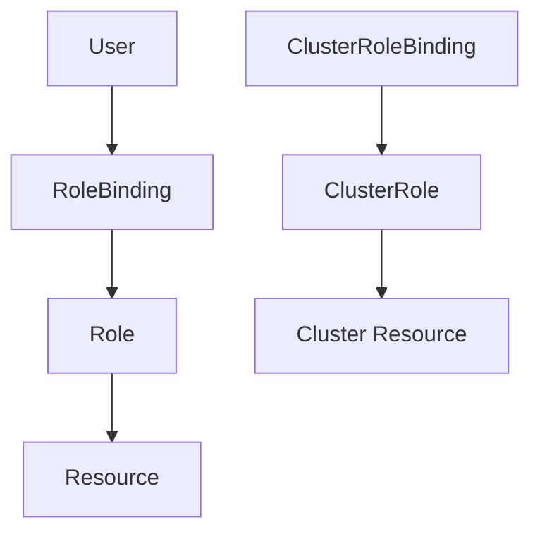

## Understanding Kubernetes Access Management

Kubernetes access management is a critical aspect of securing your Kubernetes cluster. It ensures that only authorized individuals or processes can perform specific actions within the cluster. This chapter will delve into the components and mechanisms Kubernetes provides to manage access control, focusing on Role-Based Access Control (RBAC) and integrating it with external identity providers like AWS.

### Components of Kubernetes Access Management

Kubernetes provides several mechanisms to manage access control:

1. **Users**: Individuals or processes that interact with the Kubernetes API server.
2. **Groups**: Collections of users.
3. **Roles**: Define sets of permissions (verbs) on resources.
4. **RoleBindings**: Bind roles to users or groups within a specific namespace.
5. **ClusterRoles**: Similar to roles but apply across the entire cluster.
6. **ClusterRoleBindings**: Bind cluster roles to users or groups across the entire cluster.

#### Users and Groups

Users and groups are fundamental entities in Kubernetes access management. Users can be individual developers, administrators, or even service accounts used by applications. Groups can be used to organize users based on their roles or departments.

**Example:**
```yaml
# Example of a user definition
apiVersion: v1
kind: User
metadata:
  name: developer
```

**Groups:**
```yaml
# Example of a group definition
apiVersion: rbac.authorization.k8s.io/v1
kind: Group
metadata:
  name: developers
users:
- developer
```

### Roles and RoleBindings

Roles define the set of permissions (verbs) that can be applied to specific resources. These roles can then be bound to users or groups using RoleBindings.

**Example Role:**
```yaml
# Example of a role definition
apiVersion: rbac.authorization.k8s.io/v1
kind: Role
metadata:
  namespace: development
  name: pod-reader
rules:
- apiGroups: [""]
  resources: ["pods"]
  verbs: ["get", "list", "watch"]
```

**RoleBinding:**
```yaml
# Example of a role binding
apiVersion: rbac.authorization.k8s.io/v1
kind: RoleBinding
metadata:
  name: read-pods
  namespace: development
subjects:
- kind: User
  name: developer
  apiGroup: rbac.authorization.k8s.io
roleRef:
  kind: Role
  name: pod-reader
  apiGroup: rbac.authorization.k8s.io
```

### ClusterRoles and ClusterRoleBindings

ClusterRoles are similar to roles but apply across the entire cluster rather than being limited to a specific namespace. ClusterRoleBindings bind these cluster roles to users or groups.

**Example ClusterRole:**
```yaml
# Example of a cluster role definition
apiVersion: rbac.authorization.k8s.io/v
kind: ClusterRole
metadata:
  name: pod-deleter
rules:
- apiGroups: [""]
  resources: ["pods"]
  verbs: ["delete"]
```

**ClusterRoleBinding:**
```yaml
# Example of a cluster role binding
apiVersion: rbac.authorization.k8s.io/v1
kind: ClusterRoleBinding
metadata:
  name: delete-pods
subjects:
- kind: User
  name: admin
  apiGroup: rbac.authorization.k8s.io
roleRef:
  kind: ClusterRole
  name: pod-deleter
  apiGroup: rbac.authorization.k8s.io
```

### Role-Based Access Control (RBAC)

RBAC is a method of controlling access to resources based on the roles of individual users within an organization. In Kubernetes, RBAC allows you to define fine-grained permissions for different users and groups.

#### Why RBAC Matters

RBAC is crucial because it helps prevent unauthorized access to sensitive resources. Without proper access control, malicious actors could potentially gain access to critical parts of your cluster, leading to data breaches or service disruptions.

#### How RBAC Works

RBAC works by defining roles and bindings. Roles specify what actions can be performed on which resources, and bindings associate these roles with specific users or groups. This separation of concerns makes it easier to manage permissions and ensure that only authorized individuals have access to specific resources.

### Integrating AWS Identity and Access Management (IAM) with Kubernetes

When deploying Kubernetes in an AWS environment, it is often beneficial to integrate AWS IAM with Kubernetes RBAC. This integration allows you to leverage AWS IAM users and roles to manage access to your Kubernetes cluster.

#### Mapping AWS IAM to Kubernetes

AWS IAM users and roles can be mapped to Kubernetes users and roles using tools like `aws-iam-authenticator`. This tool acts as an authentication webhook for the Kubernetes API server, allowing it to authenticate AWS IAM users and roles.

**Example Configuration:**

1. **Install aws-iam-authenticator:**
   ```sh
   curl -o aws-iam-authenticator https://amazon-eks.s3-us-west-2.amazonaws.com/1.18.9/2020-11-02/bin/linux/amd64/aws-iam-authenticator
   chmod +x ./aws-iam-authenticator
   mv ./aws-iam-authenticator /usr/local/bin/
   ```

2. **Configure the API Server:**
   Add the following to your API server configuration:
   ```yaml
   --enable-bootstrap-token-auth=true
   --authorization-mode=Node,RBAC
   --authentication-skip-lookup=true
   --authentication-token-webhook-config-file=/etc/kubernetes/aws-iam-authenticator.yaml
   ```

3. **Create the aws-iam-authenticator Config File:**
   ```yaml
   apiVersion: v1
   kind: Config
   clusters:
   - name: kubernetes
     cluster:
       server: https://<your-cluster-endpoint>
   contexts:
   - context:
       cluster: kubernetes
       user: aws
     name: aws
   current-context: aws
   users:
   - name: aws
     user:
       exec:
         apiVersion: client.authentication.k8s.io/v1alpha1
         command: aws-iam-authenticator
         args:
         - "token"
         - "-i"
         - "<cluster-name>"
   ```

### Recent Real-World Examples

#### CVE-2021-25741: Kubernetes RBAC Misconfiguration

CVE-2021-25741 highlighted a misconfiguration in Kubernetes RBAC that allowed unauthorized access to sensitive resources. This vulnerability was due to improper configuration of roles and role bindings, allowing users to perform actions they should not have been permitted to do.

**Example Vulnerable Configuration:**
```yaml
# Vulnerable RoleBinding
apiVersion: rbac.authorization.k8s.io/v1
kind: RoleBinding
metadata:
  name: admin-binding
  namespace: default
subjects:
- kind: User
  name: developer
  apiGroup: rbac.authorization.k8s.io
roleRef:
  kind: ClusterRole
  name: cluster-admin
  apiGroup: rbac.authorization.k8s.io
```

**Secure Configuration:**
```yaml
# Secure RoleBinding
apiVersion: rbac.authorization.k8s.io/v1
kind: RoleBinding
metadata:
  name: restricted-binding
  namespace: default
subjects:
- kind: User
  name: developer
  apiGroup: rbac.authorization.k8s.io
roleRef:
  kind: Role
  name: pod-reader
  apiGroup: rbac.authorization.k8s.io
```

### How to Prevent / Defend

#### Detection

To detect misconfigurations in Kubernetes RBAC, you can use tools like `kube-bench` or `kubescape`. These tools scan your cluster for known vulnerabilities and misconfigurations.

**Example Usage:**
```sh
kubectl apply -f https://github.com/aquasecurity/kube-bench/releases/download/v0.6.0/kube-bench.yaml
```

#### Prevention

1. **Least Privilege Principle**: Always follow the principle of least privilege. Grant users and roles the minimum permissions necessary to perform their tasks.
2. **Regular Audits**: Regularly audit your RBAC configurations to ensure they are correctly set up and not exposing your cluster to unnecessary risks.
3. **Automated Tools**: Use automated tools like `kube-bench` or `kubescape` to regularly scan your cluster for misconfigurations.

#### Secure Coding Practices

1. **Avoid Broad Permissions**: Avoid granting broad permissions like `cluster-admin` to regular users. Instead, use more granular roles.
2. **Use Namespaces**: Utilize namespaces to isolate resources and apply more granular access controls.

### Complete Example

#### Creating a User and Role

1. **Create a User:**
   ```sh
   kubectl config set-credentials developer --username=developer --password=password
   ```

2. **Create a Role:**
   ```yaml
   apiVersion: rbac.authorization.k8s.io/v1
   kind: Role
   metadata:
     namespace: development
     name: pod-reader
   rules:
   - apiGroups: [""]
     resources: ["pods"]
     verbs: ["get", "list", "watch"]
   ```

3. **Apply the Role:**
   ```sh
   kubectl apply -f pod-reader-role.yaml
   ```

4. **Create a RoleBinding:**
   ```yaml
   apiVersion: rbac.authorization.k8s.io/v1
   kind: RoleBinding
   metadata:
     name: read-pods
     namespace: development
   subjects:
   - kind: User
     name: developer
     apiGroup: rbac.authorization.k8s.io
   roleRef:
     kind: Role
     name: pod-reader
     apiGroup: rbac.authorization.k8s.io
   ```

5. **Apply the RoleBinding:**
   ```sh
   kubectl apply -f pod-reader-rolebinding.yaml
   ```

### Mermaid Diagrams

#### Kubernetes RBAC Architecture



### Hands-On Labs

For practical experience with Kubernetes access management, consider the following labs:

1. **PortSwigger Web Security Academy**: Offers hands-on labs to practice securing Kubernetes clusters.
2. **OWASP Juice Shop**: Provides a vulnerable web application that can be deployed on Kubernetes to practice securing access.
3. **Kubernetes Goat**: A deliberately insecure Kubernetes cluster designed for learning and practicing security techniques.

### Conclusion

Proper access management in Kubernetes is essential for maintaining the security and integrity of your cluster. By understanding and implementing RBAC effectively, you can ensure that only authorized users and processes have access to the resources they need. Integrating with external identity providers like AWS IAM further enhances your security posture. Regular audits and the use of automated tools help detect and prevent misconfigurations, ensuring your cluster remains secure.

---
<!-- nav -->
[[DevSecOps/DevSecOps Bootcamp/03-Identity & Access Management/02-Kubernetes Access Management/01-Chapter Introduction/00-Overview|Overview]] | [[DevSecOps/DevSecOps Bootcamp/03-Identity & Access Management/02-Kubernetes Access Management/01-Chapter Introduction/02-Practice Questions & Answers|Practice Questions & Answers]]
