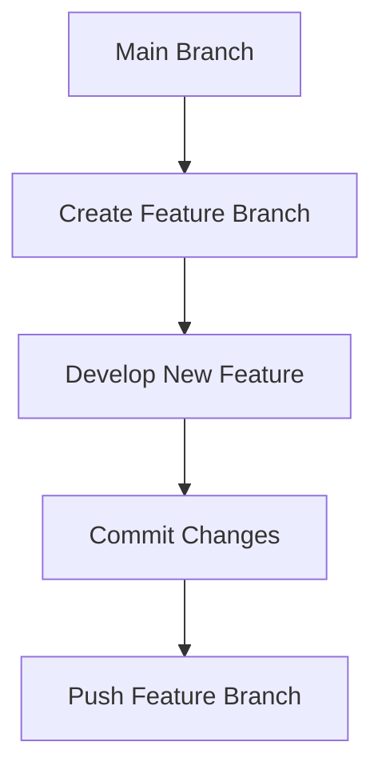
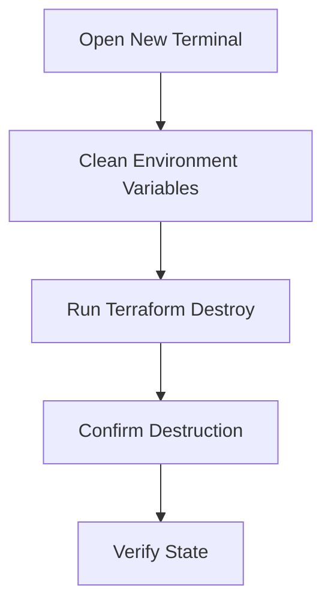

## Introduction to Kubernetes Access Management

Kubernetes access management is a critical aspect of securing your containerized applications. It involves controlling who can access your Kubernetes clusters and what actions they can perform within those clusters. This chapter delves into the details of managing access to Kubernetes clusters, including setting up feature branches, cleaning up resources, and ensuring that your environment remains secure.

### Background Theory

Before diving into the specifics, it's essential to understand the underlying concepts:

- **Feature Branches**: In Git-based workflows, a feature branch is a separate branch created to develop new features. This allows developers to work on new functionalities without affecting the main branch.
- **EKS Cluster**: Amazon Elastic Kubernetes Service (EKS) is a managed service that makes it easy to run Kubernetes on AWS without needing to stand up or maintain your own Kubernetes control plane.
- **Terraform**: Terraform is an infrastructure as code (IaC) tool that allows you to define and provision your infrastructure using declarative configuration files.

### Setting Up Feature Branches

In the context of Kubernetes development, feature branches are used to isolate new features or changes from the main branch. This ensures that the main branch remains stable and functional while new features are being developed.

#### Creating a Feature Branch

To create a feature branch, you would typically follow these steps:

1. **Checkout the Main Branch**:
    ```bash
    git checkout main
    ```

2. **Pull the Latest Changes**:
    ```bash
    git pull origin main
    ```

3. **Create a New Feature Branch**:
    ```bash
    git checkout -b feature/new-feature
    ```

4. **Make Your Changes**:
    Perform the necessary changes in your feature branch.

5. **Commit Your Changes**:
    ```bash
    git add .
    git commit -m "Add new feature"
    ```

6. **Push the Feature Branch**:
    ```bash
    git push origin feature/new-feature
    ```

#### Diagram: Feature Branch Workflow



### Cleaning Up Resources

Cleaning up resources is crucial to avoid unnecessary costs and ensure that your environment remains tidy. This includes destroying the EKS cluster and ensuring that the Terraform state is clean.

#### Destroying the EKS Cluster

To destroy the EKS cluster, you need to run `terraform destroy`. This command will remove all the resources defined in your Terraform configuration.

1. **Open a New Terminal Session**:
    Ensure that all AWS environment variables are cleaned up before proceeding.

2. **Run Terraform Destroy**:
    ```bash
    terraform destroy
    ```

3. **Confirm the Destruction**:
    You will be prompted to confirm the destruction. Type `yes` to proceed.

4. **Verify the State**:
    After the destruction, verify that the Terraform state is clean.

#### Diagram: Resource Cleanup Workflow



### Real-World Examples

Recent breaches and vulnerabilities highlight the importance of proper access management in Kubernetes environments.

#### Example: CVE-2021-25741

CVE-2021-25741 is a vulnerability in Kubernetes that allows an attacker to escalate privileges by manipulating the `PodSecurityPolicy` resource. This vulnerability underscores the need for strict access controls and regular audits.

#### Example: AWS EKS Security Incident

In 2021, AWS experienced a security incident where unauthorized access was gained to some customer data stored in EKS clusters. This incident highlights the importance of robust access management practices, including regular audits and monitoring.

### Complete Code Examples

Here are some complete code examples to illustrate the concepts discussed.

#### Example: Terraform Configuration for EKS Cluster

```hcl
provider "aws" {
  region = "us-west-2"
}

resource "aws_eks_cluster" "example" {
  name     = "example-cluster"
  role_arn = aws_iam_role.example.arn

  vpc_config {
    subnet_ids = [aws_subnet.example.id]
  }
}

resource "aws_iam_role" "example" {
  name = "example-role"

  assume_role_policy = jsonencode({
    Version = "2012-10-17"
    Statement = [
      {
        Action = "sts:AssumeRole"
        Effect = "Allow"
        Principal = {
          Service = "eks.amazonaws.com"
        }
      },
    ]
  })
}
```

#### Example: Full HTTP Request and Response

```http
POST /api/v1/namespaces/default/pods HTTP/1.1
Host: localhost:8080
Content-Type: application/json
Authorization: Bearer <token>

{
  "apiVersion": "v1",
  "kind": "Pod",
  "metadata": {
    "name": "example-pod"
  },
  "spec": {
    "containers": [
      {
        "name": "example-container",
        "image": "nginx:latest"
      }
    ]
  }
}

HTTP/1.1 201 Created
Date: Mon, 20 Mar 2023 12:00:00 GMT
Content-Type: application/json
Content-Length: 123

{
  "kind": "Pod",
  "apiVersion": "v1",
  "metadata": {
    "name": "example-pod",
    "namespace": "default",
    "selfLink": "/api/v1/namespaces/default/pods/example-pod",
    "uid": "1234567890abcdef1234567890abcdef",
    "resourceVersion": "123456789",
    "creationTimestamp": "2023-03-20T12:00:00Z"
  }
}
```

### Pitfalls and Common Mistakes

When managing access to Kubernetes clusters, there are several common pitfalls to avoid:

- **Insufficient Access Controls**: Failing to properly restrict access can lead to unauthorized actions.
- **Incomplete Cleanup**: Not thoroughly cleaning up resources can result in unnecessary costs and security risks.
- **Outdated Configuration**: Using outdated or insecure configurations can expose your cluster to vulnerabilities.

### How to Prevent / Defend

#### Detection

Regularly audit your Kubernetes cluster to detect any unauthorized access or suspicious activities. Tools like `kube-bench` and `Falco` can help with this.

#### Prevention

Implement strict access controls and regularly review permissions. Use tools like `kubectl auth can-i` to check permissions.

#### Secure Coding Fixes

Show both the vulnerable and secure versions of code side by side.

##### Vulnerable Code

```yaml
apiVersion: rbac.authorization.k8s.io/v1
kind: Role
metadata:
  namespace: default
  name: pod-reader
rules:
- apiGroups: [""]
  resources: ["pods"]
  verbs: ["get", "watch", "list"]
```

##### Secure Code

```yaml
apiVersion: rbac.authorization.k8s.io/v1
kind: Role
metadata:
  namespace: default
  name: pod-reader
rules:
- apiGroups: [""]
  resources: ["pods"]
  verbs: ["get", "watch", "list"]
- apiGroups: [""]
  resources: ["secrets"]
  verbs: ["get"]
```

#### Configuration Hardening

Ensure that your Kubernetes cluster is configured securely. Use tools like `kube-bench` to validate your configuration against CIS benchmarks.

### Practice Labs

For hands-on practice, consider the following labs:

- **Kubernetes Goat**: A Kubernetes security training platform that simulates various security scenarios.
- **OWASP WrongSecrets**: A series of challenges designed to test your knowledge of Kubernetes security.

These labs provide practical experience in managing access to Kubernetes clusters and identifying potential security issues.

### Conclusion

Proper management of access to Kubernetes clusters is crucial for maintaining the security and integrity of your containerized applications. By following best practices, using appropriate tools, and regularly auditing your environment, you can ensure that your Kubernetes clusters remain secure and efficient.

---
<!-- nav -->
[[DevSecOps/DevSecOps Bootcamp/03-Identity & Access Management/02-Kubernetes Access Management/07-Summary and Wrap Up/00-Overview|Overview]] | [[02-Kubernetes Access Management|Kubernetes Access Management]]
