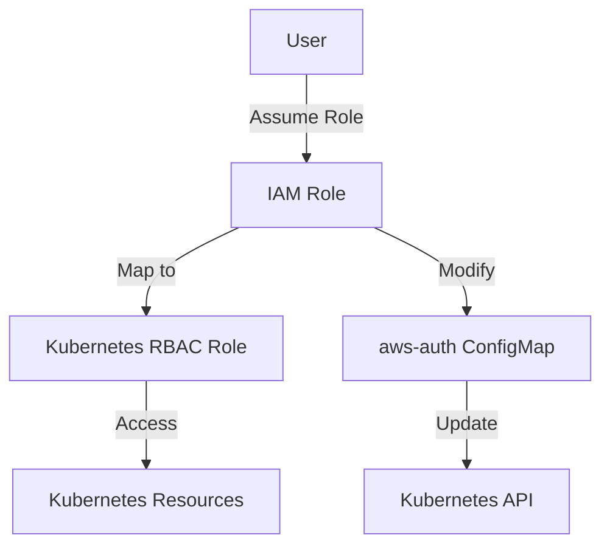

## Kubernetes Access Management: Configuring IAM Roles and Linking to K8s Roles in IaC

### Background Theory

Kubernetes (K8s) is an open-source platform designed to automate deploying, scaling, and operating application containers. One of the key aspects of managing a Kubernetes cluster is ensuring proper access control and security. In the context of cloud environments such as Amazon Web Services (AWS), integrating Kubernetes with IAM roles is crucial for securing access to both Kubernetes and AWS resources.

IAM (Identity and Access Management) roles in AWS provide a way to grant permissions to entities (users, roles, services) to perform specific actions within AWS. When using Kubernetes on AWS (EKS - Elastic Kubernetes Service), it is essential to manage these IAM roles effectively to ensure that Kubernetes components have the necessary permissions to interact with AWS resources.

### Config Map `aws-auth`

In an EKS cluster, a Kubernetes ConfigMap named `aws-auth` is automatically created when the cluster is initialized. This ConfigMap serves as a bridge between AWS IAM roles and Kubernetes RBAC (Role-Based Access Control) roles. By default, this ConfigMap contains mappings that allow worker nodes to join the cluster and perform necessary operations.

#### What is a ConfigMap?

A ConfigMap is a Kubernetes object that stores configuration data as key-value pairs. It allows you to decouple configuration data from your container images, making it easier to manage and update configurations without rebuilding your images.

#### Purpose of `aws-auth` ConfigMap

The `aws-auth` ConfigMap is specifically designed to map AWS IAM identities (users, roles, etc.) to Kubernetes RBAC roles. This mapping ensures that AWS IAM principals can assume the appropriate roles within the Kubernetes cluster.

### Managing `aws-auth` ConfigMap

To manage the `aws-auth` ConfigMap, you can set the `manage_aws_auth_config_map` attribute to `true`. This allows the EKS service to modify the ConfigMap, enabling you to add custom mappings and rules.

#### Enabling Modification

By setting `manage_aws_auth_config_map` to `true`, you enable the EKS service to make changes to the `aws-auth` ConfigMap. This is particularly useful when you need to add new mappings or update existing ones.

```yaml
apiVersion: eks.aws.amazon.com/v1alpha1
kind: Cluster
metadata:
  name: my-cluster
spec:
  manageAwsAuthConfigMap: true
```

### Adding Custom Mappings

Once the `manage_aws_auth_config_map` attribute is enabled, you can add custom mappings to the ConfigMap. These mappings define how AWS IAM roles are mapped to Kubernetes RBAC roles.

#### Example Mapping

Here is an example of adding a custom mapping to the `aws-auth` ConfigMap:

```yaml
data:
  mapRoles: |
    - rolearn: arn:aws:iam::123456789012:role/my-eks-role
      username: system:node:{{EC2PrivateDNSName}}
      groups:
        - system:bootstrappers
        - system:nodes
```

In this example:
- `rolearn`: Specifies the ARN of the AWS IAM role.
- `username`: Defines the username in Kubernetes.
- `groups`: Lists the Kubernetes RBAC groups to which the role belongs.

### Full Raw HTTP Request and Response

When modifying the `aws-auth` ConfigMap, you typically use the Kubernetes API. Here is an example of a full HTTP request and response:

#### HTTP Request

```http
PUT /api/v1/namespaces/kube-system/configmaps/aws-auth HTTP/1.1
Host: api.example.com
Authorization: Bearer <your-token>
Content-Type: application/json

{
  "apiVersion": "v1",
  "data": {
    "mapRoles": "- rolearn: arn:aws:iam::123456789012:role/my-eks-role\n  username: system:node:{{EC2PrivateDNSName}}\n  groups:\n    - system:bootstrappers\n    - system:nodes"
  },
  "kind": "ConfigMap",
  "metadata": {
    "name": "aws-auth",
    "namespace": "kube-system"
  }
}
```

#### HTTP Response

```http
HTTP/1.1 200 OK
Content-Type: application/json

{
  "apiVersion": "v1",
  "data": {
    "mapRoles": "- rolearn: arn:aws:iam::123456789012:role/my-eks-role\n  username: system:node:{{EC2PrivateDNSName}}\n  groups:\n    - system:bootstrappers\n    - system:nodes"
  },
  "kind": "ConfigMap",
  "metadata": {
     ...
  }
}
```

### Mermaid Diagrams

#### Architecture Diagram



### Recent Real-World Examples

#### CVE-2021-25741

CVE-2021-25741 is a critical vulnerability affecting AWS EKS clusters. This vulnerability arises due to misconfigurations in the `aws-auth` ConfigMap, leading to unauthorized access to Kubernetes resources. Ensuring proper management and configuration of the `aws-auth` ConfigMap is crucial to mitigate such risks.

### Common Pitfalls

#### Incorrect Role Mapping

One common pitfall is incorrectly mapping AWS IAM roles to Kubernetes RBAC roles. This can lead to either insufficient permissions or overly permissive access, compromising the security of the cluster.

#### Example of Incorrect Mapping

```yaml
data:
  mapRoles: |
    - rolearn: arn:aws:iam::123456789012:role/my-eks-role
      username: system:node:{{EC2PrivateDNSName}}
      groups:
        - system:bootstrappers
        - system:cluster-admins
```

In this incorrect example, the `system:cluster-admins` group grants excessive privileges, potentially leading to unauthorized access.

### How to Prevent / Defend

#### Detection

Regularly audit the `aws-auth` ConfigMap to ensure that all mappings are correct and up-to-date. Use tools like `kubectl` to inspect the ConfigMap:

```sh
kubectl get configmap aws-auth -n kube-system -o yaml
```

#### Prevention

1. **Secure Configuration**: Ensure that the `aws-auth` ConfigMap is configured securely, with minimal permissions granted to each role.
2. **Automated Audits**: Implement automated audits to regularly check the ConfigMap for any unauthorized changes.
3. **Least Privilege Principle**: Follow the principle of least privilege by granting only the necessary permissions to each role.

#### Secure Code Fix

**Vulnerable Version**

```yaml
data:
  mapRoles: |
    - rolearn: arn:aws:iam::123456789012:role/my-eks-role
      username: system:node:{{EC2PrivateDNSName}}
      groups:
        - system:bootstrappers
        - system:cluster-admins
```

**Fixed Version**

```yaml
data:
  mapRoles: |
    - rolearn: arn:aws:iam::123456789012:role/my-eks-role
      username: system:node:{{EC2PrivateDNSName}}
      groups:
        - system:bootstrappers
        - system:nodes
```

### Hands-On Labs

For practical experience with configuring IAM roles and linking them to Kubernetes roles, consider the following labs:

- **PortSwigger Web Security Academy**: Offers hands-on labs for various security topics, including Kubernetes security.
- **OWASP Juice Shop**: Provides a vulnerable web application for practicing security testing and exploitation techniques.
- **Kubernetes Goat**: A hands-on lab for learning Kubernetes security and best practices.

These labs will help you gain practical experience in managing Kubernetes access control and integrating with AWS IAM roles.

### Conclusion

Proper management of the `aws-auth` ConfigMap is crucial for securing access to Kubernetes resources in an AWS environment. By enabling the `manage_aws_auth_config_map` attribute and carefully configuring the mappings, you can ensure that AWS IAM roles are correctly mapped to Kubernetes RBAC roles, thereby enhancing the overall security of your EKS cluster. Regular auditing and following the principle of least privilege are essential for maintaining a secure environment.

---
<!-- nav -->
[[04-Kubernetes Access Management Configuring IAM Roles and Linking to K8s Roles in IaC Part 2|Kubernetes Access Management Configuring IAM Roles and Linking to K8s Roles in IaC Part 2]] | [[DevSecOps/DevSecOps Bootcamp/03-Identity & Access Management/02-Kubernetes Access Management/Configure IAM Roles and link to K8s Roles in IaC/00-Overview|Overview]] | [[06-Kubernetes Access Management Configuring IAM Roles and Linking to K8s Roles in Infrastructure as Code (IaC) Part 1|Kubernetes Access Management Configuring IAM Roles and Linking to K8s Roles in Infrastructure as Code (IaC) Part 1]]
