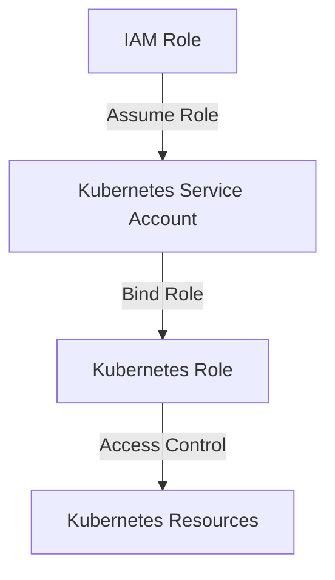

## Kubernetes Access Management: Configuring IAM Roles and Linking to K8s Roles in Infrastructure as Code (IaC)

### Background Theory

Kubernetes (K8s) is a powerful container orchestration system used to automate deployment, scaling, and management of containerized applications. To ensure security and proper access control, Kubernetes integrates with Identity and Access Management (IAM) systems such as AWS IAM. This integration allows you to manage who can access your Kubernetes clusters and what actions they can perform within those clusters.

### IAM Roles in AWS

In AWS, IAM roles are a way to grant permissions to entities (users, services, etc.) without having to manage credentials directly. An IAM role is essentially a set of permissions that can be assumed by an entity. These roles can be attached to AWS services, such as EC2 instances, Lambda functions, or Kubernetes clusters.

#### Example: IAM Role Definition

Here’s an example of an IAM role definition in JSON format:

```json
{
    "Version": "2012-10-17",
    "Statement": [
        {
            "Effect": "Allow",
            "Action": [
                "eks:DescribeCluster"
            ],
            "Resource": "*"
        }
    ]
}
```

This role allows the entity to describe an EKS cluster. The `eks:DescribeCluster` action enables the entity to retrieve information about the cluster, such as node groups, versions, and configurations.

### Linking IAM Roles to Kubernetes Roles

To integrate IAM roles with Kubernetes roles, you need to configure the Kubernetes cluster to recognize these IAM roles. This is typically done through the use of Kubernetes RBAC (Role-Based Access Control) and IAM roles for service accounts.

#### Step-by-Step Configuration

1. **Create IAM Role**: Define the IAM role with specific permissions.
2. **Attach IAM Role to Service Account**: Map the IAM role to a Kubernetes service account.
3. **Configure Kubernetes RBAC**: Define Kubernetes roles and bindings that reference the service accounts.

#### Example: Creating an IAM Role

Let's create an IAM role that allows reading the EKS cluster configuration.

```json
{
    "Version": "2012-10-17",
    "Statement": [
        {
            "Effect": "Allow",
            "Action": [
                "eks:DescribeCluster"
            ],
            "Resource": "*"
        }
    ]
}
```

This role allows the entity to describe an EKS cluster. The `eks:DescribeCluster` action enables the entity to retrieve information about the cluster, such as node groups, versions, and configurations.

#### Example: Attaching IAM Role to Service Account

Next, attach this IAM role to a Kubernetes service account. This is typically done using annotations in the service account definition.

```yaml
apiVersion: v1
kind: ServiceAccount
metadata:
  name: my-service-account
  namespace: default
  annotations:
    eks.amazonaws.com/role-arn: arn:aws:iam::123456789012:role/my-iam-role
```

Here, `my-service-account` is the Kubernetes service account, and `my-iam-role` is the IAM role created earlier.

#### Example: Configuring Kubernetes RBAC

Finally, configure Kubernetes RBAC to define roles and bindings that reference the service accounts.

```yaml
apiVersion: rbac.authorization.k8s.io/v1
kind: Role
metadata:
  namespace: default
  name: my-role
rules:
- apiGroups: [""]
  resources: ["pods"]
  verbs: ["get", "watch", "list"]

---
apiVersion: rbac.authorization.k8s.io/v1
kind: RoleBinding
metadata:
  name: my-role-binding
  namespace: default
subjects:
- kind: ServiceAccount
  name: my-service-account
  namespace: default
roleRef:
  kind: Role
  name: my-role
  apiGroup: rbac.authorization.k8s.io
```

This defines a role (`my-role`) that allows getting, watching, and listing pods, and binds this role to the service account (`my-service-account`).

### Real-World Examples

#### Recent Breaches and CVEs

One notable breach involving Kubernetes and IAM misconfigurations is the Capital One data breach in 2019. Although not directly related to Kubernetes, it highlights the importance of proper IAM configuration and access control.

Another example is the CVE-2020-14386, which affected Kubernetes versions prior to 1.18.10, 1.19.8, and 1.20.2. This vulnerability allowed attackers to bypass authentication and gain unauthorized access to the Kubernetes API server.

### Pitfalls and Common Mistakes

1. **Overly Permissive Roles**: Avoid creating roles with overly broad permissions. Always follow the principle of least privilege.
2. **Misconfigured Annotations**: Ensure that the annotations in the service account definitions correctly reference the IAM roles.
3. **Outdated Documentation**: Keep up-to-date with the latest Kubernetes and AWS documentation to avoid deprecated practices.

### How to Prevent / Defend

#### Detection

Use tools like AWS IAM Access Analyzer to detect and analyze permissions across your AWS environment. Additionally, Kubernetes audit logs can help identify unauthorized access attempts.

#### Prevention

1. **Least Privilege Principle**: Ensure that IAM roles and Kubernetes roles are configured with the minimum necessary permissions.
2. **Regular Audits**: Perform regular audits of IAM roles and Kubernetes RBAC configurations to identify and mitigate potential risks.
3. **Secure Coding Practices**: Implement secure coding practices, such as validating input and output, and using secure libraries and frameworks.

#### Secure-Coding Fixes

**Vulnerable Code**

```yaml
apiVersion: rbac.authorization.k8s.io/v1
kind: Role
metadata:
  namespace: default
  name: overly-permissive-role
rules:
- apiGroups: [""]
  resources: ["*"]
  verbs: ["*"]
```

**Fixed Code**

```yaml
apiVersion: rbac.authorization.k8s.io/v1
kind: Role
metadata:
  namespace: default
  name: least-privilege-role
rules:
- apiGroups: [""]
  resources: ["pods"]
  verbs: ["get", "watch", "list"]
```

### Complete Example

#### Full HTTP Request and Response

When creating an IAM role via the AWS API, the request and response might look like this:

**Request**

```http
POST / HTTP/1.1
Host: iam.amazonaws.com
Content-Type: application/x-amz-json-1.1
X-Amz-Target: CreateRole
Authorization: Bearer <access_token>

{
    "RoleName": "my-iam-role",
    "AssumeRolePolicyDocument": "{\"Version\":\"2012-10-17\",\"Statement\":[{\"Effect\":\"Allow\",\"Principal\":{\"Service\":[\"eks.amazonaws.com\"]},\"Action\":[\"sts:AssumeRole\"]}]}"
}
```

**Response**

```http
HTTP/1.1 200 OK
Content-Type: application/x-amz-json-1.1

{
    "Role": {
        "Path": "/",
        "RoleName": "my-iam-role",
        "RoleId": "AROA1234567890EXAMPLE",
        "Arn": "arn:aws:iam::123456789012:role/my-iam-role",
        "CreateDate": "2023-01-01T00:00:00Z",
        "AssumeRolePolicyDocument": "{\"Version\":\"2012-10-17\",\"Statement\":[{\"Effect\":\"Allow\",\"Principal\":{\"Service\":[\"eks.amazonaws.com\"]},\"Action\":[\"sts:AssumeRole\"]}]}"
    }
}
```

### Mermaid Diagrams

#### IAM Role and Kubernetes Role Integration



### Hands-On Labs

For hands-on practice, consider the following labs:

- **PortSwigger Web Security Academy**: Offers a range of labs focused on web application security, including some that touch on Kubernetes and IAM integration.
- **OWASP Juice Shop**: A deliberately insecure web application for security training. While primarily focused on web app security, it can be adapted to include Kubernetes and IAM scenarios.
- **Kubernetes Goat**: A security-focused Kubernetes lab environment designed to teach security best practices and common vulnerabilities.

These labs provide practical experience in configuring IAM roles and integrating them with Kubernetes roles, helping to solidify your understanding of the concepts discussed.

### Conclusion

Properly configuring IAM roles and linking them to Kubernetes roles is crucial for maintaining the security and integrity of your Kubernetes clusters. By following the principles of least privilege, performing regular audits, and using secure coding practices, you can significantly reduce the risk of unauthorized access and potential breaches.

---
<!-- nav -->
[[05-Kubernetes Access Management Configuring IAM Roles and Linking to K8s Roles in IaC|Kubernetes Access Management Configuring IAM Roles and Linking to K8s Roles in IaC]] | [[DevSecOps/DevSecOps Bootcamp/03-Identity & Access Management/02-Kubernetes Access Management/Configure IAM Roles and link to K8s Roles in IaC/00-Overview|Overview]] | [[07-Kubernetes Access Management Configuring IAM Roles and Linking to K8s Roles in Infrastructure as Code (IaC)|Kubernetes Access Management Configuring IAM Roles and Linking to K8s Roles in Infrastructure as Code (IaC)]]
