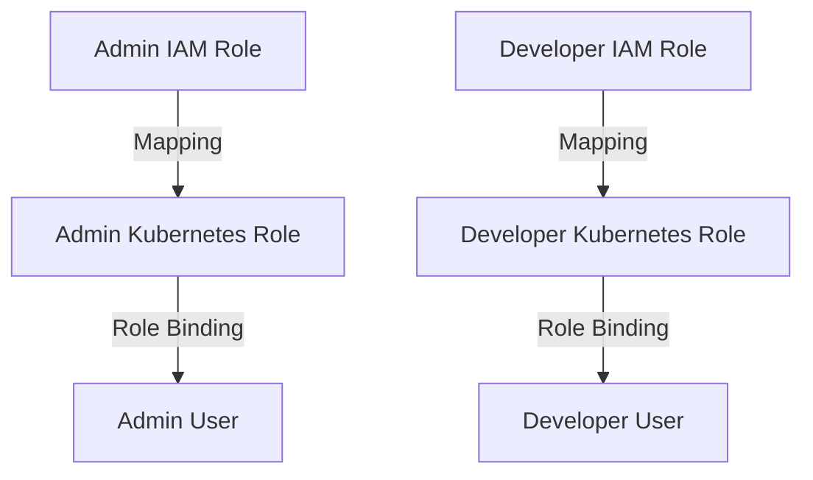

## Kubernetes Access Management: Configuring IAM Roles and Linking to Kubernetes Roles in Infrastructure as Code

### Background Theory

Kubernetes is a powerful container orchestration platform that allows you to manage and scale applications efficiently. However, with great power comes great responsibility, especially when it comes to managing access and permissions. In a production environment, it is crucial to ensure that access to Kubernetes resources is properly controlled and audited. This is where Identity and Access Management (IAM) roles come into play, along with Kubernetes' Role-Based Access Control (RBAC) mechanisms.

### Understanding IAM Roles

IAM roles are used to grant permissions to users, services, or applications in cloud environments such as AWS, Azure, or GCP. These roles define what actions a principal (user or service) can perform and on which resources. By integrating IAM roles with Kubernetes, you can achieve a more granular and secure access management system.

#### Example: AWS IAM Role

Consider an AWS environment where you have an IAM role named `AdminRole`. This role might have permissions to manage EC2 instances, S3 buckets, and other AWS services. To integrate this with Kubernetes, you would map this IAM role to a specific Kubernetes user or group.

```yaml
# Example IAM Role Policy in AWS
{
    "Version": "2012-10-17",
    "Statement": [
        {
            "Effect": "Allow",
            "Action": [
                "ec2:*",
                "s3:*"
            ],
            "Resource": "*"
        }
    ]
}
```

### Kubernetes Role-Based Access Control (RBAC)

Kubernetes uses RBAC to manage access to resources within the cluster. RBAC allows you to define roles and role bindings, which specify what actions a user or service account can perform on specific resources.

#### Roles and Role Bindings

- **Roles**: Define a set of permissions.
- **Role Bindings**: Associate roles with users, groups, or service accounts.

#### Example: Kubernetes Role and Role Binding

Let's define a role named `admin` and a role binding to associate this role with a user.

```yaml
# admin-role.yaml
apiVersion: rbac.authorization.k8s.io/v1
kind: Role
metadata:
  namespace: default
  name: admin
rules:
- apiGroups: ["*"]
  resources: ["*"]
  verbs: ["*"]

# admin-role-binding.yaml
apiVersion: rbac.authorization.k8s.io/v1
kind: RoleBinding
metadata:
  name: admin-role-binding
  namespace: default
subjects:
- kind: User
  name: admin-user
  apiGroup: rbac.authorization.k8s.io
roleRef:
  kind: Role
  name: admin
  apiGroup: rbac.authorization.k8s.io
```

### Mapping IAM Roles to Kubernetes Users

To map IAM roles to Kubernetes users, you need to configure the Kubernetes API server to trust the IAM roles. This is typically done by setting up a webhook authentication module or by configuring the API server to use IAM roles directly.

#### Example: Configuring Kubernetes API Server

Here’s an example of how you might configure the Kubernetes API server to use IAM roles:

```yaml
# kubernetes-api-server-config.yaml
apiVersion: kubeadm.k8s.io/v1beta2
kind: ClusterConfiguration
apiServer:
  extraArgs:
    oidc-issuer-url: https://your-oidc-provider.com
    oidc-client-id: your-client-id
    oidc-groups-claim: groups
```

### Creating IAM Roles and Mapping Them to Kubernetes Roles

Now, let's create IAM roles and map them to Kubernetes roles using Infrastructure as Code (IaC).

#### Step 1: Create IAM Roles

First, create IAM roles for `admin` and `developer`.

```yaml
# iam-roles.yaml
Resources:
  AdminRole:
    Type: 'AWS::IAM::Role'
    Properties:
      RoleName: 'AdminRole'
      AssumeRolePolicyDocument:
        Version: '2012-10-17'
        Statement:
          - Effect: Allow
            Principal:
              Service: [ec2.amazonaws.com]
            Action: ['sts:AssumeRole']
      Policies:
        - PolicyName: 'AdminPolicy'
          PolicyDocument:
            Version: '2012-10-17'
            Statement:
              - Effect: Allow
                Action: ['*']
                Resource: ['*']

  DeveloperRole:
    Type: 'AWS::IAM::Role'
    Properties:
      RoleName: 'DeveloperRole'
      AssumeRolePolicyDocument:
        Version: '2012-17-10'
        Statement:
          - Effect: Allow
            Principal:
              Service: [ec2.amazonaws.com]
            Action: ['sts:AssumeRole']
      Policies:
        - PolicyName: 'DeveloperPolicy'
          PolicyDocument:
            Version: '2012-10-17'
            Statement:
              - Effect: Allow
                Action: ['ec2:DescribeInstances', 's3:ListBucket']
                Resource: ['*']
```

#### Step 2: Map IAM Roles to Kubernetes Users

Next, map these IAM roles to Kubernetes users.

```yaml
# kubernetes-users.yaml
apiVersion: v1
kind: ServiceAccount
metadata:
  name: admin-sa
  namespace: default

---
apiVersion: v1
kind: ServiceAccount
metadata:
  name: developer-sa
  namespace: default
```

#### Step 3: Define Kubernetes Roles and Role Bindings

Define the roles and role bindings for the Kubernetes users.

```yaml
# kubernetes-roles.yaml
apiVersion: rbac.authorization.k8s.io/v1
kind: Role
metadata:
  namespace: default
  name: admin-role
rules:
- apiGroups: ["*"]
  resources: ["*"]
  verbs: ["*"]

---
apiVersion: rbac.authorization.k8s.io/v1
kind: Role
metadata:
  namespace: default
  name: developer-role
rules:
- apiGroups: ["extensions"]
  resources: ["deployments"]
  verbs: ["get", "list", "watch", "create", "update", "patch", "delete"]
- apiGroups: ["apps"]
  resources: ["deployments"]
  verbs: ["get", "list", "watch", "create", "update", "patch", "delete"]

---
apiVersion: rbac.authorization.k8s.io/v1
kind: RoleBinding
metadata:
  name: admin-role-binding
  namespace: default
subjects:
- kind: ServiceAccount
  name: admin-sa
  apiGroup: ""
roleRef:
  kind: Role
  name: admin-role
  apiGroup: ""

---
apiVersion: rbac.authorization.k8s.io/v1
kind: RoleBinding
metadata:
  name: developer-role-binding
  namespace: default
subjects:
- kind: ServiceAccount
  name: developer-sa
  apiGroup: ""
roleRef:
  kind: Role
  name: developer-role
  apiGroup: ""
```

### Mermaid Diagrams

#### IAM Role Mapping to Kubernetes



### Common Pitfalls and How to Avoid Them

#### Overly Permissive Roles

One common pitfall is creating overly permissive roles that grant unnecessary permissions. This can lead to security vulnerabilities if a malicious actor gains access to these roles.

**How to Prevent:**

- Use the principle of least privilege. Grant only the minimum permissions required for a user or service to perform their tasks.
- Regularly review and audit roles and permissions to ensure they remain appropriate.

#### Example: Correcting Overly Permissive Roles

```yaml
# Incorrect: Overly permissive role
apiVersion: rbac.authorization.k8s.io/v1
kind: Role
metadata:
  namespace: default
  name: overly-permissive-role
rules:
- apiGroups: ["*"]
  resources: ["*"]
  verbs: ["*"]

# Corrected: Least privilege role
apiVersion: rbac.authorization.k8s.io/v1
kind: Role
metadata:
  namespace: default
  name: least-privilege-role
rules:
- apiGroups: ["extensions"]
  resources: ["deployments"]
  verbs: ["get", "list", "watch", "create", "update", "patch", "delete"]
- apiGroups: ["apps"]
  resources: ["deployments"]
  verbs: ["get", "list", "watch", "create", "update", "patch", "delete"]
```

### Real-World Examples and CVEs

#### CVE-2021-25741: Kubernetes RBAC Misconfiguration

In 2021, a misconfiguration in Kubernetes RBAC led to unauthorized access to sensitive resources. This CVE highlights the importance of proper role definition and binding.

**Example: Vulnerable Configuration**

```yaml
# Vulnerable configuration
apiVersion: rbac.authorization.k8s.io/v1
kind: Role
metadata:
  namespace: default
  name: vulnerable-role
rules:
- apiGroups: ["*"]
  resources: ["*"]
  verbs: ["*"]
```

**Secure Configuration**

```yaml
# Secure configuration
apiVersion: rbac.authorization.k8s.io/v1
kind: Role
metadata:
  namespace: default
  name: secure-role
rules:
- apiGroups: ["extensions"]
  resources: ["deployments"]
  verbs: ["get", "list", "watch", "create", "update", "patch", "delete"]
- apiGroups: ["apps"]
  resources: ["deployments"]
  verbs: ["get", "list", "watch", "create", "update", "patch", "delete"]
```

### Detection and Prevention

#### Detection

Regularly audit your Kubernetes cluster to identify any misconfigured roles or permissions. Tools like `kubectl auth can-i` can help verify permissions.

```sh
kubectl auth can-i get pods --namespace=default
```

#### Prevention

- Use automated tools to enforce least privilege policies.
- Implement regular security audits and reviews.
- Educate developers and administrators about the importance of proper role management.

### Hands-On Labs

For practical experience with Kubernetes access management, consider the following labs:

- **Kubernetes Goat**: A hands-on lab for learning Kubernetes security.
- **OWASP WrongSecrets**: A project for learning about secrets management in Kubernetes.
- **kube-hunter**: A tool for finding security issues in Kubernetes clusters.

These labs provide real-world scenarios and challenges to help you master Kubernetes access management.

### Conclusion

Properly configuring IAM roles and linking them to Kubernetes roles is essential for securing your Kubernetes cluster. By following the principles of least privilege and regularly auditing your configurations, you can significantly reduce the risk of unauthorized access and potential security breaches.

---
<!-- nav -->
[[08-Kubernetes Access Management Configuring IAM Roles and Linking to Kubernetes Roles in Infrastructure as Code (IaC)|Kubernetes Access Management Configuring IAM Roles and Linking to Kubernetes Roles in Infrastructure as Code (IaC)]] | [[DevSecOps/DevSecOps Bootcamp/03-Identity & Access Management/02-Kubernetes Access Management/Configure IAM Roles and link to K8s Roles in IaC/00-Overview|Overview]] | [[10-Kubernetes Access Management Configuring IAM Roles and Linking to Kubernetes Roles in Infrastructure as Code|Kubernetes Access Management Configuring IAM Roles and Linking to Kubernetes Roles in Infrastructure as Code]]
