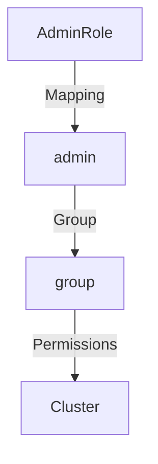

## Kubernetes Access Management: Configuring IAM Roles and Linking to Kubernetes Roles in Infrastructure as Code

### Background Theory

Kubernetes is an open-source system for automating deployment, scaling, and management of containerized applications. One of the critical aspects of Kubernetes is its access management, which ensures that only authorized entities can interact with the cluster. This includes both external entities (like AWS IAM roles) and internal entities (like Kubernetes users and groups).

#### AWS IAM Roles

AWS Identity and Access Management (IAM) is a web service that helps you securely control access to AWS resources. An IAM role is an entity that defines a set of permissions. You can assume an IAM role to temporarily get permissions to perform actions in AWS.

The Amazon Resource Name (ARN) is a unique identifier for an AWS resource. For IAM roles, the ARN format is:

```
arn:aws:iam::<account-id>:role/<role-name>
```

For example, an ARN might look like this:

```plaintext
arn:aws:iam::123456789012:role/AdminRole
```

#### Kubernetes Users and Groups

In Kubernetes, users and groups are used to manage access to the cluster. Unlike AWS IAM, Kubernetes does not have a built-in user management system. Instead, users and groups are typically managed externally (e.g., through LDAP, Active Directory, or custom authentication mechanisms) and then mapped into Kubernetes.

A Kubernetes user is an entity that can authenticate to the API server. A Kubernetes group is a collection of users. Permissions can be assigned to groups, making it easier to manage access at a higher level.

### Configuring IAM Roles and Linking to Kubernetes Roles in Infrastructure as Code

To integrate AWS IAM roles with Kubernetes, you can use the `aws-iam-authenticator` tool. This tool allows you to map AWS IAM roles to Kubernetes users and groups.

#### Step-by-Step Configuration

1. **Create an IAM Role in AWS**

   First, create an IAM role in AWS. For example, let's create an `AdminRole`.

   ```bash
   aws iam create-role --role-name AdminRole --assume-role-policy-document file://trust-policy.json
   ```

   The `trust-policy.json` file should contain the trust relationship policy document. Here’s an example:

   ```json
   {
     "Version": "2012-10-17",
     "Statement": [
       {
         "Effect": "Allow",
         "Principal": {
           "Service": "ec2.amazonaws.com"
         },
         "Action": "sts:AssumeRole"
       }
     ]
   }
   ```

2. **Attach Policies to the IAM Role**

   Attach policies to the IAM role to grant necessary permissions. For example, attach the `AdministratorAccess` policy:

   ```bash
   aws iam attach-role-policy --role-name AdminRole --policy-arn arn:aws:iam::aws:policy/AdministratorAccess
   ```

3. **Map IAM Role to Kubernetes User**

   In Kubernetes, you can map the IAM role to a Kubernetes user using the `aws-iam-authenticator`. This requires configuring the `aws-iam-authenticator` in your Kubernetes cluster.

   ```yaml
   apiVersion: v1
   kind: ConfigMap
   metadata:
     name: aws-auth
     namespace: kube-system
   data:
     mapRoles: |
       - rolearn: arn:aws:iam::123456789012:role/AdminRole
         username: admin
         groups:
           - system:masters
   ```

   This configuration maps the `AdminRole` IAM role to the `admin` Kubernetes user and assigns the `admin` user to the `system:masters` group.

4. **Apply the Configuration**

   Apply the configuration to your Kubernetes cluster:

   ```bash
   kubectl apply -f aws-auth-configmap.yaml
   ```

### Detailed Example

Let's walk through a detailed example of configuring IAM roles and linking them to Kubernetes roles in Infrastructure as Code (IaC).

#### Create IAM Role

First, create an IAM role named `AdminRole`:

```bash
aws iam create-role --role-name AdminRole --assume-role-policy-document file://trust-policy.json
```

Here is the `trust-policy.json` file:

```json
{
  "Version": "2012-10-17",
  "Statement": [
    {
      "Effect": "Allow",
      "Principal": {
        "Service": "ec2.amazonaws.com"
      },
      "Action": "sts:AssumeRole"
    }
  ]
}
```

Next, attach the `AdministratorAccess` policy to the `AdminRole`:

```bash
aws iam attach-role-policy --role-name AdminRole --policy-arn arn:aws:iam::aws:policy/AdministratorAccess
```

#### Map IAM Role to Kubernetes User

Now, map the `AdminRole` to a Kubernetes user using the `aws-iam-authenticator`. Create a `ConfigMap` in Kubernetes to configure the mapping:

```yaml
apiVersion: v1
kind: ConfigMap
metadata:
  name: aws-auth
  namespace: kube-system
data:
  mapRoles: |
    - rolearn: arn:aws:iam::123456789012:role/AdminRole
      username: admin
      groups:
        - system:masters
```

Apply the configuration to your Kubernetes cluster:

```bash
kubectl apply -f aws-auth-configmap.yaml
```

### Mermaid Diagrams

#### IAM Role Mapping Diagram



### Pitfalls and Common Mistakes

1. **Incorrect ARN Format**: Ensure the ARN format is correct. Incorrect ARNs can lead to authentication failures.
2. **Insufficient Permissions**: Ensure the IAM role has sufficient permissions to perform the required actions in the cluster.
3. **Incorrect Group Assignment**: Assigning users to incorrect groups can lead to unauthorized access or insufficient permissions.

### How to Prevent / Defend

#### Detection

Monitor the Kubernetes audit logs to detect unauthorized access attempts. Use tools like `kube-bench` to validate the security posture of your Kubernetes cluster.

#### Prevention

1. **Least Privilege Principle**: Follow the principle of least privilege by assigning minimal necessary permissions to IAM roles and Kubernetes users.
2. **Regular Audits**: Regularly audit IAM roles and Kubernetes users to ensure they have the correct permissions.
3. **Secure Configuration**: Securely configure the `aws-iam-authenticator` and ensure it is up-to-date with the latest security patches.

#### Secure Coding Fixes

**Vulnerable Code**

```yaml
apiVersion: v1
kind: ConfigMap
metadata:
  name: aws-auth
  namespace: kube-system
data:
  mapRoles: |
    - rolearn: arn:aws:iam::123456789012:role/AdminRole
      username: admin
      groups:
        - system:masters
```

**Fixed Code**

```yaml
apiVersion: v1
kind: ConfigMap
metadata:
  name: aws-auth
  namespace: kube-system
data:
  mapRoles: |
    - rolearn: arn:aws:iam::123456789012:role/LimitedAccessRole
      username: limited-user
      groups:
        - system:users
```

### Real-World Examples

#### Recent CVEs and Breaches

One notable breach involving Kubernetes access management was the **CVE-2020-14386**. This vulnerability allowed attackers to bypass authentication and gain unauthorized access to the Kubernetes API server. This highlights the importance of securing IAM roles and Kubernetes users.

### Hands-On Labs

For hands-on practice, consider the following labs:

- **PortSwigger Web Security Academy**: Offers a comprehensive course on Kubernetes security, including access management.
- **OWASP Juice Shop**: Provides a vulnerable application environment to practice securing Kubernetes clusters.
- **Kubernetes Goat**: A red team exercise platform specifically designed for Kubernetes security.

By following these steps and best practices, you can effectively manage access to your Kubernetes cluster using AWS IAM roles and Infrastructure as Code.

---
<!-- nav -->
[[09-Kubernetes Access Management Configuring IAM Roles and Linking to Kubernetes Roles in Infrastructure as Code Part 1|Kubernetes Access Management Configuring IAM Roles and Linking to Kubernetes Roles in Infrastructure as Code Part 1]] | [[DevSecOps/DevSecOps Bootcamp/03-Identity & Access Management/02-Kubernetes Access Management/Configure IAM Roles and link to K8s Roles in IaC/00-Overview|Overview]] | [[11-Kubernetes Access Management|Kubernetes Access Management]]
