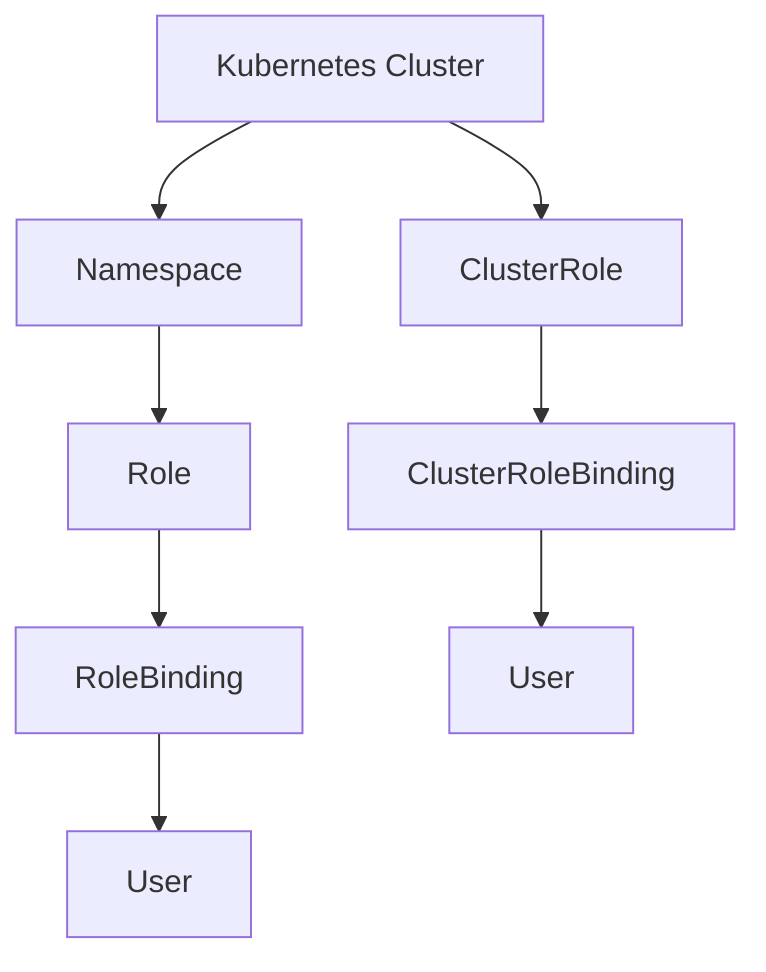
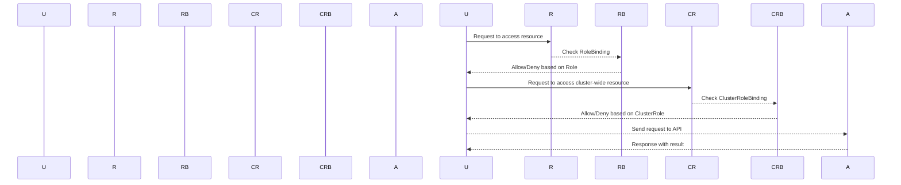

## Kubernetes Access Management

### Background Theory

Kubernetes is an open-source system for automating deployment, scaling, and management of containerized applications. One of the key aspects of managing a Kubernetes cluster is ensuring proper access control to prevent unauthorized access and potential security breaches. Access management in Kubernetes is achieved through roles and role bindings, which define permissions and associate them with users or groups.

#### Roles and ClusterRoles

- **Role**: A Role is a resource that defines a set of permissions within a specific namespace. It can be used to grant access to resources within that namespace only.
- **ClusterRole**: A ClusterRole is similar to a Role but it defines permissions across the entire cluster, not limited to a single namespace.

Both Roles and ClusterRoles are defined using YAML files and can be managed using Infrastructure as Code (IaC) tools like Terraform.

### Configuring Roles and ClusterRoles Using Terraform

Terraform is a popular IaC tool that allows you to define and provision infrastructure resources using declarative configuration files. In the context of Kubernetes, Terraform can be used to define and manage Roles and ClusterRoles.

#### Example Configuration

Let's walk through an example of configuring a Role and a ClusterRole using Terraform.

```hcl
provider "kubernetes" {
  config_path = "~/.kube/config"
}

resource "kubernetes_role" "developer_role" {
  metadata {
    name      = "developer-role"
    namespace = "online-boutique"
  }

  rule {
    api_groups   = ["", "apps"]
    resources    = ["pods", "services", "deployments"]
    verbs        = ["get", "list", "watch", "create", "update", "patch", "delete"]
  }
}

resource "kubernetes_cluster_role" "admin_role" {
  metadata {
    name = "admin-role"
  }

  rule {
    api_groups   = ["*"]
    resources    = ["*"]
    verbs        = ["*"]
  }
}
```

In this example:

- `kubernetes_role` defines a Role named `developer-role` in the `online-boutique` namespace.
- `kubernetes_cluster_role` defines a ClusterRole named `admin-role` with full access to all resources in the cluster.

### Applying the Configuration

To apply the configuration, you would typically run the following commands:

```sh
terraform init
terraform plan
terraform apply
```

The `terraform init` command initializes the Terraform working directory, downloading necessary plugins and modules. The `terraform plan` command generates an execution plan, showing what changes will be made. Finally, the `terraform apply` command applies the changes to the actual infrastructure.

### Waiting for the Cluster to Be Ready

After applying the configuration, you might need to wait for the cluster to be ready. This can take several minutes depending on the size and complexity of the cluster.

```sh
# Wait for the cluster to be ready
sleep 15m
```

### Confirming the Configuration

Once the cluster is ready, you can confirm that the roles and role bindings are correctly applied. You can use `kubectl` to check the roles and bindings:

```sh
kubectl get roles -n online-boutique
kubectl get clusterroles
```

### Real-World Examples

Recent breaches and vulnerabilities have highlighted the importance of proper access management in Kubernetes clusters. For example, the Kubernetes API server was found to be vulnerable to a privilege escalation attack due to improper RBAC (Role-Based Access Control) configurations (CVE-2020-8558).

#### Example Vulnerability

Consider a scenario where a developer role is configured with overly broad permissions, allowing access to sensitive resources. This could be exploited by an attacker to gain unauthorized access to the cluster.

```yaml
apiVersion: rbac.authorization.k8s.io/v1
kind: Role
metadata:
  name: developer-role
  namespace: online-boutique
rules:
- apiGroups: [""]
  resources: ["secrets"]
  verbs: ["get", "list", "watch"]
```

In this example, the `developer-role` has read access to secrets in the `online-boutique` namespace. If this role is assigned to a developer who should not have access to secrets, it could lead to a security breach.

### How to Prevent / Defend

#### Secure Coding Practices

To prevent such vulnerabilities, follow these secure coding practices:

1. **Least Privilege Principle**: Grant roles the minimum set of permissions required to perform their tasks.
2. **Regular Audits**: Regularly audit role definitions and bindings to ensure they align with security policies.
3. **Use Namespaces**: Utilize namespaces to isolate resources and limit the scope of roles.

#### Corrected Secure Version

Here is the corrected version of the role definition, adhering to the least privilege principle:

```yaml
apiVersion: rbac.authorization.k8s.io/v1
kind: Role
metadata:
  name: developer-role
  namespace: online-boutique
rules:
- apiGroups: [""]
  resources: ["pods", "services"]
  verbs: ["get", "list", "watch"]
```

In this corrected version, the `developer-role` only has read access to pods and services, not secrets.

### Detection and Prevention

#### Detection

To detect misconfigurations, you can use tools like `kube-bench`, which checks your Kubernetes cluster against the CIS Kubernetes Benchmark.

```sh
kube-bench run --version=1.21 --check=4.2.1
```

This command runs a specific check to ensure that roles are properly configured.

#### Prevention

To prevent misconfigurations, implement the following:

1. **Automated Scanning**: Use automated scanning tools like `kube-hunter` to identify and remediate security issues.
2. **Policy Enforcement**: Enforce strict RBAC policies using tools like `OPA` (Open Policy Agent) to ensure compliance with security policies.

### Complete Example

Here is a complete example of a Terraform configuration for setting up a Kubernetes cluster with proper access management:

```hcl
provider "kubernetes" {
  config_path = "~/.kube/config"
}

resource "kubernetes_namespace" "online_boutique" {
  metadata {
    name = "online-boutique"
  }
}

resource "kubernetes_role" "developer_role" {
  metadata {
    name      = "developer-role"
    namespace = kubernetes_namespace.online_boutique.metadata[0].name
  }

  rule {
    api_groups   = ["", "apps"]
    resources    = ["pods", "services", "deployments"]
    verbs        = ["get", "list", "watch", "create", "update", "patch", "delete"]
  }
}

resource "kubernetes_role_binding" "developer_binding" {
  metadata {
    name      = "developer-binding"
    namespace = kubernetes_namespace.online_boutique.metadata[0].name
  }

  role_ref {
    api_group = "rbac.authorization.k8s.io"
    kind      = "Role"
    name      = kubernetes_role.developer_role.metadata[0].name
  }

  subject {
    kind      = "User"
    name      = "developer-user"
    api_group = ""
  }
}

resource "kubernetes_cluster_role" "admin_role" {
  metadata {
    name = "admin-role"
  }

  rule {
    api_groups   = ["*"]
    resources    = ["*"]
    verbs        = ["*"]
  }
}

resource "kubernetes_cluster_role_binding" "admin_binding" {
  metadata {
    name = "admin-binding"
  }

  role_ref {
    api_group = "rbac.authorization.k8s.io"
    kind      = "ClusterRole"
    name      = kubernetes_cluster_role.admin_role.metadata[0].name
  }

  subject {
    kind      = "User"
    name      = "admin-user"
    api_group = ""
  }
}
```

### Mermaid Diagrams

#### Role and ClusterRole Architecture



#### Request/Response Flow



### Common Pitfalls

- **Overly Broad Permissions**: Assigning roles with overly broad permissions can lead to security breaches.
- **Missing RoleBindings**: Forgetting to bind roles to users or groups can result in roles being ineffective.
- **Incorrect Namespace Scope**: Misconfiguring roles to apply to incorrect namespaces can lead to unintended access.

### Hands-On Labs

For hands-on practice with Kubernetes access management, consider the following labs:

- **PortSwigger Web Security Academy**: Offers interactive labs on Kubernetes security.
- **OWASP Juice Shop**: Provides a vulnerable application to practice securing Kubernetes deployments.
- **Kubernetes Goat**: A vulnerable Kubernetes cluster for practicing security hardening techniques.

By following these guidelines and practices, you can ensure that your Kubernetes cluster is properly secured and managed, reducing the risk of unauthorized access and potential security breaches.

---
<!-- nav -->
[[14-Kubernetes Access Management Part 1|Kubernetes Access Management Part 1]] | [[DevSecOps/DevSecOps Bootcamp/03-Identity & Access Management/02-Kubernetes Access Management/Configure K8s Role and ClusterRole in IaC/00-Overview|Overview]] | [[16-Kubernetes Access Management|Kubernetes Access Management]]
