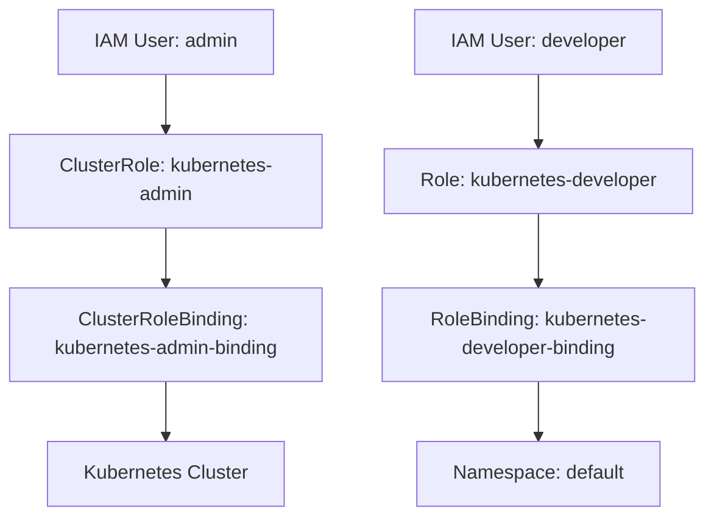

## Kubernetes Access Management

### Introduction to Kubernetes Access Management

Kubernetes Access Management is a critical aspect of securing your Kubernetes cluster. It involves controlling who can access the cluster and what actions they can perform. This is achieved through Role-Based Access Control (RBAC), which allows you to define roles and permissions for users and services within the cluster. In this section, we will delve into configuring Kubernetes `Role` and `ClusterRole` using Infrastructure as Code (IaC) tools like Terraform.

### Background Theory

#### What is RBAC?

Role-Based Access Control (RBAC) is a method of regulating access to resources based on the roles of individual users within an organization. In Kubernetes, RBAC is implemented through the following components:

- **Roles**: Define a set of permissions that apply within a specific namespace.
- **ClusterRoles**: Define a set of permissions that apply across the entire cluster.
- **RoleBindings**: Bind a Role to a user, group, or service account within a specific namespace.
- **ClusterRoleBindings**: Bind a ClusterRole to a user, group, or service account across the entire cluster.

#### Why Use RBAC?

RBAC is essential for several reasons:

- **Security**: It ensures that users and services have only the necessary permissions to perform their tasks, reducing the risk of accidental or malicious actions.
- **Compliance**: Many organizations require strict access controls to meet regulatory requirements.
- **Ease of Management**: RBAC simplifies the management of permissions by grouping them into roles, making it easier to assign and revoke access.

### Configuring Roles and ClusterRoles Using Terraform

In this section, we will walk through the process of configuring Kubernetes `Role` and `ClusterRole` using Terraform. We will also cover the necessary steps to integrate these configurations with AWS IAM users.

#### Prerequisites

Before proceeding, ensure you have the following:

- A Kubernetes cluster up and running.
- Terraform installed and configured.
- An AWS account with appropriate permissions to create IAM users and policies.

#### Step-by-Step Configuration

1. **Create AWS IAM Users**

   First, we need to create AWS IAM users with different levels of access. We will create an `admin` user and a `developer` user.

   ```hcl
   resource "aws_iam_user" "admin" {
     name = "kubernetes-admin"
   }

   resource "aws_iam_user" "developer" {
     name = "kubernetes-developer"
   }
   ```

2. **Attach Policies to IAM Users**

   Next, we attach policies to these users. For the `admin` user, we will grant full administrator access to AWS. For the `developer` user, we will grant more limited access.

   ```hcl
   resource "aws_iam_policy_attachment" "admin-policy" {
     name       = "admin-policy"
     policy_arn = aws_iam_policy.admin.arn
     users      = [aws_iam_user.admin.name]
   }

   resource "aws_iam_policy_attachment" "developer-policy" {
     name       = "developer-policy"
     policy_arn = aws_iam_policy.developer.arn
     users      = [aws_iam_user.developer.name]
   }
   ```

3. **Define Kubernetes Roles and ClusterRoles**

   Now, we define the Kubernetes roles and cluster roles using Terraform. We will create a `ClusterRole` named `kubernetes-admin` and a `Role` named `kubernetes-developer`.

   ```hcl
   resource "kubernetes_cluster_role" "admin" {
     metadata {
       name = "kubernetes-admin"
     }
     rule {
       api_groups = ["*"]
       resources  = ["*"]
       verbs      = ["*"]
     }
   }

   resource "kubernetes_role" "developer" {
     metadata {
       name      = "kubernetes-developer"
       namespace = "default"
     }
     rule {
       api_groups = [""]
       resources  = ["pods", "services"]
       verbs      = ["get", "list", "watch"]
     }
   }
   ```

4. **Bind Roles to Users**

   Finally, we bind these roles to the respective IAM users using `RoleBinding` and `ClusterRoleBinding`.

   ```hcl
   resource "kubernetes_cluster_role_binding" "admin-binding" {
     metadata {
       name = "kubernetes-admin-binding"
     }
     role_ref {
       api_group = "rbac.authorization.k8s.io"
       kind      = "ClusterRole"
       name      = kubernetes_cluster_role.admin.metadata[0].name
     }
     subject {
       kind      = "User"
       name      = aws_iam_user.admin.name
       api_group = ""
     }
   }

   resource "kubernetes_role_binding" "developer-binding" {
     metadata {
       name      = "kubernetes-developer-binding"
       namespace = "default"
     }
     role_ref {
       api_group = "rbac.authorization.k8s.io"
       kind      = "Role"
       name      = kubernetes_role.developer.metadata[0].name
     }
     subject {
       kind      = "User"
       name      = aws_iam_user.developer.name
       api_group = ""
     }
   }
   ```

### Diagramming the Architecture

To better understand the architecture, let's visualize it using a Mermaid diagram.



### Real-World Examples and Recent Breaches

#### Example: CVE-2021-25741

CVE-2021-25741 is a critical vulnerability in Kubernetes that allows an attacker to escalate privileges by manipulating the `extraArgs` field in the API server configuration. This vulnerability highlights the importance of proper access control and the need to regularly update and patch your Kubernetes clusters.

#### Example: Capital One Data Breach

The Capital One data breach in 2019 involved unauthorized access to sensitive customer data. While not directly related to Kubernetes, this breach underscores the importance of robust access control mechanisms, such as RBAC, to prevent unauthorized access to sensitive resources.

### Common Pitfalls and How to Avoid Them

#### Pitfall: Overly Permissive Roles

One common pitfall is creating overly permissive roles that grant unnecessary permissions. This can lead to security vulnerabilities and compliance issues.

**How to Avoid:**
- Follow the principle of least privilege (PoLP).
- Regularly review and audit roles and permissions.
- Use tools like `kubectl auth can-i` to test permissions.

#### Pitfall: Misconfigured RoleBindings

Misconfigured RoleBindings can result in unintended access to resources. For example, binding a `ClusterRole` to a `RoleBinding` can lead to unexpected behavior.

**How to Avoid:**
- Ensure that `ClusterRoleBindings` are used for cluster-wide permissions and `RoleBindings` for namespace-specific permissions.
- Use descriptive names for roles and bindings to avoid confusion.

### How to Prevent / Defend

#### Detection

To detect misconfigurations and unauthorized access, you can use the following methods:

- **Audit Logs:** Enable and monitor audit logs to track access and changes to resources.
- **Network Monitoring:** Monitor network traffic for unusual patterns that may indicate unauthorized access.

#### Prevention

To prevent unauthorized access, follow these best practices:

- **Least Privilege:** Grant only the minimum necessary permissions to users and services.
- **Regular Audits:** Conduct regular audits of roles and permissions to identify and correct misconfigurations.
- **Secure Configuration Management:** Use IaC tools like Terraform to manage and version control your configurations.

#### Secure Coding Fixes

Here is an example of a vulnerable configuration and its secure counterpart:

**Vulnerable Configuration:**

```hcl
resource "kubernetes_cluster_role" "overly-permissive" {
  metadata {
    name = "overly-permissive"
  }
  rule {
    api_groups = ["*"]
    resources  = ["*"]
    verbs      = ["*"]
  }
}

resource "kubernetes_cluster_role_binding" "overly-permissive-binding" {
  metadata {
    name = "overly-permissive-binding"
  }
  role_ref {
    api_group = "rbac.authorization.k8s.io"
    kind      = "ClusterRole"
    name      = kubernetes_cluster_role.overly-permissive.metadata[0].name
  }
  subject {
    kind      = "User"
    name      = aws_iam_user.admin.name
    api_group = ""
  }
}
```

**Secure Configuration:**

```hcl
resource "kubernetes_cluster_role" "secure" {
  metadata {
    name = "secure"
  }
  rule {
    api_groups = [""]
    resources  = ["pods", "services"]
    verbs      = ["get", "list", "watch"]
  }
}

resource "kubernetes_cluster_role_binding" "secure-binding" {
  metadata {
    name = "secure-binding"
  }
  role_ref {
    api_group = "rbac.authorization.k8s.io"
    kind      = "ClusterRole"
    name      = kubernetes_cluster_role.secure.metadata[0].name
  }
  subject {
    kind      = "User"
    name      = aws_  iam_user.admin.name
    api_group = ""
  }
}
```

### Hands-On Labs

For hands-on practice, consider the following labs:

- **PortSwigger Web Security Academy:** Offers interactive labs to practice web application security.
- **OWASP Juice Shop:** A deliberately insecure web application for practicing web security skills.
- **Kubernetes Goat:** A Kubernetes-based penetration testing environment for learning and practicing Kubernetes security.

These labs provide practical experience in configuring and managing Kubernetes access control, helping you to master the concepts covered in this chapter.

### Conclusion

Kubernetes Access Management is a crucial aspect of securing your Kubernetes cluster. By understanding and implementing RBAC using IaC tools like Terraform, you can ensure that your cluster is secure and compliant. Regular audits and adherence to best practices will help you maintain a secure and efficient Kubernetes environment.

---
<!-- nav -->
[[15-Kubernetes Access Management Part 2|Kubernetes Access Management Part 2]] | [[DevSecOps/DevSecOps Bootcamp/03-Identity & Access Management/02-Kubernetes Access Management/Configure K8s Role and ClusterRole in IaC/00-Overview|Overview]] | [[DevSecOps/DevSecOps Bootcamp/03-Identity & Access Management/02-Kubernetes Access Management/Configure K8s Role and ClusterRole in IaC/17-Practice Questions & Answers|Practice Questions & Answers]]
