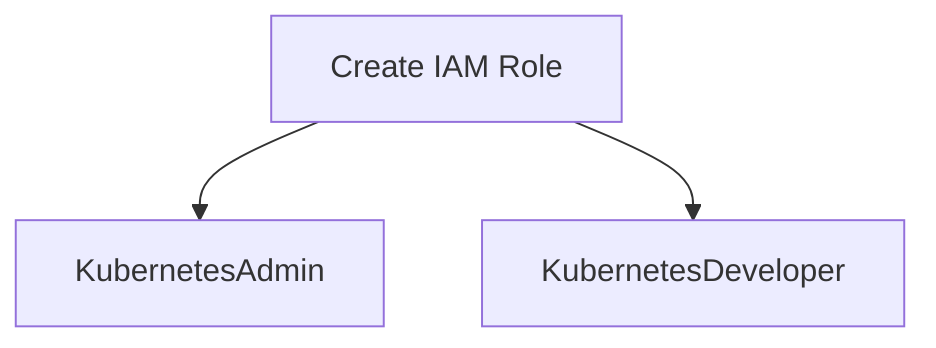
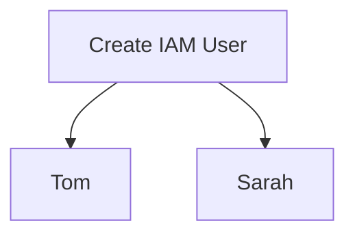
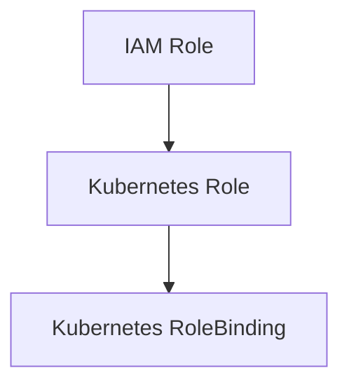

## Introduction to Kubernetes Access Management

Kubernetes Access Management is a critical aspect of securing your Kubernetes clusters. This involves managing access to the cluster resources and ensuring that only authorized entities can perform specific actions. In this chapter, we will delve into the integration of AWS Identity and Access Management (IAM) with Kubernetes Role-Based Access Control (RBAC) to manage access to a Kubernetes cluster hosted on Amazon Elastic Kubernetes Service (EKS).

### Background Theory

Before diving into the specifics, let's understand the foundational concepts:

#### AWS IAM
AWS Identity and Access Management (IAM) is a web service that helps you securely control access to AWS resources. With IAM, you can create and manage AWS users and groups, and use permissions to allow and deny their access to AWS resources.

- **Users**: Individual identities that can sign in to AWS and access resources.
- **Groups**: Collections of users that share similar permissions.
- **Roles**: Temporary credentials that can be assumed by entities to perform actions within AWS.

#### Kubernetes RBAC
Role-Based Access Control (RBAC) is a method of regulating access to resources based on the roles of individual users within an organization. In Kubernetes, RBAC allows you to define roles and role bindings to control access to resources within the cluster.

- **Roles**: Define a set of permissions.
- **RoleBindings**: Bind roles to users or groups.
- **ClusterRoles**: Similar to roles but apply across the entire cluster.
- **ClusterRoleBindings**: Bind cluster roles to users or groups.

### Integration of AWS IAM and Kubernetes RBAC

The goal is to integrate AWS IAM with Kubernetes RBAC to manage access to a Kubernetes cluster hosted on EKS. This involves creating IAM roles and users, and then mapping these roles to Kubernetes RBAC roles.

#### Creating IAM Roles

First, we need to create IAM roles that will be used to manage access to the Kubernetes cluster. These roles will be named `KubernetesAdmin` and `KubernetesDeveloper`.



To create these roles, follow these steps:

1. **Log in to the AWS Management Console**.
2. **Navigate to the IAM service**.
3. **Click on "Roles" and then "Create role"**.
4. **Select "AWS service" as the trusted entity type**.
5. **Choose "EKS" as the service that will use this role**.
6. **Attach policies to the role**:
   - For `KubernetesAdmin`, attach policies that grant full access to the EKS cluster.
   - For `KubernetesDeveloper`, attach policies that grant read-only access to the EKS cluster.

Here is an example of the policy for `KubernetesAdmin`:

```json
{
    "Version": "2012-10-17",
    "Statement": [
        {
            "Effect": "Allow",
            "Action": [
                "eks:*"
            ],
            "Resource": "*"
        }
    ]
}
```

And here is an example of the policy for `KubernetesDeveloper`:

```json
{
    "Version": "2012-10-17",
    "Statement": [
        {
            "Effect": "Allow",
            "Action": [
                "eks:Describe*"
            ],
            "Resource": "*"
        }
    ]
}
```

#### Creating IAM Users

Next, we need to create IAM users who will assume these roles. For example, we can create users named `Tom` and `Sarah`.



To create these users:

1. **Log in to the AWS Management Console**.
2. **Navigate to the IAM service**.
3. **Click on "Users" and then "Add user"**.
4. **Enter the username (e.g., Tom)**.
5. **Assign programmatic access to the user**.
6. **Set permissions for the user**:
   - For `Tom`, assign the `KubernetesAdmin` role.
   - For `Sarah`, assign the `KubernetesDeveloper` role.

#### Mapping IAM Roles to Kubernetes RBAC Roles

Now that we have created the IAM roles and users, we need to map these roles to Kubernetes RBAC roles. This involves creating Kubernetes roles and role bindings that correspond to the IAM roles.



For example, we can create a Kubernetes role named `kubernetes-admin` and a role binding named `kubernetes-admin-binding`.

Here is an example of the Kubernetes role definition:

```yaml
apiVersion: rbac.authorization.k8s.io/v1
kind: Role
metadata:
  namespace: default
  name: kubernetes-admin
rules:
- apiGroups: ["*"]
  resources: ["*"]
  verbs: ["*"]
```

And here is an example of the role binding definition:

```yaml
apiVersion: rbac.authorization.k8s.io/v1
kind: RoleBinding
metadata:
  name: kubernetes-admin-binding
  namespace: default
subjects:
- kind: User
  name: tom
  apiGroup: rbac.authorization.k8s.io
roleRef:
  kind: Role
  name: kubernetes-admin
  apiGroup: rbac.authorization.k8s.io
```

Similarly, we can create a Kubernetes role named `kubernetes-developer` and a role binding named `kubernetes-developer-binding`.

Here is an example of the Kubernetes role definition:

```yaml
apiVersion: rbac.authorization.k8s.io/v
kind: Role
metadata:
  namespace: default
  name: kubernetes-developer
rules:
- apiGroups: [""]
  resources: ["pods", "services", "configmaps", "secrets"]
  verbs: ["get", "list", "watch"]
```

And here is an example of the role binding definition:

```yaml
apiVersion: rbac.authorization.k8s.io/v1
kind: RoleBinding
metadata:
  name: kubernetes-developer-binding
  namespace: default
subjects:
- kind: User
  name: sarah
  apiGroup: rbac.authorization.k8s.io
roleRef:
  kind: Role
  name: kubernetes-developer
  apiGroup: rbac.authorization.k8s.io
```

### Real-World Examples

Let's consider some real-world examples to illustrate the importance of proper access management in Kubernetes clusters.

#### Example 1: CVE-2020-11655

CVE-2020-11655 is a vulnerability in Kubernetes that allows an attacker to escalate privileges by manipulating the `extraArgs` field in the API server configuration. This vulnerability highlights the importance of strict access controls and regular audits of cluster configurations.

To prevent such vulnerabilities, ensure that:

- Only authorized users have access to modify cluster configurations.
- Regularly audit cluster configurations for unauthorized changes.
- Implement strict RBAC policies to limit access to sensitive resources.

#### Example 2: Misconfigured IAM Policies

In a real-world scenario, a misconfigured IAM policy allowed an attacker to gain unauthorized access to a Kubernetes cluster. The policy granted excessive permissions to a user, allowing them to perform administrative actions.

To prevent such issues:

- Regularly review and audit IAM policies to ensure they are correctly configured.
- Implement least privilege principles to minimize the risk of unauthorized access.
- Use tools like AWS Config and AWS Trusted Advisor to monitor and enforce compliance.

### Common Pitfalls and Best Practices

#### Pitfall 1: Overly Permissive Policies

One common pitfall is creating overly permissive IAM policies or Kubernetes RBAC roles. This can lead to unauthorized access and potential security breaches.

**Best Practice**: Always follow the principle of least privilege. Grant only the minimum necessary permissions required to perform a task.

#### Pitfall 2: Inconsistent Naming Conventions

Inconsistent naming conventions can lead to confusion and errors when managing access controls.

**Best Practice**: Establish and adhere to consistent naming conventions for IAM roles, users, and Kubernetes roles and role bindings.

#### Pitfall 3: Lack of Regular Audits

Failing to regularly audit IAM policies and Kubernetes RBAC roles can result in outdated or incorrect access controls.

**Best Practice**: Schedule regular audits of IAM policies and Kubernetes RBAC roles to ensure they remain up-to-date and aligned with organizational requirements.

### How to Prevent / Defend

#### Detection

To detect unauthorized access attempts:

- **Enable AWS CloudTrail**: Monitor API calls made to your AWS account to identify unauthorized access attempts.
- **Use Kubernetes Audit Logs**: Enable audit logging in Kubernetes to track API requests and identify suspicious activity.

#### Prevention

To prevent unauthorized access:

- **Implement Least Privilege**: Ensure that IAM policies and Kubernetes RBAC roles are configured to grant only the minimum necessary permissions.
- **Regular Audits**: Conduct regular audits of IAM policies and Kubernetes RBAC roles to ensure they remain up-to-date and aligned with organizational requirements.
- **Use Multi-Factor Authentication (MFA)**: Require MFA for all IAM users to add an additional layer of security.

#### Secure Coding Fixes

Here is an example of a vulnerable IAM policy and its secure counterpart:

**Vulnerable Policy**:

```json
{
    "Version": "2012-10-17",
    "Statement": [
        {
            "Effect": "Allow",
            "Action": [
                "eks:*"
            ],
            "Resource": "*"
        }
    ]
}
```

**Secure Policy**:

```json
{
    "Version": "2012-10-17",
    "Statement": [
        {
            "Effect": "Allow",
            "Action": [
                "eks:Describe*"
            ],
            "Resource": "*"
        }
    ]
}
```

Here is an example of a vulnerable Kubernetes role and its secure counterpart:

**Vulnerable Role**:

```yaml
apiVersion: rbac.authorization.k8s.io/v1
kind: Role
metadata:
  namespace: default
  name: kubernetes-admin
rules:
- apiGroups: ["*"]
  resources: ["*"]
  verbs: ["*"]
```

**Secure Role**:

```yaml
apiVersion: rbac.authorization.k8s.io/v1
kind: Role
metadata:
  namespace: default
  name: kubernetes-developer
rules:
- apiGroups: [""]
  resources: ["pods", "services", "configmaps", "secrets"]
  verbs: ["get", "list", "watch"]
```

### Conclusion

Proper access management is crucial for securing Kubernetes clusters hosted on AWS. By integrating AWS IAM with Kubernetes RBAC, you can effectively manage access to your cluster resources. Follow best practices, conduct regular audits, and implement least privilege principles to ensure the security of your Kubernetes environment.

### Hands-On Labs

To practice and reinforce the concepts covered in this chapter, consider the following hands-on labs:

- **PortSwigger Web Security Academy**: Offers a comprehensive set of labs covering various aspects of web application security.
- **OWASP Juice Shop**: A deliberately insecure web application designed for security training.
- **Kubernetes Goat**: A security-focused Kubernetes lab environment for practicing and learning Kubernetes security.
- **CloudGoat**: A cloud security lab environment for practicing and learning AWS security.

These labs provide practical experience in managing access to Kubernetes clusters and applying the concepts discussed in this chapter.

---
<!-- nav -->
[[DevSecOps/DevSecOps Bootcamp/03-Identity & Access Management/02-Kubernetes Access Management/IAM Roles and K8s Roles How it works/00-Overview|Overview]] | [[DevSecOps/DevSecOps Bootcamp/03-Identity & Access Management/02-Kubernetes Access Management/IAM Roles and K8s Roles How it works/02-Overview of Kubernetes Access Management|Overview of Kubernetes Access Management]]
