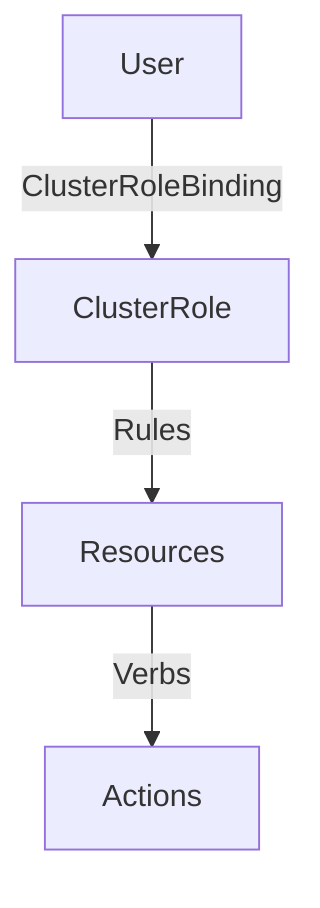
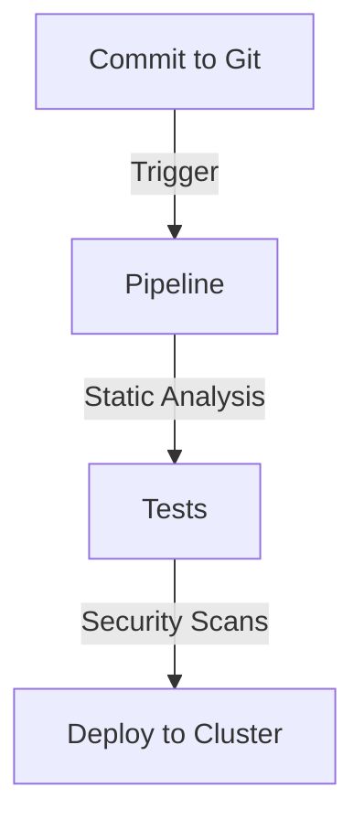

## Kubernetes Access Management: IAM Roles and K8s Roles

### Background Theory

Kubernetes (K8s) is a powerful container orchestration platform that allows you to manage and scale applications across multiple nodes. One of the key aspects of managing a Kubernetes cluster is ensuring proper access control and management. This involves defining roles and permissions for users and services within the cluster.

Access management in Kubernetes is crucial because it ensures that only authorized entities can perform specific actions within the cluster. This is particularly important in a DevSecOps environment where security and compliance are paramount. Kubernetes uses Role-Based Access Control (RBAC) to manage access to resources within the cluster.

### RBAC in Kubernetes

Role-Based Access Control (RBAC) is a method of regulating access to resources based on the roles of individual users within an organization. In Kubernetes, RBAC is implemented using the following components:

- **Roles**: Define a set of permissions that can be granted to users or groups.
- **RoleBindings**: Bind roles to specific users or groups within a namespace.
- **ClusterRoles**: Similar to roles, but they are cluster-scoped and can be used to grant permissions across the entire cluster.
- **ClusterRoleBindings**: Bind cluster roles to specific users or groups across the entire cluster.

### Cluster-Wide Access Management

In the context of the lecture, the focus is on granting cluster-wide access to an admin user. This means that the admin user should have access to all namespaces and resources within the cluster, but with strict limitations on what they can do.

#### Read-Only Access

The admin user is given read-only access to the entire cluster. This means they can view and inspect any resource within the cluster, but they cannot make any changes. This is achieved by creating a `ClusterRole` with read-only permissions and binding it to the admin user via a `ClusterRoleBinding`.

Here’s an example of how this can be done:

```yaml
# Define a ClusterRole with read-only permissions
apiVersion: rbac.authorization.k8s.io/v1
kind: ClusterRole
metadata:
  name: read-only-admin
rules:
- apiGroups: ["*"]
  resources: ["*"]
  verbs: ["get", "list", "watch"]

# Bind the ClusterRole to the admin user
apiVersion: rbac.authorization.k8s.io/v1
kind: ClusterRoleBinding
metadata:
  name: read-only-admin-binding
subjects:
- kind: User
  name: admin-user
roleRef:
  kind: ClusterRole
  name: read-only-admin
  apiGroup: rbac.authorization.k8s.io
```

### Workflow for Troubleshooting and Changes

The workflow described in the lecture ensures that any changes to the cluster are made through a controlled process. Here’s a detailed breakdown of the workflow:

1. **Troubleshooting**: The admin user can connect to the cluster and inspect any resource using read-only commands. They can list pods, services, and other components to diagnose issues.
   
2. **Fixing Issues**: Once the admin user identifies a problem, they can propose a fix. This fix is committed to the Git repository as part of the infrastructure-as-code (IaC) or configuration-as-code (CaC) approach.

3. **Pipeline Execution**: The commit triggers a pipeline that runs various checks, such as static analysis, unit tests, and security scans. Only if these checks pass successfully are the changes applied to the cluster.

4. **Cluster Update**: The pipeline applies the changes to the cluster, ensuring that all modifications are tracked and auditable.

### Example of Troubleshooting Workflow

Let’s walk through an example of how this workflow might look in practice:

1. **Admin User Connects to the Cluster**:
   ```sh
   kubectl get pods --all-namespaces
   ```

2. **Identifies a Problem**:
   ```sh
   kubectl describe pod <pod-name> -n <namespace>
   ```

3. **Proposes a Fix**:
   - Edits the deployment configuration file in the Git repository.
   - Commits the changes to the Git repository.

4. **Pipeline Triggers**:
   - Runs static analysis tools like SonarQube.
   - Executes unit tests using frameworks like JUnit.
   - Performs security scans using tools like Trivy.

5. **Changes Applied to the Cluster**:
   - The pipeline deploys the updated configuration to the cluster.

### Real-World Examples and CVEs

Recent breaches and vulnerabilities often highlight the importance of proper access management. For instance, the SolarWinds breach (CVE-2020-1014) involved unauthorized access to systems due to weak access controls. In a Kubernetes context, similar issues could arise if access management is not properly configured.

### How to Prevent / Defend

To ensure robust access management in a Kubernetes cluster, follow these best practices:

1. **Use RBAC**: Always use RBAC to define and enforce roles and permissions.
2. **Least Privilege Principle**: Grant users the minimum level of access necessary to perform their tasks.
3. **Audit Logs**: Enable audit logs to track all actions performed within the cluster.
4. **Regular Reviews**: Regularly review and update roles and bindings to ensure they remain appropriate.
5. **Automated Pipelines**: Use automated pipelines to manage changes to the cluster, ensuring all modifications are tracked and auditable.

### Secure Coding Fixes

Here’s an example of how to correct a vulnerable configuration:

#### Vulnerable Configuration

```yaml
apiVersion: rbac.authorization.k8s.io/v1
kind: ClusterRole
metadata:
  name: admin-role
rules:
- apiGroups: ["*"]
  resources: ["*"]
  verbs: ["*"]
```

This configuration grants full administrative access to the user, which is overly permissive.

#### Corrected Configuration

```yaml
apiVersion: rbac.authorization.k8s.io/v1
kind: ClusterRole
metadata:
  name: read-only-admin
rules:
- apiGroups: ["*"]
  resources: ["*"]
  verbs: ["get", "list", "watch"]
```

This configuration restricts the user to read-only access, adhering to the least privilege principle.

### Mermaid Diagrams

#### Cluster Role Binding Diagram



#### Pipeline Workflow Diagram



### Hands-On Labs

For hands-on practice with Kubernetes access management, consider the following labs:

- **Kubernetes Goat**: A hands-on lab that focuses on Kubernetes security and access management.
- **OWASP WrongSecrets**: A series of challenges that cover various aspects of Kubernetes security, including access management.

These labs provide practical experience in configuring and managing access controls in a Kubernetes cluster.

### Conclusion

Proper access management in Kubernetes is essential for maintaining security and compliance in a DevSecOps environment. By using RBAC to define roles and permissions, and by adhering to the least privilege principle, you can ensure that only authorized entities can perform specific actions within the cluster. Additionally, using automated pipelines to manage changes ensures that all modifications are tracked and auditable, further enhancing security and compliance.

---
<!-- nav -->
[[03-Kubernetes Access Management IAM Roles and K8s Roles Part 1|Kubernetes Access Management IAM Roles and K8s Roles Part 1]] | [[DevSecOps/DevSecOps Bootcamp/03-Identity & Access Management/02-Kubernetes Access Management/IAM Roles and K8s Roles How it works/00-Overview|Overview]] | [[05-Kubernetes Access Management IAM Roles and Kubernetes Roles Part 1|Kubernetes Access Management IAM Roles and Kubernetes Roles Part 1]]
