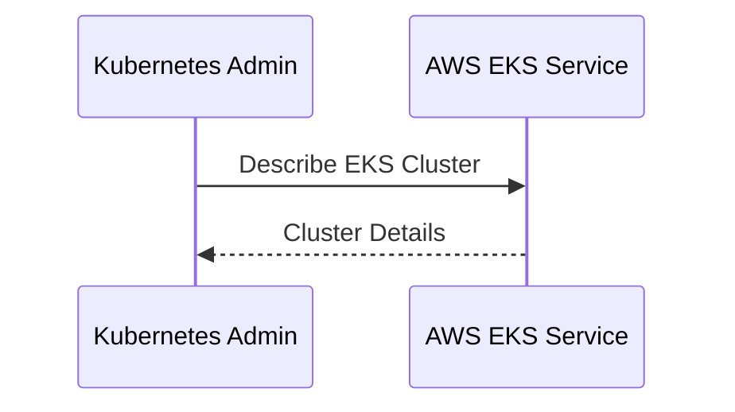
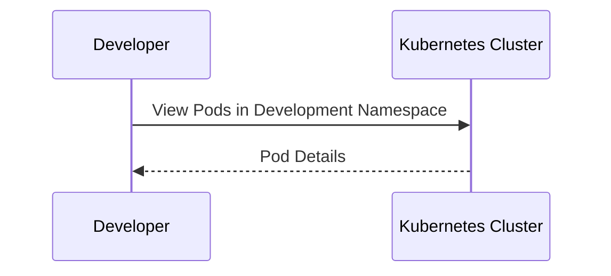

## Kubernetes Access Management: IAM Roles and Kubernetes Roles

In the realm of DevSecOps, managing access to Kubernetes clusters is a critical aspect of ensuring both security and operational efficiency. This chapter delves into the intricacies of Identity and Access Management (IAM) roles and Kubernetes roles, explaining their purposes, how they work, and how to implement them securely.

### Understanding IAM Roles and Kubernetes Roles

#### What Are IAM Roles?

IAM roles are a fundamental component of cloud-based identity management systems, such as those provided by AWS. An IAM role is an entity that defines a set of permissions that can be assumed by entities (like EC2 instances, Lambda functions, or even humans) within the cloud environment. These roles are crucial because they allow you to grant temporary, limited permissions to resources without sharing long-term credentials.

**Why IAM Roles Matter:**
- **Least Privilege Principle:** IAM roles help enforce the principle of least privilege by granting only the necessary permissions required to perform a task.
- **Security:** By limiting permissions, IAM roles reduce the risk of unauthorized access and potential breaches.
- **Flexibility:** IAM roles can be easily modified, revoked, or reassigned, providing flexibility in managing access across different environments and users.

#### What Are Kubernetes Roles?

Kubernetes roles are a way to manage access control within a Kubernetes cluster. A role is a resource that defines a set of permissions for accessing Kubernetes API objects. Roles are used to define permissions at the namespace level, meaning they apply to resources within a specific namespace.

**Why Kubernetes Roles Matter:**
- **Granular Control:** Kubernetes roles allow for granular control over access to different parts of the cluster, enabling you to restrict access based on the specific needs of different users or applications.
- **Isolation:** By defining roles at the namespace level, you can isolate different teams or applications, reducing the risk of cross-namespace interference.
- **Compliance:** Properly configured roles help ensure compliance with organizational policies and regulatory requirements.

### Kubernetes Admin Role

The Kubernetes admin role is designed to provide comprehensive access to the Kubernetes cluster, including the ability to manage the control plane and other critical components. However, the permissions granted to this role are carefully controlled to ensure that only necessary actions can be performed.

#### Permissions on AWS

For a Kubernetes admin role, one of the key permissions is the ability to describe EKS (Elastic Kubernetes Service) clusters. This permission allows the admin to view details about the EKS cluster, such as its status, configuration, and other metadata.



**Permissions within the Kubernetes Cluster**

Within the Kubernetes cluster itself, the admin role typically has read-only access to all cluster resources. This includes the ability to view the control plane processes, nodes, pods, services, and other components.

```yaml
apiVersion: rbac.authorization.k8s.io/v1
kind: ClusterRole
metadata:
  name: kubernetes-admin
rules:
- apiGroups: [""]
  resources: ["nodes", "pods", "services"]
  verbs: ["get", "list", "watch"]
- apiGroups: ["apps"]
  resources: ["deployments", "statefulsets"]
  verbs: ["get", "list", "watch"]
```

**Creating the Cluster Role**

To create a cluster role for the Kubernetes admin, you would use the following YAML definition:

```yaml
apiVersion: rbac.authorization.k8s.io/v1
kind: ClusterRole
metadata:
  name: kubernetes-admin
rules:
- apiGroups: [""]
  resources: ["nodes", "pods", "services"]
  verbs: ["get", "list", "watch"]
- apiGroups: ["apps"]
  resources: ["deployments", "statefulsets"]
  verbs: ["get", "list", "watch"]
```

This role grants read-only access to various resources within the cluster.

### Kubernetes Developer Role

The Kubernetes developer role is designed to provide limited access to a specific namespace within the cluster. This role ensures that developers can only interact with the resources in their designated namespace, reducing the risk of accidental or malicious changes to other parts of the cluster.

#### Limited Set of Permissions

For a Kubernetes developer role, the permissions are restricted to a specific namespace. This means that developers can only view and interact with resources within that namespace.

```yaml
apiVersion: rbac.authorization.k8s.io/v1
kind: Role
metadata:
  name: kubernetes-developer
  namespace: development
rules:
- apiGroups: [""]
  resources: ["pods", "services"]
  verbs: ["get", "list", "watch"]
- apiGroups: ["apps"]
  resources: ["deployments", "statefulsets"]
  verbs: ["get", "list", "watch"]
```

**Creating the Role**

To create a role for the Kubernetes developer, you would use the following YAML definition:

```yaml
apiVersion: rbac.authorization.k8s.io/v1
kind: Role
metadata:
  name: kubernetes-developer
  namespace: development
rules:
- apiGroups: [""]
  resources: ["pods", "services"]
  verbs: ["get", "list", "watch"]
- apiGroups: ["apps"]
  resources: ["deployments", "statefulsets"]
  verbs:[ "get", "list", "watch"]
```

This role grants read-only access to various resources within the `development` namespace.

### Troubleshooting and Human Access

One of the primary purposes of these roles is to enable troubleshooting within the cluster. However, it is important to avoid direct human access to the cluster for making changes. Instead, roles should be used to grant the necessary permissions for troubleshooting purposes.

#### Example Scenario

Consider a scenario where a developer needs to troubleshoot an issue within their application namespace. They would use their Kubernetes developer role to view the relevant resources and diagnose the problem.



### Real-World Examples and Breaches

Recent breaches and vulnerabilities have highlighted the importance of proper access management in Kubernetes clusters. For example, the Kubernetes API server has been a target for attacks due to misconfigured RBAC rules.

#### CVE-2020-8558

CVE-2020-8558 is a vulnerability in the Kubernetes API server that allows an attacker to bypass RBAC restrictions and gain elevated privileges. This vulnerability underscores the importance of properly configuring and auditing RBAC rules.

**Example Exploit:**

An attacker could exploit this vulnerability by crafting a request that bypasses the intended RBAC restrictions.

```http
POST /apis/rbac.authorization.k8s.io/v1/namespaces/default/clusterroles HTTP/1.1
Host: kubernetes-api-server
Authorization: Bearer <token>
Content-Type: application/json

{
  "apiVersion": "rbac.authorization.k8s.io/v1",
  "kind": "ClusterRole",
  "metadata": {
    "name": "attacker-role"
  },
  "rules": [
    {
      "apiGroups": [""],
      "resources": ["pods"],
      "verbs": ["get", "list", "watch"]
    }
  ]
}
```

**Secure Configuration:**

To prevent such attacks, it is essential to configure RBAC rules correctly and audit them regularly.

```yaml
apiVersion: rbac.authorization.k8s.io/v1
kind: ClusterRole
metadata:
  name: secure-cluster-role
rules:
- apiGroups: [""]
  resources: ["pods"]
  verbs: ["get", "list", "watch"]
```

### How to Prevent / Defend

#### Detection

Regularly audit your RBAC configurations to ensure that roles are correctly defined and that no unnecessary permissions are granted. Tools like `kubectl auth can-i` can be used to check permissions.

```sh
kubectl auth can-i get pods --namespace=development
```

#### Prevention

- **Least Privilege:** Always follow the principle of least privilege by granting only the necessary permissions.
- **Regular Audits:** Conduct regular audits of RBAC configurations to identify and correct any misconfigurations.
- **Monitoring:** Implement monitoring and logging to detect unauthorized access attempts.

#### Secure Coding Fixes

Compare the vulnerable and secure versions of RBAC configurations.

**Vulnerable Configuration:**

```yaml
apiVersion: rbac.authorization.k8s.io/v1
kind: ClusterRole
metadata:
  name: insecure-cluster-role
rules:
- apiGroups: [""]
  resources: ["pods"]
  verbs: ["*"]
```

**Secure Configuration:**

```yaml
apiVersion: rbac.authorization.k8s.io/v1
kind: ClusterRole
metadata:
  name: secure-cluster-role
rules:
- apiGroups: [""]
  resources: ["pods"]
  verbs: ["get", "list", "watch"]
```

### Hands-On Labs

To practice and reinforce the concepts covered in this chapter, consider the following hands-on labs:

- **PortSwigger Web Security Academy:** Offers exercises on Kubernetes security, including RBAC configurations.
- **OWASP Juice Shop:** Provides a vulnerable web application that can be deployed on Kubernetes to practice securing access.
- **Kubernetes Goat:** A Kubernetes-based penetration testing platform that includes challenges related to RBAC and access management.

By thoroughly understanding and implementing the principles of IAM roles and Kubernetes roles, you can significantly enhance the security and operational efficiency of your Kubernetes clusters.

---
<!-- nav -->
[[04-Kubernetes Access Management IAM Roles and K8s Roles|Kubernetes Access Management IAM Roles and K8s Roles]] | [[DevSecOps/DevSecOps Bootcamp/03-Identity & Access Management/02-Kubernetes Access Management/IAM Roles and K8s Roles How it works/00-Overview|Overview]] | [[06-Kubernetes Access Management IAM Roles and Kubernetes Roles Part 2|Kubernetes Access Management IAM Roles and Kubernetes Roles Part 2]]
