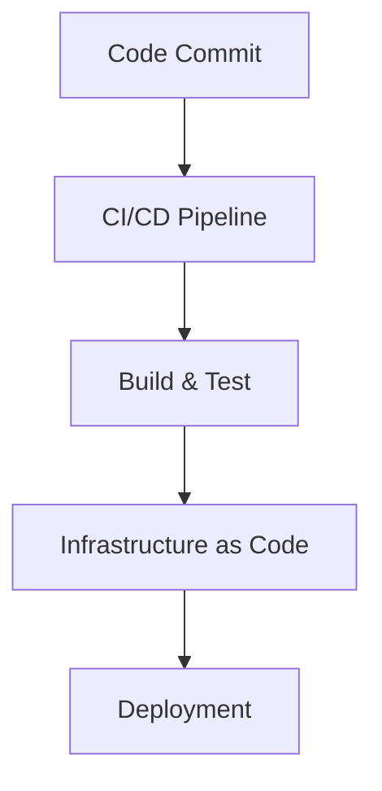

## Kubernetes Access Management: IAM Roles and Kubernetes Roles

### Introduction to Kubernetes Access Management

Kubernetes access management is a critical aspect of securing your Kubernetes cluster. It ensures that only authorized entities can perform specific actions within the cluster. This involves managing identities and permissions through Identity and Access Management (IAM) roles and Kubernetes roles.

### Mapping IAM Roles to Kubernetes Users

In a typical setup, you need to map IAM roles to Kubernetes users. This mapping allows you to control access to the Kubernetes cluster based on the identity of the user. Here’s how it works:

1. **IAM Role**: An IAM role is a set of permissions defined in your cloud provider’s IAM system. These roles are assigned to users or services.
2. **Kubernetes User**: A Kubernetes user is an entity that interacts with the Kubernetes API server. This could be a human user or a service account.
3. **Mapping**: The mapping process associates an IAM role with a Kubernetes user. This is typically done using a service account and a role binding.

#### Example: Mapping IAM Role to Kubernetes User

Consider a scenario where you have an IAM role named `k8s-admin` and a Kubernetes user named `admin-user`. You would map the IAM role to the Kubernetes user using a service account and a role binding.

```yaml
# Service Account Definition
apiVersion: v1
kind: ServiceAccount
metadata:
  name: admin-sa
  namespace: default

# Role Binding Definition
apiVersion: rbac.authorization.k8s.io/v1
kind: RoleBinding
metadata:
  name: admin-binding
  namespace: default
subjects:
- kind: ServiceAccount
  name: admin-sa
roleRef:
  apiGroup: rbac.authorization.k8s.io
  kind: ClusterRole
  name: cluster-admin
```

### Kubernetes Roles and Permissions

Once the mapping is established, the Kubernetes user will have permissions based on the Kubernetes role assigned to them. Kubernetes uses Role-Based Access Control (RBAC) to manage these permissions.

#### Kubernetes Role Types

1. **ClusterRole**: Defines a set of permissions that can be applied across the entire cluster.
2. **Role**: Defines a set of permissions that are scoped to a specific namespace.

#### Example: Defining a ClusterRole

Here’s an example of a `ClusterRole` definition:

```yaml
apiVersion: rbac.authorization.k8s.io/v1
kind: ClusterRole
metadata:
  name: my-cluster-role
rules:
- apiGroups: [""]
  resources: ["pods"]
  verbs: ["get", "list", "watch"]
- apiGroups: ["apps"]
  resources: ["deployments"]
  verbs: ["get", "list", "watch"]
```

### Security Measures in Kubernetes Access Management

One of the most important security measures in Kubernetes access management is ensuring that administrative actions are performed through automated processes rather than direct manual intervention.

#### Why Automation is Important

Automation ensures consistency and reduces the risk of human error. In a DevOps context, this means using release pipelines and GitOps practices to manage infrastructure changes.

#### Example: Release Pipeline for Infrastructure Changes

A typical release pipeline might involve the following steps:

1. **Code Commit**: Developers commit changes to the codebase.
2. **CI/CD Pipeline**: The changes trigger a CI/CD pipeline that builds and tests the application.
3. **Infrastructure as Code**: Infrastructure changes are managed using tools like Terraform or Ansible.
4. **Deployment**: The pipeline deploys the changes to the Kubernetes cluster.

#### Mermaid Diagram: Release Pipeline



### Preventing Direct Manual Changes

To ensure that no human user makes direct changes to the Kubernetes cluster, you can enforce strict RBAC policies and monitor for unauthorized activities.

#### How to Prevent / Defend

1. **Strict RBAC Policies**:
   - Ensure that only service accounts with specific roles can perform administrative tasks.
   - Limit the scope of permissions to the minimum required.

2. **Monitoring and Logging**:
   - Use tools like Prometheus and Grafana to monitor Kubernetes activity.
   - Enable audit logging to track all API calls.

3. **Secure Coding Practices**:
   - Implement least privilege principles.
   - Regularly review and update RBAC configurations.

#### Example: Secure RBAC Configuration

Here’s an example of a secure RBAC configuration:

```yaml
apiVersion: rbac.authorization.k8s.io/v1
kind: ClusterRole
metadata:
  name: restricted-admin
rules:
- apiGroups: [""]
  resources: ["pods"]
  verbs: ["get", "list", "watch"]
- apiGroups: ["apps"]
  resources: ["deployments"]
  verbs: ["get", "list", "watch"]
---
apiVersion: rbac.authorization.k8s.io/v1
kind: RoleBinding
metadata:
  name: restricted-binding
  namespace: default
subjects:
- kind: ServiceAccount
  name: restricted-sa
roleRef:
  apiGroup: rbac.authorization.k8s.io
  kind: ClusterRole
  name: restricted-admin
```

### Real-World Examples and Breaches

Recent breaches have highlighted the importance of proper access management in Kubernetes clusters. For instance, the 2021 SolarWinds breach involved unauthorized access to Kubernetes clusters, leading to significant data exfiltration.

#### Example: SolarWinds Breach

The SolarWinds breach demonstrated the risks of improper access management. Attackers were able to gain unauthorized access to Kubernetes clusters due to weak RBAC policies and lack of monitoring.

#### How to Prevent Similar Breaches

1. **Regular Audits**: Conduct regular audits of RBAC configurations.
2. **Least Privilege Principle**: Ensure that users and service accounts have the minimum necessary permissions.
3. **Monitoring Tools**: Use monitoring tools to detect and respond to unauthorized activities.

### Conclusion

Proper Kubernetes access management is crucial for securing your cluster. By mapping IAM roles to Kubernetes users, defining appropriate roles and permissions, and enforcing strict RBAC policies, you can significantly reduce the risk of unauthorized access and breaches.

### Practice Labs

For hands-on experience with Kubernetes access management, consider the following labs:

- **Kubernetes Goat**: A hands-on lab for learning Kubernetes security.
- **OWASP WrongSecrets**: A series of challenges to learn about Kubernetes security.
- **kube-hunter**: A tool for discovering and exploiting misconfigurations in Kubernetes clusters.

By following these guidelines and practicing with real-world scenarios, you can master Kubernetes access management and ensure the security of your Kubernetes clusters.

---
<!-- nav -->
[[06-Kubernetes Access Management IAM Roles and Kubernetes Roles Part 2|Kubernetes Access Management IAM Roles and Kubernetes Roles Part 2]] | [[DevSecOps/DevSecOps Bootcamp/03-Identity & Access Management/02-Kubernetes Access Management/IAM Roles and K8s Roles How it works/00-Overview|Overview]] | [[DevSecOps/DevSecOps Bootcamp/03-Identity & Access Management/02-Kubernetes Access Management/IAM Roles and K8s Roles How it works/08-Practice Questions & Answers|Practice Questions & Answers]]
