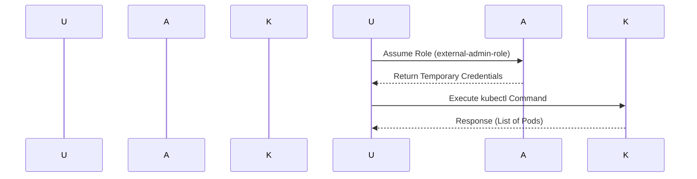

## Kubernetes Access Management

### Introduction to Kubernetes Access Management

Kubernetes access management is a critical aspect of securing your Kubernetes clusters. It ensures that only authorized users and services can interact with the cluster resources. This involves managing identities, roles, and permissions within the Kubernetes environment. In this section, we will delve into the practical aspects of reviewing and testing access in a Kubernetes cluster, particularly focusing on the integration with AWS Identity and Access Management (IAM).

### Understanding the Context

Before diving into the commands and configurations, it's essential to understand the context:

- **AWS IAM**: AWS Identity and Access Management (IAM) is a web service that helps you securely control access to AWS resources. IAM allows you to manage users, groups, and permissions.
- **Kubernetes RBAC**: Role-Based Access Control (RBAC) is a method of regulating access to resources based on the roles of individual users within an organization. In Kubernetes, RBAC is used to control who can perform actions on resources within the cluster.

### Switching Users in AWS

In the given transcript, the user switches between different AWS identities. This is typically done using the `aws sts` command, which stands for Security Token Service. The `sts` command allows you to assume roles and retrieve temporary credentials.

#### Example: Switching to an Admin User

```bash
# Switch to an admin user
export AWS_ACCESS_KEY_ID=<admin_access_key>
export AWS_SECRET_ACCESS_KEY=<admin_secret_key>
```

### Executing Kubernetes Commands

Once you have switched to the admin user, you can execute Kubernetes commands. The transcript mentions getting all the parts of the cluster, which could be achieved using the `kubectl` command.

#### Example: Listing All Pods

```bash
kubectl get pods --all-namespaces
```

### Unauthorized Access

The transcript also mentions that switching to a non-admin user results in unauthorized access. This is because the non-admin user does not have the necessary permissions to access the Kubernetes cluster.

#### Example: Unauthorized Access

```bash
# Attempt to list pods as a non-admin user
kubectl get pods --all-namespaces
```

**Response:**

```http
HTTP/1.1 403 Forbidden
Content-Type: application/json
Date: Mon, 01 Jan 2024 00:00:00 GMT
Content-Length: 213

{
    "kind": "Status",
    "apiVersion": "v1",
    "metadata": {},
    "status": "Failure",
    "message": "pods is forbidden: User \"nonadmin\" cannot list resource \"pods\" in API group \"\" at the cluster scope",
    "reason": "Forbidden",
    "details": {
        "kind": "pods"
    },
    "code": 403
}
```

### Assuming an External Admin Role

To regain access, the user assumes an external admin role that is mapped to the Kubernetes admin role. This is done using the `aws sts assume-role` command.

#### Example: Assuming an External Admin Role

```bash
# Assume the external admin role
aws sts assume-role \
    --role-arn arn:aws:iam::<account_id>:role/external-admin-role \
    --role-session-name kubernetes-session
```

**Response:**

```json
{
    "Credentials": {
        "AccessKeyId": "<access_key>",
        "SecretAccessKey": "<secret_key>",
        "SessionToken": "<session_token>",
        "Expiration": "2024-01-01T00:00:00Z"
    },
    "AssumedRoleUser": {
        "AssumedRoleId": "<assumed_role_id>",
        "Arn": "arn:aws:sts::<account_id>:assumed-role/external-admin-role/kubernetes-session"
    }
}
```

### Using Temporary Credentials

After assuming the role, you can use the temporary credentials to authenticate with Kubernetes.

#### Example: Setting Environment Variables

```bash
export AWS_ACCESS_KEY_ID=<access_key>
export AWS_SECRET_ACCESS_KEY=<secret_key>
export AWS_SESSION_TOKEN=<session_token>
```

### Executing Kubernetes Commands Again

Now that you have the correct credentials, you can execute Kubernetes commands again.

#### Example: Listing All Pods Again

```bash
kubectl get pods --all-namespaces
```

### Diagramming the Process

Let's visualize the process using a mermaid diagram.



### Real-World Examples

#### Example: CVE-2021-25741

CVE-2021-25741 is a vulnerability in Kubernetes that allows an attacker to escalate privileges by manipulating the `serviceAccountName` field in a pod specification. This highlights the importance of proper access management and RBAC policies.

#### Example: Breach at Capital One

In 2019, Capital One suffered a data breach due to misconfigured AWS S3 buckets. This incident underscores the need for strict access controls and regular audits of IAM roles and permissions.

### How to Prevent / Defend

#### Detection

- **Audit Logs**: Enable and monitor audit logs for both AWS and Kubernetes.
- **Security Tools**: Use tools like Aqua Security, Sysdig, or Falco to detect unauthorized access attempts.

#### Prevention

- **Least Privilege Principle**: Ensure that users and services have only the minimum permissions required to perform their tasks.
- **Regular Audits**: Conduct regular audits of IAM roles and Kubernetes RBAC policies.

#### Secure Coding Fixes

##### Vulnerable Code

```yaml
apiVersion: v1
kind: Pod
metadata:
  name: example-pod
spec:
  serviceAccountName: admin-account
```

##### Fixed Code

```yaml
apiVersion: v1
kind: Pod
metadata:
  name: example-pod
spec:
  serviceAccountName: restricted-account
```

### Configuration Hardening

#### Example: IAM Policy

```json
{
    "Version": "2012-10-17",
    "Statement": [
        {
            "Effect": "Allow",
            "Action": [
                "sts:AssumeRole"
            ],
            "Resource": "arn:aws:iam::<account_id>:role/external-admin-role"
        }
    ]
}
```

#### Example: Kubernetes RBAC Policy

```yaml
apiVersion: rbac.authorization.k8s.io/v1
kind: ClusterRoleBinding
metadata:
  name: admin-binding
subjects:
- kind: User
  name: admin-user
  apiGroup: rbac.authorization.k8s.io
roleRef:
  kind: ClusterRole
  name: admin
  apiGroup: rbac.authorization.k8s.io
```

### Conclusion

Proper access management in Kubernetes is crucial for maintaining the security and integrity of your cluster. By understanding and implementing the principles of least privilege, regular audits, and secure coding practices, you can significantly reduce the risk of unauthorized access and potential breaches.

### Hands-On Labs

For hands-on practice, consider the following labs:

- **Kubernetes Goat**: A Kubernetes-based security training platform.
- **OWASP WrongSecrets**: A series of challenges designed to test your knowledge of Kubernetes security.

These labs provide a practical way to apply the concepts learned in this chapter and gain deeper insights into Kubernetes access management.

---
<!-- nav -->
[[05-Kubernetes Access Management Part 2|Kubernetes Access Management Part 2]] | [[DevSecOps/DevSecOps Bootcamp/03-Identity & Access Management/02-Kubernetes Access Management/Review and Test Access/00-Overview|Overview]] | [[07-Kubernetes Access Management Part 4|Kubernetes Access Management Part 4]]
