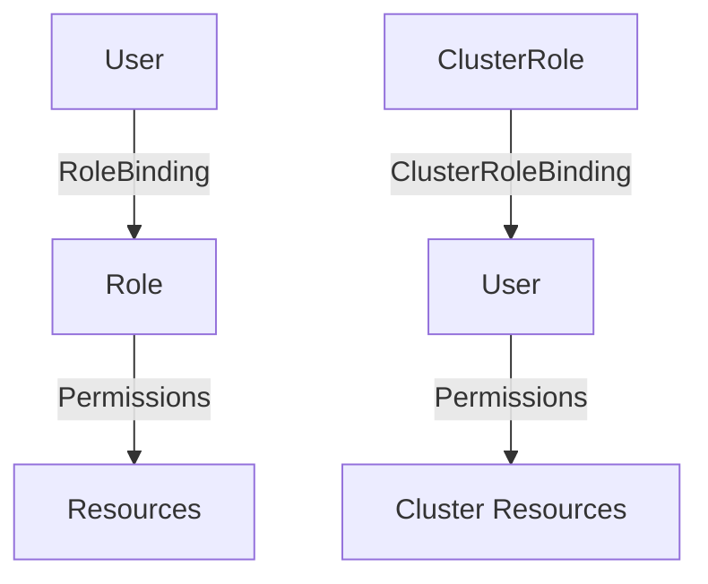

## Kubernetes Access Management

### Background Theory

Kubernetes is an open-source system for automating deployment, scaling, and management of containerized applications. One of the key aspects of managing a Kubernetes cluster is ensuring proper access control. Access management in Kubernetes revolves around roles, role bindings, and service accounts. These mechanisms allow administrators to define and enforce fine-grained access policies for users and services within the cluster.

### Key Concepts

#### Namespaces

A **namespace** in Kubernetes is a way to divide cluster resources between multiple users or projects. Each namespace provides a scope for names, allowing multiple teams to use the same cluster without name conflicts. Namespaces can also be used to enforce resource quotas and manage access control.

#### Roles and Role Bindings

- **Role**: A role is a set of permissions defined within a namespace. It specifies which actions can be performed on which resources.
- **ClusterRole**: Similar to a role, but it defines permissions across the entire cluster, not just within a namespace.
- **RoleBinding**: A role binding associates a role with a user or group within a namespace.
- **ClusterRoleBinding**: Associates a cluster role with a user or group across the entire cluster.

### Setting Up Access Control

Let's walk through setting up access control for two types of users: `admin` and `developer`.

#### Creating a Namespace

First, we create a namespace called `test`. This namespace will be used to demonstrate access permissions.

```bash
kubectl create namespace test
```

This command creates a new namespace named `test`.

#### Defining Roles and Role Bindings

We need to define roles and role bindings for both the `admin` and `developer` users.

##### Admin User

For the `admin` user, we might define a role that allows read-only access to all resources in the cluster.

```yaml
# admin-role.yaml
apiVersion: rbac.authorization.k8s.io/v1
kind: ClusterRole
metadata:
  name: admin-role
rules:
- apiGroups: ["*"]
  resources: ["*"]
  verbs: ["get", "list", "watch"]
```

Next, we bind this role to the `admin` user.

```yaml
# admin-rolebinding.yaml
apiVersion: rbac.authorization.k8s.io/v1
kind: ClusterRoleBinding
metadata:
  name: admin-rolebinding
subjects:
- kind: User
  name: admin
roleRef:
  kind: ClusterRole
  name: admin-role
  apiGroup: rbac.authorization.k8s.io
```

Apply these configurations:

```bash
kubectl apply -f admin-role.yaml
kubectl apply -f admin-rolebinding.yaml
```

##### Developer User

For the `developer` user, we might define a role that allows full access to a specific namespace, such as `online-boutique`.

```yaml
# developer-role.yaml
apiVersion: rbac.authorization.k8s.io/v1
kind: Role
metadata:
  namespace: online-boutique
  name: developer-role
rules:
- apiGroups: [""]
  resources: ["pods", "services", "deployments"]
  verbs: ["get", "list", "watch", "create", "update", "patch", "delete"]
```

Next, we bind this role to the `developer` user.

```yaml
# developer-rolebinding.yaml
apiVersion: rbac.authorization.k8s.io/v1
kind: RoleBinding
metadata:
  namespace: online-boutique
  name: developer-rolebinding
subjects:
- kind: User
  name: developer
roleRef:
  kind: Role
  name: developer-role
  apiGroup: rbac.authorization.k8s.io
```

Apply these configurations:

```bash
kubectl apply -f developer-role.yaml
kubectl apply -f developer-rolebinding.yaml
```

### Testing Access Permissions

Now that we have defined and applied the roles and role bindings, let's test the access permissions for both users.

#### Admin User

The `admin` user should be able to describe a pod in the `kube-system` namespace but should not be able to create or modify resources.

```bash
kubectl describe pod <pod-id> -n kube-system
```

Expected output:

```plaintext
Name:         <pod-id>
Namespace:    kube-system
...
```

However, attempting to create a new resource should fail:

```bash
kubectl run my-pod --image=nginx -n kube-system
```

Expected error:

```plaintext
Error from server (Forbidden): pods is forbidden: User "admin" cannot create resource "pods" in API group "" in the namespace "kube-system"
```

#### Developer User

The `developer` user should only have access to the `online-boutique` namespace.

```bash
kubectl get namespace online-boutique
```

Expected output:

```plaintext
NAME             STATUS   AGE
online-boutique   Active   1h
```

Attempting to access other namespaces should fail:

```bash
kubectl get namespace kube-system
```

Expected error:

```plaintext
Error from server (Forbidden): namespaces is forbidden: User "developer" cannot list resource "namespaces" in API group "" at the cluster scope
```

### Mermaid Diagrams

#### Role and Role Binding Architecture



### Real-World Examples

#### Recent CVEs and Breaches

One notable breach involving Kubernetes access management was the **CVE-2021-25741**. This vulnerability allowed unauthorized access to Kubernetes clusters due to misconfigured RBAC rules. In this case, a misconfigured role binding allowed a low-privilege user to escalate their privileges and gain full access to the cluster.

To prevent such issues, it is crucial to regularly audit and review RBAC configurations to ensure they align with least privilege principles.

### How to Prevent / Defend

#### Detection

Regularly audit RBAC configurations using tools like `kubectl auth can-i` to check what actions a user can perform.

```bash
kubectl auth can-i get pods --as=developer -n online-boutique
```

Expected output:

```plaintext
yes
```

#### Prevention

1. **Least Privilege Principle**: Ensure that users and services have only the minimum permissions necessary to perform their tasks.
2. **Regular Audits**: Periodically review and update RBAC configurations to ensure they remain secure.
3. **Automated Tools**: Use automated tools like `kube-bench` to check for compliance with best practices.

#### Secure Coding Fixes

##### Vulnerable Code

```yaml
# vulnerable-rolebinding.yaml
apiVersion: rbac.authorization.k8s.io/v1
kind: RoleBinding
metadata:
  namespace: online-boutique
  name: developer-rolebinding
subjects:
- kind: User
  name: developer
roleRef:
  kind: Role
  name: developer-role
  apiGroup: rbac.authorization.k8s.io
```

##### Fixed Code

```yaml
# fixed-rolebinding.yaml
apiVersion: rbac.authorization.k8s.io/v1
kind: RoleBinding
metadata:
  namespace: online-boutique
  name: developer-rolebinding
subjects:
- kind: User
  name: developer
roleRef:
  kind: Role
  name: developer-role
  apiGroup: rbac.authorization.k8s.io
```

### Complete Example

#### Full HTTP Request and Response

##### Request

```http
GET /api/v1/namespaces/online-boutique/pods HTTP/1.1
Host: kubernetes.default.svc.cluster.local
Authorization: Bearer <token>
```

##### Response

```http
HTTP/1.1 200 OK
Content-Type: application/json
Date: Mon, 01 Jan 2024 00:00:00 GMT
Content-Length: 1234

{
  "apiVersion": "v1",
  "items": [
    {
      "metadata": {
        "name": "my-pod",
        "namespace": "online-boutique"
      },
      "spec": {
        "containers": [
          {
            "name": "nginx",
            "image": "nginx:latest"
          }
        ]
      }
    }
  ],
  "kind": "PodList",
  "metadata": {
    "resourceVersion": "123456789"
  }
}
```

### Common Pitfalls

1. **Overly Permissive Roles**: Avoid granting unnecessary permissions to users or services.
2. **Misconfigured Role Bindings**: Ensure that role bindings are correctly scoped to the intended namespace or cluster.
3. **Outdated RBAC Configurations**: Regularly review and update RBAC configurations to reflect current security requirements.

### Hands-On Labs

For practical experience with Kubernetes access management, consider the following labs:

- **Kubernetes Goat**: A hands-on lab for learning Kubernetes security.
- **OWASP WrongSecrets**: A series of challenges to learn about Kubernetes security.
- **kube-hunter**: A tool for hunting down security misconfigurations in Kubernetes clusters.

These labs provide real-world scenarios and challenges to help solidify your understanding of Kubernetes access management.

### Conclusion

Proper access management in Kubernetes is critical for maintaining the security and integrity of your cluster. By carefully defining and enforcing roles and role bindings, you can ensure that users and services have only the necessary permissions to perform their tasks. Regular audits and the use of automated tools can help detect and prevent potential security issues.

---
<!-- nav -->
[[07-Kubernetes Access Management Part 4|Kubernetes Access Management Part 4]] | [[DevSecOps/DevSecOps Bootcamp/03-Identity & Access Management/02-Kubernetes Access Management/Review and Test Access/00-Overview|Overview]] | [[09-Kubernetes Access Management Part 6|Kubernetes Access Management Part 6]]
