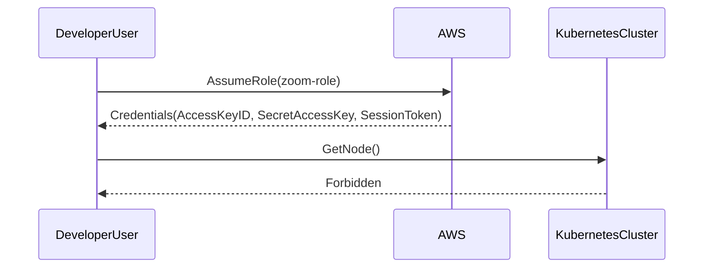
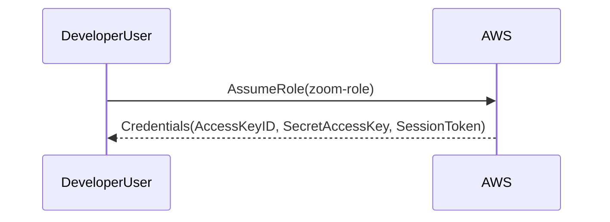

## Kubernetes Access Management

### Background Theory

Kubernetes is an open-source system for automating deployment, scaling, and management of containerized applications. One of the critical aspects of managing a Kubernetes cluster is ensuring proper access control to its resources. This involves defining roles, binding those roles to users or groups, and enforcing policies to restrict access based on the principle of least privilege.

### Role-Based Access Control (RBAC)

Role-Based Access Control (RBAC) is a method of regulating access to computer or network resources based on the roles of individual users within an organization. In Kubernetes, RBAC is implemented using three main components:

1. **Roles**: Define a set of permissions.
2. **RoleBindings**: Bind roles to users or groups within a specific namespace.
3. **ClusterRoles**: Similar to roles but apply cluster-wide.
4. **ClusterRoleBindings**: Bind cluster roles to users or groups across the entire cluster.

### Example Scenario: Zoom Role

In the given scenario, we have a role named `zoom-role` with an associated ARN (Amazon Resource Name). This role is being assumed by a developer user, and the credentials are set using an access key ID, secret access key, and session token.



### Testing Access

Let's break down the steps involved in testing the access of the `zoom-role`.

#### Step 1: Assumption of Role

The developer user assumes the `zoom-role` using the provided credentials. This role grants limited access to specific resources within the `online-boutique` namespace.



#### Step 2: Get Node

The developer user attempts to retrieve information about the nodes in the cluster.

```bash
kubectl get nodes
```

However, since the role does not have permissions to access nodes, the request is denied.

```http
HTTP/1.1 403 Forbidden
Content-Type: application/json
{
    "kind": "Status",
    "apiVersion": "v1",
    "metadata": {},
    "status": "Failure",
    "message": "nodes is forbidden: User \"developer-user\" cannot list resource \"nodes\" in API group \"\"",
    "reason": "Forbidden",
    "details": {
        "kind": "nodes"
    },
    "code": 403
}
```

#### Step 3: List Pods Across All Namespaces

Next, the developer user tries to list pods across all namespaces.

```bash
kubectl get pods --all-namespaces
```

Since the role is restricted to the `online-boutique` namespace, the request fails.

```http
HTTP/1.1 403 Forbidden
Content-Type: application/json
{
    "kind": "Status",
    "apiVersion": "v1",
    "metadata": {},
    "status": "Failure",
    "message": "pods is forbidden: User \"developer-user\" cannot list resource \"pods\" in API group \"\" at the cluster scope",
    "reason": "Forbidden",
    "details": {
        "kind": "pods"
    },
    "code": 403
}
```

#### Step 4: List Pods in Online Boutique Namespace

Now, the developer user lists pods within the `online-boutique` namespace.

```bash
kubectl get pods -n online-boutique
```

Since there are no pods running in this namespace, the response indicates no resources were found.

```http
HTTP/1.1 200 OK
Content-Type: application/json
{
    "kind": "PodList",
    "apiVersion": "v1",
    "metadata": {
        "resourceVersion": "123456789"
    },
    "items": []
}
```

#### Step 5: List Services in Online Boutique Namespace

Finally, the developer user lists services within the `online-boutique` namespace.

```bash
kubectl get services -n online-boutique
```

Again, since there are no services, the response indicates no resources were found.

```http
HTTP/1.1 200 OK
Content-Type: application/json
{
    "kind": "ServiceList",
    "apiVersion": "v1",
    "metadata": {
        "resourceVersion": "123456789"
    },
    "items": []
}
```

### Role Definition

To understand the role definition, let's look at a sample `zoom-role` definition.

```yaml
# zoom-role.yaml
kind: Role
apiVersion: rbac.authorization.k8s.io/v1
metadata:
  namespace: online-boutique
  name: zoom-role
rules:
- apiGroups: [""]
  resources: ["pods", "services"]
  verbs: ["get", "list"]
```

This role allows the user to list pods and services within the `online-boutique` namespace.

### ClusterRole Definition

For comparison, let's consider a `cluster-role` definition that provides broader access.

```yaml
# cluster-role.yaml
kind: ClusterRole
apiVersion: rbac.authorization.k8s.io/v1
metadata:
  name: cluster-role
rules:
- apiGroups: [""]
  resources: ["pods", "services"]
  verbs: ["get", "list"]
```

### RoleBinding

To bind the role to a user, we use a `RoleBinding`.

```yaml
# rolebinding.yaml
kind: RoleBinding
apiVersion: rbac.authorization.k8s.io/v1
metadata:
  name: zoom-role-binding
  namespace: online-boutique
subjects:
- kind: User
  name: developer-user
roleRef:
  kind: Role
  name: zoom-role
  apiGroup: rbac.authorization.k8s.io
```

### ClusterRoleBinding

Similarly, to bind a `ClusterRole` to a user, we use a `ClusterRoleBinding`.

```yaml
# clusterrolebinding.yaml
kind: ClusterRoleBinding
apiVersion: rbac.authorization.k8s.io/v1
metadata:
  name: cluster-role-binding
subjects:
- kind: User
  name: developer-user
roleRef:
  kind: ClusterRole
  name: cluster-role
  apiGroup: rbac.authorization.k8s.io
```

### Real-World Examples

#### CVE-2021-25741: Kubernetes RBAC Misconfiguration

In 2021, a misconfiguration in Kubernetes RBAC led to unauthorized access to sensitive resources. This CVE highlights the importance of properly configuring roles and bindings to ensure that users only have access to the resources they need.

#### Breach Example: Docker Hub

In 2021, Docker Hub experienced a breach due to misconfigured RBAC settings. This incident underscores the need for regular audits and strict enforcement of access controls.

### How to Prevent / Defend

#### Detection

Regularly audit your RBAC configurations to ensure that roles and bindings are correctly defined. Tools like `kube-bench` and `kubescape` can help automate this process.

#### Prevention

1. **Least Privilege Principle**: Ensure that roles grant only the necessary permissions.
2. **Regular Audits**: Conduct periodic reviews of RBAC configurations.
3. **Automated Scanning**: Use tools like `kube-bench` and `kubescape` to scan for misconfigurations.

#### Secure Coding Fixes

**Vulnerable Code**

```yaml
# zoom-role.yaml
kind: Role
apiVersion: rbac.authorization.k8s.io/v1
metadata:
  namespace: online-boutique
  name: zoom-role
rules:
- apiGroups: [""]
  resources: ["*"]
  verbs: ["*"]
```

**Fixed Code**

```yaml
# zoom-role.yaml
kind: Role
apiVersion: rbac.authorization.k8s.io/v1
metadata:
  namespace: online-boutique
  name: zoom-role
rules:
- apiGroups: [""]
  resources: ["pods", "services"]
  verbs: ["get", "list"]
```

### Configuration Hardening

Ensure that your Kubernetes cluster is configured with strict RBAC policies. Use tools like `kube-bench` to validate your configurations against best practices.

### Conclusion

Properly managing access in a Kubernetes cluster is crucial for maintaining security and preventing unauthorized access. By following the principles of least privilege and regularly auditing your RBAC configurations, you can ensure that your cluster remains secure.

### Practice Labs

For hands-on practice with Kubernetes access management, consider the following labs:

- **Kubernetes Goat**: A red team exercise for Kubernetes security.
- **OWASP WrongSecrets**: A series of challenges focused on Kubernetes security.
- **kube-hunter**: A tool for finding security issues in Kubernetes clusters.

These labs provide practical experience in configuring and testing RBAC policies in a Kubernetes environment.

---
<!-- nav -->
[[09-Kubernetes Access Management Part 6|Kubernetes Access Management Part 6]] | [[DevSecOps/DevSecOps Bootcamp/03-Identity & Access Management/02-Kubernetes Access Management/Review and Test Access/00-Overview|Overview]] | [[11-Kubernetes Access Management Part 8|Kubernetes Access Management Part 8]]
