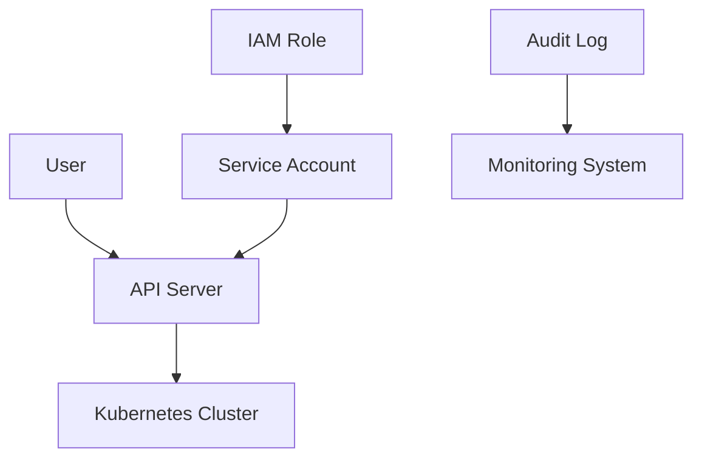
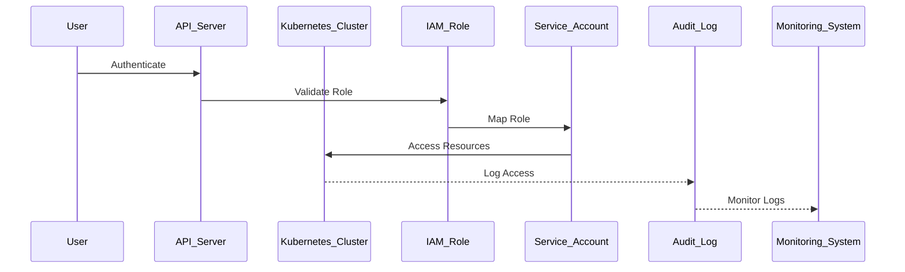

## Kubernetes Access Management

### Background Theory

Kubernetes is a powerful container orchestration system that allows developers to manage and scale applications efficiently. However, with great power comes great responsibility, especially when it comes to access management. Properly managing access to your Kubernetes cluster is crucial to ensure that only authorized personnel can perform actions that could potentially compromise the security of your applications and data.

Access management in Kubernetes involves controlling who can access the cluster and what actions they can perform. This is achieved through a combination of authentication and authorization mechanisms. Authentication verifies the identity of the user, while authorization determines what actions the authenticated user is allowed to perform.

### Authentication Mechanisms

Authentication in Kubernetes can be performed using several methods:

1. **X.509 Client Certificates**: Each user is issued a client certificate that is used to authenticate against the API server.
2. **Static Token Files**: Tokens are stored in a file and used to authenticate users.
3. **Service Accounts**: Service accounts are used to authenticate pods and other resources within the cluster.
4. **Webhook Authenticators**: Custom authentication plugins can be implemented to integrate with external authentication services like LDAP or OAuth.

#### Example: X.509 Client Certificate Authentication

To set up X.509 client certificate authentication, you need to generate a client certificate for each user and configure the API server to accept these certificates.

```bash
# Generate a client certificate
openssl req -new -newkey rsa:2048 -nodes -keyout client.key -out client.csr
openssl x509 -req -days 365 -in client.csr -CA ca.crt -CAkey ca.key -CAcreateserial -out client.crt

# Configure the API server to use client certificates
kubectl config set-credentials my-user --client-certificate=client.crt --client-key=client.key
```

### Authorization Mechanisms

Authorization in Kubernetes is typically handled by Role-Based Access Control (RBAC). RBAC allows you to define roles and bind them to users or groups, thereby controlling their access to resources within the cluster.

#### Roles and RoleBindings

Roles define a set of permissions, while RoleBindings associate these roles with specific users or groups.

```yaml
# Define a role
apiVersion: rbac.authorization.k8s.io/v1
kind: Role
metadata:
  namespace: default
  name: pod-reader
rules:
- apiGroups: [""]
  resources: ["pods"]
  verbs: ["get", "watch", "list"]

# Bind the role to a user
apiVersion: rbac.authorization.k8s.io/v1
kind: RoleBinding
metadata:
  name: read-pods
  namespace: default
subjects:
- kind: User
  name: johndoe
  apiGroup: rbac.authorization.k8s.io
roleRef:
  kind: Role
  name: pod-reader
  apiGroup: rbac.authorization.k8s.io
```

### Integration with AWS

In many organizations, Kubernetes clusters are deployed on cloud platforms like AWS. Managing access to these clusters often involves integrating Kubernetes access management with AWS Identity and Access Management (IAM).

#### Creating IAM Roles for Kubernetes

AWS IAM roles can be created to grant access to Kubernetes resources. These roles can then be mapped to Kubernetes service accounts using the `aws-iam-authenticator`.

```bash
# Create an IAM role
aws iam create-role --role-name KubernetesAdmin --assume-role-policy-document file://trust-policy.json

# Attach a policy to the role
aws iam attach-role-policy --role-name KubernetesAdmin --policy-arn arn:aws:iam::aws:policy/AdministratorAccess

# Map the IAM role to a Kubernetes service account
kubectl annotate serviceaccount default -n default aws-auth="mapRoles=[{groups:[\"system:masters\"],rolearn:\"arn:aws:iam::123456789012:role/KubernetesAdmin\"}]"
```

### Real-World Examples

#### Recent Breaches

One notable breach involving Kubernetes access management occurred in 2021 when a misconfigured Kubernetes cluster exposed sensitive data due to improper access controls. The cluster had a publicly accessible API server with default credentials, allowing unauthorized access to sensitive resources.

#### Secure Configuration

To prevent such breaches, it is essential to follow best practices for securing Kubernetes access management:

1. **Use Strong Authentication**: Ensure that strong authentication mechanisms are in place, such as X.509 client certificates or webhook authenticators.
2. **Implement RBAC**: Use RBAC to define fine-grained permissions and restrict access to only necessary resources.
3. **Monitor and Audit**: Regularly monitor and audit access logs to detect any unauthorized access attempts.

### How to Prevent / Defend

#### Detection

To detect unauthorized access attempts, you can enable audit logging in Kubernetes. Audit logs capture detailed information about API requests, including the user, resource, and action performed.

```yaml
# Enable audit logging
apiVersion: audit.k8s.io/v1
kind: Policy
rules:
- level: Metadata
  users: ["system:serviceaccount:kube-system:default"]
- level: Request
  users: ["system:anonymous"]
- level: RequestResponse
  verbs: ["create", "update", "delete"]
```

#### Prevention

To prevent unauthorized access, follow these best practices:

1. **Use Strong Authentication**: Implement strong authentication mechanisms like X.509 client certificates or webhook authenticators.
2. **Implement RBAC**: Define roles and role bindings to restrict access to only necessary resources.
3. **Regular Audits**: Perform regular audits of access logs to detect and respond to unauthorized access attempts.

#### Secure Coding Fixes

Here is an example of a vulnerable configuration and its secure counterpart:

**Vulnerable Configuration**

```yaml
# Vulnerable RoleBinding
apiVersion: rbac.authorization.k8s.io/v1
kind: RoleBinding
metadata:
  name: read-pods
  namespace: default
subjects:
- kind: User
  name: johndoe
  apiGroup: rbac.authorization.k8s.io
roleRef:
  kind: Role
  name: pod-reader
  apiGroup: rbac.authorization.k8s.io
```

**Secure Configuration**

```yaml
# Secure RoleBinding
apiVersion: rbac.authorization.k8s.io/v1
kind: RoleBinding
metadata:
  name: read-pods
  namespace: default
subjects:
- kind: User
  name: johndoe
  apiGroup: rb
roleRef:
  kind: Role
  name: pod-reader
  apiGroup: rbac.authorization.k8s.io
```

### Mermaid Diagrams

#### Kubernetes Access Management Architecture



#### Access Flow Sequence Diagram



### Practice Labs

For hands-on practice with Kubernetes access management, consider the following labs:

- **PortSwigger Web Security Academy**: Offers a module on Kubernetes security, including access management.
- **OWASP Juice Shop**: Provides a vulnerable application that includes Kubernetes security challenges.
- **Kubernetes Goat**: A vulnerable Kubernetes cluster designed for security testing and learning.

By following these best practices and using the provided tools and resources, you can effectively manage access to your Kubernetes cluster and ensure the security of your applications and data.

---
<!-- nav -->
[[10-Kubernetes Access Management Part 7|Kubernetes Access Management Part 7]] | [[DevSecOps/DevSecOps Bootcamp/03-Identity & Access Management/02-Kubernetes Access Management/Review and Test Access/00-Overview|Overview]] | [[12-Kubernetes Access Management Part 9|Kubernetes Access Management Part 9]]
