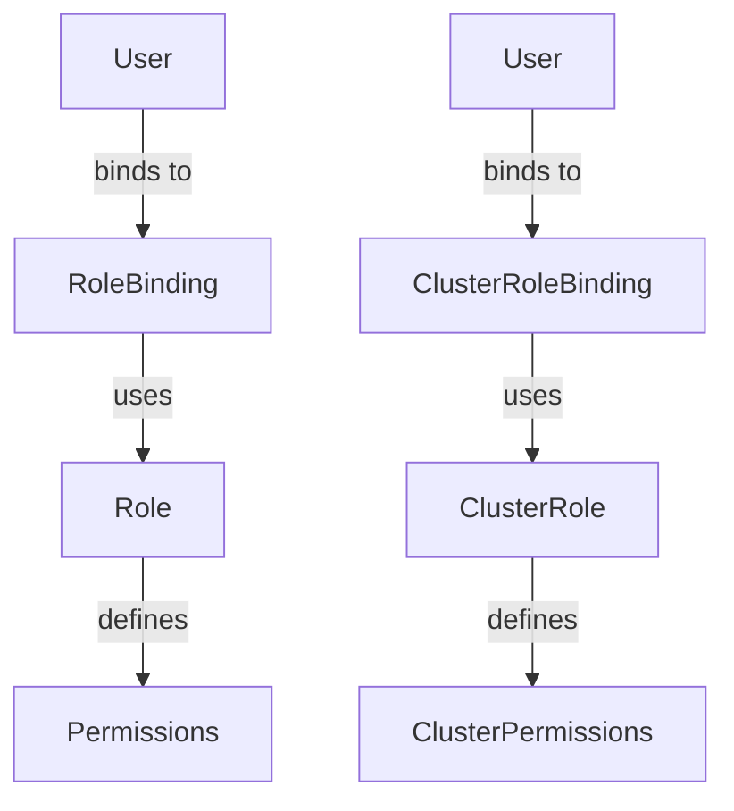

## Kubernetes Access Management

Kubernetes Access Management is a critical aspect of securing your cluster. It allows you to define and enforce policies that control who can access your resources and what actions they can perform. This is achieved through Role-Based Access Control (RBAC), which is a fundamental mechanism for managing access in Kubernetes.

### Role-Based Access Control (RBAC)

Role-Based Access Control (RBAC) is a method of regulating access to resources based on the roles of individual users within an organization. In Kubernetes, RBAC is used to control access to API endpoints. This means that you can define roles and bind those roles to users or groups, thereby controlling what actions they can perform within the cluster.

#### Roles and ClusterRoles

In Kubernetes, there are two types of roles:

- **Role**: Defines permissions within a namespace.
- **ClusterRole**: Defines permissions across the entire cluster.

These roles specify the set of operations that can be performed on specific resources. For example, a role might allow a user to list pods but not delete them.

```yaml
# Example Role definition
apiVersion: rbac.authorization.k8s.io/v1
kind: Role
metadata:
  namespace: default
  name: pod-reader
rules:
- apiGroups: [""]
  resources: ["pods"]
  verbs: ["get", "watch", "list"]
```

```yaml
# Example ClusterRole definition
apiVersion: rbac.authorization.k8s.io/v
kind: ClusterRole
metadata:
  name: pod-reader
rules:
- apiGroups: [""]
  resources: ["pods"]
  verbs: ["get", "watch", "list"]
```

#### RoleBindings and ClusterRoleBindings

To apply these roles to users or groups, you use RoleBindings and ClusterRoleBindings:

- **RoleBinding**: Binds a Role to a user or group within a namespace.
- **ClusterRoleBinding**: Binds a ClusterRole to a user or group across the entire cluster.

```yaml
# Example RoleBinding
apiVersion: rbac.authorization.k8s.io/v1
kind: RoleBinding
metadata:
  name: read-pods
  namespace: default
subjects:
- kind: User
  name: johndoe
  apiGroup: rbac.authorization.k8s.io
roleRef:
  kind: Role
  name: pod-reader
  apiGroup: rbac.authorization.k8s.io
```

```yaml
# Example ClusterRoleBinding
apiVersion: rbac.authorization.k8s.io/v1
kind: ClusterRoleBinding
metadata:
  name: read-pods-global
subjects:
- kind: Group
  name: developers
  apiGroup: rbac.authorization.k8s.io
roleRef:
  kind: ClusterRole
  name: pod-reader
  apiGroup: rbac.authorization.k8s.io
```

### Managing Multiple Engineers

In a typical development environment, you might have multiple engineers working on different parts of the system. You can organize these engineers into groups such as `admin` or `developer`, and assign appropriate roles to these groups.

#### Example Scenario

Suppose you have a team of engineers working on a Kubernetes cluster. You want to ensure that some engineers have administrative privileges, while others have more limited access.

1. **Define Roles**:
    - `admin-role`: Full access to all resources.
    - `developer-role`: Limited access to specific resources.

2. **Create RoleBindings**:
    - Bind `admin-role` to the `admins` group.
    - Bind `developer-role` to the `developers` group.

```yaml
# admin-role.yaml
apiVersion: rbac.authorization.k8s.io/v1
kind: ClusterRole
metadata:
  name: admin-role
rules:
- apiGroups: ["*"]
  resources: ["*"]
  verbs: ["*"]

# developer-role.yaml
apiVersion: rbac.authorization.k8s.io/v1
kind: Role
metadata:
  namespace: default
  name: developer-role
rules:
- apiGroups: [""]
  resources: ["pods"]
  verbs: ["get", "watch", "list"]
```

```yaml
# admin-binding.yaml
apiVersion: rbac.authorization.k8s.io/v1
kind: ClusterRoleBinding
metadata:
  name: admin-binding
subjects:
- kind: Group
  name: admins
  apiGroup: rbac.authorization.k8s.io
roleRef:
  kind: ClusterRole
  name: admin-role
  apiGroup: rb
```

```yaml
# developer-binding.yaml
apiVersion: rbac.authorization.k8s.io/v1
kind: RoleBinding
metadata:
  name: developer-binding
  namespace: default
subjects:
- kind: Group
  name: developers
  apiGroup: rbac.authorization.k8s.io
roleRef:
  kind: Role
  name: developer-role
  apiGroup: rbac.authorization.k8s.io
```

### Real-World Examples

#### CVE-2021-25741: Kubernetes API Server RBAC Bypass

In 2021, a critical vulnerability was discovered in the Kubernetes API server that allowed attackers to bypass RBAC controls. This vulnerability (CVE-2021-25741) affected versions of Kubernetes prior to 1.21.1, 1.20.7, and 1.19.10.

**Impact**: An attacker could exploit this vulnerability to gain unauthorized access to the Kubernetes API server and perform actions that were not intended by the RBAC policies.

**Mitigation**: Ensure that your Kubernetes clusters are updated to the latest versions to patch this vulnerability. Additionally, regularly review and audit your RBAC configurations to ensure they are correctly implemented.

### How to Prevent / Defend

#### Detection

Regularly monitor your Kubernetes cluster for unauthorized access attempts. Tools like Kubernetes Audit Logs can help you track who is accessing your resources and what actions they are performing.

```bash
# Example of enabling audit logging
kubectl edit configmap -n kube-system extension-apiserver-authentication
```

#### Prevention

1. **Least Privilege Principle**: Always follow the principle of least privilege. Grant users and groups the minimum level of access necessary to perform their tasks.
2. **Regular Audits**: Regularly review and audit your RBAC configurations to ensure they are correctly implemented and up-to-date.
3. **Patch Management**: Keep your Kubernetes clusters updated to the latest versions to patch known vulnerabilities.
4. **Secure Configuration**: Ensure that your Kubernetes configurations are secure. Use tools like `kube-bench` to check your cluster against CIS benchmarks.

#### Secure Coding Fixes

Here is an example of a vulnerable configuration and its secure counterpart:

**Vulnerable Configuration**:
```yaml
apiVersion: rbac.authorization.k8s.io/v1
kind: ClusterRole
metadata:
  name: full-access
rules:
- apiGroups: ["*"]
  resources: ["*"]
  verbs: ["*"]
```

**Secure Configuration**:
```yaml
apiVersion: rbac.authorization.k8s.io/v1
kind: ClusterRole
metadata:
  name: limited-access
rules:
- apiGroups: [""]
  resources: ["pods"]
  verbs: ["get", "watch", "list"]
```

### Mermaid Diagrams

#### Role and RoleBinding Architecture



### Practice Labs

For hands-on practice with Kubernetes Access Management, consider the following labs:

- **PortSwigger Web Security Academy**: Offers a series of labs focused on Kubernetes security, including RBAC.
- **OWASP Juice Shop**: While primarily focused on web application security, it includes scenarios involving Kubernetes deployments and access management.
- **Kubernetes Goat**: A red-team exercise designed to test and improve your Kubernetes security posture, including RBAC configurations.

By thoroughly understanding and implementing Kubernetes Access Management, you can significantly enhance the security of your cluster and protect it from unauthorized access.

---
<!-- nav -->
[[11-Kubernetes Access Management Part 8|Kubernetes Access Management Part 8]] | [[DevSecOps/DevSecOps Bootcamp/03-Identity & Access Management/02-Kubernetes Access Management/Review and Test Access/00-Overview|Overview]] | [[13-Kubernetes Access Management|Kubernetes Access Management]]
