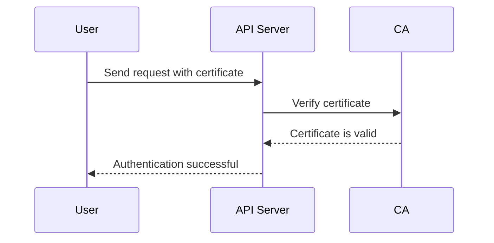

## Introduction to Kubernetes Access Management

Kubernetes is a powerful container orchestration platform that allows developers to manage and scale applications efficiently. However, with great power comes great responsibility, especially when it comes to securing access to the Kubernetes cluster. Access management in Kubernetes is crucial to ensure that only authorized entities can interact with the cluster and perform specific actions. This chapter delves into the intricacies of Kubernetes access management, focusing on Role-Based Access Control (RBAC).

### What is Kubernetes Access Management?

Access management in Kubernetes refers to the mechanisms and policies used to control who can access the cluster and what actions they can perform. This includes authentication (verifying the identity of the entity) and authorization (granting or denying access based on roles and permissions).

### Why is Access Management Important?

Access management is critical for several reasons:

1. **Security**: Ensures that only authorized entities can interact with the cluster, reducing the risk of unauthorized access and potential security breaches.
2. **Compliance**: Helps organizations comply with regulatory requirements by ensuring that access controls are properly implemented and audited.
3. **Operational Efficiency**: Simplifies the management of access rights, making it easier to grant and revoke permissions as needed.

### How Does Access Management Work in Kubernetes?

In Kubernetes, access management is primarily achieved through Role-Based Access Control (RBAC). RBAC allows you to define roles and bind those roles to users or groups, thereby controlling their access to resources within the cluster.

#### Authentication

Before any action can be performed, the Kubernetes API server must authenticate the user or application. This process verifies the identity of the entity attempting to access the cluster.

##### Methods of Authentication

- **Username and Password**: Basic authentication using a username and password.
- **X.509 Certificates**: Digital certificates issued by a trusted Certificate Authority (CA).
- **Service Accounts**: Tokens associated with service accounts, commonly used for applications running within the cluster.

##### Example: Authenticating with X.509 Certificates



#### Authorization

Once the user or application is authenticated, the Kubernetes API server checks the authorization to determine what actions the entity is permitted to perform.

##### Role-Based Access Control (RBAC)

RBAC is the primary mechanism for authorization in Kubernetes. It allows you to define roles and bind those roles to users or groups. Roles can be defined at the cluster level (ClusterRole) or at the namespace level (Role).

###### ClusterRole vs Role

- **ClusterRole**: Defines permissions across the entire cluster.
- **Role**: Defines permissions within a specific namespace.

##### Example: Defining a ClusterRole

```yaml
apiVersion: rbac.authorization.k8s.io/v1
kind: ClusterRole
metadata:
  name: pod-reader
rules:
- apiGroups: [""]
  resources: ["pods"]
  verbs: ["get", "list", "watch"]
```

This `ClusterRole` grants read-only access to pods across the entire cluster.

##### Example: Binding a ClusterRole to a User

```yaml
apiVersion: rbac.authorization.k8s.io/v
kind: ClusterRoleBinding
metadata:
  name: pod-reader-binding
subjects:
- kind: User
  name: alice
roleRef:
  kind: ClusterRole
  name: pod-reader
  apiGroup: rbac.authorization.k8s.io
```

This `ClusterRoleBinding` binds the `pod-reader` role to the user `alice`.

### Checking Privileges Using kubectl

The `kubectl` command-line tool provides several commands to check the privileges of users and roles within the cluster.

#### Viewing Roles and Bindings

You can list all roles and bindings using the following commands:

```bash
kubectl get roles --all-namespaces
kubectl get clusterroles
kubectl get rolebindings --all-namespaces
kubectl get clusterrolebindings
```

#### Checking User Privileges

To check the privileges of a specific user, you can use the `kubectl auth can-i` command. For example:

```bash
kubectl auth can-i get pods --as=alice
```

This command checks if the user `alice` has permission to get pods.

### Real-World Examples and Recent Breaches

Recent breaches and vulnerabilities highlight the importance of proper access management in Kubernetes clusters.

#### Example: CVE-2021-25741

CVE-2021-25741 is a privilege escalation vulnerability in Kubernetes. An attacker with access to a low-privileged service account could potentially escalate their privileges to gain full cluster access.

##### Impact

- **Unauthorized Access**: Attackers could gain unauthorized access to sensitive resources within the cluster.
- **Data Exfiltration**: Sensitive data could be exfiltrated from the cluster.

##### Prevention

- **Least Privilege Principle**: Ensure that service accounts and users have only the minimum necessary permissions.
- **Regular Audits**: Conduct regular audits to identify and mitigate potential privilege escalation vectors.

##### Secure Coding Fix

**Vulnerable Code**

```yaml
apiVersion: v1
kind: ServiceAccount
metadata:
  name: low-privilege-account
```

**Secure Code**

```yaml
apiVersion: v1
kind: ServiceAccount
metadata:
  name: low-privilege-account
---
apiVersion: rbac.authorization.k8s.io/v1
kind: ClusterRoleBinding
metadata:
  name: low-privilege-binding
subjects:
- kind: ServiceAccount
  name: low-privilege-account
roleRef:
  kind: ClusterRole
  name: low-privilege-role
  apiGroup: rbac.authorization.k8s.io
---
apiVersion: rbac.authorization.k8s.io/v1
kind: ClusterRole
metadata:
  name: low-privilege-role
rules:
- apiGroups: [""]
  resources: ["pods"]
  verbs: ["get", "list", "watch"]
```

By explicitly defining and binding roles, you can ensure that service accounts have only the necessary permissions.

### How to Prevent / Defend

#### Detection

- **Audit Logs**: Enable audit logging to track all API requests and responses.
- **Monitoring Tools**: Use tools like Prometheus and Grafana to monitor access patterns and detect anomalies.

#### Prevention

- **Least Privilege Principle**: Grant users and service accounts only the minimum necessary permissions.
- **Regular Audits**: Conduct regular audits to identify and mitigate potential security risks.
- **Secure Configuration**: Harden the Kubernetes configuration to reduce the attack surface.

#### Secure Coding Practices

- **Explicit Role Definitions**: Always explicitly define roles and bind them to users or service accounts.
- **Namespace Isolation**: Use namespaces to isolate resources and limit the scope of permissions.

### Conclusion

Kubernetes access management is a critical aspect of securing your cluster. By implementing robust authentication and authorization mechanisms, you can ensure that only authorized entities can interact with the cluster and perform specific actions. Regular audits and secure coding practices are essential to maintaining the security of your Kubernetes environment.

### Practice Labs

For hands-on practice with Kubernetes access management, consider the following labs:

- **Kubernetes Goat**: A security-focused Kubernetes environment designed to test and improve your security skills.
- **OWASP WrongSecrets**: A series of challenges focused on various security aspects, including access management in Kubernetes.

These labs provide practical experience in securing Kubernetes clusters and are highly recommended for mastering access management concepts.

---
<!-- nav -->
[[03-Introduction to Kubernetes Access Management Part 3|Introduction to Kubernetes Access Management Part 3]] | [[DevSecOps/DevSecOps Bootcamp/03-Identity & Access Management/02-Kubernetes Access Management/Role Based Access Control RBAC/00-Overview|Overview]] | [[05-Introduction to Kubernetes Access Management Part 5|Introduction to Kubernetes Access Management Part 5]]
