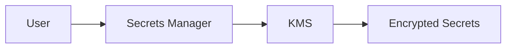
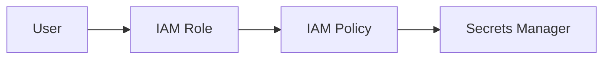
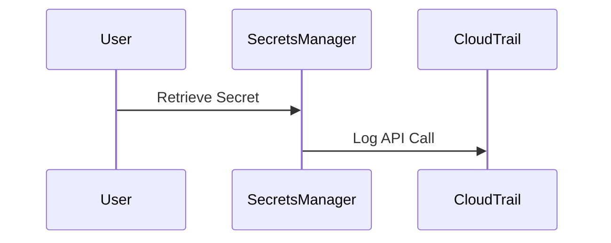

## Introduction to AWS Secrets Manager

### Background Theory

Secrets management is a critical aspect of securing applications and infrastructure. Secrets such as API keys, database passwords, and other sensitive information must be stored securely and managed throughout their lifecycle. AWS Secrets Manager is a service designed to help manage secrets securely and efficiently. It integrates seamlessly with other AWS services, providing a robust solution for handling sensitive data.

### Key Concepts

#### Centralized Secret Storage

AWS Secrets Manager stores secrets centrally, ensuring that sensitive data is not scattered across various systems. This centralization simplifies management and reduces the risk of unauthorized access. By storing secrets in a centralized location, you can enforce strict access controls and monitor usage more effectively.

#### Encryption Using KMS

One of the core features of AWS Secrets Manager is its integration with AWS Key Management Service (KMS). KMS is responsible for encrypting the secrets stored in Secrets Manager. This ensures that even if an attacker gains access to the storage, they cannot decrypt the secrets without the appropriate encryption keys.



#### Access Management Using IAM

Access to secrets is controlled using AWS Identity and Access Management (IAM). IAM allows you to define roles and policies that specify who can access which secrets and what actions they can perform. This granular control ensures that only authorized users can retrieve or modify secrets.



### Real-World Examples

Recent breaches and vulnerabilities often involve mismanagement of secrets. For instance, in 2021, a misconfigured AWS S3 bucket exposed sensitive data, including API keys and credentials. Such incidents highlight the importance of proper secrets management.

### Creating and Storing Secrets

To create and store secrets in AWS Secrets Manager, follow these steps:

1. **Create a Secret**:
   - Navigate to the AWS Secrets Manager console.
   - Click on "Store a new secret".
   - Choose the type of secret you want to store (e.g., database credentials, API keys).

2. **Configure Access Policies**:
   - Define IAM roles and policies to control access to the secret.
   - Specify which users or services can access the secret and what actions they can perform.

3. **Encrypt the Secret**:
   - AWS Secrets Manager automatically encrypts the secret using KMS.
   - You can choose to use a custom KMS key or the default one provided by AWS.

Here is an example of creating a secret using the AWS CLI:

```bash
aws secretsmanager create-secret \
    --name MyDatabaseSecret \
    --description "My database secret" \
    --secret-string '{"username":"myuser","password":"mypassword"}'
```

### Retrieving Secrets

To retrieve a secret, you can use the AWS SDK or the AWS CLI. Here is an example of retrieving a secret using the AWS CLI:

```bash
aws secretsmanager get-secret-value --secret-id MyDatabaseSecret
```

The response will include the encrypted secret value:

```http
HTTP/1.1 200 OK
Content-Type: application/json
Date: Thu, 01 Mar 2023 12:00:00 GMT
Content-Length: 123

{
    "ARN": "arn:aws:secretsmanager:us-west-2:123456789012:secret:MyDatabaseSecret",
    "Name": "MyDatabaseSecret",
    "VersionId": "EXAMPLE1-90ab-cdef-fedc-ba987EXAMPLE",
    "SecretString": "{\"username\":\"myuser\",\"password\":\"mypassword\"}",
    "VersionStages": ["AWSCURRENT"]
}
```

### Traceability Using CloudTrail

AWS CloudTrail logs API calls made to AWS Secrets Manager, providing traceability of who accessed or modified secrets. This helps in auditing and monitoring access to sensitive data.



### How to Prevent / Defend

#### Detection

To detect unauthorized access to secrets, enable CloudTrail logging and set up alerts for specific API calls related to Secrets Manager. Use AWS CloudWatch to monitor and alert on suspicious activity.

#### Prevention

1. **Use Strong IAM Policies**: Ensure that IAM roles and policies are strictly defined to limit access to secrets.
2. **Enable Multi-Factor Authentication (MFA)**: Require MFA for users who have access to sensitive secrets.
3. **Regularly Rotate Secrets**: Implement a process to regularly rotate secrets to minimize the risk of exposure.

#### Secure Coding Fixes

Compare the insecure and secure versions of accessing a secret:

**Insecure Version**:
```python
import boto3

client = boto3.client('secretsmanager')
response = client.get_secret_value(SecretId='MyDatabaseSecret')
print(response['SecretString'])
```

**Secure Version**:
```python
import boto3
import json

client = boto3.client('secretsmanager')
response = client.get_secret_value(SecretId='MyDatabaseSecret')
secret = json.loads(response['SecretString'])

# Use the secret securely
db_username = secret['username']
db_password = secret['password']

# Example usage
print(f"Connecting to database with username {db_username}")
```

### Complete Example

Here is a complete example of creating, storing, and retrieving a secret in AWS Secrets Manager:

1. **Create a Secret**:
   ```bash
   aws secretsmanager create-secret \
       --name MyDatabaseSecret \
       --description "My database secret" \
       --secret-string '{"username":"myuser","password":"mypassword"}'
   ```

2. **Retrieve the Secret**:
   ```bash
   aws secretsmanager get-secret-value --secret-id MyDatabaseSecret
   ```

3. **Response**:
   ```http
   HTTP/1.1 200 OK
   Content-Type: application/json
   Date: Thu, 01 Mar 2023 12:00:00 GMT
   Content-Length: 123

   {
       "ARN": "arn:aws:secretsmanager:us-west-2:123456789012:secret:MyDatabaseSecret",
       "Name": "MyDatabaseSecret",
       "VersionId": "EXAMPLE1-90ab-cdef-fedc-ba987EXAMPLE",
       "SecretString": "{\"username\":\"myuser\",\"password\":\"mypassword\"}",
       "VersionStages": ["AWSCURRENT"]
   }
   ```

### Hands-On Labs

For practical experience with AWS Secrets Manager, consider the following labs:

- **PortSwigger Web Security Academy**: Offers modules on secrets management and secure coding practices.
- **OWASP Juice Shop**: Provides a vulnerable web application where you can practice securing secrets.
- **DVWA (Damn Vulnerable Web Application)**: Another vulnerable web application for practicing security measures.

These labs provide real-world scenarios to apply the concepts learned in this chapter.

### Conclusion

AWS Secrets Manager is a powerful tool for managing secrets securely. By leveraging KMS for encryption and IAM for access control, you can ensure that sensitive data is protected throughout its lifecycle. Regularly rotating secrets and enabling multi-factor authentication further enhances security. With proper implementation and monitoring, you can significantly reduce the risk of unauthorized access to sensitive data.

---
<!-- nav -->
[[DevSecOps/DevSecOps Bootcamp/03-Identity & Access Management/03-Secrets Management/01-Introduction to AWS Secrets Manager/00-Overview|Overview]] | [[02-Introduction to Secrets Management in Kubernetes with AWS Secrets Manager|Introduction to Secrets Management in Kubernetes with AWS Secrets Manager]]
