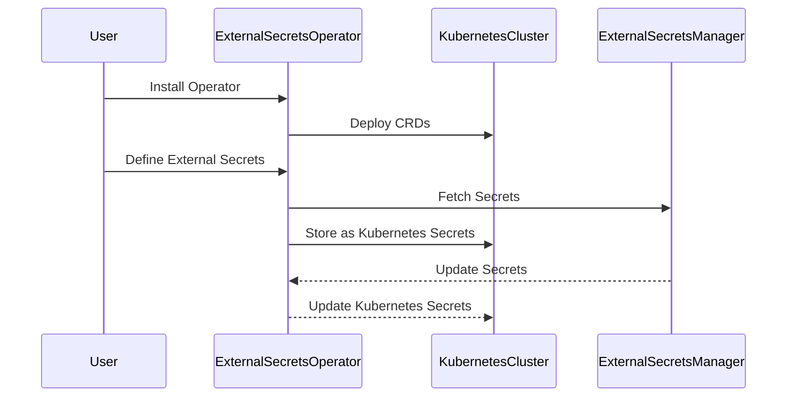

## Introduction to External Secrets Operator in Kubernetes

### Background Theory

In modern DevOps environments, managing secrets securely is a critical task. Secrets such as API keys, database passwords, and access tokens need to be stored and accessed in a way that minimizes exposure and ensures confidentiality. Kubernetes, being a widely used container orchestration platform, provides several mechanisms to manage secrets, but integrating with external secrets management tools like AWS Secrets Manager or HashiCorp Vault can introduce complexity.

The **External Secrets Operator** is a solution designed to simplify this integration. It acts as an intermediary between Kubernetes and various external secrets management systems, allowing you to manage secrets in a unified manner across different tools. This operator leverages Kubernetes Custom Resource Definitions (CRDs) to provide a consistent interface for managing secrets from different sources.

### What is the External Secrets Operator?

The External Secrets Operator is a Kubernetes controller that extends the functionality of Kubernetes by providing a generic way to manage secrets from external sources. It allows you to define secrets in Kubernetes using CRDs and automatically sync them with external secrets management systems. This means you can use the same mechanisms to manage secrets from AWS Secrets Manager, HashiCorp Vault, or any other supported system.

#### Why Use the External Secrets Operator?

1. **Unified Interface**: Instead of learning and configuring different methods for each secrets management tool, you can use a single, consistent approach.
2. **Automation**: The operator automates the process of fetching and updating secrets in Kubernetes, reducing manual intervention.
3. **Security**: By leveraging external secrets management systems, you can take advantage of their robust security features, such as encryption at rest and in transit.
4. **Scalability**: The operator scales with your Kubernetes cluster, ensuring that secrets are managed efficiently even as your infrastructure grows.

### How Does the External Secrets Operator Work?

The External Secrets Operator works by defining custom resources in Kubernetes that represent secrets from external sources. These custom resources are defined using CRDs, which are essentially custom APIs that extend Kubernetes.

Here’s a high-level overview of the workflow:

1. **Install the Operator**: Deploy the External Secrets Operator in your Kubernetes cluster.
2. **Define External Secrets**: Create custom resources that specify the location of secrets in external systems.
3. **Sync Secrets**: The operator fetches the secrets from the external systems and stores them as Kubernetes secrets.
4. **Update Secrets**: When the external secrets change, the operator updates the corresponding Kubernetes secrets.

#### Detailed Workflow Diagram



### Installing the External Secrets Operator

To install the External Secrets Operator, you need to deploy it in your Kubernetes cluster. This typically involves applying a set of manifests that define the operator and its associated CRDs.

#### Example Installation Manifest

```yaml
apiVersion: apps/v1
kind: Deployment
metadata:
  name: external-secrets-operator
spec:
  replicas: 1
  selector:
    matchLabels:
      app: external-secrets-operator
  template:
    metadata:
      labels:
        app: external-secrets-operator
    spec:
      containers:
      - name: external-secrets-operator
        image: external-secrets/kubernetes-external-secrets:v0.8.0
        args:
        - --leader-election-id=external-secrets
        - --namespace=default
```

Apply the manifest using `kubectl`:

```sh
kubectl apply -f external-secrets-operator.yaml
```

### Defining External Secrets

Once the operator is installed, you can define external secrets using custom resources. These resources specify the location of the secrets in external systems and how they should be synced with Kubernetes.

#### Example External Secret Definition

```yaml
apiVersion: externalsecrets.io/v1beta1
kind: ExternalSecret
metadata:
  name: my-secret
spec:
  backendType: awssm
  dataFrom:
  - key: my-secret-key
    name: my-secret-name
```

This definition specifies that the secret should be fetched from AWS Secrets Manager (`backendType: awssm`) and the key `my-secret-key` should be mapped to the Kubernetes secret `my-secret-name`.

### Syncing Secrets

When the External Secrets Operator detects a new or updated external secret definition, it fetches the secret from the specified external system and stores it as a Kubernetes secret.

#### Example Kubernetes Secret

```yaml
apiVersion: v1
kind: Secret
metadata:
  name: my-secret-name
type: Opaque
data:
  my-secret-key: <base64-encoded-value>
```

### Updating Secrets

If the external secret changes, the operator automatically updates the corresponding Kubernetes secret. This ensures that your applications always have access to the most up-to-date secrets.

### Real-World Examples

#### Recent Breaches and CVEs

One notable breach involving secrets management was the **Capital One breach** in 2019 (CVE-2019-11017). In this case, an attacker gained unauthorized access to sensitive data due to misconfigured AWS S3 buckets and improperly managed secrets. Using the External Secrets Operator could have helped mitigate this risk by ensuring that secrets were properly managed and encrypted.

Another example is the **Tesla breach** in 2020 (CVE-2020-28499), where an attacker exploited a misconfigured Kubernetes cluster to gain access to sensitive data. Proper use of the External Secrets Operator could have prevented this by ensuring that secrets were securely managed and not exposed in plaintext.

### Pitfalls and Common Mistakes

While the External Secrets Operator simplifies secrets management, there are still potential pitfalls to be aware of:

1. **Configuration Errors**: Incorrectly configured external secrets can lead to missing or incorrect secrets in Kubernetes.
2. **Permissions Issues**: Ensure that the operator has the necessary permissions to access external secrets and update Kubernetes secrets.
3. **Network Latency**: Fetching secrets from external systems can introduce latency, especially if the systems are hosted in different regions.

### How to Prevent / Defend

#### Detection

To detect issues with external secrets, you can use monitoring and logging tools to track the status of secrets and the operator itself. For example, you can set up alerts for failed secret fetches or updates.

#### Prevention

1. **Secure Configuration**: Ensure that external secrets are correctly configured and that the operator has the necessary permissions.
2. **Encryption**: Use encryption at rest and in transit for both external secrets and Kubernetes secrets.
3. **Regular Audits**: Regularly audit the configuration and usage of external secrets to identify and address any issues.

#### Secure Coding Fixes

Here’s an example of a vulnerable configuration and its secure counterpart:

**Vulnerable Configuration**

```yaml
apiVersion: externalsecrets.io/v1beta1
kind: ExternalSecret
metadata:
  name: my-secret
spec:
  backendType: awssm
  dataFrom:
  - key: my-secret-key
    name: my-secret-name
```

**Secure Configuration**

```yaml
apiVersion: externalsecrets.io/v1beta1
kind: ExternalSecret
metadata:
  name: my-secret
spec:
  backendType: awssm
  dataFrom:
  - key: my-secret-key
    name: my-secret-name
  refreshInterval: 1h
  secretStoreRef:
    kind: SecretStore
    name: aws-secret-store
```

In the secure configuration, we added a `refreshInterval` to ensure that secrets are regularly refreshed and a `secretStoreRef` to specify the secret store reference.

### Hands-On Labs

For practical experience with the External Secrets Operator, consider the following labs:

- **PortSwigger Web Security Academy**: Offers a module on secrets management in Kubernetes.
- **OWASP Juice Shop**: Provides a hands-on environment to practice securing secrets in a web application.
- **Kubernetes Goat**: A red-team exercise for Kubernetes security, including secrets management.

These labs will help you gain practical experience in deploying and managing the External Secrets Operator in a real-world scenario.

### Conclusion

The External Secrets Operator is a powerful tool for managing secrets in Kubernetes. By providing a unified interface for integrating with external secrets management systems, it simplifies the process of securing sensitive information. Understanding how to install, configure, and use the operator effectively is crucial for maintaining the security and integrity of your Kubernetes cluster.

---
<!-- nav -->
[[DevSecOps/DevSecOps Bootcamp/03-Identity & Access Management/03-Secrets Management/02-Introduction to External Secrets Operator in K8s/00-Overview|Overview]] | [[DevSecOps/DevSecOps Bootcamp/03-Identity & Access Management/03-Secrets Management/02-Introduction to External Secrets Operator in K8s/02-Practice Questions & Answers|Practice Questions & Answers]]
