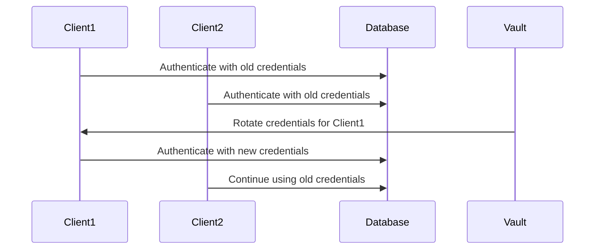
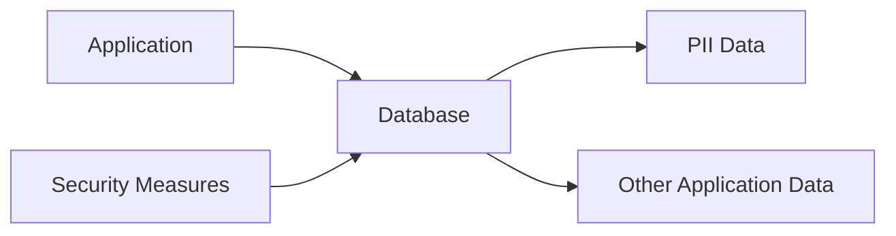
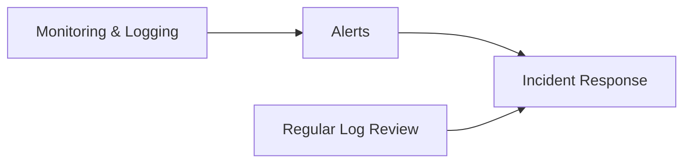
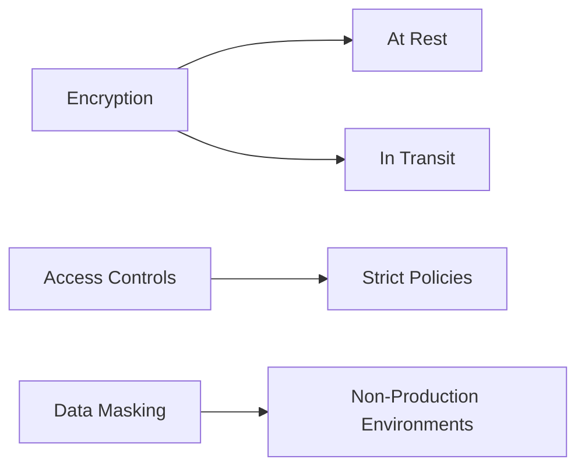

## Secrets Management and Revocation

### Background Theory

Secrets management is a critical aspect of modern DevSecOps practices. It involves the secure handling of sensitive information such as API keys, passwords, and cryptographic keys. One of the key challenges in secrets management is ensuring that credentials can be rotated without causing outages to legitimate clients. This requires a robust mechanism to isolate and revoke access for specific compromised entities while maintaining service availability for others.

### Revocation Mechanism

When rotating credentials for a system like a database, it is essential to minimize downtime for legitimate clients. Traditional methods often involve a complete credential rotation, which can lead to temporary outages as clients update their configurations. However, modern secrets management tools like HashiCorp Vault provide mechanisms to isolate and revoke access for specific clients without affecting others.

#### Example: Database Credential Rotation

Consider a scenario where a database uses a set of credentials for authentication. If one of these credentials is compromised, it is necessary to rotate the credentials to ensure security. However, rotating all credentials at once can cause an outage for all clients.



In this sequence diagram, `Client1` has its credentials rotated by `Vault`, while `Client2` continues to use the old credentials until it is ready to update. This approach minimizes downtime and isolates the impact of the credential rotation.

### Personal Identifiable Information (PII)

Apart from actual secrets, organizations also handle personal identifiable information (PII). PII refers to any information that can be used to uniquely identify an individual. Examples of PII include:

- Name
- Address
- Email address
- Phone number
- Social Security Number
- Date of birth

While PII is not typically classified as a secret, it still requires protection due to its sensitive nature. Exposing PII can have severe consequences, including identity theft and targeted phishing attacks.

#### Storing PII

PII should be stored securely, even though it is not considered a secret. Typically, PII is stored in regular databases alongside other application data. However, it is crucial to implement appropriate security measures to protect this data.



In this diagram, `Application` interacts with `Database`, which stores both `PII Data` and `Other Application Data`. `Security Measures` are implemented to protect the database.

### Security Implications of Exposed PII

Exposing PII can have significant security implications. Hackers can use this information to craft highly personalized phishing attacks, making them more convincing and harder to detect. For example, a hacker might use a victim's name, address, and date of birth to create a fake email that appears to come from a trusted source.

#### Real-World Example: Equifax Breach

The Equifax breach in 2017 is a notable example of the consequences of exposing PII. In this breach, hackers accessed sensitive information of over 147 million consumers, including names, Social Security numbers, birth dates, addresses, and driver’s license numbers. This information was then used to conduct various fraudulent activities, including identity theft and financial fraud.

### How to Prevent / Defend

#### Detection

To detect unauthorized access to PII, organizations should implement monitoring and logging mechanisms. This includes setting up alerts for unusual activity patterns and regularly reviewing logs for suspicious behavior.



In this diagram, `Monitoring & Logging` systems generate `Alerts` for unusual activity, triggering an `Incident Response`. Regular review of logs (`D`) also helps in detecting unauthorized access.

#### Prevention

Preventing exposure of PII involves implementing strong security controls and policies. This includes:

- **Encryption**: Encrypting PII both at rest and in transit.
- **Access Controls**: Implementing strict access controls to limit who can access PII.
- **Data Masking**: Using data masking techniques to hide sensitive information in non-production environments.



In this diagram, `Encryption` ensures data is protected both `At Rest` and `In Transit`. `Access Controls` enforce `Strict Policies`, and `Data Masking` hides sensitive information in `Non-Production Environments`.

#### Secure Coding Fixes

Here is an example of how to securely handle PII in code:

**Vulnerable Code:**

```python
def process_user_data(user_data):
    print(f"Processing user data: {user_data}")
```

**Secure Code:**

```python
import hashlib

def process_user_data(user_data):
    masked_data = {
        "name": hashlib.sha256(user_data["name"].encode()).hexdigest(),
        "email": hashlib.sha256(user_data["email"].encode()).hexdigest(),
        "phone": hashlib.sha256(user_data["phone"].encode()).hexdigest()
    }
    print(f"Processing masked user data: {masked_data}")
```

In the secure version, sensitive fields are hashed using SHA-256 to mask the data.

### Hands-On Labs

For practical experience with secrets management and PII protection, consider the following labs:

- **PortSwigger Web Security Academy**: Offers modules on securing sensitive data and handling PII.
- **OWASP Juice Shop**: Provides a vulnerable web application to practice securing PII and other sensitive data.
- **DVWA (Damn Vulnerable Web Application)**: Another vulnerable web application for practicing secure coding and data protection.

By thoroughly understanding and implementing these principles, organizations can significantly enhance their security posture and protect sensitive information effectively.

---
<!-- nav -->
[[DevSecOps/DevSecOps Bootcamp/03-Identity & Access Management/03-Secrets Management/08-Vault Capabilities Vault Deep Dive Part 1/02-Introduction to Secrets Management|Introduction to Secrets Management]] | [[DevSecOps/DevSecOps Bootcamp/03-Identity & Access Management/03-Secrets Management/08-Vault Capabilities Vault Deep Dive Part 1/00-Overview|Overview]] | [[DevSecOps/DevSecOps Bootcamp/03-Identity & Access Management/03-Secrets Management/08-Vault Capabilities Vault Deep Dive Part 1/04-Practice Questions & Answers|Practice Questions & Answers]]
