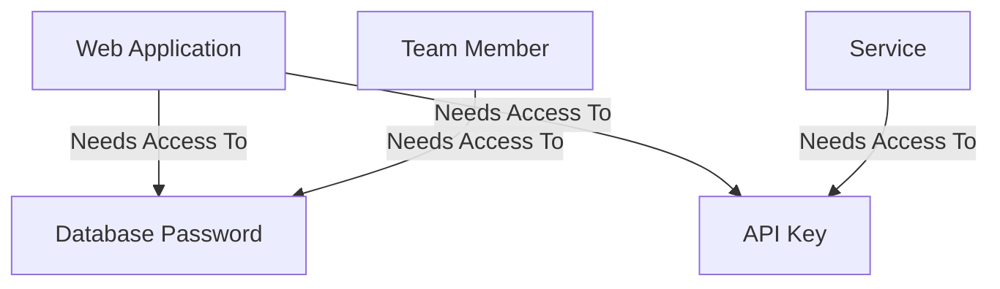
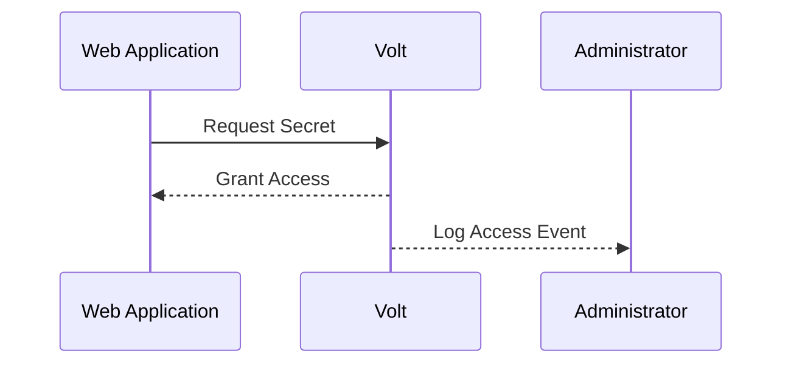
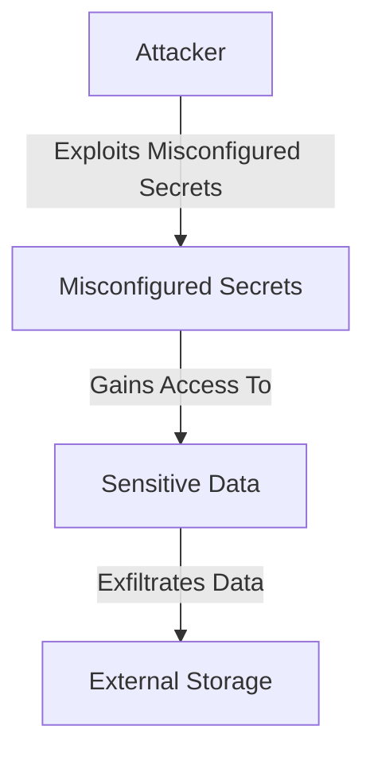

## Introduction to Secrets Management

In the realm of DevSecOps, managing secrets securely is paramount. Secrets encompass sensitive information such as API keys, database passwords, encryption keys, and other confidential data. These secrets are often required by applications to function correctly but pose significant risks if exposed. This chapter delves into the capabilities of secrets management tools, focusing on access control and auditing mechanisms. We will explore these concepts in depth, providing theoretical foundations, practical examples, and real-world scenarios to ensure a comprehensive understanding.

### Background Theory

#### What Are Secrets?

Secrets are pieces of sensitive information that are critical to the operation of an application but must be kept confidential. Examples include:

- **API Keys**: Used to authenticate requests to external services.
- **Database Passwords**: Credentials used to access databases.
- **Encryption Keys**: Used to encrypt and decrypt sensitive data.
- **SSH Keys**: Used for secure remote access to servers.

#### Why Manage Secrets Securely?

Managing secrets securely is essential to prevent unauthorized access and potential data breaches. Exposed secrets can lead to:

- **Data Leakage**: Unauthorized access to sensitive data.
- **Financial Loss**: Compromised financial systems due to stolen credentials.
- **Reputation Damage**: Loss of trust from customers and partners.

### Access Control in Secrets Management

Access control is a fundamental aspect of secrets management. It ensures that only authorized entities can access specific secrets. This section explores the principles and mechanisms of access control.

#### Principles of Access Control

Access control is based on the principle of least privilege (PoLP), which states that users should have the minimum level of access necessary to perform their job functions. This principle helps mitigate the risk of unauthorized access and reduces the attack surface.

#### Mechanisms of Access Control

Access control mechanisms typically involve:

- **Authentication**: Verifying the identity of the user or service.
- **Authorization**: Determining whether the authenticated entity is allowed to access a particular resource.
- **Role-Based Access Control (RBAC)**: Assigning permissions based on roles rather than individual identities.

#### Granular Access Management

Granular access management allows for fine-grained control over who can access which secrets. This is crucial in large organizations where different teams and services may require access to different sets of secrets.

##### Example: Granular Access Management in Volt

Volt is a hypothetical secrets management tool that provides granular access management. Let's consider a scenario where a web application needs access to a database password and an API key for an external service.



In this scenario, the web application requires access to both the database password and the API key. However, a team member might only need access to the database password, and a service might only need access to the API key. Volt allows us to configure these access controls granularly.

#### Implementation of Granular Access Management

To implement granular access management, we need to define roles and assign permissions accordingly. Here’s an example using a role-based access control system:

```yaml
# Role definitions
roles:
  - name: webapp_role
    permissions:
      - secret: database_password
      - secret: api_key
  - name: team_member_role
    permissions:
      - secret: database_password
  - name: service_role
    permissions:
      - secret: api_key

# User and service assignments
users:
  - username: webapp_user
    role: webapp_role
  - username: team_member
    role: team_member_role
services:
  - name: external_service
    role: service_role
```

In this example, `webapp_user` has access to both the database password and the API key, `team_member` has access only to the database password, and `external_service` has access only to the API key.

### Auditing in Secrets Management

Auditing is another critical capability of secrets management tools. It provides visibility into who accessed which secrets and when. This is analogous to having cameras in a building to monitor activities.

#### Purpose of Auditing

The primary purposes of auditing are:

- **Detection**: Identifying unauthorized access attempts.
- **Investigation**: Tracing the origin of a breach.
- **Compliance**: Meeting regulatory requirements for logging and monitoring.

#### Mechanisms of Auditing

Auditing mechanisms typically involve:

- **Logging**: Recording access events.
- **Monitoring**: Real-time tracking of access attempts.
- **Alerting**: Notifying administrators of suspicious activities.

#### Example: Auditing in Volt

Volt provides detailed auditing capabilities. Each access event is logged, including the timestamp, the entity accessing the secret, and the secret itself. This allows for thorough investigation in case of a breach.



In this sequence diagram, the web application requests a secret from Volt. Upon granting access, Volt logs the event and notifies the administrator.

#### Implementation of Auditing

To implement auditing, we need to configure logging and monitoring. Here’s an example using a logging framework:

```json
{
  "log": {
    "level": "info",
    "file": "/var/log/volt-access.log"
  },
  "monitor": {
    "interval": "1m",
    "alert": {
      "threshold": 5,
      "email": "admin@example.com"
    }
  }
}
```

In this configuration, access events are logged at the info level to `/var/log/volt-access.log`. Monitoring is set to check every minute (`1m`), and an alert is sent via email if more than five access events occur within the interval.

### Real-World Examples and Breaches

#### Recent CVEs and Breaches

Several high-profile breaches have occurred due to mismanaged secrets. Here are a few recent examples:

- **CVE-2021-44228 (Log4Shell)**: Although not directly related to secrets management, this vulnerability highlights the importance of securing sensitive data. Attackers exploited a flaw in the Apache Log4j library to execute arbitrary code, leading to widespread breaches.
- **GitHub Data Breach (2022)**: GitHub suffered a data breach where attackers gained access to private repositories containing sensitive information, including secrets. This incident underscores the need for robust access control and auditing mechanisms.

#### Case Study: Tesla Data Breach (2020)

Tesla experienced a data breach where an attacker gained access to internal documents and source code. The breach was attributed to misconfigured secrets management, allowing unauthorized access to sensitive data.



In this case study, the attacker exploited misconfigured secrets to gain access to sensitive data, which was then exfiltrated to external storage.

### How to Prevent / Defend

#### Detection

To detect unauthorized access, implement robust logging and monitoring mechanisms. Regularly review logs for suspicious activities and set up alerts for unusual patterns.

#### Prevention

To prevent unauthorized access, follow these best practices:

- **Use Strong Authentication**: Implement multi-factor authentication (MFA) for all users and services.
- **Enforce RBAC**: Assign permissions based on roles rather than individual identities.
- **Regularly Audit Access Controls**: Review and update access controls periodically to ensure they align with current organizational needs.

#### Secure Coding Fixes

Here’s an example of a vulnerable and secure version of a secrets management configuration:

**Vulnerable Version:**

```yaml
secrets:
  - name: database_password
    value: "password123"
  - name: api_key
    value: "abc123def456"
```

**Secure Version:**

```yaml
secrets:
  - name: database_password
    value: "{{ vault_secret('database_password') }}"
  - name: api_key
    value: "{{ vault_secret('api_key') }}"
```

In the secure version, secrets are stored in a vault and retrieved dynamically, ensuring they are not hardcoded in the configuration.

#### Configuration Hardening

Hardening configurations involves setting strict policies and enforcing them across the organization. Here’s an example of a hardened configuration:

```json
{
  "access_control": {
    "enabled": true,
    "roles": [
      {
        "name": "webapp_role",
        "permissions": ["database_password", "api_key"]
      },
      {
        "name": "team_member_role",
        "permissions": ["database_password"]
      },
      {
        "name": "service_role",
        "permissions": ["api_key"]
      }
    ]
  },
  "auditing": {
    "enabled": true,
    "log_file": "/var/log/volt-access.log",
    "monitor_interval": "1m",
    "alert_threshold": 5,
    "alert_email": "admin@example.com"
  }
}
```

In this configuration, access control and auditing are enabled with strict policies.

### Hands-On Practice

For hands-on practice, consider the following labs:

- **PortSwigger Web Security Academy**: Offers modules on secrets management and access control.
- **OWASP Juice Shop**: Provides a vulnerable web application for practicing secrets management techniques.
- **DVWA (Damn Vulnerable Web Application)**: Another vulnerable web application for learning about secrets management.

These labs provide real-world scenarios to apply the concepts learned in this chapter.

### Conclusion

Secrets management is a critical aspect of DevSecOps, ensuring that sensitive information is protected from unauthorized access. By implementing robust access control and auditing mechanisms, organizations can significantly reduce the risk of data breaches. Understanding the principles, mechanisms, and best practices of secrets management is essential for maintaining the security and integrity of sensitive data.

---
<!-- nav -->
[[DevSecOps/DevSecOps Bootcamp/03-Identity & Access Management/03-Secrets Management/Capabilities of Secrets Management Tools/00-Overview|Overview]] | [[DevSecOps/DevSecOps Bootcamp/03-Identity & Access Management/03-Secrets Management/Capabilities of Secrets Management Tools/02-Introduction to Secrets Management|Introduction to Secrets Management]]
