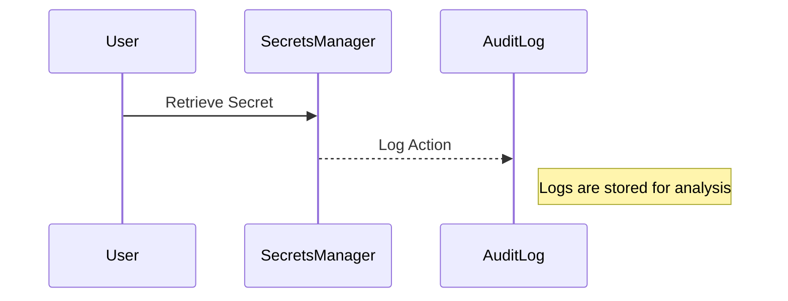

## Implementation and Best Practices

### Setting Up Secrets Management

#### Step-by-Step Guide

1. **Choose a Tool**: Select a secrets management tool that fits your organization's needs. Popular options include HashiCorp Vault, AWS Secrets Manager, and Azure Key Vault.
2. **Install and Configure**: Follow the installation instructions provided by the tool. Ensure that the tool is configured to meet your security requirements.
3. **Store Secrets**: Import existing secrets into the tool. Ensure that all secrets are encrypted both at rest and in transit.
4. **Integrate with Applications**: Modify applications to retrieve secrets from the management tool rather than storing them locally.

#### Example Configuration

Here’s an example of how to configure AWS Secrets Manager to store a database password:

```yaml
# AWS Secrets Manager Configuration
{
  "Name": "db-password",
  "SecretString": "my-secret-password"
}
```

### Access Controls

#### What Are Access Controls?

Access controls determine who can access the secrets and under what conditions. Proper access controls ensure that only authorized personnel can retrieve and use the secrets.

#### How Does It Work?

Access controls typically involve role-based access control (RBAC) and least privilege principles. Users are assigned roles based on their job functions, and each role is granted the minimum permissions necessary to perform their tasks.


#### Real-World Example

In the Equifax breach (CVE-2017-5638), attackers exploited a vulnerability in Apache Struts to gain unauthorized access to sensitive data. Proper access controls could have limited the damage by ensuring that only authorized personnel had access to critical systems.

### Auditing and Monitoring

#### What Is Auditing?

Auditing involves tracking and logging all activities related to the secrets management tool. This helps in detecting and responding to suspicious activities.

#### How Does It Work?

Audit logs record every action performed within the secrets management tool, including who accessed the secrets, when they accessed them, and what actions they performed. These logs can be analyzed to identify potential security incidents.



#### Real-World Example

In the SolarWinds supply chain attack (CVE-2020-1014), attackers gained access to SolarWinds’ systems and compromised their software updates. Proper auditing and monitoring could have detected the unauthorized access and prevented the attack.

---
<!-- nav -->
[[DevSecOps/DevSecOps Bootcamp/03-Identity & Access Management/03-Secrets Management/Capabilities of Secrets Management Tools/03-Common Pitfalls and How to Avoid Them|Common Pitfalls and How to Avoid Them]] | [[DevSecOps/DevSecOps Bootcamp/03-Identity & Access Management/03-Secrets Management/Capabilities of Secrets Management Tools/00-Overview|Overview]] | [[05-Key Features of Secrets Management Tools|Key Features of Secrets Management Tools]]
