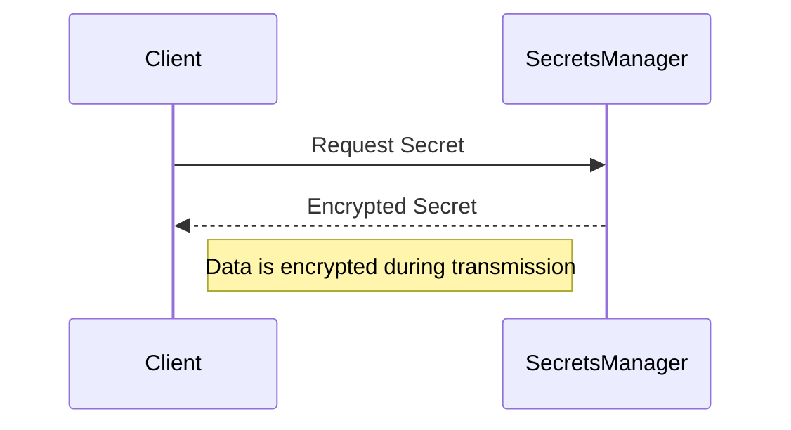
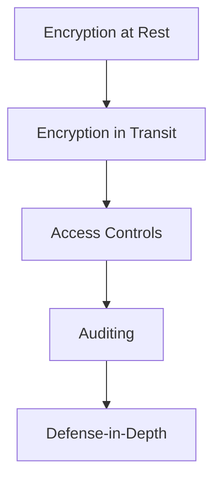

## Key Features of Secrets Management Tools

### Encryption at Rest

#### What Is Encryption at Rest?

Encryption at rest refers to the process of converting data into a coded form while it is stored. This ensures that even if an attacker gains access to the storage medium, they cannot read the data without the decryption key.

#### How Does It Work?

When secrets are stored in a secrets management tool, they are encrypted using strong cryptographic algorithms. For instance, AES (Advanced Encryption Standard) is commonly used due to its strength and efficiency.

#### Real-World Example

Consider a recent breach where an attacker gained unauthorized access to a company's database. If the secrets were stored in plaintext, the attacker could easily read and misuse them. However, with encryption at rest, the attacker would only see gibberish, rendering the data useless without the decryption key.

### Encryption in Transit

#### What Is Encryption in Transit?

Encryption in transit ensures that data remains secure while being transferred between systems. This is crucial because data in transit is often more vulnerable to interception than data at rest.

#### How Does It Work?

When secrets are transmitted from the secrets management tool to the client (e.g., a web application), they are encrypted using protocols like TLS (Transport Layer Security). This ensures that even if an attacker intercepts the data, they cannot read it without the decryption key.

#### Real-World Example

A notable example is the Heartbleed bug (CVE-2014-0160), which affected OpenSSL and allowed attackers to read sensitive data from memory, including encryption keys. If secrets were properly encrypted in transit, this vulnerability would have been less impactful.

### Layered Security

#### What Is Layered Security?

Layered security, often referred to as defense-in-depth, involves implementing multiple layers of security controls to protect against threats. Each layer provides an additional barrier that an attacker must overcome.

#### How Does It Work?

By combining encryption at rest, encryption in transit, access controls, and auditing, secrets management tools create a robust security framework. This multi-layered approach makes it significantly harder for attackers to compromise the system.

#### Real-World Example

The Capital One breach (CVE-2019-11510) involved an attacker exploiting a misconfigured firewall to gain unauthorized access to sensitive customer data. Had the data been properly encrypted and managed through a secrets management tool, the impact of the breach would have been minimized.

---
<!-- nav -->
[[04-Implementation and Best Practices|Implementation and Best Practices]] | [[DevSecOps/DevSecOps Bootcamp/03-Identity & Access Management/03-Secrets Management/Capabilities of Secrets Management Tools/00-Overview|Overview]] | [[DevSecOps/DevSecOps Bootcamp/03-Identity & Access Management/03-Secrets Management/Capabilities of Secrets Management Tools/06-Practice Labs|Practice Labs]]
