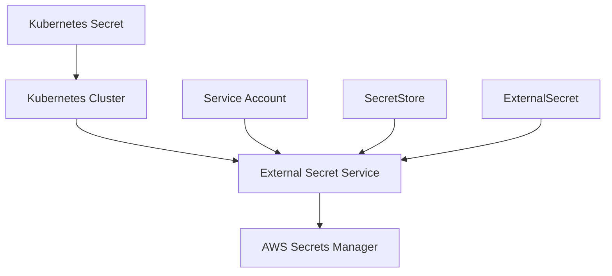

## Introduction to Secrets Management in DevSecOps

In the realm of DevSecOps, managing secrets securely is a critical aspect of ensuring the integrity and confidentiality of your applications and infrastructure. Secrets can include API keys, database passwords, SSH keys, and other sensitive information that must be protected from unauthorized access. In this chapter, we will delve into the process of creating a `SecretStore` and an `ExternalSecret`, which allows you to manage secrets stored in external secret stores such as AWS Secrets Manager within a Kubernetes cluster.

### Background Theory

Before diving into the practical steps, it's essential to understand the theoretical underpinnings of secrets management in Kubernetes and the broader DevSecOps landscape.

#### What is a Secret?

A **Secret** in Kubernetes is an object that contains a small amount of sensitive data, such as a password, OAuth token, or SSH key. Secrets are designed to keep sensitive data out of your pods and containers, making it easier to manage and rotate credentials.

#### Why Manage Secrets Securely?

Managing secrets securely is crucial because:

- **Data Protection**: Ensures that sensitive data remains confidential and is not exposed to unauthorized users.
- **Compliance**: Helps organizations meet regulatory requirements such as GDPR, HIPAA, and PCI-DSS.
- **Security Best Practices**: Adheres to the principle of least privilege, reducing the risk of insider threats and external attacks.

### External Secret Service

The **External Secret Service** is a tool that enables Kubernetes clusters to fetch secrets from external secret stores, such as AWS Secrets Manager, HashiCorp Vault, or Azure Key Vault. This service acts as a bridge between the Kubernetes cluster and the external secret store, allowing you to manage secrets in a centralized and secure manner.

#### Components of External Secret Service

1. **SecretStore**: A custom resource definition (CRD) that defines the connection details to an external secret store.
2. **ExternalSecret**: A CRD that specifies which secrets to retrieve from the external secret store and how to map them to Kubernetes secrets.

### Setting Up the Environment

To set up the environment for managing secrets using the External Secret Service, you need to perform the following steps:

1. **Deploy External Secret Service**: Install the External Secret Service in your Kubernetes cluster.
2. **Configure Service Account**: Set up a service account in the cluster with the necessary permissions to access the external secret store.
3. **Create SecretStore**: Define the connection details to the external secret store.
4. **Create ExternalSecret**: Specify which secrets to retrieve from the external secret store and how to map them to Kubernetes secrets.

### Step-by-Step Guide

#### Deploy External Secret Service

First, you need to deploy the External Secret Service in your Kubernetes cluster. This can be done using Helm charts or by applying the necessary manifests.

```yaml
# Example Helm chart installation
helm repo add external-secrets https://external-secrets.github.io/kubernetes-external-secrets/
helm install external-secrets external-secrets/kubernetes-external-secrets
```

#### Configure Service Account

Next, configure a service account in the cluster with the necessary permissions to access the external secret store. For AWS Secrets Manager, you need to create an IAM role and attach it to the service account.

```yaml
apiVersion: v1
kind: ServiceAccount
metadata:
  name: external-secrets-sa
  namespace: default
---
apiVersion: rbac.authorization.k8s.io/v1
kind: Role
metadata:
  name: external-secrets-role
  namespace: default
rules:
- apiGroups: [""]
  resources: ["secrets"]
  verbs: ["get", "list", "watch", "create", "update", "patch", "delete"]
---
apiVersion: rbac.authorization.k8s.io/v1
kind: RoleBinding
metadata:
  name: external-secrets-binding
  namespace: default
roleRef:
  apiGroup: rbac.authorization.k8s.io
  kind: Role
  name: external-secrets-role
subjects:
- kind: ServiceAccount
  name: external-secrets-sa
  namespace: default
```

#### Create SecretStore

Now, create a `SecretStore` CRD that defines the connection details to the external secret store. For AWS Secrets Manager, you need to specify the ARN of the IAM role and the region.

```yaml
apiVersion: external-secrets.io/v1beta1
kind: SecretStore
metadata:
  name: aws-secrets-manager
spec:
  provider:
    aws:
      secretsManager:
        roleArn: arn:aws:iam::123456789012:role/external-secrets-role
        region: us-east-1
```

#### Create ExternalSecret

Finally, create an `ExternalSecret` CRD that specifies which secrets to retrieve from the external secret store and how to map them to Kubernetes secrets.

```yaml
apiVersion: external-secrets.io/v1beta1
kind: ExternalSecret
metadata:
  name: my-secret
spec:
  refreshInterval: 1h
  secretStoreRef:
    name: aws-secrets-manager
  target:
    name: my-kubernetes-secret
    creationPolicy: Owner
  dataFrom:
  - extract:
      key: my-secret-key
      remoteRef:
        key: my-secret-key
```

### Diagramming the Architecture

Let's visualize the architecture using a Mermaid diagram:



### Real-World Examples

#### Recent CVEs and Breaches

One notable breach involving secrets management was the **Capital One Data Breach** in 2019. An attacker gained unauthorized access to a misconfigured AWS S3 bucket, which contained sensitive customer data. This breach highlights the importance of securing secrets and ensuring proper access controls.

#### Secure Coding Practices

To prevent similar breaches, follow these secure coding practices:

1. **Use Strong Authentication**: Ensure that the service account used to access the external secret store has strong authentication mechanisms in place.
2. **Least Privilege Principle**: Grant the service account only the minimum permissions required to access the necessary secrets.
3. **Regular Audits**: Perform regular audits to ensure that secrets are being managed securely and that no unauthorized access has occurred.

### How to Prevent / Defend

#### Detection

To detect unauthorized access to secrets, implement logging and monitoring solutions that track access to the external secret store and the Kubernetes cluster.

```yaml
# Example logging configuration
apiVersion: v1
kind: ConfigMap
metadata:
  name: fluent-bit-config
data:
  fluent-bit.conf: |
    [SERVICE]
        Flush        1
        Daemon       Off
        Log_Level    info
        Parsers_File parsers.conf
    [INPUT]
        Name              tail
        Path              /var/log/containers/*.log
        Parser            docker
        Tag               kube.*
    [FILTER]
        Name                kubernetes
        Match               kube.*
        Kube_URL            https://kubernetes.default.svc:443
        Kube_CA_File        /var/run/secrets/kubernetes.io/serviceaccount/ca.crt
        Kube_Token_File     /var/run/secrets/kubernetes.io/serviceaccount/token
        Kube_Tag_Prefix     kube.var.log.containers.
        Merge_Log           On
        Ignore_Old_Logs     On
        Keep_Time           On
    [OUTPUT]
        Name                stdout
        Match               *
```

#### Prevention

To prevent unauthorized access to secrets, implement the following measures:

1. **Strong Access Controls**: Ensure that only authorized users and services have access to the external secret store and the Kubernetes cluster.
2. **Encryption at Rest**: Encrypt secrets at rest using strong encryption algorithms.
3. **Regular Audits**: Perform regular audits to ensure that secrets are being managed securely and that no unauthorized access has occurred.

#### Secure-Coding Fixes

Here is an example of a vulnerable code snippet and its secure counterpart:

**Vulnerable Code**

```yaml
apiVersion: v1
kind: Secret
metadata:
  name: my-secret
type: Opaque
data:
  password: cGFzc3dvcmQ=  # Base64 encoded password
```

**Secure Code**

```yaml
apiVersion: v1
kind: Secret
metadata:
  name: my-secret
type: Opaque
data:
  password: cGFzc3dvcmQ=  # Base64 encoded password
---
apiVersion: rbac.authorization.k8s.io/v1
kind: Role
metadata:
  name: my-secret-role
  namespace: default
rules:
- apiGroups: [""]
  resources: ["secrets"]
  verbs: ["get"]
---
apiVersion: rbac.authorization.k8s.io/v1
kind: RoleBinding
metadata:
  name: my-secret-binding
  namespace:  default
roleRef:
  apiGroup: rbac.authorization.k8s.io
  kind: Role
  name: my-secret-role
subjects:
- kind: ServiceAccount
  name: my-service-account
  namespace: default
```

### Hands-On Labs

To practice managing secrets in a Kubernetes cluster, you can use the following labs:

- **PortSwigger Web Security Academy**: Offers a variety of labs focused on web application security, including secrets management.
- **OWASP Juice Shop**: A deliberately insecure web application for practicing web security skills.
- **DVWA (Damn Vulnerable Web Application)**: Another popular web application for practicing web security skills.
- **WebGoat**: A deliberately insecure Java web application maintained by OWASP.

For DevSecOps-specific labs, consider the following:

- **CloudGoat**: A cloud security training platform that includes labs focused on managing secrets in cloud environments.
- **flaws.cloud**: A cloud security training platform that includes labs focused on managing secrets in cloud environments.
- **AWS Official Workshops**: Provides hands-on labs for learning about AWS services, including secrets management.

### Conclusion

Managing secrets securely is a critical aspect of DevSecOps. By using tools like the External Secret Service, you can centralize and secure the management of secrets in your Kubernetes cluster. Following secure coding practices and implementing strong access controls can help prevent unauthorized access to sensitive data. Regular audits and monitoring can help detect and respond to potential security incidents.

---
<!-- nav -->
[[04-Introduction to Secrets Management in DevSecOps Part 4|Introduction to Secrets Management in DevSecOps Part 4]] | [[DevSecOps/DevSecOps Bootcamp/03-Identity & Access Management/03-Secrets Management/Create SecretStore and ExternalSecret/00-Overview|Overview]] | [[06-Introduction to Secrets Management in Kubernetes|Introduction to Secrets Management in Kubernetes]]
