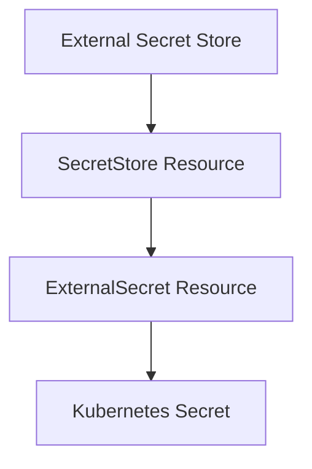
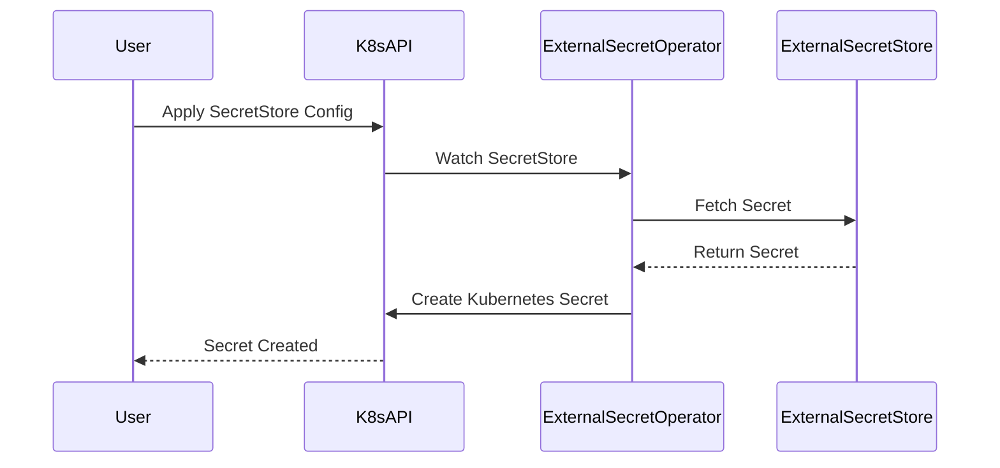

## Introduction to Secrets Management

Secrets management is a critical aspect of modern DevSecOps practices. In the context of containerized applications and microservices, managing sensitive information such as API keys, database passwords, and other credentials securely is paramount. This chapter delves into the creation and management of secret stores and external secrets using Kubernetes and tools like `kubeseal` and `external-secrets`.

### Background Theory

Secrets management involves storing, distributing, and rotating sensitive information securely. In Kubernetes, secrets are used to store sensitive data such as passwords, tokens, and keys. These secrets are encoded in base64 and stored in the etcd backend, ensuring they are not exposed in plain text within the cluster.

#### Cluster Secret Store

A cluster secret store is a centralized repository for storing secrets across multiple namespaces within a Kubernetes cluster. This allows for better organization and management of secrets, especially in large-scale environments. The cluster secret store can be managed using various tools, including `external-secrets`, which integrates with external secret stores like HashiCorp Vault, AWS Secrets Manager, and Azure Key Vault.

### Creating a Cluster Secret Store

To create a cluster secret store, you first need to install the `external-secrets` operator. This operator watches for custom resources defined in your Kubernetes cluster and automatically syncs secrets from external sources.

#### Installation Steps

1. **Install the `external-secrets` Operator**:
   ```sh
   kubectl apply -f https://raw.githubusercontent.com/external-secrets/external-secrets/master/deploy/crds.yaml
   kubectl apply -f https://raw.githubusercontent.com/external-secrets/external-secrets/master/deploy/operator.yaml
   ```

2. **Create a Secret Store Resource**:
   Define a `SecretStore` resource to specify the external secret store you want to use. For example, if you are using HashiCorp Vault:

   ```yaml
   apiVersion: external-secrets.io/v1beta1
   kind: SecretStore
   metadata:
     name: vault-secret-store
   spec:
     provider:
       vault:
         server: http://vault.example.com:8200
         path: secret/data/
         auth:
           token: <your-vault-token>
   ```

   Apply this configuration to your cluster:
   ```sh
   kubectl apply -f secret-store.yaml
   ```

### Creating an External Secret

Once the cluster secret store is set up, you can create external secrets that reference specific secrets from the external store.

#### Define the External Secret

An `ExternalSecret` resource specifies which secret to fetch from the external store and where to store it in the Kubernetes cluster.

```yaml
apiVersion: external-secrets.io/v1beta1
kind: ExternalSecret
metadata:
  name: my-external-secret
spec:
  refreshInterval: 1h
  secretStoreRef:
    name: vault-secret-store
  target:
    name: my-kubernetes-secret
    namespace: default
  dataFrom:
    - name: my-remote-secret
      property: password
```

This configuration does the following:
- References the `vault-secret-store` created earlier.
- Specifies a refresh interval of 1 hour.
- Defines the target Kubernetes secret (`my-kubernetes-secret`) where the fetched secret will be stored.
- Specifies the remote secret (`my-remote-secret`) and the property (`password`) to fetch.

Apply this configuration:
```sh
kubectl apply -f external-secret.yaml
```

### Detailed Explanation of Components

#### Secret Store Reference

The `secretStoreRef` field in the `ExternalSecret` resource references the `SecretStore` resource that was previously created. This tells the `external-secrets` operator which external secret store to use.

#### Data From

The `dataFrom` field specifies the remote secret and the property to fetch. In this example, `name: my-remote-secret` refers to the name of the secret in the external store, and `property: password` specifies the key-value pair to retrieve.

#### Target Secret

The `target` field defines where the fetched secret will be stored in the Kubernetes cluster. The `name` and `namespace` fields specify the name and namespace of the Kubernetes secret.

### Full Example with Raw HTTP Messages

Consider a scenario where you are using AWS Secrets Manager as the external secret store. Here’s how you might configure the `SecretStore` and `ExternalSecret` resources:

#### SecretStore Configuration

```yaml
apiVersion: external-secrets.io/v1beta1
kind: SecretStore
metadata:
  name: aws-secret-store
spec:
  provider:
    aws:
      region: us-west-2
      accessKeyID: <your-access-key-id>
      secretAccessKey: <your-secret-access-key>
```

#### ExternalSecret Configuration

```yaml
apiVersion: external-secrets.io/v1beta1
kind: ExternalSecret
metadata:
  name: my-aws-external-secret
spec:
  refreshInterval: 1h
  secretStoreRef:
    name: aws-secret-store
  target:
    name: my-kubernetes-secret
    namespace: default
  dataFrom:
    - name: my-aws-secret
      property: password
```

### Mermaid Diagrams

#### Secret Store Architecture



#### Request/Response Flow



### Common Pitfalls and Best Practices

#### Pitfall: Hardcoding Secrets

Hardcoding secrets directly into your application code or configuration files is a significant security risk. Instead, use environment variables or Kubernetes secrets to manage sensitive information.

#### Best Practice: Rotate Secrets Regularly

Regularly rotating secrets helps mitigate the risk of unauthorized access. Automate this process using tools like `external-secrets` to ensure secrets are updated periodically.

### How to Prevent / Defend

#### Detection

Monitor your Kubernetes cluster for unauthorized access to secrets. Use tools like `Falco` or `kube-bench` to detect suspicious activities.

#### Prevention

1. **Use Strong Authentication**: Ensure strong authentication mechanisms are in place for accessing external secret stores.
2. **Limit Permissions**: Restrict permissions to only those users and services that require access to the secrets.
3. **Audit Logs**: Enable audit logs to track access to secrets and detect any unauthorized activity.

#### Secure Coding Fixes

Compare the insecure and secure versions of a secret management setup:

**Insecure Version**
```yaml
apiVersion: v1
kind: Secret
metadata:
  name: my-insecure-secret
type: Opaque
data:
  password: cGFzc3dvcmQ=  # Base64 encoded password
```

**Secure Version**
```yaml
apiVersion: v1
kind: Secret
metadata:
  name: my-secure-secret
type: Opaque
data:
  password: <dynamic-value-from-external-store>
```

### Real-World Examples

#### Recent Breaches

- **CVE-2021-20225**: A vulnerability in Kubernetes allowed unauthorized access to secrets due to improper validation of API requests.
- **AWS Secrets Manager Breach**: In 2021, a misconfiguration in AWS Secrets Manager led to unauthorized access to sensitive data.

### Hands-On Labs

For practical experience with secrets management in Kubernetes, consider the following labs:

- **PortSwigger Web Security Academy**: Offers modules on securing web applications, including handling sensitive data.
- **OWASP Juice Shop**: A deliberately insecure web application for practicing security testing and learning about common vulnerabilities.
- **Kubernetes Goat**: A Kubernetes-based security training platform that includes challenges related to secrets management.

By following these steps and best practices, you can effectively manage secrets in your Kubernetes cluster, ensuring the security and integrity of your applications.

---
<!-- nav -->
[[07-Introduction to Secrets Management Part 1|Introduction to Secrets Management Part 1]] | [[DevSecOps/DevSecOps Bootcamp/03-Identity & Access Management/03-Secrets Management/Create SecretStore and ExternalSecret/00-Overview|Overview]] | [[09-Introduction to Secrets Management Part 3|Introduction to Secrets Management Part 3]]
