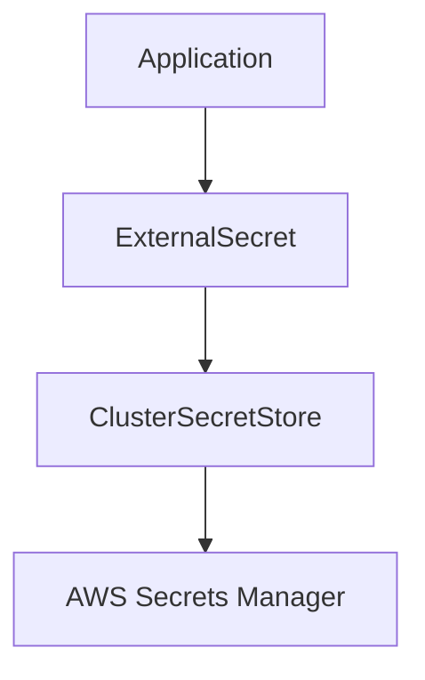

## Creating a Secret Store and External Secret

### Background Theory

In Kubernetes, secrets are managed using custom resource definitions (CRDs). A CRD is a way to extend the Kubernetes API to support custom resources. By defining a CRD, you can create custom objects that behave similarly to built-in Kubernetes resources.

For secrets management, we use the `external-secrets` operator, which provides a way to manage secrets stored in external secret stores. The `external-secrets` operator uses two main CRDs:

1. **ClusterSecretStore**: Defines the connection to an external secret store.
2. **ExternalSecret**: Defines how to fetch secrets from the external secret store and inject them into a Kubernetes namespace.

### Step-by-Step Mechanics

#### Step 1: Define the ClusterSecretStore

The `ClusterSecretStore` is a cluster-wide configuration that establishes a connection to an external secret store. This configuration is defined in the platform folder, as it applies to the entire cluster.

```yaml
apiVersion: external-secrets.io/v1beta1
kind: ClusterSecretStore
metadata:
  name: aws-secrets-store
spec:
  provider:
    aws:
      region: us-east-1
```

**Explanation:**

- `apiVersion`: Specifies the version of the API used by the `external-secrets` operator.
- `kind`: Indicates that this is a `ClusterSecretStore`.
- `metadata.name`: A unique name for the secret store.
- `spec.provider.aws.region`: Specifies the AWS region where the secret store is located.

#### Step 2: Define the ExternalSecret

The `ExternalSecret` is defined in the application section and specifies how to fetch secrets from the external secret store and inject them into a specific namespace.

```yaml
apiVersion: external-secrets.io/v1beta1
kind: ExternalSecret
metadata:
  name: my-app-secret
  namespace: my-namespace
spec:
  secretStoreRef:
    name: aws-secrets-store
    kind: ClusterSecretStore
  target:
    name: my-app-secret
    creationPolicy: Owner
  dataFrom:
  - extract:
      key: my-secret-key
      remoteRef:
        key: my-secret-key
```

**Explanation:**

- `apiVersion`: Specifies the version of the API used by the `external-secrets` operator.
- `kind`: Indicates that this is an `ExternalSecret`.
- `metadata.name`: A unique name for the external secret.
- `metadata.namespace`: The namespace where the secret will be injected.
- `spec.secretStoreRef`: References the `ClusterSecretStore` defined earlier.
- `spec.target.name`: The name of the secret to be created in the namespace.
- `spec.dataFrom.extract.key`: The key of the secret to be fetched from the external secret store.
- `spec.dataFrom.extract.remoteRef.key`: The key of the secret in the external secret store.

### Complete Example

Let's put it all together with a complete example. Assume we have a Kubernetes cluster with the `external-secrets` operator installed.

#### Platform Folder Configuration

Create a new folder in the platform section and define the `ClusterSecretStore`.

```yaml
# platform/secret-store.yaml
apiVersion: external-secrets.io/v1beta1
kind: ClusterSecretStore
metadata:
  name: aws-secrets-store
spec:
  provider:
    aws:
      region: us-east-1
```

#### Application Section Configuration

Define the `ExternalSecret` in the application section.

```yaml
# application/my-app-secret.yaml
apiVersion: external-secrets.io/v1beta1
kind: ExternalSecret
metadata:
  name: my-app-secret
  namespace: my-namespace
spec:
  secretStoreRef:
    name: aws-secrets-store
    kind: ClusterSecretStore
  target:
    name: my-app-secret
    creationPolicy: Owner
  dataFrom:
  - extract:
      key: my-secret-key
      remoteRef:
        key: my-secret-key
```

### Mermaid Diagrams

#### Architecture Diagram



This diagram shows the flow of secrets from the external secret store (AWS Secrets Manager) to the application via the `ExternalSecret` and `ClusterSecretStore`.

### Common Pitfalls and Best Practices

#### Pitfall: Hardcoding Secrets

One common mistake is hardcoding secrets directly into application code or configuration files. This practice exposes secrets to anyone with access to the codebase and can lead to unauthorized access.

**Best Practice: Use Environment Variables**

Instead of hardcoding secrets, use environment variables to pass secrets to applications. This approach ensures that secrets are not stored in plain text within the codebase.

#### Pitfall: Insecure Distribution

Another pitfall is insecure distribution of secrets. Distributing secrets over unencrypted channels or using weak encryption methods can expose secrets to interception.

**Best Practice: Use Secure Channels**

Always use secure channels (such as HTTPS) for distributing secrets. Additionally, ensure that encryption methods are strong and up-to-date.

### How to Prevent / Defend

#### Detection

To detect unauthorized access to secrets, implement logging and monitoring of access patterns. Use tools like Kubernetes audit logs to track access to secrets.

#### Prevention

1. **Use Strong Authentication Mechanisms**: Ensure that only authorized users and services can access secrets.
2. **Rotate Secrets Regularly**: Change secrets periodically to minimize the window of opportunity for an attacker.
3. **Limit Access**: Restrict access to secrets to only those who need it. Use role-based access control (RBAC) to enforce least privilege.

#### Secure Coding Fixes

##### Vulnerable Code

```yaml
# application/my-app-secret.yaml
apiVersion: v1
kind: Secret
metadata:
  name: my-app-secret
type: Opaque
data:
  password: cGFzc3dvcmQ=  # Base64 encoded password
```

##### Fixed Code

```yaml
# application/my-app-secret.yaml
apiVersion: external-secrets.io/v1beta1
kind: ExternalSecret
metadata:
  name: my-app-secret
  namespace: my-namespace
spec:
  secretStoreRef:
    name: aws-secrets-store
    kind: ClusterSecretStore
  target:
    name: my-app-secret
    creationPolicy: Owner
  dataFrom:
  - extract:
      key: my-secret-key
      remoteRef:
        key: my-secret-key
```

### Real-World Example: Capital One Data Breach

The Capital One data breach in 2019 (CVE-2019-11510) was caused by a misconfigured firewall rule that allowed unauthorized access to sensitive data. This breach highlights the importance of proper secrets management and secure coding practices.

### Hands-On Labs

For hands-on practice with secrets management in Kubernetes, consider the following labs:

- **PortSwigger Web Security Academy**: Offers a comprehensive set of labs covering various aspects of web security, including secrets management.
- **OWASP Juice Shop**: A deliberately insecure web application for practicing web security skills.
- **Kubernetes Goat**: A Kubernetes-based security training platform that includes exercises on secrets management.

These labs provide practical experience in implementing and securing secrets in a Kubernetes environment.

### Conclusion

Secrets management is a critical aspect of DevSecOps, ensuring that sensitive information is securely stored, distributed, and managed. By following best practices and using tools like the `external-secrets` operator, you can significantly enhance the security of your applications and services.

---
<!-- nav -->
[[10-Introduction to Secrets Management|Introduction to Secrets Management]] | [[DevSecOps/DevSecOps Bootcamp/03-Identity & Access Management/03-Secrets Management/Create SecretStore and ExternalSecret/00-Overview|Overview]] | [[12-Creating a Secret Store in Kubernetes|Creating a Secret Store in Kubernetes]]
