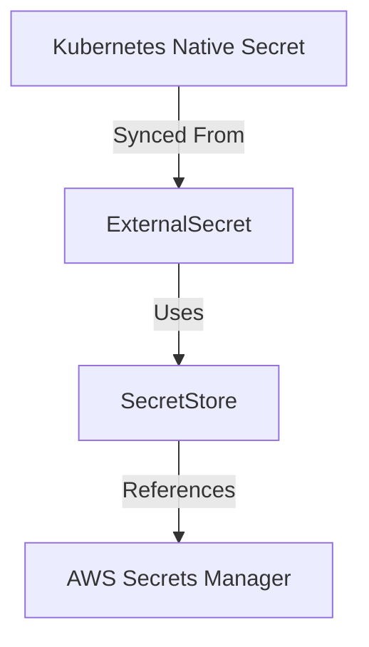
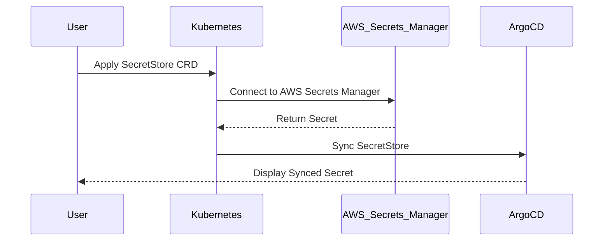

## Creating a SecretStore and ExternalSecret

### SecretStore Overview

A `SecretStore` is a custom resource definition (CRD) that defines a connection to an external secrets store, such as AWS Secrets Manager or Azure Key Vault. This allows Kubernetes to securely retrieve and manage secrets from these external stores.

#### Step-by-Step Guide to Creating a SecretStore

1. **Define the SecretStore CRD**: First, you need to define the `SecretStore` CRD in your Kubernetes cluster. This involves creating a YAML file that specifies the connection details to the external secrets store.

```yaml
apiVersion: secrets-store.csi.k8s.io/v1
kind: SecretStore
metadata:
  name: my-secret-store
spec:
  provider: aws-secrets-manager
  parameters:
    region: us-west-2
```

2. **Apply the SecretStore CRD**: Once the YAML file is defined, apply it to your Kubernetes cluster using `kubectl`.

```bash
kubectl apply -f secretstore.yaml
```

3. **Verify the SecretStore**: After applying the CRD, verify that the `SecretStore` has been successfully created and configured.

```bash
kubectl get secretstores
```

### ExternalSecret Overview

An `ExternalSecret` is another CRD that references a `SecretStore` and specifies which secrets to retrieve from the external store. This allows Kubernetes to automatically sync secrets from the external store into the cluster.

#### Step-by-Step Guide to Creating an ExternalSecret

1. **Define the ExternalSecret CRD**: Create a YAML file that defines the `ExternalSecret` and specifies the `SecretStore` to use.

```yaml
apiVersion: external-secrets.io/v1beta1
kind: ExternalSecret
metadata:
  name: my-external-secret
spec:
  secretStoreRef:
    name: my-secret-store
    kind: SecretStore
  target:
    name: my-kubernetes-secret
    creationPolicy: Owner
  dataFrom:
  - extract:
      key: stripe-api-key
      name: stripe-api-key
```

2. **Apply the ExternalSecret CRD**: Apply the YAML file to your Kubernetes cluster using `kubectl`.

```bash
kubectl apply -f externalsecret.yaml
```

3. **Verify the ExternalSecret**: Verify that the `ExternalSecret` has been successfully created and that the secrets have been synced into the cluster.

```bash
kubectl get externalsecrets
```

### Visualizing with ArgoCD

ArgoCD is a declarative, GitOps continuous delivery tool for Kubernetes. It can be used to visualize and manage the state of your Kubernetes resources, including `SecretStore` and `ExternalSecret`.

#### Step-by-Step Guide to Visualizing with ArgoCD

1. **Install ArgoCD**: Install ArgoCD in your Kubernetes cluster using the official documentation.

```bash
kubectl create namespace argocd
kubectl apply -n argocd -f https://raw.githubusercontent.com/argoproj/argo-cd/stable/manifests/install.yaml
```

2. **Login to ArgoCD**: Login to ArgoCD using the CLI.

```bash
argocd login localhost:2746 --username admin --password $(kubectl -n argocd get secret argocd-initial-admin-secret -o jsonpath="{.data.password}" | base64 -d)
```

3. **Sync the Application**: Sync the application that includes the `SecretStore` and `ExternalSecret`.

```bash
argocd app sync my-app
```

4. **Visualize the Resources**: Use ArgoCD to visualize the resources, including the `SecretStore` and `ExternalSecret`.

```bash
argocd app get my-app
```

### Full Example with HTTP Requests and Responses

To demonstrate the full process, let's consider a scenario where we are deploying an application called `online-boutique` that requires secrets from AWS Secrets Manager.

#### Step 1: Define the SecretStore

```yaml
apiVersion: secrets-store.csi.k8s.io/v1
kind: SecretStore
metadata:
  name: aws-secret-store
spec:
  provider: aws-secrets-manager
  parameters:
    region: us-west-2
```

#### Step 2: Define the ExternalSecret

```yaml
apiVersion: external-secrets.io/v1beta1
kind: ExternalSecret
metadata:
  name: stripe-api-key
spec:
  secretStoreRef:
    name: aws-secret-store
    kind: SecretStore
  target:
    name: stripe-api-key
    creationPolicy: Owner
  dataFrom:
  - extract:
      key: stripe-api-key
      name: stripe-api-key
```

#### Step 3: Apply the Definitions

```bash
kubectl apply -f secretstore.yaml
kubectl apply -f externalsecret.yaml
```

#### Step 4: Verify the Secrets

```bash
kubectl get secretstores
kubectl get externalsecrets
```

### Full Raw HTTP Messages

#### HTTP Request to Retrieve Secret

```http
GET /secrets-manager/secrets/stripe-api-key HTTP/1.1
Host: secrets-manager.us-west-2.amazonaws.com
Authorization: Bearer <access-token>
```

#### HTTP Response with Secret

```http
HTTP/1.1 200 OK
Content-Type: application/json
{
  "SecretString": "your-stripe-api-key"
}
```

### Full Raw HTTP Messages for Kubernetes

#### HTTP Request to Get SecretStore

```http
GET /apis/secrets-store.csi.k8s.io/v1/namespaces/default/secretstores/aws-secret-store HTTP/1.1
Host: kubernetes.default.svc.cluster.local
Authorization: Bearer <bearer-token>
```

#### HTTP Response with SecretStore

```http
HTTP/1.1 200 OK
Content-Type: application/json
{
  "apiVersion": "secrets-store.csi.k8s.io/v1",
  "kind": "SecretStore",
  "metadata": {
    "name": "aws-secret-store",
     ...
  },
  "spec": {
    "provider": "aws-secrets-manager",
    "parameters": {
      "region": "us-west-2"
    }
  }
}
```

#### HTTP Request to Get ExternalSecret

```http
GET /apis/external-secrets.io/v1beta1/namespaces/default/externalsecrets/stripe-api-key HTTP/1.1
Host: kubernetes.default.svc.cluster.local
Authorization: Bearer <bearer-token>
```

#### HTTP Response with ExternalSecret

```http
HTTP/1.1 200 OK
Content-Type: application/json
{
  "apiVersion": "external-secrets.io/v1beta1",
  "kind": "ExternalSecret",
  "metadata": {
    "name": "stripe-api-key",
    ...
  },
  "spec": {
    "secretStoreRef": {
      "name": "aws-secret-store",
      "kind": "SecretStore"
    },
    "target": {
      "name": "stripe-api-key",
      "creationPolicy": "Owner"
    },
    "dataFrom": [
      {
        "extract": {
          "key": "stripe-api-key",
          "name": "stripe-api-key"
        }
      }
    ]
  }
}
```

### Mermaid Diagrams

#### SecretStore and ExternalSecret Architecture



#### Sequence Diagram for Secret Retrieval



### Common Pitfalls and How to Avoid Them

#### Pitfall 1: Insecure Access to Secrets

**What Goes Wrong**: If access controls are not properly configured, unauthorized users may be able to access secrets.

**How to Prevent**: Use role-based access control (RBAC) to restrict access to secrets. Ensure that only authorized users and services have access to the `SecretStore` and `ExternalSecret` resources.

#### Pitfall 2: Manual Secret Management

**What Goes Wrong**: Manually managing secrets can lead to errors and security vulnerabilities.

**How to Prevent**: Automate the management of secrets using tools like `external-secrets`. This ensures that secrets are securely stored and managed without manual intervention.

#### Pitfall 3: Lack of Auditing

**What Goes Wrong**: Without proper auditing, it is difficult to track who accessed secrets and when.

**How to Prevent**: Enable auditing in your Kubernetes cluster and monitor access to secrets. Use tools like `Falco` to detect and alert on suspicious activity.

### Secure Coding Practices

#### Vulnerable Code Example

```yaml
apiVersion: v1
kind: Secret
metadata:
  name: insecure-secret
type: Opaque
data:
  password: cGFzc3dvcmQ=
```

#### Secure Code Example

```yaml
apiVersion: v1
kind: Secret
metadata:
  name: secure-secret
type: Opaque
data:
  password: cGFzc3dvcmQ=
---
apiVersion: rbac.authorization.k8s.io/v1
kind: Role
metadata:
  name: secret-reader
rules:
- apiGroups: [""]
  resources: ["secrets"]
  verbs: ["get", "watch", "list"]
---
apiVersion: rbac.authorization.k8s.io/v1
kind: RoleBinding
metadata:
  name: secret-reader-binding
subjects:
- kind: ServiceAccount
  name: my-service-account
roleRef:
  kind: Role
  name: secret-reader
  apiGroup: rbac.authorization.k8s.io
```

### Hands-On Labs

For practical experience with secrets management in Kubernetes, consider the following labs:

- **PortSwigger Web Security Academy**: Focuses on web application security but includes sections on secrets management.
- **OWASP Juice Shop**: A deliberately insecure web application for practicing security skills.
- **DVWA (Damn Vulnerable Web Application)**: Another intentionally vulnerable web application for learning security concepts.
- **WebGoat**: An interactive training application for learning about web application security.

These labs provide a controlled environment to practice and understand secrets management in a real-world context.

By following these steps and best practices, you can effectively manage secrets in your Kubernetes cluster, ensuring that sensitive data remains secure and accessible only to authorized entities.

---
<!-- nav -->
[[12-Creating a Secret Store in Kubernetes|Creating a Secret Store in Kubernetes]] | [[DevSecOps/DevSecOps Bootcamp/03-Identity & Access Management/03-Secrets Management/Create SecretStore and ExternalSecret/00-Overview|Overview]] | [[14-Secrets Management in DevSecOps Part 1|Secrets Management in DevSecOps Part 1]]
