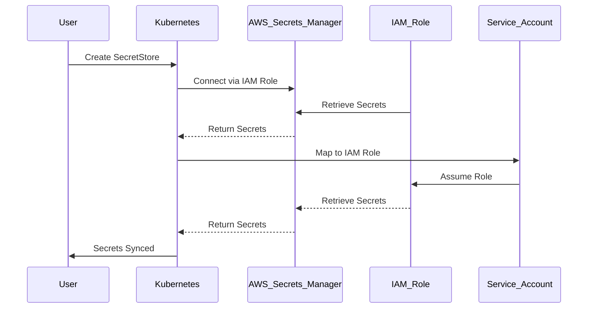

## Secrets Management in DevSecOps

### Introduction to Secrets Management

In the realm of DevSecOps, managing secrets securely is one of the most critical aspects of ensuring the overall security posture of an application. Secrets can include API keys, database passwords, SSH keys, and other sensitive information that, if compromised, can lead to severe security breaches. In this chapter, we will delve into the concepts of creating a `SecretStore` and an `ExternalSecret`, focusing on integrating with AWS Secrets Manager as an example.

### What is a SecretStore?

A `SecretStore` is a configuration object that defines the connection details to an external secrets management system. It acts as a bridge between your application and the external secrets provider, allowing you to manage and retrieve secrets securely. The `SecretStore` specifies the type of secrets provider (e.g., AWS Secrets Manager), the region where the secrets are stored, and the authentication method used to connect to the provider.

#### Why Use a SecretStore?

Using a `SecretStore` provides several benefits:

1. **Centralized Management**: All secrets are managed centrally, making it easier to track and update them.
2. **Decoupling**: Your application does not need to know the specifics of how secrets are stored; it only interacts with the `SecretStore`.
3. **Security**: By abstracting away the details of the secrets provider, you reduce the risk of exposing sensitive information directly within your application code.

### Creating a SecretStore for AWS Secrets Manager

To create a `SecretStore` for AWS Secrets Manager, you need to specify the following details:

- **Provider Type**: The type of secrets provider you are using. In this case, it is `AWS`.
- **Service Name**: The specific service within AWS, which is `secretsmanager`.
- **Region**: The AWS region where the secrets are stored.
- **Authentication Method**: How the `SecretStore` will authenticate with AWS Secrets Manager.

#### Example Configuration

Here is an example of how to configure a `SecretStore` for AWS Secrets Manager:

```yaml
apiVersion: secrets-store.csi.k8s.io/v1
kind: SecretStore
metadata:
  name: aws-secrets-manager
spec:
  provider: aws
  parameters:
    objects: '[{"accessKeyId":"${AWS_ACCESS_KEY_ID}","secretAccessKey":"${AWS_SECRET_ACCESS_KEY}","region":"us-east-1"}]'
```

However, using static access keys (`AWS_ACCESS_KEY_ID` and `AWS_SECRET_ACCESS_KEY`) is not recommended due to security risks. Instead, we will use a more secure approach involving IAM roles and service accounts.

### Using IAM Roles and Service Accounts

Instead of using static credentials, it is a best practice to map a Kubernetes service account to an IAM role. This allows the service account to assume the IAM role and gain temporary credentials to access AWS Secrets Manager.

#### Steps to Configure IAM Role Mapping

1. **Create an IAM Role**: Define an IAM role in AWS that has the necessary permissions to access the secrets in AWS Secrets Manager.
2. **Attach Policy to IAM Role**: Attach a policy to the IAM role that grants the required permissions.
3. **Map Service Account to IAM Role**: Map the Kubernetes service account to the IAM role using an annotation.

#### Example Configuration

Here is an example of how to configure the service account and map it to an IAM role:

```yaml
apiVersion: v1
kind: ServiceAccount
metadata:
  name: my-service-account
  namespace: online-boutique
  annotations:
    eks.amazonaws.com/role-arn: arn:aws:iam::123456789012:role/my-iam-role
```

In this example, the `my-service-account` service account in the `online-boutique` namespace is mapped to the IAM role `my-iam-role`.

### Creating an ExternalSecret

An `ExternalSecret` is a custom resource definition (CRD) that references a `SecretStore` and specifies which secrets to retrieve from the external secrets provider. It allows you to automatically sync secrets from the external provider into Kubernetes secrets.

#### Example Configuration

Here is an example of how to create an `ExternalSecret`:

```yaml
apiVersion: external-secrets.io/v1beta1
kind: ExternalSecret
metadata:
  name: my-external-secret
  namespace: online-boutique
spec:
  secretStoreRef:
    name: aws-secrets-manager
    kind: SecretStore
  target:
    name: my-kubernetes-secret
    creationPolicy: Owner
  dataFrom:
    - extract:
        key: my-secret-key
        property: value
```

In this example, the `my-external-secret` references the `aws-secrets-manager` `SecretStore` and retrieves the secret with the key `my-secret-key` from AWS Secrets Manager. The retrieved secret is then stored in a Kubernetes secret named `my-kubernetes-secret`.

### Full Workflow Diagram

Let's visualize the workflow using a mermaid diagram:



### Common Pitfalls and Best Practices

#### Pitfall: Using Static Credentials

Using static credentials (like `AWS_ACCESS_KEY_ID` and `AWS_SECRET_ACCESS_KEY`) is a common pitfall. These credentials can be exposed and are difficult to rotate securely.

#### Best Practice: Use IAM Roles and Service Accounts

Mapping a Kubernetes service account to an IAM role is a much safer approach. It ensures that the service account has temporary, limited credentials that are automatically rotated.

### Real-World Examples and CVEs

#### Example: CVE-2021-20225

CVE-2021-20225 was a vulnerability in AWS Secrets Manager that allowed unauthorized access to secrets. This highlights the importance of proper authentication and authorization mechanisms.

#### Example: Breach at Capital One

The Capital One breach in 2019 involved unauthorized access to customer data stored in AWS. Proper secrets management practices could have helped mitigate such breaches.

### How to Prevent / Defend

#### Detection

- **Audit Logs**: Enable audit logs in AWS to monitor access to secrets.
- **Monitoring Tools**: Use tools like AWS CloudTrail to monitor and alert on suspicious activities.

#### Prevention

- **IAM Policies**: Ensure that IAM policies are tightly scoped to only allow necessary permissions.
- **Rotation**: Regularly rotate secrets to minimize the window of exposure.

#### Secure Coding Fixes

**Vulnerable Code**

```yaml
apiVersion: v1
kind: Secret
metadata:
  name: my-secret
type: Opaque
data:
  password: cGFzc3dvcmQ=
```

**Secure Code**

```yaml
apiVersion: v1
kind: Secret
metadata:
  name: my-secret
type: Opaque
data:
  password: <base64-encoded-value>
```

In the secure version, the password is fetched dynamically from AWS Secrets Manager rather than being hardcoded.

### Complete Example

#### Full HTTP Request and Response

Here is a complete example of an HTTP request and response for retrieving a secret from AWS Secrets Manager:

**HTTP Request**

```http
POST /secretsmanager/get-secret-value HTTP/1.1
Host: secretsmanager.us-east-1.amazonaws.com
Authorization: Bearer <access-token>
Content-Type: application/x-amz-json-1.1
X-Amz-Target: SecretsManager.GetSecretValue

{
  "SecretId": "my-secret-id"
}
```

**HTTP Response**

```http
HTTP/1.1 200 OK
Content-Type: application/x-amz-json-1.1

{
  "ARN": "arn:aws:secretsmanager:us-east-1:123456789012:secret:my-secret-id",
  "Name": "my-secret-id",
  "VersionId": "12345678-1234-1234-1234-123456789012",
  "SecretString": "{\"password\":\"my-password\"}"
}
```

### Hands-On Labs

For hands-on practice with secrets management, consider the following labs:

- **PortSwigger Web Security Academy**: Offers exercises on managing secrets securely.
- **OWASP Juice Shop**: Provides a vulnerable application where you can practice securing secrets.
- **DVWA**: A deliberately vulnerable web application for practicing security techniques.

By following these steps and best practices, you can ensure that your secrets are managed securely in a DevSecOps environment.

---
<!-- nav -->
[[14-Secrets Management in DevSecOps Part 1|Secrets Management in DevSecOps Part 1]] | [[DevSecOps/DevSecOps Bootcamp/03-Identity & Access Management/03-Secrets Management/Create SecretStore and ExternalSecret/00-Overview|Overview]] | [[DevSecOps/DevSecOps Bootcamp/03-Identity & Access Management/03-Secrets Management/Create SecretStore and ExternalSecret/16-Practice Questions & Answers|Practice Questions & Answers]]
