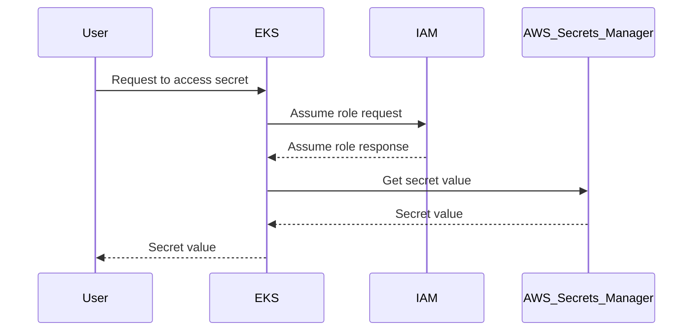

## Introduction to Secrets Management in DevSecOps

### Background Theory

Secrets management is a critical aspect of DevSecOps, ensuring that sensitive information such as API keys, database passwords, and other credentials are securely stored and accessed. In modern cloud-native environments, Kubernetes has become a popular platform for deploying applications, and managing secrets within this ecosystem requires careful consideration.

### Key Concepts

- **IAM Roles**: Identity and Access Management (IAM) roles define permissions and access levels for entities within AWS. These roles are crucial for controlling who can perform actions within your AWS environment.
- **Kubernetes Resources**: Kubernetes uses various resources like `Roles`, `ClusterRoles`, `ServiceAccounts`, and `Pods` to manage access control and deployment of applications.
- **AWS Secrets Manager**: A service provided by AWS to store, manage, and retrieve secrets securely. It integrates well with IAM roles and Kubernetes through tools like the External Secrets Controller.

### Role Configuration in Terraform

Let's dive into the configuration of an IAM role using Terraform, which is a popular infrastructure-as-code tool.

#### Example Terraform Configuration

```hcl
resource "aws_iam_role" "external_secrets_role" {
  name = "external-secrets-role"

  assume_role_policy = jsonencode({
    Version = "2012-10-17"
    Statement = [
      {
        Effect = "Allow"
        Principal = {
          Service = "eks.amazonaws.com"
        }
        Action = "sts:AssumeRole"
      }
    ]
  })
}
```

This configuration creates an IAM role named `external-secrets-role`. The `assume_role_policy` specifies that the EKS service can assume this role.

### Understanding the Assume Policy

The `assume_role_policy` is a JSON document that defines who can assume the IAM role. In this case, the EKS service is allowed to assume the role. This is important because it ensures that only authorized services can access the secrets managed by AWS Secrets Manager.

#### Explanation of Assume Policy Components

- **Version**: Specifies the version of the policy language being used.
- **Statement**: Contains one or more statements defining the permissions.
  - **Effect**: Determines whether the statement allows or denies access.
  - **Principal**: Identifies the entity that can assume the role.
  - **Action**: Specifies the action that the principal is allowed to perform.

### External Secrets Controller

The External Secrets Controller is a Kubernetes operator that watches for custom resources and automatically syncs secrets from external secret stores like AWS Secrets Manager into Kubernetes secrets. This allows applications running in Kubernetes to securely access their secrets without hardcoding them into the application code.

#### Example Custom Resource Definition (CRD)

```yaml
apiVersion: externalsecrets.io/v1beta1
kind: ExternalSecret
metadata:
  name: my-secret
spec:
  backendType: awssm
  dataFrom:
    - key: my-secret-key
      name: my-secret-name
```

This CRD instructs the External Secrets Controller to fetch the secret `my-secret-key` from AWS Secrets Manager and store it in a Kubernetes secret named `my-secret-name`.

### Integration with EKS

In an EKS (Elastic Kubernetes Service) cluster, the Kubernetes resources are not natively recognized by AWS. Therefore, we need to use IAM roles with web identity to allow these resources to assume AWS roles.

#### Web Identity Federation

Web identity federation allows AWS to trust identities from external identity providers. In the context of EKS, this means that Kubernetes service accounts can assume IAM roles.

#### Example Assume Role Policy for EKS

```json
{
  "Version": "2012-10-17",
  "Statement": [
    {
      "Effect": "Allow",
      "Principal": {
        "Federated": "arn:aws:iam::123456789012:oidc-provider/oidc.eks.us-west-2.amazonaws.com/id/abcdef1234567890"
      },
      "Action": "sts:AssumeRoleWithWebIdentity",
      "Condition": {
        "StringEquals": {
          "oidc.eks.us-west-2.amazonaws.com/id/abcdef1234567890:sub": "system:serviceaccount:default:my-service-account"
        }
      }
    }
  ]
}
```

This policy allows the specified service account to assume the IAM role.

### Real-World Examples and Recent Breaches

Recent breaches involving misconfigured IAM roles and secrets management highlight the importance of proper configuration and monitoring.

#### Example: AWS Ransomware Attack (CVE-2021-3539)

In 2021, a ransomware group exploited misconfigured IAM roles to gain unauthorized access to AWS resources. This attack underscores the need for strict access controls and regular audits of IAM roles and policies.

### How to Prevent / Defend

#### Detection

- **Audit Logs**: Enable AWS CloudTrail to log all API calls made to your AWS resources. Regularly review these logs for suspicious activity.
- **Monitoring Tools**: Use tools like AWS Config and AWS Trusted Advisor to monitor compliance with best practices and detect misconfigurations.

#### Prevention

- **Least Privilege Principle**: Ensure that IAM roles have the minimum set of permissions required to perform their tasks.
- **Regular Audits**: Conduct regular audits of IAM roles and policies to ensure they remain secure and up-to-date.

#### Secure Coding Fixes

##### Vulnerable Code Example

```yaml
apiVersion: v1
kind: Secret
metadata:
  name: my-secret
type: Opaque
data:
  password: cGFzc3dvcmQ=
```

##### Secure Code Example

```yaml
apiVersion: v1
kind: Secret
metadata:
  name: my-secret
type: Opaque
data:
  password: <base64-encoded-value-from-aws-secrets-manager>
```

### Complete Example

#### Full HTTP Request and Response

```http
POST /secretsmanager/get-secret-value HTTP/1.1
Host: secretsmanager.us-west-2.amazonaws.com
Content-Type: application/x-amz-json-1.1
X-Amz-Target: SecretsManager.GetSecretValue
Authorization: Bearer <token>

{
  "SecretId": "my-secret-id"
}
```

```http
HTTP/1.1 200 OK
Content-Type: application/x-amz-json-1.1

{
  "ARN": "arn:aws:secretsmanager:us-west-2:123456789012:secret:my-secret-id",
  "Name": "my-secret-id",
  "VersionId": "EXAMPLE1-90ab-cdef-fedc-ba987EXAMPLE",
  "SecretString": "{\"password\":\"my-password\"}"
}
```

#### Full Policy/Config File

```json
{
  "Version": "2012-10-17",
  "Statement": [
    {
      "Effect": "Allow",
      "Action": [
        "secretsmanager:GetSecretValue"
      ],
      "Resource": "arn:aws:secretsmanager:us-west-2:123456789012:secret:my-secret-id"
    }
  ]
}
```

### Mermaid Diagrams

#### IAM Role Assumption Flow



### Hands-On Labs

For practical experience with secrets management in Kubernetes and AWS, consider the following labs:

- **PortSwigger Web Security Academy**: Offers modules on securing web applications, including handling secrets.
- **OWASP Juice Shop**: A deliberately insecure web app for practicing security skills, including secrets management.
- **CloudGoat**: A series of labs designed to teach cloud security concepts, including IAM roles and secrets management.

By thoroughly understanding and implementing these principles, you can significantly enhance the security of your DevSecOps environment.

---
<!-- nav -->
[[DevSecOps/DevSecOps Bootcamp/03-Identity & Access Management/03-Secrets Management/Deploy External Secrets Controller Demo Part 1/01-Introduction to Secrets Management in DevSecOps Part 1|Introduction to Secrets Management in DevSecOps Part 1]] | [[DevSecOps/DevSecOps Bootcamp/03-Identity & Access Management/03-Secrets Management/Deploy External Secrets Controller Demo Part 1/00-Overview|Overview]] | [[03-Introduction to Secrets Management in Kubernetes|Introduction to Secrets Management in Kubernetes]]
