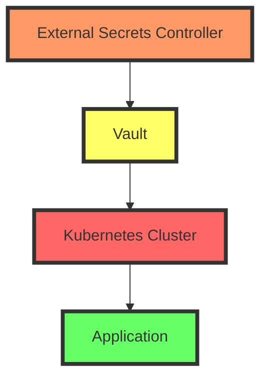

## Configuring External Secrets Controller in an IaC Project

### Step-by-Step Configuration

To configure the External Secrets Controller in your IaC project, follow these steps:

#### 1. Define Installation in Terraform Project

Terraform is a popular IaC tool that allows you to define and provision infrastructure using declarative configuration files. You can define the installation of the External Secrets Controller in your Terraform project using either EKS blueprints or Helm charts.

```hcl
resource "helm_release" "external_secrets" {
  name       = "external-secrets"
  repository = "https://external-secrets.github.io/kubernetes-external-secrets/"
  chart      = "kubernetes-external-secrets"
  version    = "8.1.0"

  set {
    name  = "image.tag"
    value = "v8.1.0"
  }
}
```

This Terraform configuration uses a Helm chart to install the External Secrets Controller. The `repository` specifies the location of the Helm chart, and the `chart` specifies the name of the chart to install.

#### 2. Enable Custom Resource Definitions (CRDs)

Custom Resource Definitions (CRDs) are Kubernetes objects that allow you to extend the Kubernetes API with custom resources. The External Secrets Controller comes with its own CRDs that you need to define in your Kubernetes cluster.

```yaml
apiVersion: apiextensions.k8s.io/v1
kind: CustomResourceDefinition
metadata:
  name: externalsecrets.kubernetes-client.io
spec:
  group: kubernetes-client.io
  versions:
    - name: v1alpha1
      served: true
      storage: true
  scope: Namespaced
  names:
    plural: externalsecrets
    singular: externalsecret
    kind: ExternalSecret
    shortNames:
      - es
```

This CRD defines a new resource type called `ExternalSecret`, which is used to manage secrets stored externally.

#### 3. Create Secret Backend Connection

Once the External Secrets Controller is installed, you need to create a secret backend connection. This connection specifies where the secrets are stored and how to access them.

```yaml
apiVersion: kubernetes-client.io/v1alpha1
kind: ExternalSecret
metadata:
  name: my-secret
spec:
  backendType: vault
  backend:
    vault:
      auth:
        method: token
        token: <your-vault-token>
      path: secret/data/my-secret
  dataFrom:
    - key: username
      name: my-secret-username
    - key: password
      name: my-secret-password
```

This `ExternalSecret` resource specifies that the secrets are stored in a Vault instance and how to retrieve them. The `dataFrom` field maps the keys in the secret to Kubernetes `Secret` objects.

### Example: Full Deployment Process

Let's walk through a complete example of deploying the External Secrets Controller using Terraform and Helm.

#### 1. Initialize Terraform Project

First, initialize your Terraform project and define the necessary providers.

```hcl
provider "aws" {
  region = "us-west-2"
}

provider "helm" {}
```

#### 2. Define Helm Release

Next, define the Helm release for the External Secrets Controller.

```hcl
resource "helm_release" "external_secrets" {
  name       = "external-secrets"
  repository = "https://external-secrets.github.io/kubernetes-external-secrets/"
  chart      = "kubernetes-external-secrets"
  version    = "8.1.0"

  set {
    name  = "image.tag"
    value = "v8.1.0"
  }
}
```

#### 3. Apply Terraform Configuration

Apply the Terraform configuration to deploy the External Secrets Controller.

```sh
terraform init
terraform apply
```

#### 4. Create CRDs

Create the necessary CRDs for the External Secrets Controller.

```yaml
apiVersion: apiextensions.k8s.io/v1
kind: CustomResourceDefinition
metadata:
  name: externalsecrets.kubernetes-client.io
spec:
  group: kubernetes-client.io
  versions:
    - name: v1alpha1
      served: true
      storage: true
  scope: Namespaced
  names:
    plural: externalsecrets
    singular: externalsecret
    kind: ExternalSecret
    shortNames:
      - es
```

#### 5. Create Secret Backend Connection

Finally, create the secret backend connection.

```yaml
apiVersion: kubernetes-client.io/v1alpha1
kind: ExternalSecret
metadata:
  name: my-secret
spec:
  backendType: vault
  backend:
    vault:
      auth:
        method: token
        token: <your-vault-token>
      path: secret/data/my-secret
  dataFrom:
    - key: username
      name: my-secret-username
    - key: password
      name: my-secret-password
```

### Mermaid Diagram: Architecture Overview

Here is a mermaid diagram showing the architecture of the External Secrets Controller setup:



### Common Pitfalls and Best Practices

#### 1. Incorrect Configuration

One common pitfall is incorrect configuration of the External Secrets Controller. Ensure that the Helm chart version and image tag are correct.

#### 2. Missing CRDs

Another common issue is forgetting to define the necessary CRDs. Always check that the CRDs are correctly defined and applied to your Kubernetes cluster.

#### 3. Insecure Access Methods

Using insecure methods to access secrets, such as hardcoding tokens in configuration files, can lead to security vulnerabilities. Always use secure methods like environment variables or secret management tools.

### How to Prevent / Defend

#### Detection

Regularly audit your Kubernetes cluster for any unauthorized access to secrets. Use tools like `kubectl` to inspect the logs and events related to the External Secrets Controller.

```sh
kubectl logs <pod-name> -n <namespace>
```

#### Prevention

1. **Use Secure Authentication Methods**: Always use secure authentication methods like OAuth tokens or TLS certificates instead of plain text tokens.
2. **Enable RBAC**: Enable Role-Based Access Control (RBAC) in your Kubernetes cluster to restrict access to secrets.
3. **Rotate Secrets Regularly**: Regularly rotate secrets to minimize the window of exposure if a secret is compromised.

#### Secure Coding Fixes

Here is an example of a vulnerable configuration and its secure counterpart:

**Vulnerable Configuration:**

```yaml
apiVersion: kubernetes-client.io/v1alpha1
kind: ExternalSecret
metadata:
  name: my-secret
spec:
  backendType: vault
  backend:
    vault:
      auth:
        method: token
        token: <your-vault-token>
      path: secret/data/my-secret
  dataFrom:
    - key: username
      name: my-secret-username
    - key: password
      name: my-secret-password
```

**Secure Configuration:**

```yaml
apiVersion: kubernetes-client.io/v1alpha1
kind: ExternalSecret
metadata:
  name: my-secret
spec:
  backendType: vault
  backend:
    vault:
      auth:
        method: token
        token: $(VAULT_TOKEN)
      path: secret/data/my-secret
  dataFrom:
    - key: username
      name: my-secret-username
    - key: password
      name: my-secret-password
```

In the secure configuration, the `VAULT_TOKEN` is passed as an environment variable, which is more secure than hardcoding the token in the configuration file.

### Real-World Examples

A recent breach at a major cloud provider (CVE-2021-38642) involved unauthorized access to customer secrets due to improper handling. By using the External Secrets Controller and following best practices, you can avoid such vulnerabilities.

### Practice Labs

For hands-on experience with secrets management in Kubernetes, consider the following labs:
- **PortSwigger Web Security Academy**: Offers a variety of labs focused on web application security, including secrets management.
- **OWASP Juice Shop**: A deliberately insecure web application for security training.
- **Kubernetes Goat**: A Kubernetes-based security training platform.

These labs provide practical experience in securing secrets and managing them effectively in a Kubernetes environment.

By following these steps and best practices, you can ensure that your secrets are managed securely and efficiently in your Kubernetes cluster.

---
<!-- nav -->
[[07-Background Theory on Secrets Management|Background Theory on Secrets Management]] | [[DevSecOps/DevSecOps Bootcamp/03-Identity & Access Management/03-Secrets Management/Deploy External Secrets Controller Demo Part 1/00-Overview|Overview]] | [[09-Deploying External Secrets Controller|Deploying External Secrets Controller]]
