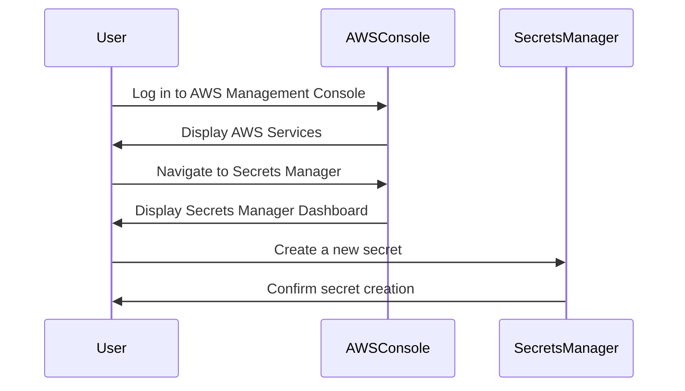
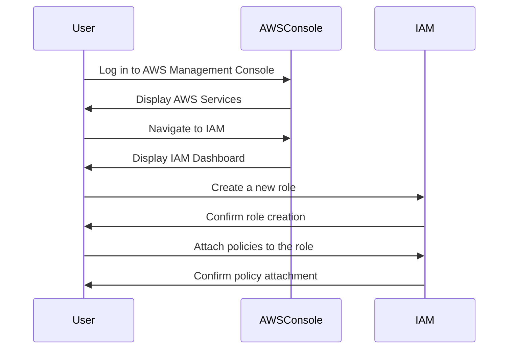

## Deploying External Secrets Controller

### Step 1: Setting Up the Main Component in the Cluster

The first step in deploying an external secrets controller is to set up the main component within the Kubernetes cluster. This component acts as a bridge between the Kubernetes environment and the external secret storage service.

#### What is the External Secrets Controller?

The External Secrets Controller is a Kubernetes operator that automatically syncs secrets from external secret stores (like AWS Secrets Manager) into Kubernetes secrets. This allows applications running in Kubernetes to access secrets without needing direct access to the external secret store.

#### Why Use an External Secrets Controller?

Using an external secrets controller provides several benefits:

1. **Centralized Secret Management**: Secrets are managed centrally, reducing the risk of misconfiguration.
2. **Automated Syncing**: Secrets are automatically synced into Kubernetes, ensuring that applications always have the latest secrets.
3. **Reduced Permissions**: Applications in Kubernetes do not need direct access to the external secret store, reducing the attack surface.

### Step 2: Creating a Secret in AWS Secrets Manager

The next step is to create a secret in AWS Secrets Manager. This involves defining the secret and setting up the necessary permissions.

#### What is AWS Secrets Manager?

AWS Secrets Manager is a service provided by Amazon Web Services (AWS) that helps you protect access to your applications, services, and IT resources without requiring you to implement complex key management. It enables you to easily rotate, manage, and retrieve database credentials, API keys, and other secrets throughout their lifecycle.

#### Creating a Secret in AWS Secrets Manager

To create a secret in AWS Secrets Manager, follow these steps:

1. **Navigate to AWS Secrets Manager**:
   - Log in to the AWS Management Console.
   - Navigate to the Secrets Manager service.

2. **Create a New Secret**:
   - Click on "Store a new secret".
   - Choose the type of secret you want to store (e.g., database credentials, API keys).

3. **Define the Secret**:
   - Enter the details of the secret (e.g., username, password).
   - Specify the region where the secret will be stored.



### Mapping Roles Between AWS and Kubernetes

Once the secret is created, the next step is to map the necessary roles between AWS and Kubernetes. This involves creating an IAM role in AWS and mapping it to a Kubernetes service account.

#### What is IAM Role?

An IAM role is an identity with specific permissions that you can use to delegate access to your AWS resources. Roles are similar to users, but instead of being uniquely associated with one person, they are typically assumed by an application or service.

#### Creating an IAM Role

To create an IAM role in AWS:

1. **Navigate to IAM**:
   - In the AWS Management Console, navigate to the Identity and Access Management (IAM) service.

2. **Create a New Role**:
   - Click on "Roles" and then "Create role".
   - Select the type of trusted entity (e.g., AWS service).
   - Choose the service that will assume the role (e.g., EC2, Lambda).

3. **Attach Policies**:
   - Attach policies that grant the necessary permissions to access the secret in Secrets Manager.



#### Mapping the IAM Role to a Kubernetes Service Account

To map the IAM role to a Kubernetes service account:

1. **Create a Service Account**:
   - In the Kubernetes cluster, create a service account that will assume the IAM role.

2. **Assign the IAM Role to the Service Account**:
   - Use the `aws-iam-authenticator` to map the IAM role to the service account.

```yaml
apiVersion: v1
kind: ServiceAccount
metadata:
  name: my-service-account
  annotations:
    eks.amazonaws.com/role-arn: arn:aws:iam::123456789012:role/my-iam-role
```

### Configuring the External Secrets Controller

Now that the secret is created and the roles are mapped, the final step is to configure the External Secrets Controller to sync the secret into Kubernetes.

#### What is the External Secrets Controller Configuration?

The External Secrets Controller configuration specifies the source of the secrets and how they should be synced into Kubernetes. This includes specifying the secret store (e.g., AWS Secrets Manager) and the credentials to access it.

#### Configuring the External Secrets Controller

To configure the External Secrets Controller:

1. **Install the External Secrets Operator**:
   - Use Helm or Kustomize to install the External Secrets Operator in your Kubernetes cluster.

2. **Create an ExternalSecret Resource**:
   - Define an `ExternalSecret` resource that specifies the source of the secret and how it should be synced into Kubernetes.

```yaml
apiVersion: externalsecrets.io/v1beta1
kind: ExternalSecret
metadata:
  name: my-external-secret
spec:
  backendType: awssm
  dataFrom:
  - key: my-secret-key
    name: my-secret-name
  refreshInterval: 1h
  awsSecretStoreConfig:
    region: us-east-1
    serviceAccountRef:
      name: my-service-account
```

### Pitfalls and Best Practices

#### Common Pitfalls

1. **Incorrect Permissions**: Ensure that the IAM role has the correct permissions to access the secret in Secrets Manager.
2. **Manual Syncing**: Avoid manually syncing secrets; use automated tools to ensure consistency.
3. **Hardcoded Secrets**: Never hardcode secrets in your application code; use environment variables or secret stores.

#### Best Practices

1. **Use Strong Encryption**: Ensure that secrets are encrypted both at rest and in transit.
2. **Regular Audits**: Regularly audit access to secrets to detect unauthorized access.
3. **Least Privilege Principle**: Assign the least privilege necessary to access secrets.

### How to Prevent / Defend

#### Detection

1. **Audit Logs**: Enable audit logging for both AWS Secrets Manager and Kubernetes to track access to secrets.
2. **Monitoring Tools**: Use monitoring tools like AWS CloudTrail and Kubernetes audit logs to detect unauthorized access.

#### Prevention

1. **Role-Based Access Control (RBAC)**: Implement RBAC to control who can access secrets.
2. **Secret Rotation**: Regularly rotate secrets to minimize the window of exposure.
3. **Secure Coding Practices**: Follow secure coding practices to avoid hardcoding secrets in your application.

#### Secure Code Fix

Here is an example of a vulnerable code snippet and its secure counterpart:

**Vulnerable Code:**

```python
import os

# Hardcoded secret
secret = "my-hardcoded-secret"

def authenticate(user, password):
    if password == secret:
        return True
    else:
        return False
```

**Secure Code:**

```python
import os

# Retrieve secret from environment variable
secret = os.getenv("MY_SECRET")

def authenticate(user, password):
    if password == secret:
        return True
    else:
        return False
```

### Conclusion

Deploying an external secrets controller is a critical step in securing sensitive information in a Kubernetes environment. By following the steps outlined above, you can ensure that your secrets are stored, accessed, and used securely. Remember to regularly audit and monitor access to secrets to detect and prevent unauthorized access.

### Practice Labs

For hands-on practice with secrets management in Kubernetes, consider the following labs:

- **PortSwigger Web Security Academy**: Offers interactive labs on web application security, including secrets management.
- **OWASP Juice Shop**: A deliberately insecure web application for practicing web security skills.
- **Kubernetes Goat**: A Kubernetes-based security training platform that includes exercises on secrets management.

By completing these labs, you can gain practical experience in deploying and managing secrets in a Kubernetes environment.

---
<!-- nav -->
[[08-Configuring External Secrets Controller in an IaC Project|Configuring External Secrets Controller in an IaC Project]] | [[DevSecOps/DevSecOps Bootcamp/03-Identity & Access Management/03-Secrets Management/Deploy External Secrets Controller Demo Part 1/00-Overview|Overview]] | [[10-Detailed Explanation of the Transcript Chunk|Detailed Explanation of the Transcript Chunk]]
